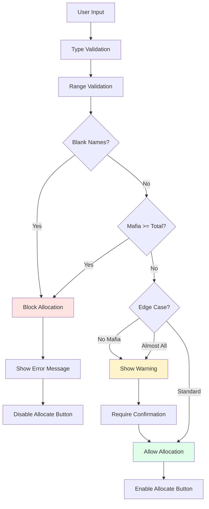

# Edge Case Validation Documentation

## Overview

Edge case validation in the Mafia Game Role Allocator ensures robust handling of unusual game configurations while maintaining flexibility for valid but uncommon setups. The system distinguishes between **invalid configurations** (which block allocation) and **edge cases** (which allow allocation with warnings).

## Implementation Status

✅ **Fully Implemented** - All acceptance criteria from the PRD are met.

### Current Implementation

Edge case validation is implemented across multiple components:

1. **`useMafiaCountValidation` Hook** (`src/hooks/useMafiaCountValidation.js`)
   - Real-time validation of Mafia count against player count
   - Edge case detection for 0 Mafia and almost-all-Mafia scenarios
   - Dynamic revalidation when player count changes

2. **`MafiaCountValidator` Component** (`src/components/MafiaCountValidator.jsx`)
   - Visual feedback with warning icons and messages
   - Yellow border and warning text for edge cases
   - Red border and error text for invalid configurations

3. **`AllocationConfirmationFlow` Component** (`src/components/AllocationConfirmationFlow.jsx`)
   - Edge case warnings in confirmation dialog
   - Clear explanation of unusual game dynamics
   - User must explicitly confirm edge cases

4. **`usePlayerCountManager` Hook** (`src/hooks/usePlayerCountManager.js`)
   - Blank name validation
   - Completion tracking
   - Clear error messaging

5. **Edge Case Validation Utility** (`src/utils/edgeCaseValidation.js`)
   - Centralized validation logic for consistency
   - Comprehensive edge case detection
   - User-friendly message formatting

## Edge Case Categories

### 1. Allowed Edge Cases (Warnings)

These configurations are unusual but valid. Users see warnings and must confirm before proceeding.

#### No Mafia (0 Mafia)
```javascript
// Example: 5 players, 0 Mafia
{
  isValid: true,
  isEdgeCase: true,
  warning: 'No Mafia players - this creates an unusual game mode',
  canProceed: true,
  requiresConfirmation: true,
  type: 'warning'
}
```

**Gameplay Impact:** All players are Villagers. No elimination phase or deduction gameplay.

**When to Use:** Cooperative game variants, trust exercises, role-playing scenarios.

#### Almost All Mafia (Total - 1)
```javascript
// Example: 5 players, 4 Mafia (only 1 Villager)
{
  isValid: true,
  isEdgeCase: true,
  warning: 'Almost all players are Mafia - this creates an unusual game mode',
  canProceed: true,
  requiresConfirmation: true,
  type: 'warning'
}
```

**Gameplay Impact:** Heavily favors Mafia with minimal Villager resistance.

**When to Use:** Advanced game variants, asymmetric gameplay, testing scenarios.

#### Large Groups (Future Enhancement)
- Groups > 30 players
- Warning about potential UI crowding on mobile
- Performance considerations

#### Small Groups (Future Enhancement)
- Groups < 3 players
- Warning about limited social dynamics
- Reduced deduction opportunities

### 2. Invalid Configurations (Errors)

These configurations are mathematically or logically impossible and block allocation.

#### Mafia Count >= Total Players
```javascript
// Example: 5 players, 5+ Mafia
{
  isValid: false,
  isEdgeCase: false,
  error: 'Mafia count must be less than total players (5)',
  canProceed: false,
  type: 'error'
}
```

**Why Invalid:** No Villagers to create game dynamics. This is caught as an error, not an edge case.

**Note:** Mafia count = Total players is blocked (not the same as "Almost All Mafia" which is Total - 1).

#### Blank Player Names
```javascript
// Example: 5 players, 2 names blank
{
  isValid: false,
  hasBlankNames: true,
  errors: {
    names: 'All player names are required',
    message: '2 player names required',
    fields: [1, 3] // Indices of blank fields
  }
}
```

**Why Invalid:** Each player must have a name for role assignment and reveal.

#### Negative Mafia Count
```javascript
{
  isValid: false,
  error: 'Mafia count cannot be negative',
  canProceed: false
}
```

**Why Invalid:** Cannot have negative players.

## Validation Flow



## User Experience

### Warning States (Yellow)
- Yellow border on input field
- ⚠️ Warning icon
- Clear explanation of implications
- "Valid range" text shows configuration is technically valid
- Allocation button **enabled**
- Confirmation dialog shows edge case warning

### Error States (Red)
- Red border on input field
- ❌ Error icon
- Specific error message explaining what's wrong
- Allocation button **disabled**
- Cannot proceed until fixed

### Valid States (Green/Blue)
- Blue border on focused input
- Green checkmarks on completed fields
- No warning or error messages
- Allocation button enabled
- Standard confirmation dialog

## Code Examples

### Using Edge Case Validation Utility

```javascript
import { validateMafiaCount, formatValidationMessages } from '../utils/edgeCaseValidation';

// Validate configuration
const validation = validateMafiaCount(mafiaCount, totalPlayers);

// Check if can proceed
if (validation.canProceed) {
  // Enable allocation button
  if (validation.requiresConfirmation) {
    // Show warning in confirmation dialog
    const messages = formatValidationMessages(validation);
    console.log(messages.icon, messages.warningText);
  }
} else {
  // Block allocation, show error
  console.error(validation.message);
}
```

### Validation Result Structure

```typescript
interface ValidationResult {
  isValid: boolean;           // Overall validity
  severity: 'ERROR' | 'WARNING' | 'INFO';
  type: string | null;        // Edge case type
  message: string;            // User-friendly message
  explanation?: string;       // Detailed explanation
  gameplayImpact?: string;    // Gameplay implications
  canProceed: boolean;        // Can user proceed?
  requiresConfirmation: boolean; // Needs confirmation?
  isEdgeCase: boolean;        // Is this an edge case?
}
```

## Testing Edge Cases

### Manual Testing Scenarios

#### Scenario 1: 0 Mafia
1. Set player count: 5
2. Fill all names: Alice, Bob, Charlie, Diana, Eve
3. Set Mafia count: 0
4. **Expected:**
   - Yellow warning displayed
   - Message: "No Mafia players - this creates an unusual game mode"
   - Allocation button enabled
   - Confirmation dialog shows edge case warning

#### Scenario 2: Almost All Mafia
1. Set player count: 5
2. Fill all names
3. Set Mafia count: 4
4. **Expected:**
   - Yellow warning displayed
   - Message: "Almost all players are Mafia - this creates an unusual game mode"
   - Allocation button enabled
   - Confirmation dialog shows edge case warning

#### Scenario 3: All Mafia (Invalid)
1. Set player count: 5
2. Fill all names
3. Try to set Mafia count: 5
4. **Expected:**
   - Red error displayed
   - Message: "Mafia count must be less than total players (5)"
   - Allocation button disabled
   - Cannot proceed

#### Scenario 4: Blank Names
1. Set player count: 5
2. Fill only 3 names (leave 2 blank)
3. Set Mafia count: 1
4. **Expected:**
   - Red error on blank fields
   - Overall error: "2 player names required"
   - Allocation button disabled
   - Cannot proceed

## Performance

- Validation runs within **100ms** (typically < 10ms)
- Memoized validation prevents unnecessary recalculations
- Efficient state management with React hooks
- No performance impact on large player counts

## Accessibility

- ARIA labels on all validation messages
- `role="alert"` for error and warning messages
- Screen reader announcements for validation state changes
- Color contrast meets WCAG AA standards
- Keyboard navigation fully supported

## Future Enhancements

The centralized `edgeCaseValidation.js` utility supports future enhancements:

1. **Large Group Warnings** (> 30 players)
   - UI crowding on mobile devices
   - Performance considerations
   
2. **Small Group Warnings** (< 3 players)
   - Limited social dynamics
   - Reduced deduction opportunities

3. **Custom Validation Rules**
   - Game-specific configuration validation
   - Advanced role balancing (future advanced roles feature)

4. **Validation Analytics**
   - Track common edge cases
   - Improve user guidance

## Related Documentation

- [Input & Validation Epic PRD](./ways-of-work/plan/input-and-validation/epic.md)
- [Alternative & Edge Cases Epic PRD](./ways-of-work/plan/alternative-and-edge-cases/epic.md)
- [Edge Case Validation Feature PRD](./ways-of-work/plan/alternative-and-edge-cases/edge-case-validation/prd.md)
- [Edge Case Validation Implementation Plan](./ways-of-work/plan/alternative-and-edge-cases/edge-case-validation/implementation-plan.md)
