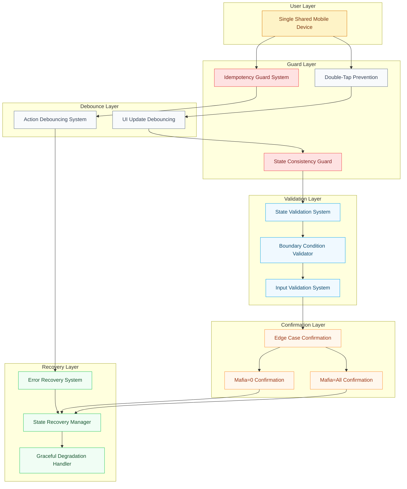

# Epic Architecture Specification: Alternative / Edge Cases

## 1. Epic Architecture Overview

This epic implements comprehensive edge case handling and interaction robustness patterns across the entire application. The architecture focuses on idempotency guards, confirmation flows for unusual configurations, and defensive programming patterns to ensure reliable behavior under stress conditions, rapid user interactions, and non-standard input scenarios.

Key properties:
- Idempotency systems preventing duplicate actions from rapid taps or network issues
- Edge case confirmation flows for boundary conditions (mafia=0, mafia=all players)
- Defensive state validation and recovery mechanisms throughout all application phases
- Single-device workflow assumptions with no authentication or persistence requirements
- Performance-maintained interaction debouncing and state guards targeting <200ms response
- Comprehensive error boundaries and graceful degradation patterns

## 2. System Architecture Diagram

Notes:
- All edge case handling occurs client-side with no server dependencies
- Idempotency and debouncing systems maintain performance while preventing errors
- Recovery systems ensure graceful handling of unexpected states or user actions

## 3. High-Level Features & Technical Enablers

### Features
- **Edge Case Confirmations**: Special confirmation flows for mafia=0 and mafia=all scenarios
- **Idempotency Protection**: Guards preventing duplicate actions from rapid button taps
- **Reset During Reveal**: Safe reset capability during active reveal dialogs
- **Input Validation Guards**: Comprehensive blocking of invalid inputs with clear error messages
- **Single-Device Assumptions**: Workflow designed for sequential device passing without authentication
- **Graceful Error Recovery**: Automatic recovery from invalid states with user guidance

### Technical Enablers
- **Idempotency Guard System**: Action deduplication with time-based and state-based guards
- **Debouncing Infrastructure**: User interaction debouncing maintaining <200ms responsiveness
- **Confirmation Modal System**: Reusable confirmation patterns for edge case scenarios
- **State Validation Engine**: Comprehensive state consistency checking across all phases
- **Error Boundary Components**: React error boundaries with graceful fallback UIs
- **Recovery State Management**: Automatic state repair and user guidance systems
- **Performance Monitoring**: Client-side performance guards ensuring interaction targets are met

## 4. Technology Stack
- React 18 (error boundaries, useCallback for performance optimization, custom guard hooks)
- Tailwind CSS v3.4.17 (error states, confirmation modals, disabled state styling)
- JavaScript (debouncing utilities, state validation, error handling patterns)
- React hooks for idempotency (useRef, useCallback, custom debouncing hooks)
- Mobile browser performance APIs (timing validation, interaction measurement)

## 5. Technical Value
**Value: Medium-High**
- Ensures application reliability under real-world usage conditions
- Establishes defensive programming patterns for the entire codebase
- Creates reusable guard and validation systems for future features
- Prevents user frustration and abandonment through graceful error handling

## 6. T-Shirt Size Estimate
**Size: M-L (≈ 1-1.5 days)**
- Comprehensive edge case testing requires extensive scenario coverage
- Idempotency systems need careful timing and state coordination
- Integration testing across all application phases adds complexity
- Performance validation under stress conditions requires device testing

## Context Template
- **Epic PRD**: `docs/ways-of-work/plan/alternative-and-edge-cases/epic.md`