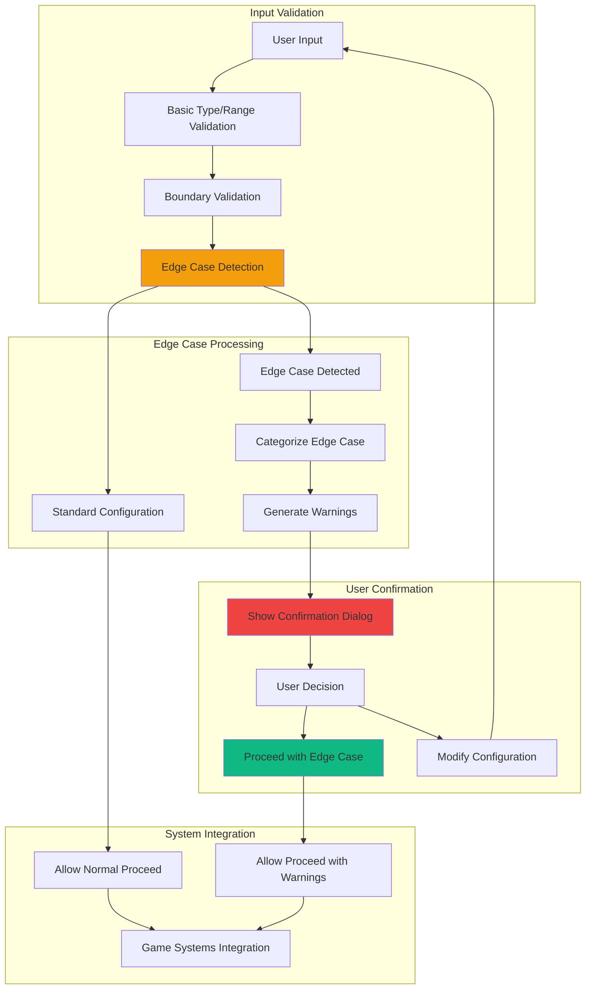

# Feature Implementation Plan: Edge Case Validation

## Goal

Implement comprehensive edge case validation system that handles unusual game configurations (0 mafia, all mafia, extreme player counts) with appropriate warnings, confirmations, and graceful handling. This includes input boundary validation, user confirmation flows, and integration with all game systems.

## Requirements

### Core Validation Requirements
- Boundary validation: 0 ≤ mafia count ≤ total players
- Edge case detection: mafia = 0, mafia = total players, mafia = total - 1
- Warning system for unusual configurations with clear explanations
- User confirmation required for edge cases before proceeding
- Graceful handling without blocking legitimate unusual games
- Integration with input validation, allocation, and display systems
- Clear messaging explaining game implications
- Accessibility-compliant warning and confirmation interfaces

### Edge Case Categories
- **No Mafia (0)**: All players are Villagers
- **All Mafia (total)**: All players are Mafia
- **Almost All Mafia (total - 1)**: Only one Villager
- **Large Groups (> 20 players)**: Performance and UX considerations
- **Small Groups (< 3 players)**: Minimal viable game size
- **Invalid Inputs**: Non-numeric, negative, or out-of-bound values

## Technical Considerations

### System Architecture Overview



### Frontend Architecture

#### Edge Case Validation Engine

```jsx
// utils/edgeCaseValidation.js

/**
 * Edge case types and categories
 */
export const EDGE_CASE_TYPES = {
  NO_MAFIA: 'NO_MAFIA',
  ALL_MAFIA: 'ALL_MAFIA', 
  ALMOST_ALL_MAFIA: 'ALMOST_ALL_MAFIA',
  LARGE_GROUP: 'LARGE_GROUP',
  SMALL_GROUP: 'SMALL_GROUP',
  INVALID_INPUT: 'INVALID_INPUT'
};

export const VALIDATION_SEVERITY = {
  ERROR: 'ERROR',       // Blocks proceeding
  WARNING: 'WARNING',   // Requires confirmation
  INFO: 'INFO'          // Informational only
};

/**
 * Configuration thresholds
 */
const THRESHOLDS = {
  MIN_PLAYERS: 1,
  MAX_PLAYERS: 50,
  LARGE_GROUP_SIZE: 20,
  SMALL_GROUP_SIZE: 3,
  PERFORMANCE_WARNING_SIZE: 30
};

/**
 * Validate mafia count against player count
 * @param {number} mafiaCount - Number of mafia players
 * @param {number} totalPlayers - Total number of players
 * @returns {Object} Validation result with details
 */
export const validateMafiaCount = (mafiaCount, totalPlayers) => {
  // Basic input validation
  if (typeof mafiaCount !== 'number' || typeof totalPlayers !== 'number') {
    return {
      isValid: false,
      severity: VALIDATION_SEVERITY.ERROR,
      type: EDGE_CASE_TYPES.INVALID_INPUT,
      message: 'Mafia count and total players must be numbers',
      canProceed: false
    };
  }

  if (!Number.isInteger(mafiaCount) || !Number.isInteger(totalPlayers)) {
    return {
      isValid: false,
      severity: VALIDATION_SEVERITY.ERROR,
      type: EDGE_CASE_TYPES.INVALID_INPUT,
      message: 'Mafia count and total players must be whole numbers',
      canProceed: false
    };
  }

  // Range validation
  if (mafiaCount < 0) {
    return {
      isValid: false,
      severity: VALIDATION_SEVERITY.ERROR,
      type: EDGE_CASE_TYPES.INVALID_INPUT,
      message: 'Mafia count cannot be negative',
      canProceed: false
    };
  }

  if (totalPlayers < THRESHOLDS.MIN_PLAYERS) {
    return {
      isValid: false,
      severity: VALIDATION_SEVERITY.ERROR,
      type: EDGE_CASE_TYPES.SMALL_GROUP,
      message: `Need at least ${THRESHOLDS.MIN_PLAYERS} player to play`,
      canProceed: false
    };
  }

  if (totalPlayers > THRESHOLDS.MAX_PLAYERS) {
    return {
      isValid: false,
      severity: VALIDATION_SEVERITY.ERROR,
      type: EDGE_CASE_TYPES.LARGE_GROUP,
      message: `Maximum ${THRESHOLDS.MAX_PLAYERS} players supported`,
      canProceed: false
    };
  }

  if (mafiaCount > totalPlayers) {
    return {
      isValid: false,
      severity: VALIDATION_SEVERITY.ERROR,
      type: EDGE_CASE_TYPES.INVALID_INPUT,
      message: 'Mafia count cannot exceed total players',
      canProceed: false
    };
  }

  // Edge case detection
  const edgeCase = detectEdgeCase(mafiaCount, totalPlayers);
  
  if (edgeCase) {
    return {
      isValid: true,
      severity: VALIDATION_SEVERITY.WARNING,
      type: edgeCase.type,
      message: edgeCase.message,
      explanation: edgeCase.explanation,
      canProceed: true,
      requiresConfirmation: true,
      isEdgeCase: true
    };
  }

  // Standard valid configuration
  return {
    isValid: true,
    severity: VALIDATION_SEVERITY.INFO,
    type: null,
    message: 'Valid game configuration',
    canProceed: true,
    requiresConfirmation: false,
    isEdgeCase: false
  };
};

/**
 * Detect specific edge cases
 * @param {number} mafiaCount - Number of mafia players
 * @param {number} totalPlayers - Total number of players
 * @returns {Object|null} Edge case details or null if standard
 */
const detectEdgeCase = (mafiaCount, totalPlayers) => {
  // No Mafia (all Villagers)
  if (mafiaCount === 0) {
    return {
      type: EDGE_CASE_TYPES.NO_MAFIA,
      message: 'No Mafia players (all Villagers)',
      explanation: 'This game will have only Villager roles. Consider if this provides the intended game experience.',
      gameplayImpact: 'No elimination phase or deduction gameplay.'
    };
  }

  // All Mafia
  if (mafiaCount === totalPlayers) {
    return {
      type: EDGE_CASE_TYPES.ALL_MAFIA,
      message: 'All players are Mafia',
      explanation: 'Every player will receive the Mafia role. This creates an unusual game dynamic.',
      gameplayImpact: 'No Villagers to eliminate or deceive.'
    };
  }

  // Almost all Mafia (only 1 Villager)
  if (mafiaCount === totalPlayers - 1 && totalPlayers > 2) {
    return {
      type: EDGE_CASE_TYPES.ALMOST_ALL_MAFIA,
      message: 'Only one Villager player',
      explanation: 'This configuration has only one Villager among all players. This may create an unbalanced game.',
      gameplayImpact: 'Heavily favors Mafia with minimal Villager resistance.'
    };
  }

  // Large group performance warning
  if (totalPlayers > THRESHOLDS.PERFORMANCE_WARNING_SIZE) {
    return {
      type: EDGE_CASE_TYPES.LARGE_GROUP,
      message: 'Large group size',
      explanation: `With ${totalPlayers} players, the game interface may become crowded on mobile devices.`,
      gameplayImpact: 'Consider splitting into multiple smaller games for better experience.'
    };
  }

  // Small group gameplay warning
  if (totalPlayers < THRESHOLDS.SMALL_GROUP_SIZE) {
    return {
      type: EDGE_CASE_TYPES.SMALL_GROUP,
      message: 'Very small group size',
      explanation: `With only ${totalPlayers} players, the game may lack the social dynamics typical of Mafia.`,
      gameplayImpact: 'Limited deduction and social interaction opportunities.'
    };
  }

  return null;
};

/**
 * Generate user-friendly messages for edge cases
 * @param {Object} validation - Validation result
 * @returns {Object} Formatted messages for UI display
 */
export const formatValidationMessages = (validation) => {
  if (!validation) return null;

  const baseMessage = {
    title: validation.message,
    description: validation.explanation || '',
    severity: validation.severity
  };

  switch (validation.type) {
    case EDGE_CASE_TYPES.NO_MAFIA:
      return {
        ...baseMessage,
        icon: '👥',
        actionText: 'Proceed with all Villagers',
        warningText: 'This will be a cooperative game without elimination mechanics.'
      };

    case EDGE_CASE_TYPES.ALL_MAFIA:
      return {
        ...baseMessage,
        icon: '🎭',
        actionText: 'Proceed with all Mafia',
        warningText: 'This creates a unique game variant without traditional roles.'
      };

    case EDGE_CASE_TYPES.ALMOST_ALL_MAFIA:
      return {
        ...baseMessage,
        icon: '⚖️',
        actionText: 'Proceed with unbalanced roles',
        warningText: 'Consider adding more Villagers for better game balance.'
      };

    case EDGE_CASE_TYPES.LARGE_GROUP:
      return {
        ...baseMessage,
        icon: '📱',
        actionText: 'Proceed with large group',
        warningText: 'Mobile interface may be crowded. Consider multiple smaller games.'
      };

    case EDGE_CASE_TYPES.SMALL_GROUP:
      return {
        ...baseMessage,
        icon: '🤝',
        actionText: 'Proceed with small group',
        warningText: 'Game dynamics may differ from typical Mafia experience.'
      };

    default:
      return baseMessage;
  }
};

/**
 * Validate complete game configuration
 * @param {Object} config - Game configuration object
 * @returns {Object} Complete validation result
 */
export const validateGameConfiguration = (config) => {
  const { playerNames = [], mafiaCount = 0 } = config;
  
  // Validate player names
  const validNames = playerNames.filter(name => 
    typeof name === 'string' && name.trim().length > 0
  );
  
  if (validNames.length !== playerNames.length) {
    return {
      isValid: false,
      severity: VALIDATION_SEVERITY.ERROR,
      type: EDGE_CASE_TYPES.INVALID_INPUT,
      message: 'All players must have names',
      canProceed: false
    };
  }

  // Validate mafia count against actual player count
  return validateMafiaCount(mafiaCount, validNames.length);
};
```

#### Edge Case Confirmation Component

```jsx
// components/EdgeCaseValidation.jsx
import React, { useState, useCallback, useEffect } from 'react';
import PropTypes from 'prop-types';
import { createPortal } from 'react-dom';
import { 
  validateMafiaCount, 
  formatValidationMessages, 
  VALIDATION_SEVERITY 
} from '../utils/edgeCaseValidation';

const EdgeCaseValidation = ({
  mafiaCount,
  totalPlayers,
  onValidationChange,
  onConfirmationRequired,
  children
}) => {
  const [validation, setValidation] = useState(null);
  const [showConfirmation, setShowConfirmation] = useState(false);
  const [userConfirmed, setUserConfirmed] = useState(false);

  // Validate configuration whenever inputs change
  useEffect(() => {
    const result = validateMafiaCount(mafiaCount, totalPlayers);
    setValidation(result);
    
    // Reset confirmation when configuration changes
    if (result.isEdgeCase !== validation?.isEdgeCase) {
      setUserConfirmed(false);
    }
    
    // Notify parent of validation state
    onValidationChange?.({
      ...result,
      userConfirmed: result.requiresConfirmation ? userConfirmed : true
    });
  }, [mafiaCount, totalPlayers, userConfirmed]);

  // Handle confirmation dialog
  const handleConfirmationRequired = useCallback(() => {
    if (validation?.requiresConfirmation) {
      setShowConfirmation(true);
      onConfirmationRequired?.(validation);
    }
  }, [validation, onConfirmationRequired]);

  // Handle user confirmation
  const handleConfirm = useCallback(() => {
    setUserConfirmed(true);
    setShowConfirmation(false);
  }, []);

  const handleCancel = useCallback(() => {
    setShowConfirmation(false);
  }, []);

  // Format messages for display
  const messages = validation ? formatValidationMessages(validation) : null;

  return (
    <>
      {/* Validation Status Display */}
      {validation && validation.severity === VALIDATION_SEVERITY.ERROR && (
        <div className="bg-red-50 border border-red-200 rounded-lg p-4 mb-4">
          <div className="flex items-start">
            <svg className="w-5 h-5 text-red-500 mr-3 mt-0.5 flex-shrink-0" fill="currentColor" viewBox="0 0 20 20">
              <path
                fillRule="evenodd"
                d="M10 18a8 8 0 100-16 8 8 0 000 16zM8.707 7.293a1 1 0 00-1.414 1.414L8.586 10l-1.293 1.293a1 1 0 101.414 1.414L10 11.414l1.293 1.293a1 1 0 001.414-1.414L11.414 10l1.293-1.293a1 1 0 00-1.414-1.414L10 8.586 8.707 7.293z"
                clipRule="evenodd"
              />
            </svg>
            <div>
              <h4 className="text-sm font-medium text-red-800 mb-1">
                Invalid Configuration
              </h4>
              <p className="text-sm text-red-700">
                {validation.message}
              </p>
            </div>
          </div>
        </div>
      )}

      {validation && validation.severity === VALIDATION_SEVERITY.WARNING && !userConfirmed && (
        <div className="bg-yellow-50 border border-yellow-200 rounded-lg p-4 mb-4">
          <div className="flex items-start">
            <svg className="w-5 h-5 text-yellow-500 mr-3 mt-0.5 flex-shrink-0" fill="currentColor" viewBox="0 0 20 20">
              <path
                fillRule="evenodd"
                d="M8.257 3.099c.765-1.36 2.722-1.36 3.486 0l5.58 9.92c.75 1.334-.213 2.98-1.742 2.98H4.42c-1.53 0-2.493-1.646-1.743-2.98l5.58-9.92zM11 13a1 1 0 11-2 0 1 1 0 012 0zm-1-8a1 1 0 00-1 1v3a1 1 0 002 0V6a1 1 0 00-1-1z"
                clipRule="evenodd"
              />
            </svg>
            <div className="flex-1">
              <h4 className="text-sm font-medium text-yellow-800 mb-1">
                Unusual Configuration Detected
              </h4>
              <p className="text-sm text-yellow-700 mb-3">
                {validation.message}
              </p>
              <button
                onClick={handleConfirmationRequired}
                className="
                  px-3 py-1.5 text-sm font-medium
                  bg-yellow-600 hover:bg-yellow-700 text-white
                  rounded-md transition-colors
                  focus:outline-none focus:ring-2 focus:ring-yellow-500
                "
              >
                Review Configuration
              </button>
            </div>
          </div>
        </div>
      )}

      {validation && validation.severity === VALIDATION_SEVERITY.WARNING && userConfirmed && (
        <div className="bg-green-50 border border-green-200 rounded-lg p-4 mb-4">
          <div className="flex items-center">
            <svg className="w-5 h-5 text-green-500 mr-3" fill="currentColor" viewBox="0 0 20 20">
              <path
                fillRule="evenodd"
                d="M10 18a8 8 0 100-16 8 8 0 000 16zm3.707-9.293a1 1 0 00-1.414-1.414L9 10.586 7.707 9.293a1 1 0 00-1.414 1.414l2 2a1 1 0 001.414 0l4-4z"
                clipRule="evenodd"
              />
            </svg>
            <div>
              <h4 className="text-sm font-medium text-green-800">
                Configuration Confirmed
              </h4>
              <p className="text-sm text-green-700">
                Proceeding with unusual configuration as requested.
              </p>
            </div>
          </div>
        </div>
      )}

      {/* Child components */}
      {children}

      {/* Confirmation Dialog */}
      {showConfirmation && messages && createPortal(
        <div className="fixed inset-0 bg-black bg-opacity-50 flex items-center justify-center p-4 z-50">
          <div className="bg-white rounded-xl p-6 max-w-md w-full shadow-2xl">
            {/* Dialog Header */}
            <div className="text-center mb-6">
              <div className="text-4xl mb-2">{messages.icon}</div>
              <h3 className="text-xl font-bold text-gray-900 mb-2">
                {messages.title}
              </h3>
              <p className="text-gray-600">
                {messages.description}
              </p>
            </div>

            {/* Game Impact Warning */}
            <div className="bg-yellow-50 border border-yellow-200 rounded-lg p-4 mb-6">
              <h4 className="text-sm font-medium text-yellow-800 mb-2">
                Game Impact:
              </h4>
              <p className="text-sm text-yellow-700">
                {messages.warningText}
              </p>
            </div>

            {/* Configuration Details */}
            <div className="bg-gray-50 rounded-lg p-4 mb-6">
              <div className="grid grid-cols-2 gap-4 text-sm">
                <div>
                  <span className="text-gray-600">Total Players:</span>
                  <span className="font-semibold ml-2">{totalPlayers}</span>
                </div>
                <div>
                  <span className="text-gray-600">Mafia Count:</span>
                  <span className="font-semibold ml-2">{mafiaCount}</span>
                </div>
              </div>
            </div>

            {/* Action Buttons */}
            <div className="flex gap-3">
              <button
                onClick={handleCancel}
                className="
                  flex-1 h-12 px-4 text-gray-700 bg-gray-200
                  hover:bg-gray-300 active:bg-gray-400
                  rounded-lg font-medium transition-colors
                  focus:outline-none focus:ring-4 focus:ring-gray-200
                "
              >
                Modify Settings
              </button>
              <button
                onClick={handleConfirm}
                className="
                  flex-1 h-12 px-4 text-white bg-yellow-600
                  hover:bg-yellow-700 active:bg-yellow-800
                  rounded-lg font-medium transition-colors
                  focus:outline-none focus:ring-4 focus:ring-yellow-200
                "
              >
                {messages.actionText}
              </button>
            </div>
          </div>
        </div>,
        document.body
      )}
    </>
  );
};

EdgeCaseValidation.propTypes = {
  mafiaCount: PropTypes.number.isRequired,
  totalPlayers: PropTypes.number.isRequired,
  onValidationChange: PropTypes.func,
  onConfirmationRequired: PropTypes.func,
  children: PropTypes.node,
};

export default EdgeCaseValidation;
```

### Performance Optimization

- **Efficient Validation:** Fast boundary checks with minimal computational overhead
- **Memoized Messages:** Cached validation messages to prevent recalculation
- **Event Debouncing:** Debounced validation updates for responsive input
- **Minimal Re-renders:** Optimized validation state management
- **Progressive Enhancement:** Core functionality works without JavaScript

### Implementation Steps

1. **Validation Engine**
   - Create comprehensive boundary and edge case validation
   - Implement categorized warning and error systems
   - Add user-friendly message generation

2. **Confirmation System**
   - Build confirmation dialog for edge cases
   - Add clear warning messaging and impact explanations
   - Implement user choice handling and state persistence

3. **Integration Points**
   - Connect with input validation systems
   - Integrate with allocation confirmation flow
   - Add validation state to game configuration

4. **Testing and Polish**
   - Test all edge case scenarios and boundary conditions
   - Validate accessibility and mobile experience
   - Test integration with all game systems

## Context Template

- **Feature PRD:** Edge Case Validation handles unusual game configurations with appropriate warnings and confirmations
- **Epic Integration:** First component of Alternative & Edge Cases epic, provides validation foundation
- **Dependencies:** Integrates with Input & Validation epic for form validation
- **Dependents:** Error Recovery System depends on edge case detection and handling