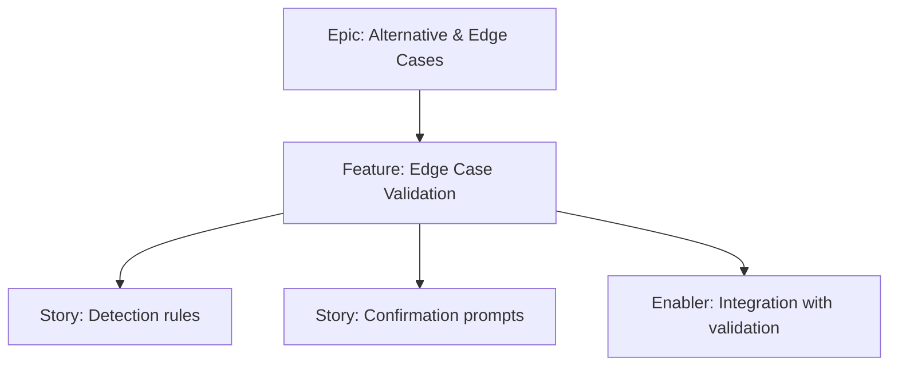

# Project Plan — Edge Case Validation

## 1. Project Overview
- Feature Summary: Validate and confirm unusual configurations (0 mafia, all mafia); ensure UX guidance and safe proceed/cancel.
- Success Criteria: Confirmation prompts; clear copy; logs or cues; idempotent.
- Milestones: Detect edge case → Prompt confirmation → Integrate with allocation.
- Risks: User confusion; accidental confirmation.

## 2. Work Item Hierarchy

## 3. Issues Breakdown
- Feature: Edge Case Validation
- Acceptance: 0/all mafia allowed via confirm; copy clear
- DoD: Docs updated

## 4. Priority/Value
| Priority | Value |
|---|---|
| P2 | Medium |

## 5. Estimation
- Size: S (2 pts)

## 6. Dependencies
- Mafia Count Validation

## 7. Sprint Planning
- Goal: Safe handling of edge cases

## 8. Project Board
- Component: validation

## 9. Automation
- N/A
