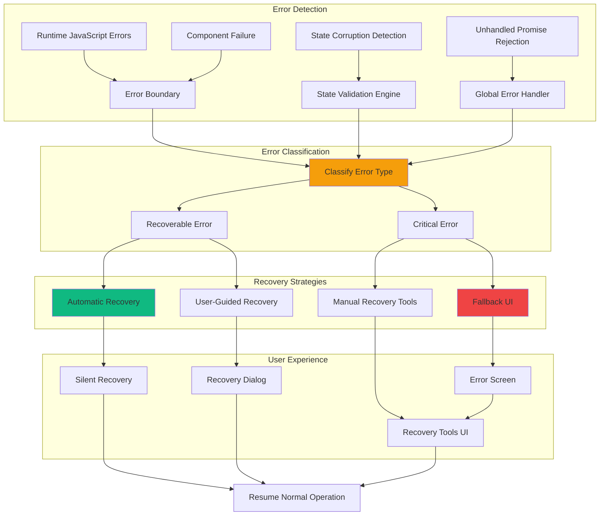

# Feature Implementation Plan: Error Recovery System

## Goal

Implement comprehensive error recovery system that handles application failures, state corruption, and unexpected errors with graceful fallbacks, user notification, and automatic recovery mechanisms. This includes error boundaries, state recovery, user guidance, and integration with all game systems.

## Requirements

### Core Recovery Requirements
- JavaScript error boundary implementation with graceful fallbacks
- State corruption detection and automatic recovery
- User-friendly error messaging with actionable recovery options
- Automatic retry mechanisms for transient failures
- Manual recovery tools for persistent issues
- Error logging and debugging support (development mode)
- Progressive enhancement ensuring core functionality without JavaScript
- Integration with all game systems for comprehensive error handling

### Error Categories
- **Runtime Errors**: JavaScript exceptions and unhandled promises
- **State Corruption**: Invalid or inconsistent application state
- **Input Validation Failures**: Malformed or unexpected user input
- **Performance Issues**: Memory leaks or excessive resource usage
- **Network Failures**: Connection issues (if applicable for future features)
- **Storage Issues**: LocalStorage quota or corruption (if implemented)
- **Component Failures**: Individual component crashes or failures

## Technical Considerations

### System Architecture Overview



### Frontend Architecture

#### Error Recovery Engine

```jsx
// utils/errorRecovery.js

/**
 * Error types and severity levels
 */
export const ERROR_TYPES = {
  RUNTIME_ERROR: 'RUNTIME_ERROR',
  STATE_CORRUPTION: 'STATE_CORRUPTION',
  VALIDATION_ERROR: 'VALIDATION_ERROR',
  COMPONENT_ERROR: 'COMPONENT_ERROR',
  PERFORMANCE_ERROR: 'PERFORMANCE_ERROR',
  UNKNOWN_ERROR: 'UNKNOWN_ERROR'
};

export const ERROR_SEVERITY = {
  LOW: 'LOW',           // Auto-recoverable
  MEDIUM: 'MEDIUM',     // User-guided recovery
  HIGH: 'HIGH',         // Manual recovery required
  CRITICAL: 'CRITICAL'  // Application restart needed
};

/**
 * Recovery strategies
 */
export const RECOVERY_STRATEGIES = {
  RETRY: 'RETRY',
  RESET_STATE: 'RESET_STATE',
  RELOAD_COMPONENT: 'RELOAD_COMPONENT',
  FALLBACK_UI: 'FALLBACK_UI',
  MANUAL_INTERVENTION: 'MANUAL_INTERVENTION'
};

/**
 * Error classification and recovery mapping
 */
const ERROR_RECOVERY_MAP = {
  [ERROR_TYPES.VALIDATION_ERROR]: {
    severity: ERROR_SEVERITY.LOW,
    strategy: RECOVERY_STRATEGIES.RETRY,
    autoRecovery: true
  },
  [ERROR_TYPES.STATE_CORRUPTION]: {
    severity: ERROR_SEVERITY.MEDIUM,
    strategy: RECOVERY_STRATEGIES.RESET_STATE,
    autoRecovery: false
  },
  [ERROR_TYPES.COMPONENT_ERROR]: {
    severity: ERROR_SEVERITY.HIGH,
    strategy: RECOVERY_STRATEGIES.RELOAD_COMPONENT,
    autoRecovery: false
  },
  [ERROR_TYPES.RUNTIME_ERROR]: {
    severity: ERROR_SEVERITY.HIGH,
    strategy: RECOVERY_STRATEGIES.FALLBACK_UI,
    autoRecovery: false
  },
  [ERROR_TYPES.PERFORMANCE_ERROR]: {
    severity: ERROR_SEVERITY.MEDIUM,
    strategy: RECOVERY_STRATEGIES.RESET_STATE,
    autoRecovery: true
  }
};

/**
 * Classify error and determine recovery strategy
 * @param {Error} error - The error object
 * @param {Object} errorInfo - Additional error context
 * @returns {Object} Error classification and recovery plan
 */
export const classifyError = (error, errorInfo = {}) => {
  let errorType = ERROR_TYPES.UNKNOWN_ERROR;
  let context = {};

  // Classify by error message patterns
  if (error.message?.includes('state') || error.message?.includes('invalid')) {
    errorType = ERROR_TYPES.STATE_CORRUPTION;
  } else if (error.message?.includes('validation') || error.message?.includes('input')) {
    errorType = ERROR_TYPES.VALIDATION_ERROR;
  } else if (errorInfo.componentStack) {
    errorType = ERROR_TYPES.COMPONENT_ERROR;
    context.componentStack = errorInfo.componentStack;
  } else if (error.name === 'ChunkLoadError') {
    errorType = ERROR_TYPES.RUNTIME_ERROR;
    context.chunkError = true;
  } else {
    errorType = ERROR_TYPES.RUNTIME_ERROR;
  }

  const recovery = ERROR_RECOVERY_MAP[errorType] || {
    severity: ERROR_SEVERITY.CRITICAL,
    strategy: RECOVERY_STRATEGIES.MANUAL_INTERVENTION,
    autoRecovery: false
  };

  return {
    type: errorType,
    severity: recovery.severity,
    strategy: recovery.strategy,
    autoRecovery: recovery.autoRecovery,
    error,
    errorInfo,
    context,
    timestamp: new Date().toISOString()
  };
};

/**
 * Generate user-friendly error messages
 * @param {Object} errorClassification - Classified error
 * @returns {Object} User-friendly messages
 */
export const generateErrorMessages = (errorClassification) => {
  const { type, severity, context } = errorClassification;

  const messages = {
    [ERROR_TYPES.VALIDATION_ERROR]: {
      title: 'Input Validation Error',
      description: 'There was an issue with the provided input. Please check your entries and try again.',
      actionText: 'Retry',
      icon: '⚠️'
    },
    [ERROR_TYPES.STATE_CORRUPTION]: {
      title: 'Game State Issue',
      description: 'The game state appears to be corrupted. We can reset to the last known good state.',
      actionText: 'Reset Game State',
      icon: '🔄'
    },
    [ERROR_TYPES.COMPONENT_ERROR]: {
      title: 'Component Error',
      description: 'A component has encountered an error. Reloading the component may resolve the issue.',
      actionText: 'Reload Component',
      icon: '🔧'
    },
    [ERROR_TYPES.RUNTIME_ERROR]: {
      title: 'Application Error',
      description: 'The application has encountered an unexpected error. You may need to refresh the page.',
      actionText: 'Refresh Page',
      icon: '🚫'
    },
    [ERROR_TYPES.PERFORMANCE_ERROR]: {
      title: 'Performance Issue',
      description: 'The application is running slowly. Clearing the current state may improve performance.',
      actionText: 'Reset for Performance',
      icon: '⚡'
    }
  };

  const baseMessage = messages[type] || {
    title: 'Unknown Error',
    description: 'An unexpected error has occurred. Please try refreshing the page.',
    actionText: 'Refresh',
    icon: '❓'
  };

  return {
    ...baseMessage,
    severity,
    technicalDetails: context,
    canRecover: severity !== ERROR_SEVERITY.CRITICAL
  };
};

/**
 * State validation utilities
 */
export const validateApplicationState = (state) => {
  const issues = [];

  // Validate player assignments
  if (state.assignment) {
    if (!Array.isArray(state.assignment.players)) {
      issues.push({
        type: 'INVALID_PLAYERS_ARRAY',
        message: 'Players array is not valid'
      });
    } else {
      // Validate individual players
      state.assignment.players.forEach((player, index) => {
        if (!player.id && player.id !== 0) {
          issues.push({
            type: 'MISSING_PLAYER_ID',
            message: `Player at index ${index} missing ID`
          });
        }
        if (!player.name || typeof player.name !== 'string') {
          issues.push({
            type: 'INVALID_PLAYER_NAME',
            message: `Player at index ${index} has invalid name`
          });
        }
        if (!['MAFIA', 'VILLAGER'].includes(player.role)) {
          issues.push({
            type: 'INVALID_PLAYER_ROLE',
            message: `Player at index ${index} has invalid role`
          });
        }
      });
    }
  }

  // Validate form data
  if (state.form) {
    if (state.form.playerCount && typeof state.form.playerCount !== 'number') {
      issues.push({
        type: 'INVALID_PLAYER_COUNT',
        message: 'Player count is not a number'
      });
    }
    if (state.form.mafiaCount && typeof state.form.mafiaCount !== 'number') {
      issues.push({
        type: 'INVALID_MAFIA_COUNT',
        message: 'Mafia count is not a number'
      });
    }
  }

  return {
    isValid: issues.length === 0,
    issues
  };
};

/**
 * Recovery action implementations
 */
export const executeRecoveryAction = async (strategy, context = {}) => {
  switch (strategy) {
    case RECOVERY_STRATEGIES.RETRY:
      // Simple retry - just return success
      return { success: true, message: 'Operation retried successfully' };

    case RECOVERY_STRATEGIES.RESET_STATE:
      // Clear problematic state
      if (context.clearState) {
        context.clearState();
      }
      return { success: true, message: 'State reset successfully' };

    case RECOVERY_STRATEGIES.RELOAD_COMPONENT:
      // Force component remount
      if (context.reloadComponent) {
        context.reloadComponent();
      }
      return { success: true, message: 'Component reloaded successfully' };

    case RECOVERY_STRATEGIES.FALLBACK_UI:
      // Switch to fallback interface
      if (context.activateFallback) {
        context.activateFallback();
      }
      return { success: true, message: 'Fallback interface activated' };

    case RECOVERY_STRATEGIES.MANUAL_INTERVENTION:
      // Provide recovery tools
      return { success: false, message: 'Manual intervention required' };

    default:
      return { success: false, message: 'Unknown recovery strategy' };
  }
};
```

#### Error Boundary Component

```jsx
// components/ErrorRecoverySystem.jsx
import React, { Component, createContext, useContext } from 'react';
import PropTypes from 'prop-types';
import { 
  classifyError, 
  generateErrorMessages, 
  executeRecoveryAction,
  ERROR_SEVERITY 
} from '../utils/errorRecovery';

/**
 * Error Recovery Context
 */
const ErrorRecoveryContext = createContext({
  reportError: () => {},
  clearError: () => {},
  hasError: false
});

export const useErrorRecovery = () => useContext(ErrorRecoveryContext);

/**
 * Error Boundary with Recovery
 */
class ErrorBoundary extends Component {
  constructor(props) {
    super(props);
    
    this.state = {
      hasError: false,
      error: null,
      errorInfo: null,
      errorClassification: null,
      retryCount: 0,
      isRecovering: false
    };
  }

  static getDerivedStateFromError(error) {
    return { hasError: true, error };
  }

  componentDidCatch(error, errorInfo) {
    const errorClassification = classifyError(error, errorInfo);
    
    this.setState({
      errorInfo,
      errorClassification
    });

    // Log error in development
    if (process.env.NODE_ENV === 'development') {
      console.group('🚨 Error Boundary Caught Error');
      console.error('Error:', error);
      console.error('Error Info:', errorInfo);
      console.error('Classification:', errorClassification);
      console.groupEnd();
    }

    // Attempt automatic recovery for recoverable errors
    if (errorClassification.autoRecovery && this.state.retryCount < 3) {
      setTimeout(() => {
        this.handleRecovery();
      }, 1000);
    }
  }

  handleRecovery = async () => {
    const { errorClassification, retryCount } = this.state;
    
    this.setState({ isRecovering: true });

    try {
      const result = await executeRecoveryAction(
        errorClassification.strategy,
        {
          clearState: this.props.onStateReset,
          reloadComponent: () => this.setState({
            hasError: false,
            error: null,
            errorInfo: null,
            errorClassification: null,
            retryCount: retryCount + 1
          }),
          activateFallback: this.props.onFallbackActivate
        }
      );

      if (result.success) {
        this.setState({
          hasError: false,
          error: null,
          errorInfo: null,
          errorClassification: null,
          isRecovering: false
        });
      }
    } catch (recoveryError) {
      console.error('Recovery failed:', recoveryError);
      this.setState({ isRecovering: false });
    }
  };

  handleManualRecovery = () => {
    window.location.reload();
  };

  render() {
    const { hasError, errorClassification, isRecovering } = this.state;
    const { children, fallbackComponent: FallbackComponent } = this.props;

    if (hasError) {
      if (FallbackComponent) {
        return (
          <FallbackComponent
            error={this.state.error}
            errorInfo={this.state.errorInfo}
            errorClassification={errorClassification}
            onRecovery={this.handleRecovery}
            onManualRecovery={this.handleManualRecovery}
            isRecovering={isRecovering}
          />
        );
      }

      return <DefaultErrorFallback 
        errorClassification={errorClassification}
        onRecovery={this.handleRecovery}
        onManualRecovery={this.handleManualRecovery}
        isRecovering={isRecovering}
      />;
    }

    const contextValue = {
      reportError: (error, context) => {
        const classification = classifyError(error, context);
        this.setState({
          hasError: true,
          error,
          errorInfo: context,
          errorClassification: classification
        });
      },
      clearError: () => {
        this.setState({
          hasError: false,
          error: null,
          errorInfo: null,
          errorClassification: null
        });
      },
      hasError
    };

    return (
      <ErrorRecoveryContext.Provider value={contextValue}>
        {children}
      </ErrorRecoveryContext.Provider>
    );
  }
}

/**
 * Default Error Fallback UI
 */
const DefaultErrorFallback = ({ 
  errorClassification, 
  onRecovery, 
  onManualRecovery, 
  isRecovering 
}) => {
  const messages = errorClassification ? generateErrorMessages(errorClassification) : {
    title: 'Application Error',
    description: 'Something went wrong. Please try refreshing the page.',
    actionText: 'Refresh Page',
    icon: '🚫',
    canRecover: false
  };

  return (
    <div className="min-h-screen bg-gray-50 flex items-center justify-center p-4">
      <div className="bg-white rounded-xl shadow-lg p-6 max-w-md w-full text-center">
        {/* Error Icon */}
        <div className="text-6xl mb-4">{messages.icon}</div>
        
        {/* Error Message */}
        <h1 className="text-2xl font-bold text-gray-900 mb-2">
          {messages.title}
        </h1>
        <p className="text-gray-600 mb-6">
          {messages.description}
        </p>

        {/* Recovery Actions */}
        <div className="space-y-3">
          {messages.canRecover && (
            <button
              onClick={onRecovery}
              disabled={isRecovering}
              className="
                w-full h-12 px-6 text-white bg-blue-600
                hover:bg-blue-700 active:bg-blue-800
                rounded-lg font-medium transition-colors
                focus:outline-none focus:ring-4 focus:ring-blue-200
                disabled:opacity-50 disabled:cursor-not-allowed
              "
            >
              {isRecovering ? (
                <div className="flex items-center justify-center">
                  <svg className="animate-spin h-4 w-4 mr-2" viewBox="0 0 24 24">
                    <circle className="opacity-25" cx="12" cy="12" r="10" stroke="currentColor" strokeWidth="4" fill="none" />
                    <path className="opacity-75" fill="currentColor" d="M4 12a8 8 0 018-8V0C5.373 0 0 5.373 0 12h4zm2 5.291A7.962 7.962 0 014 12H0c0 3.042 1.135 5.824 3 7.938l3-2.647z" />
                  </svg>
                  Recovering...
                </div>
              ) : (
                messages.actionText
              )}
            </button>
          )}
          
          <button
            onClick={onManualRecovery}
            className="
              w-full h-12 px-6 text-gray-700 bg-gray-200
              hover:bg-gray-300 active:bg-gray-400
              rounded-lg font-medium transition-colors
              focus:outline-none focus:ring-4 focus:ring-gray-200
            "
          >
            Refresh Page
          </button>
        </div>

        {/* Development Info */}
        {process.env.NODE_ENV === 'development' && errorClassification && (
          <details className="mt-6 text-left">
            <summary className="cursor-pointer text-sm text-gray-500 hover:text-gray-700">
              Technical Details (Development)
            </summary>
            <div className="mt-2 p-3 bg-gray-100 rounded text-xs font-mono text-gray-800 overflow-auto">
              <div>Type: {errorClassification.type}</div>
              <div>Severity: {errorClassification.severity}</div>
              <div>Strategy: {errorClassification.strategy}</div>
              {errorClassification.error && (
                <div>Error: {errorClassification.error.message}</div>
              )}
            </div>
          </details>
        )}
      </div>
    </div>
  );
};

ErrorBoundary.propTypes = {
  children: PropTypes.node.isRequired,
  fallbackComponent: PropTypes.elementType,
  onStateReset: PropTypes.func,
  onFallbackActivate: PropTypes.func,
};

export default ErrorBoundary;
```

### Performance Optimization

- **Lightweight Error Detection:** Minimal performance impact on normal operation
- **Efficient Recovery Strategies:** Fast recovery mechanisms with minimal disruption
- **Memory Management:** Proper cleanup of error state and handlers
- **Progressive Enhancement:** Core functionality available without JavaScript
- **Async Error Handling:** Non-blocking error recovery operations

### Implementation Steps

1. **Error Detection System**
   - Implement error boundary with comprehensive error catching
   - Add global error handlers for unhandled promises
   - Create state validation and corruption detection

2. **Recovery Mechanisms**
   - Build automatic recovery strategies for common issues
   - Create user-guided recovery flows with clear instructions
   - Implement manual recovery tools for persistent problems

3. **User Experience**
   - Design user-friendly error messages and recovery interfaces
   - Add progress indicators and recovery status feedback
   - Ensure accessibility compliance for error states

4. **Integration and Testing**
   - Integrate error boundaries across all major components
   - Test error scenarios and recovery mechanisms
   - Validate error handling in edge cases and stress conditions

## Context Template

- **Feature PRD:** Error Recovery System provides comprehensive error handling with automatic and manual recovery mechanisms
- **Epic Integration:** Completes Alternative & Edge Cases epic with robust error handling
- **Dependencies:** Integrates with Edge Case Validation for comprehensive error prevention
- **Dependents:** Protects all components across all epics from errors and failures