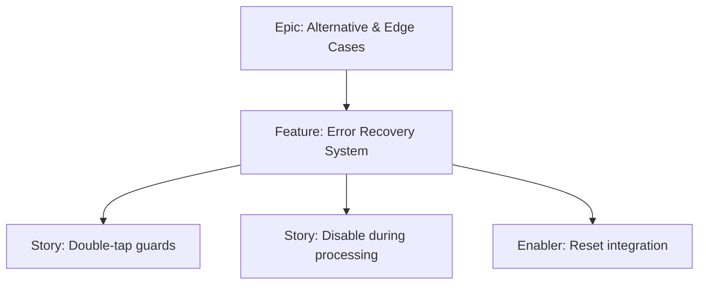

# Project Plan — Error Recovery System

## 1. Project Overview
- Feature Summary: Ensure idempotency and guards for rapid taps, and provide recovery paths (e.g., reset) to continue workflow if interrupted.
- Success Criteria: Double taps do not break state; actions disable while processing; reset path available.
- Milestones: Guards on key actions → Disable during processing → Reset integration.
- Risks: Deadlocks if buttons never re-enable.

## 2. Work Item Hierarchy

## 3. Issues Breakdown
- Feature: Error Recovery System
- Acceptance: Idempotent actions; recovery via reset
- DoD: Docs updated

## 4. Priority/Value
| Priority | Value |
|---|---|
| P2 | Medium |

## 5. Estimation
- Size: S (2 pts)

## 6. Dependencies
- Allocation/Reveal/Reset features

## 7. Sprint Planning
- Goal: Robust guards and recovery

## 8. Project Board
- Component: state

## 9. Automation
- N/A
