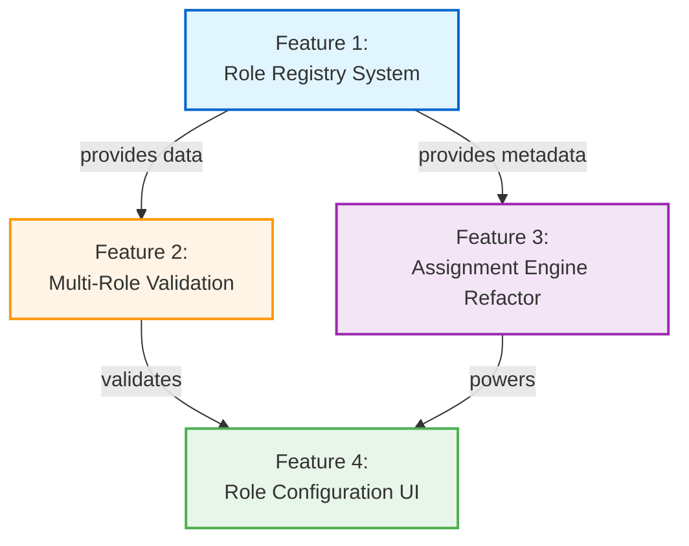

# Extensible Special Roles System - Feature Breakdown Summary

## Epic Overview

**Epic:** Extensible Special Roles System (Police & Doctor)  
**Parent Documents:**
- [Epic PRD](./epic.md)
- [Architecture Specification](./arch.md)

## Feature Breakdown Strategy

The epic has been decomposed into **4 core features** following a **bottom-up implementation approach** (foundation → logic → UI):



## Features

### Feature 1: Role Registry System (Foundation)

**Location:** `role-registry-system/prd.md`  
**User Stories:** US-31 through US-37  
**T-Shirt Size:** SMALL (S)  
**Duration:** 1.5 weeks

**Purpose:** Centralized role metadata store serving as single source of truth for all role definitions.

**Key Deliverables:**
- `src/utils/roleRegistry.js` with frozen role configuration objects
- Role schema: `{ id, name, team, color, description, constraints, icon?, priority? }`
- Predefined roles: MAFIA, POLICE, DOCTOR, VILLAGER with complete metadata
- API functions: `getRoles()`, `getRoleById()`, `getRolesByTeam()`, `getSpecialRoles()`, `validateRoleCount()`
- JSDoc type annotations for IDE autocomplete
- 100% test coverage for registry module

**Dependencies:** None (foundational feature)

**Success Criteria:**
- New role added via registry entry in ~5 minutes
- Zero engine/UI changes required when adding roles
- <1ms registry access time
- <2KB bundle size increase

---

### Feature 2: Multi-Role Validation Framework

**Location:** `multi-role-validation-framework/prd.md`  
**User Stories:** US-38 through US-44  
**T-Shirt Size:** MEDIUM (M)  
**Duration:** 1 week

**Purpose:** Extensible validation framework ensuring role configuration integrity with real-time feedback.

**Key Deliverables:**
- `src/utils/roleValidation.js` with composable validation rule system
- Built-in rules: TotalRoleCountRule, IndividualMinMaxRule, MinimumVillagersRule, NegativeCountRule, AllSpecialRolesRule
- `calculateVillagerCount()` function for dynamic calculation
- `useRoleValidation(roleConfiguration, totalPlayers)` React hook
- Integration with existing `edgeCaseValidation.js` patterns
- User-friendly error messages with actionable suggestions

**Dependencies:** Role Registry System (reads constraints)

**Success Criteria:**
- <10ms validation execution time
- <100ms UI response time (debounced)
- 90%+ test coverage
- New validation rules added via array composition

---

### Feature 3: Generic Assignment Engine Refactor

**Location:** `generic-assignment-engine-refactor/prd.md`  
**User Stories:** US-45 through US-50  
**T-Shirt Size:** MEDIUM (M)  
**Duration:** 1 week

**Purpose:** Refactor assignment engine to operate on role objects from registry, enabling multi-role support.

**Key Deliverables:**
- Refactored `src/utils/roleAssignmentEngine.js` with role array builder
- `buildRoleArray(roleConfiguration, totalPlayers, registry)` function
- Generic Fisher-Yates shuffle operating on role objects
- Enhanced assignment data structure: `{ id, name, role: {roleObject}, index, revealed }`
- `verifyAssignment()` function for integrity checking
- Backward compatibility via adapter for legacy signature

**Dependencies:** Role Registry System (role definitions), Validation Framework (config validation)

**Success Criteria:**
- <200ms assignment time for 30 players with 10 roles
- Sub-millisecond performance for typical configs (20 players, 4 roles)
- Passes randomness distribution tests (1% max deviation)
- 95%+ test coverage
- Zero breaking changes to existing workflows

---

### Feature 4: Role Configuration UI System

**Location:** `role-configuration-ui-system/prd.md`  
**User Stories:** US-51 through US-57  
**T-Shirt Size:** MEDIUM-LARGE (M-L)  
**Duration:** 1.5 weeks

**Purpose:** User-facing multi-role configuration interface with real-time validation and villager calculation.

**Key Deliverables:**
- `src/components/RoleConfigurationManager.jsx` orchestrator component
- `src/components/RoleInput.jsx` generic data-driven input component
- `src/hooks/usePlayerRoleConfiguration.js` state management hook
- Role distribution summary with color-coded badges
- Real-time villager count display with validation feedback
- Touch-optimized counter controls (44px+ targets)
- Full WCAG AA accessibility compliance

**Dependencies:** Role Registry (metadata), Validation Framework (real-time feedback)

**Success Criteria:**
- <50ms initial render time
- <100ms role count update response
- New roles render automatically when added to registry
- 44px+ touch targets on all interactive elements
- WCAG AA compliant with screen reader support

---

## Implementation Sequence

### Phase 1: Foundation (Week 1-2)
1. **Feature 1: Role Registry System** (1.5 weeks)
   - Build centralized role metadata store
   - Define schema and API functions
   - Write comprehensive tests
   - Document extensibility patterns

### Phase 2: Core Logic (Week 3-5)
2. **Feature 2: Multi-Role Validation Framework** (1 week)
   - Implement validation rule system
   - Create React hook integration
   - Test edge cases thoroughly

3. **Feature 3: Generic Assignment Engine Refactor** (1 week)
   - Refactor role array builder
   - Update Fisher-Yates shuffle
   - Verify assignment integrity
   - Ensure backward compatibility

### Phase 3: User Interface (Week 6-7.5)
4. **Feature 4: Role Configuration UI System** (1.5 weeks)
   - Build generic RoleInput component
   - Implement RoleConfigurationManager
   - Integrate validation framework
   - Polish mobile UX and accessibility

### Phase 4: Integration & Testing (Week 7.5-8.5)
- End-to-end integration testing
- Performance optimization
- Accessibility audit
- Documentation completion
- Production deployment

**Total Duration:** 8.5 weeks (2 sprints with buffer)

---

## Cross-Feature Integration Points

### Registry → Validation
- Validation framework reads role constraints from registry
- Validation rules data-driven by registry metadata

### Registry → Assignment Engine
- Engine builds role arrays from registry definitions
- Assignment includes complete role objects with metadata

### Validation → UI
- UI components consume validation state for real-time feedback
- Error messages displayed inline with inputs

### Registry → UI
- UI components render dynamically from registry entries
- Role colors, labels, constraints read from registry

### Assignment Engine → UI (Future)
- Enhanced assignment data structure enables role-specific card styling
- Role descriptions displayed in reveal dialog

---

## Extensibility Validation

**Testing New Role Addition (Detective Example):**

1. **Add to Registry** (~5 minutes):
   ```javascript
   {
     id: 'DETECTIVE',
     name: 'Detective',
     team: 'special',
     color: { primary: '#8b5cf6', ... },
     description: 'Investigate player alignment each night',
     constraints: { min: 0, max: 1, default: 0 }
   }
   ```

2. **Validation Automatically Extends** (0 code changes):
   - Min/max constraints enforced
   - Total role count validation includes Detective

3. **Assignment Engine Automatically Supports** (0 code changes):
   - Detective roles shuffled with others
   - Assignment data includes Detective metadata

4. **UI Automatically Renders** (0 code changes):
   - Detective input appears in role configuration
   - Purple color accent applied from registry
   - "Max: 1" constraint hint displayed

**Total Time:** ~4 hours (add + test + document)

---

## Success Metrics (Epic-Level)

**Developer Velocity:**
- ✅ Role addition time: 4 hours (vs. 2 weeks currently)
- ✅ Zero engine changes required for new roles
- ✅ Zero UI changes required for new roles

**Performance:**
- ✅ <200ms assignment time (30 players, 10+ roles)
- ✅ <100ms validation feedback
- ✅ <10KB total bundle increase

**User Experience:**
- ✅ Real-time villager calculation
- ✅ Clear role distribution summary
- ✅ Mobile-optimized touch controls (44px+ targets)
- ✅ WCAG AA accessibility compliance

**Code Quality:**
- ✅ 90%+ test coverage across all features
- ✅ Comprehensive JSDoc documentation
- ✅ Backward compatibility maintained

---

## Documentation Deliverables

1. **Feature PRDs** (Complete):
   - Role Registry System
   - Multi-Role Validation Framework
   - Generic Assignment Engine Refactor
   - Role Configuration UI System

2. **Developer Guide** (To Create):
   - `docs/ROLE_EXTENSIBILITY.md` with step-by-step role addition guide

3. **Architecture Updates** (To Update):
   - `copilot-instructions.md` with new patterns
   - `DEVELOPMENT.md` with architectural decisions

4. **Testing Documentation** (To Create):
   - Test strategy for each feature
   - Integration test scenarios
   - Performance benchmark procedures

---

## Next Steps

1. **✅ Feature PRDs Complete** - Ready for implementation planning
2. **⏭️ Create Implementation Plans** - Detailed technical specifications for each feature
3. **⏭️ Set Up Project Structure** - Create feature branches and issues
4. **⏭️ Begin Phase 1** - Start with Role Registry System foundation

---

## Questions for Clarification

Before starting implementation, consider:

1. **Role Constraints:** Should Police/Doctor max be 2 (current PRD) or configurable/unlimited?
2. **Villager Minimum:** Should there be a configurable minimum villagers (default 1)?
3. **Role Icons:** Are role-specific icons (Police badge, Doctor cross) required or nice-to-have?
4. **Presets:** Should we support configuration presets (e.g., "Balanced 20-player game")?
5. **Progressive Disclosure:** Should Police/Doctor inputs be hidden by default until Mafia configured?

These can be addressed during implementation or marked as future enhancements.
