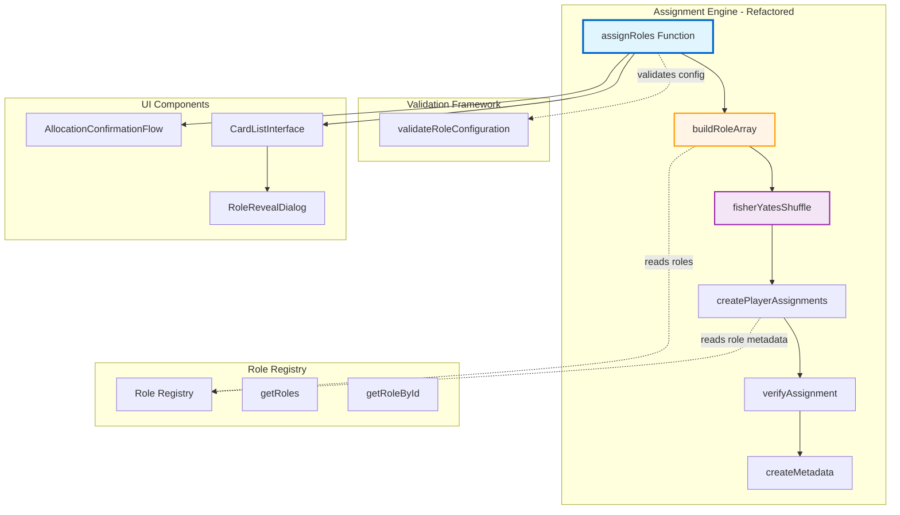

# Implementation Plan: Generic Assignment Engine Refactor

## Goal

Refactor the hardcoded two-role assignment engine to support unlimited role types through a generic architecture operating on role objects from the registry. Replace boolean array assignments (true=Mafia, false=Villager) with role object arrays enabling Police, Doctor, and future special roles. Maintain cryptographic randomization, preserve sub-millisecond performance (<200ms for 30 players with 10 roles), and ensure backward compatibility with existing two-role workflows. The enhanced assignment data structure will include complete role metadata (id, name, color, description) enabling role-specific UI rendering. This refactoring establishes the core extensibility foundation allowing new roles to be added through registry configuration without touching engine code.

## Requirements

- Implement `buildRoleArray(roleConfiguration, totalPlayers, registry)` converting role count dictionary to shuffleable array
- Refactor Fisher-Yates shuffle to operate on role object arrays (not boolean arrays)
- Enhance assignment data structure: `{ id, name, role: {fullRoleObject}, index, revealed }`
- Update `assignRoles()` to accept role configuration dictionary instead of single mafiaCount parameter
- Implement `verifyAssignment()` validating assignment integrity against expected counts
- Add assignment metadata and statistics for UI display and debugging
- Maintain backward compatibility via adapter supporting legacy `assignRoles(playerNames, mafiaCount)` signature
- Achieve <200ms assignment time for 30 players with 10 role types (target: <50ms typical)
- Write comprehensive tests achieving 95%+ coverage with randomness validation

## Technical Considerations

### System Architecture



**Key Changes:**
- **Before:** Boolean array shuffle → Zip with names → Assign role strings
- **After:** Role object array builder → Shuffle role objects → Zip with names → Assign full role objects
- **Data Flow:** Registry provides role metadata → Engine builds/shuffles → UI renders with colors/descriptions

### Implementation Steps

#### Phase 1: Role Array Builder (Day 1)

**Step 1.1: Implement buildRoleArray()**
```javascript
import { getRoleById, getSpecialRoles, ROLES } from './roleRegistry';

/**
 * Build array of role objects from role configuration for shuffling.
 * 
 * @param {Object} roleConfiguration - Role count dictionary {[ROLES.MAFIA]: 5, ...}
 * @param {number} totalPlayers - Total players in game
 * @returns {Object[]} Array of role objects ready for shuffle
 */
export function buildRoleArray(roleConfiguration, totalPlayers) {
  const roleArray = [];
  const specialRoles = getSpecialRoles();
  
  // Add special role objects to array
  for (const role of specialRoles) {
    const count = roleConfiguration[role.id] || 0;
    for (let i = 0; i < count; i++) {
      roleArray.push(role);
    }
  }
  
  // Calculate and add villagers
  const villagerRole = getRoleById(ROLES.VILLAGER);
  const villagerCount = totalPlayers - roleArray.length;
  
  if (villagerCount < 0) {
    throw new Error(`Total role counts (${roleArray.length}) exceeds total players (${totalPlayers})`);
  }
  
  for (let i = 0; i < villagerCount; i++) {
    roleArray.push(villagerRole);
  }
  
  return roleArray;
}
```

#### Phase 2: Refactor Shuffle (Day 1-2)

**Step 2.1: Update fisherYatesShuffle() for Role Objects**
```javascript
/**
 * Fisher-Yates shuffle for role object arrays (cryptographically secure).
 * 
 * @param {Object[]} array - Array of role objects to shuffle
 * @returns {Object[]} Shuffled array (in-place mutation)
 */
export function fisherYatesShuffle(array) {
  const getRandomIndex = (max) => {
    if (typeof crypto !== 'undefined' && crypto.getRandomValues) {
      const randomBuffer = new Uint32Array(1);
      crypto.getRandomValues(randomBuffer);
      return randomBuffer[0] % max;
    }
    return Math.floor(Math.random() * max);
  };
  
  for (let i = array.length - 1; i > 0; i--) {
    const j = getRandomIndex(i + 1);
    [array[i], array[j]] = [array[j], array[i]]; // Swap role objects
  }
  
  return array;
}
```

#### Phase 3: Enhanced Data Structure (Day 2-3)

**Step 3.1: Create Player Assignment Objects**
```javascript
/**
 * Create player assignment objects with full role metadata.
 * 
 * @param {string[]} playerNames - Player names
 * @param {Object[]} shuffledRoles - Shuffled role objects
 * @returns {Object[]} Player assignment objects
 */
function createPlayerAssignments(playerNames, shuffledRoles) {
  return playerNames.map((name, index) => ({
    id: index,
    name: name,
    role: shuffledRoles[index], // Full role object with metadata
    index: index,
    revealed: false
  }));
}
```

#### Phase 4: Assignment Verification (Day 3)

**Step 4.1: Implement verifyAssignment()**
```javascript
/**
 * Verify assignment integrity against expected role counts.
 * 
 * @param {Object} assignment - Assignment object to verify
 * @param {Object} expectedRoleCounts - Expected role configuration
 * @returns {{isValid: boolean, errors: string[]}} Verification result
 */
export function verifyAssignment(assignment, expectedRoleCounts) {
  const errors = [];
  const actualCounts = {};
  
  // Count actual roles
  for (const player of assignment.players) {
    if (!player.role || !player.role.id) {
      errors.push(`Player ${player.name} has invalid role`);
      continue;
    }
    actualCounts[player.role.id] = (actualCounts[player.role.id] || 0) + 1;
  }
  
  // Verify counts match configuration
  const specialRoles = getSpecialRoles();
  for (const role of specialRoles) {
    const expected = expectedRoleCounts[role.id] || 0;
    const actual = actualCounts[role.id] || 0;
    if (expected !== actual) {
      errors.push(`${role.name} count mismatch: expected ${expected}, got ${actual}`);
    }
  }
  
  return { isValid: errors.length === 0, errors };
}
```

#### Phase 5: Main Assignment Function (Day 3-4)

**Step 5.1: Refactor assignRoles()**
```javascript
/**
 * Assign roles to players with multi-role support.
 * 
 * @param {string[]} playerNames - Player names array
 * @param {Object} roleConfiguration - Role count dictionary
 * @returns {Object} Assignment result with metadata
 */
export function assignRoles(playerNames, roleConfiguration) {
  // Validate inputs
  if (!playerNames || playerNames.length === 0) {
    throw new Error('Player names array cannot be empty');
  }
  
  const totalPlayers = playerNames.length;
  
  // Build role array
  const roleArray = buildRoleArray(roleConfiguration, totalPlayers);
  
  // Shuffle roles
  const shuffledRoles = fisherYatesShuffle(roleArray);
  
  // Create player assignments
  const players = createPlayerAssignments(playerNames, shuffledRoles);
  
  // Generate metadata
  const assignmentId = `assign_${Date.now()}_${Math.random().toString(36).substr(2, 9)}`;
  const timestamp = new Date().toISOString();
  
  // Calculate statistics
  const roleDistribution = {};
  const teamDistribution = {};
  for (const player of players) {
    roleDistribution[player.role.id] = (roleDistribution[player.role.id] || 0) + 1;
    teamDistribution[player.role.team] = (teamDistribution[player.role.team] || 0) + 1;
  }
  
  const assignment = {
    id: assignmentId,
    timestamp,
    players,
    metadata: {
      totalPlayers,
      roleConfiguration,
      version: '2.0.0-multi-role'
    },
    statistics: {
      roleDistribution,
      teamDistribution
    }
  };
  
  // Verify assignment
  const verification = verifyAssignment(assignment, roleConfiguration);
  if (!verification.isValid) {
    throw new Error(`Assignment verification failed: ${verification.errors.join(', ')}`);
  }
  
  return assignment;
}
```

**Step 5.2: Create Backward Compatibility Adapter**
```javascript
import { ROLES } from './roleRegistry';

/**
 * Legacy adapter supporting old assignRoles(playerNames, mafiaCount) signature.
 * 
 * @param {string[]} playerNames - Player names
 * @param {number|Object} mafiaCountOrConfig - Mafia count (legacy) or role config (new)
 * @returns {Object} Assignment result
 */
export function assignRolesAdapter(playerNames, mafiaCountOrConfig) {
  if (typeof mafiaCountOrConfig === 'number') {
    // Legacy signature: convert mafiaCount to configuration
    const roleConfiguration = {
      [ROLES.MAFIA]: mafiaCountOrConfig,
      [ROLES.POLICE]: 0,
      [ROLES.DOCTOR]: 0
      // Villagers calculated automatically
    };
    return assignRoles(playerNames, roleConfiguration);
  } else {
    // New signature: pass through
    return assignRoles(playerNames, mafiaCountOrConfig);
  }
}
```

#### Phase 6: Testing (Day 4-5)

**Step 6.1: Unit Tests**
```javascript
// src/utils/roleAssignmentEngine.test.js
import { describe, it, expect } from 'vitest';
import {
  buildRoleArray,
  fisherYatesShuffle,
  verifyAssignment,
  assignRoles
} from './roleAssignmentEngine';

describe('buildRoleArray', () => {
  it('should build correct role array', () => {
    const roleArray = buildRoleArray({ MAFIA: 2, POLICE: 1, DOCTOR: 1 }, 10);
    expect(roleArray).toHaveLength(10);
    expect(roleArray.filter(r => r.id === 'MAFIA')).toHaveLength(2);
    expect(roleArray.filter(r => r.id === 'POLICE')).toHaveLength(1);
    expect(roleArray.filter(r => r.id === 'DOCTOR')).toHaveLength(1);
    expect(roleArray.filter(r => r.id === 'VILLAGER')).toHaveLength(6);
  });
  
  it('should throw error if roles exceed players', () => {
    expect(() => {
      buildRoleArray({ MAFIA: 11 }, 10);
    }).toThrow('exceeds total players');
  });
});

describe('assignRoles', () => {
  it('should assign roles correctly', () => {
    const playerNames = ['Alice', 'Bob', 'Charlie', 'Dave', 'Eve'];
    const assignment = assignRoles(playerNames, { MAFIA: 2, POLICE: 1 });
    
    expect(assignment.players).toHaveLength(5);
    expect(assignment.players.filter(p => p.role.id === 'MAFIA')).toHaveLength(2);
    expect(assignment.players.filter(p => p.role.id === 'POLICE')).toHaveLength(1);
    expect(assignment.players.filter(p => p.role.id === 'VILLAGER')).toHaveLength(2);
  });
});
```

**Step 6.2: Randomness Distribution Test**
```javascript
describe('Randomness Validation', () => {
  it('should distribute roles evenly over 10,000 iterations', () => {
    const iterations = 10000;
    const playerNames = Array(20).fill(0).map((_, i) => `Player${i}`);
    const roleConfig = { MAFIA: 5, POLICE: 1, DOCTOR: 1 };
    
    const playerRoleCounts = {};
    
    for (let i = 0; i < iterations; i++) {
      const assignment = assignRoles(playerNames, roleConfig);
      assignment.players.forEach(player => {
        if (!playerRoleCounts[player.name]) {
          playerRoleCounts[player.name] = { MAFIA: 0, POLICE: 0, DOCTOR: 0, VILLAGER: 0 };
        }
        playerRoleCounts[player.name][player.role.id]++;
      });
    }
    
    // Each player should get Mafia ~25% of time (5/20 players)
    Object.values(playerRoleCounts).forEach(counts => {
      const mafiaPercentage = counts.MAFIA / iterations;
      expect(mafiaPercentage).toBeCloseTo(0.25, 1); // Within 10% (0.225-0.275)
    });
  });
});
```

**Step 6.3: Performance Test**
```javascript
describe('Performance', () => {
  it('should complete assignment in <200ms for 30 players', () => {
    const playerNames = Array(30).fill(0).map((_, i) => `Player${i}`);
    const roleConfig = { MAFIA: 8, POLICE: 2, DOCTOR: 2 };
    
    const start = performance.now();
    assignRoles(playerNames, roleConfig);
    const end = performance.now();
    
    expect(end - start).toBeLessThan(200);
  });
});
```

## Acceptance Validation

### Implementation Checklist
- [ ] buildRoleArray() implemented with villager auto-fill
- [ ] fisherYatesShuffle() refactored for role objects
- [ ] Enhanced player assignment objects with full role metadata
- [ ] assignRoles() accepts role configuration dictionary
- [ ] verifyAssignment() validates counts and integrity
- [ ] Backward compatibility adapter created
- [ ] Assignment metadata and statistics calculated
- [ ] Unit tests achieve 95%+ coverage
- [ ] Randomness distribution test passing (<1% deviation)
- [ ] Performance test passing (<200ms for 30 players)

### Post-Implementation Validation
- [ ] All acceptance criteria verified (AC-1 through AC-11)
- [ ] Existing tests pass with legacy adapter
- [ ] New multi-role assignments work in UI components
- [ ] Bundle size increase <5KB confirmed
- [ ] Documentation updated (copilot-instructions.md, DEVELOPMENT.md)

## Success Metrics

- ✅ Assignment time <200ms for 30 players with 10 roles
- ✅ Randomness distribution <1% deviation over 10,000 iterations
- ✅ 95%+ test coverage
- ✅ Zero count mismatches in verification
- ✅ Backward compatibility maintained

## Next Steps

After Feature 3 complete, Feature 4 (Role Configuration UI System) will integrate the refactored engine with user-facing role configuration interface using the enhanced assignment data structure.
