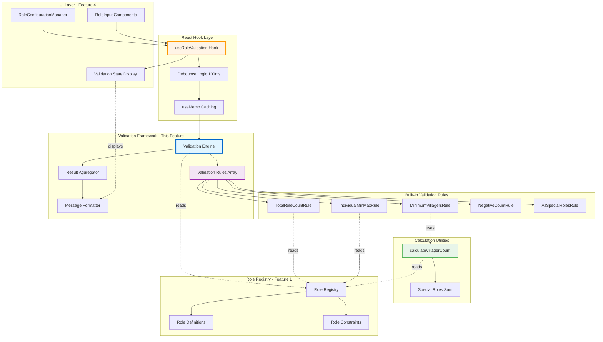
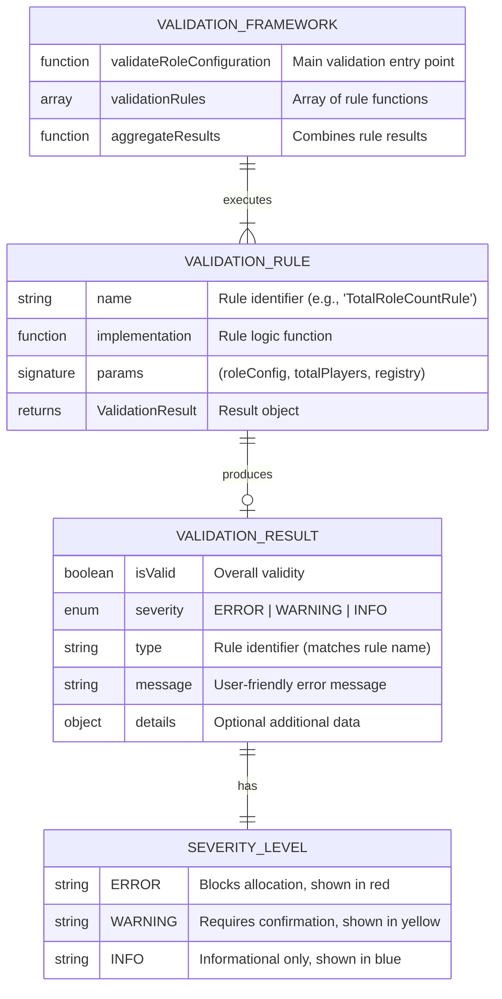

# Implementation Plan: Multi-Role Validation Framework

## Goal

Implement an extensible Multi-Role Validation Framework that validates role configurations against registry-defined constraints, ensuring data integrity before role assignment. The framework will support composable validation rules enabling developers to add new constraints without modifying core validation logic. A React hook (`useRoleValidation`) will integrate the framework with UI components, providing real-time validation feedback within 100ms with clear, actionable error messages. The system will differentiate between blocking errors (prevent allocation) and warnings (require confirmation), handling edge cases like 0 villagers and all-special-roles configurations. This feature ensures zero invalid allocations reach the assignment engine while maintaining excellent user experience through immediate, helpful validation feedback.

## Requirements

### Core Validation Framework
- Create `src/utils/roleValidation.js` with composable validation rule system
- Implement validation rule pattern: `(roleConfig, totalPlayers, registry) => ValidationResult`
- Define ValidationResult structure with isValid, severity, type, message, details fields
- Create built-in rules: TotalRoleCountRule, IndividualMinMaxRule, MinimumVillagersRule, NegativeCountRule, AllSpecialRolesRule
- Support ERROR, WARNING, INFO severity levels with appropriate handling

### Villager Calculation System
- Implement `calculateVillagerCount(roleConfiguration, totalPlayers)` function
- Support dynamic calculation reading special roles from registry
- Handle edge cases: negative counts (ERROR), zero counts (WARNING)
- Memoize calculations for performance optimization
- Expose villager count in validation results

### React Hook Integration
- Create `useRoleValidation(roleConfiguration, totalPlayers)` custom hook
- Return comprehensive validation state object with errors, warnings, villagerCount
- Implement 100ms debouncing to prevent excessive recalculation
- Use useMemo for result caching based on dependencies
- Support callback-based notification pattern for parent components

### Error Message System
- Generate user-friendly messages using role display names from registry
- Include specific constraint values and current counts in messages
- Provide actionable suggestions for fixing validation errors
- Support multi-line messages for complex violations
- Format messages consistently with existing edgeCaseValidation.js patterns

### Testing & Quality
- Write unit tests achieving 90%+ coverage
- Test each validation rule with valid, invalid, and edge cases
- Performance test validation execution (<10ms requirement)
- Integration test hook behavior in React component context
- Regression test existing Mafia validation patterns

## Technical Considerations

### System Architecture Overview



**Architecture Highlights:**
- **Composable Rules:** Validation rules are pure functions executed sequentially, enabling easy addition
- **Data-Driven:** Rules read constraints from Role Registry (no hardcoding)
- **Separation of Concerns:** Validation logic separated from UI presentation and state management
- **Performance Optimized:** Debouncing + memoization prevent excessive recalculation
- **Extensible:** New rules added to array without framework modifications

### Technology Stack Selection

**Core Implementation:**
- **JavaScript ES6+** with JSDoc type annotations for type safety
- **React Hooks** (useState, useMemo, useCallback, useEffect) for hook implementation
- **No external validation libraries** (Yup, Zod, Joi) to minimize bundle size

**Testing:**
- **Vitest** for unit testing (already configured)
- **React Testing Library** for hook integration tests
- **Performance.now()** for execution time measurements

**Performance:**
- **Lodash.debounce** OR custom debounce implementation (<1KB overhead)
- **React.useMemo** for result caching (zero-cost abstraction)

**Rationale:**
- Pure JavaScript keeps bundle <3KB (no heavy validation library dependencies)
- React Hooks pattern consistent with existing codebase (usePlayerCountManager, useMafiaCountValidation)
- Custom implementations prevent over-engineering for simple validation needs

### Integration Points

**Upstream Dependency (Required):**

**Role Registry System (Feature 1):**
- Validation framework reads role constraints via `getRoles()`, `getRoleById()`
- Rules access `role.constraints.min`, `role.constraints.max`, `role.team` properties
- calculateVillagerCount() uses registry to identify special roles dynamically

**Downstream Consumers (Features using Validation):**

**Role Configuration UI System (Feature 4):**
- `RoleConfigurationManager` uses `useRoleValidation` hook for real-time feedback
- Component displays validation errors/warnings from hook state
- Allocation button disabled when `isValid === false`

**AllocationConfirmationFlow (Existing):**
- Receives validation state via `onValidationChange` callback
- Displays edge case warnings in confirmation dialog
- Checks `requiresConfirmation` flag for WARNING-severity cases

**Integration Protocol:**
```javascript
// Example: RoleConfigurationManager integration
import { useRoleValidation } from '@/hooks/useRoleValidation';

function RoleConfigurationManager({ totalPlayers }) {
  const [roleCounts, setRoleCounts] = useState({ MAFIA: 1, POLICE: 0, DOCTOR: 0 });
  
  const validation = useRoleValidation(roleCounts, totalPlayers);
  
  return (
    <div>
      {validation.errors.map(error => (
        <p className="text-red-600" role="alert">{error.message}</p>
      ))}
      {validation.warnings.map(warning => (
        <p className="text-yellow-600" role="alert">{warning.message}</p>
      ))}
      <p>Villagers: {validation.villagerCount}</p>
    </div>
  );
}
```

### Validation Rule Schema Design



**Validation Flow:**
```
1. Input: roleConfiguration = { MAFIA: 5, POLICE: 1, DOCTOR: 1 }, totalPlayers = 20
2. Execute each rule in validationRules array sequentially
3. Collect all ValidationResult objects
4. Aggregate results:
   - isValid = no ERROR-severity results
   - hasErrors = any ERROR results
   - hasWarnings = any WARNING results
   - errors = array of ERROR results
   - warnings = array of WARNING results
5. Calculate villagerCount = 20 - (5 + 1 + 1) = 13
6. Return aggregated validation state
```

### API Design Specification

#### Type Definitions

```javascript
/**
 * @typedef {Object} RoleConfiguration
 * @property {number} MAFIA - Mafia player count
 * @property {number} POLICE - Police player count
 * @property {number} DOCTOR - Doctor player count
 * @description Object mapping role IDs to counts (extensible for future roles)
 */

/**
 * @typedef {Object} ValidationResult
 * @property {boolean} isValid - Whether validation passed
 * @property {'ERROR'|'WARNING'|'INFO'} severity - Severity level
 * @property {string} type - Rule identifier (e.g., 'TotalRoleCountRule')
 * @property {string} message - User-friendly error/warning message
 * @property {Object} [details] - Optional additional validation context
 */

/**
 * @typedef {Object} AggregatedValidationState
 * @property {boolean} isValid - Overall validation status (no ERRORs)
 * @property {boolean} hasErrors - Whether any ERROR-severity results present
 * @property {boolean} hasWarnings - Whether any WARNING-severity results present
 * @property {ValidationResult[]} errors - Array of ERROR-severity results
 * @property {ValidationResult[]} warnings - Array of WARNING-severity results
 * @property {number} villagerCount - Calculated villager count
 * @property {boolean} requiresConfirmation - Whether warnings require confirmation
 */

/**
 * @typedef {function} ValidationRule
 * @param {RoleConfiguration} roleConfig - Role count configuration
 * @param {number} totalPlayers - Total players in game
 * @param {Object} registry - Role registry reference
 * @returns {ValidationResult|null} Validation result or null if rule passes
 */
```

#### Core Functions

**Function: `validateRoleConfiguration(roleConfig, totalPlayers)`**

```javascript
/**
 * Validate a role configuration against all validation rules.
 * 
 * @param {RoleConfiguration} roleConfig - Role count configuration
 * @param {number} totalPlayers - Total players in game
 * @returns {AggregatedValidationState} Aggregated validation state
 * 
 * @example
 * const validation = validateRoleConfiguration(
 *   { MAFIA: 5, POLICE: 1, DOCTOR: 1 },
 *   20
 * );
 * 
 * if (!validation.isValid) {
 *   console.error('Invalid configuration:', validation.errors);
 * }
 * 
 * console.log(`Villagers: ${validation.villagerCount}`);
 */
export function validateRoleConfiguration(roleConfig, totalPlayers) {
  // Import registry
  const registry = require('./roleRegistry');
  
  // Execute all validation rules
  const results = VALIDATION_RULES
    .map(rule => rule(roleConfig, totalPlayers, registry))
    .filter(result => result !== null); // Remove passing rules
  
  // Aggregate results
  const errors = results.filter(r => r.severity === 'ERROR');
  const warnings = results.filter(r => r.severity === 'WARNING');
  
  // Calculate villager count
  const villagerCount = calculateVillagerCount(roleConfig, totalPlayers);
  
  return {
    isValid: errors.length === 0,
    hasErrors: errors.length > 0,
    hasWarnings: warnings.length > 0,
    errors,
    warnings,
    villagerCount,
    requiresConfirmation: warnings.length > 0 && errors.length === 0
  };
}
```

---

**Function: `calculateVillagerCount(roleConfig, totalPlayers)`**

```javascript
/**
 * Calculate remaining villager count after special roles assigned.
 * 
 * @param {RoleConfiguration} roleConfig - Role count configuration
 * @param {number} totalPlayers - Total players in game
 * @returns {number} Calculated villager count (may be negative if over-allocated)
 * 
 * @example
 * const villagerCount = calculateVillagerCount(
 *   { MAFIA: 5, POLICE: 1, DOCTOR: 1 },
 *   20
 * );
 * // Returns: 13 (20 - 5 - 1 - 1)
 */
export function calculateVillagerCount(roleConfig, totalPlayers) {
  const { getSpecialRoles } = require('./roleRegistry');
  
  const specialRoles = getSpecialRoles(); // Excludes VILLAGER
  const specialRoleSum = specialRoles.reduce((sum, role) => {
    return sum + (roleConfig[role.id] || 0);
  }, 0);
  
  return totalPlayers - specialRoleSum;
}
```

---

#### Built-In Validation Rules

**Rule: TotalRoleCountRule**

```javascript
/**
 * Validates that total role count does not exceed total players.
 * 
 * @param {RoleConfiguration} roleConfig - Role count configuration
 * @param {number} totalPlayers - Total players in game
 * @returns {ValidationResult|null} Error if sum exceeds total, null otherwise
 */
function TotalRoleCountRule(roleConfig, totalPlayers) {
  const { getSpecialRoles } = require('./roleRegistry');
  
  const specialRoles = getSpecialRoles();
  const totalRoles = specialRoles.reduce((sum, role) => {
    return sum + (roleConfig[role.id] || 0);
  }, 0);
  
  if (totalRoles > totalPlayers) {
    return {
      isValid: false,
      severity: 'ERROR',
      type: 'TotalRoleCountRule',
      message: `Total roles (${totalRoles}) cannot exceed total players (${totalPlayers}). Reduce role counts by ${totalRoles - totalPlayers}.`,
      details: { totalRoles, totalPlayers, excess: totalRoles - totalPlayers }
    };
  }
  
  return null; // Rule passes
}
```

---

**Rule: IndividualMinMaxRule**

```javascript
/**
 * Validates each role count against its registry-defined min/max constraints.
 * 
 * @param {RoleConfiguration} roleConfig - Role count configuration
 * @param {number} totalPlayers - Total players in game
 * @param {Object} registry - Role registry reference
 * @returns {ValidationResult|null} Error if any role violates constraints
 */
function IndividualMinMaxRule(roleConfig, totalPlayers, registry) {
  const { getRoles } = registry;
  const roles = getRoles();
  
  for (const role of roles) {
    if (role.id === 'VILLAGER') continue; // Villager count calculated, not configured
    
    const count = roleConfig[role.id] || 0;
    const { min, max } = role.constraints;
    
    if (count < min) {
      return {
        isValid: false,
        severity: 'ERROR',
        type: 'IndividualMinMaxRule',
        message: `${role.name} count (${count}) is below minimum (${min})`,
        details: { roleId: role.id, count, min, max }
      };
    }
    
    if (count > max) {
      return {
        isValid: false,
        severity: 'ERROR',
        type: 'IndividualMinMaxRule',
        message: `${role.name} count (${count}) exceeds maximum (${max}). Reduce ${role.name} count by ${count - max}.`,
        details: { roleId: role.id, count, min, max }
      };
    }
  }
  
  return null; // All roles within constraints
}
```

---

**Rule: MinimumVillagersRule**

```javascript
/**
 * Validates that configuration leaves at least minimum villagers (default: 1).
 * 
 * @param {RoleConfiguration} roleConfig - Role count configuration
 * @param {number} totalPlayers - Total players in game
 * @param {Object} registry - Role registry reference
 * @param {number} [minVillagers=1] - Minimum required villagers
 * @returns {ValidationResult|null} ERROR if negative, WARNING if 0, null otherwise
 */
function MinimumVillagersRule(roleConfig, totalPlayers, registry, minVillagers = 1) {
  const villagerCount = calculateVillagerCount(roleConfig, totalPlayers);
  
  if (villagerCount < 0) {
    return {
      isValid: false,
      severity: 'ERROR',
      type: 'MinimumVillagersRule',
      message: `Configuration allocates ${Math.abs(villagerCount)} more roles than players. Reduce special role counts.`,
      details: { villagerCount, totalPlayers }
    };
  }
  
  if (villagerCount === 0) {
    return {
      isValid: false,
      severity: 'WARNING',
      type: 'MinimumVillagersRule',
      message: 'Configuration leaves 0 villagers. All players assigned special roles. Consider adding villagers for balanced gameplay.',
      details: { villagerCount, totalPlayers }
    };
  }
  
  if (villagerCount < minVillagers) {
    return {
      isValid: false,
      severity: 'WARNING',
      type: 'MinimumVillagersRule',
      message: `Configuration leaves only ${villagerCount} villager(s). Consider reducing special roles for better balance.`,
      details: { villagerCount, minVillagers, totalPlayers }
    };
  }
  
  return null; // Sufficient villagers
}
```

---

**Rule: NegativeCountRule**

```javascript
/**
 * Validates that no role has negative count (should be caught by input controls).
 * 
 * @param {RoleConfiguration} roleConfig - Role count configuration
 * @param {number} totalPlayers - Total players in game
 * @param {Object} registry - Role registry reference
 * @returns {ValidationResult|null} Error if any role has negative count
 */
function NegativeCountRule(roleConfig, totalPlayers, registry) {
  const { getRoles } = registry;
  const roles = getRoles();
  
  for (const role of roles) {
    if (role.id === 'VILLAGER') continue;
    
    const count = roleConfig[role.id] || 0;
    if (count < 0) {
      return {
        isValid: false,
        severity: 'ERROR',
        type: 'NegativeCountRule',
        message: `${role.name} count cannot be negative (currently: ${count})`,
        details: { roleId: role.id, count }
      };
    }
  }
  
  return null;
}
```

---

**Rule: AllSpecialRolesRule**

```javascript
/**
 * Detects when all players are assigned special roles (0 villagers).
 * 
 * @param {RoleConfiguration} roleConfig - Role count configuration
 * @param {number} totalPlayers - Total players in game
 * @param {Object} registry - Role registry reference
 * @returns {ValidationResult|null} WARNING if 0 villagers, null otherwise
 */
function AllSpecialRolesRule(roleConfig, totalPlayers, registry) {
  const villagerCount = calculateVillagerCount(roleConfig, totalPlayers);
  
  if (villagerCount === 0) {
    return {
      isValid: false,
      severity: 'WARNING',
      type: 'AllSpecialRolesRule',
      message: 'All players assigned special roles. No villagers in game. This configuration may affect gameplay balance.',
      details: { villagerCount: 0, totalPlayers }
    };
  }
  
  return null;
}
```

---

**Validation Rules Array:**

```javascript
/**
 * Array of validation rules executed sequentially.
 * Rules return ValidationResult or null (if passing).
 * 
 * @type {ValidationRule[]}
 */
const VALIDATION_RULES = [
  NegativeCountRule,        // Execute first (basic sanity check)
  TotalRoleCountRule,       // Check total doesn't exceed players
  IndividualMinMaxRule,     // Check each role constraints
  MinimumVillagersRule,     // Check villager count
  AllSpecialRolesRule       // Check edge case (all special)
];

export { VALIDATION_RULES };
```

### React Hook Implementation

**useRoleValidation Hook:**

```javascript
/**
 * React hook for role configuration validation with debouncing.
 * 
 * @param {RoleConfiguration} roleConfiguration - Role count configuration
 * @param {number} totalPlayers - Total players in game
 * @param {Object} [options] - Hook options
 * @param {number} [options.debounceMs=100] - Debounce delay in milliseconds
 * @param {function} [options.onValidationChange] - Callback when validation changes
 * @returns {AggregatedValidationState} Validation state object
 * 
 * @example
 * const RoleConfigurationManager = () => {
 *   const [roleCounts, setRoleCounts] = useState({ MAFIA: 1, POLICE: 0, DOCTOR: 0 });
 *   const [totalPlayers, setTotalPlayers] = useState(20);
 *   
 *   const validation = useRoleValidation(roleCounts, totalPlayers, {
 *     debounceMs: 100,
 *     onValidationChange: (state) => console.log('Validation changed:', state)
 *   });
 *   
 *   return (
 *     <div>
 *       <p>Valid: {validation.isValid ? 'Yes' : 'No'}</p>
 *       <p>Villagers: {validation.villagerCount}</p>
 *       {validation.errors.map(err => <p className="text-red-600">{err.message}</p>)}
 *     </div>
 *   );
 * };
 */
export function useRoleValidation(
  roleConfiguration,
  totalPlayers,
  options = {}
) {
  const { debounceMs = 100, onValidationChange } = options;
  
  // Debounced validation to prevent excessive recalculation
  const [debouncedConfig, setDebouncedConfig] = useState(roleConfiguration);
  const [debouncedTotal, setDebouncedTotal] = useState(totalPlayers);
  
  useEffect(() => {
    const timeoutId = setTimeout(() => {
      setDebouncedConfig(roleConfiguration);
      setDebouncedTotal(totalPlayers);
    }, debounceMs);
    
    return () => clearTimeout(timeoutId);
  }, [roleConfiguration, totalPlayers, debounceMs]);
  
  // Memoized validation result
  const validation = useMemo(() => {
    return validateRoleConfiguration(debouncedConfig, debouncedTotal);
  }, [debouncedConfig, debouncedTotal]);
  
  // Notify parent component of validation changes
  useEffect(() => {
    if (onValidationChange) {
      onValidationChange(validation);
    }
  }, [validation, onValidationChange]);
  
  return validation;
}
```

### Performance Optimization

**Memoization Strategy:**
```javascript
// useMemo prevents recalculation when inputs unchanged
const validation = useMemo(() => {
  return validateRoleConfiguration(roleConfig, totalPlayers);
}, [roleConfig, totalPlayers]); // Only recompute if dependencies change
```

**Debouncing Strategy:**
```javascript
// Debounce prevents validation during rapid input changes
useEffect(() => {
  const timeoutId = setTimeout(() => {
    setDebouncedConfig(roleConfiguration); // Update after 100ms of inactivity
  }, 100);
  
  return () => clearTimeout(timeoutId); // Cancel pending updates
}, [roleConfiguration]);
```

**Performance Benchmarks:**
```javascript
// Test harness for <10ms requirement
console.time('validateRoleConfiguration');
for (let i = 0; i < 1000; i++) {
  validateRoleConfiguration(
    { MAFIA: 5, POLICE: 1, DOCTOR: 1 },
    20
  );
}
console.timeEnd('validateRoleConfiguration'); // Target: <10ms total (0.01ms per call)
```

### Security & Data Integrity

**Input Validation:**
- All role counts validated as non-negative integers
- Total players validated as positive integer (1-50 range)
- Role IDs validated against registry (unknown roles ignored)
- No user-supplied code execution (pure data validation)

**Immutability:**
- Validation rules are pure functions (no side effects)
- Registry data accessed read-only via registry API
- Validation results are new objects (no mutation of inputs)

**Error Handling:**
- Registry access errors logged but don't crash validation
- Malformed role configuration defaults to safe state ({ MAFIA: 0, ... })
- Unknown severity levels default to 'ERROR' for safety

## Implementation Steps

### Phase 1: Core Framework (Day 1-2)

**Step 1.1: Create Validation File Structure**
```bash
# Create validation framework file
touch src/utils/roleValidation.js
```

**Step 1.2: Define TypeScript-Style Types (JSDoc)**
```javascript
// src/utils/roleValidation.js

/**
 * @typedef {Object} RoleConfiguration
 * @property {number} MAFIA - Mafia player count
 * @property {number} POLICE - Police player count
 * @property {number} DOCTOR - Doctor player count
 */

/**
 * @typedef {Object} ValidationResult
 * @property {boolean} isValid - Whether validation passed
 * @property {'ERROR'|'WARNING'|'INFO'} severity - Severity level
 * @property {string} type - Rule identifier
 * @property {string} message - User-friendly message
 * @property {Object} [details] - Optional additional context
 */

/**
 * @typedef {Object} AggregatedValidationState
 * @property {boolean} isValid - Overall validation status
 * @property {boolean} hasErrors - Whether ERROR results present
 * @property {boolean} hasWarnings - Whether WARNING results present
 * @property {ValidationResult[]} errors - ERROR-severity results
 * @property {ValidationResult[]} warnings - WARNING-severity results
 * @property {number} villagerCount - Calculated villager count
 * @property {boolean} requiresConfirmation - Whether warnings need confirmation
 */

/**
 * @typedef {function} ValidationRule
 * @param {RoleConfiguration} roleConfig - Role count configuration
 * @param {number} totalPlayers - Total players in game
 * @param {Object} registry - Role registry reference
 * @returns {ValidationResult|null} Validation result or null if passing
 */
```

**Step 1.3: Implement calculateVillagerCount()**
```javascript
import { getSpecialRoles } from './roleRegistry';

/**
 * Calculate remaining villager count after special roles assigned.
 * 
 * @param {RoleConfiguration} roleConfig - Role count configuration
 * @param {number} totalPlayers - Total players in game
 * @returns {number} Calculated villager count (may be negative)
 */
export function calculateVillagerCount(roleConfig, totalPlayers) {
  const specialRoles = getSpecialRoles(); // Excludes VILLAGER
  
  const specialRoleSum = specialRoles.reduce((sum, role) => {
    return sum + (roleConfig[role.id] || 0);
  }, 0);
  
  return totalPlayers - specialRoleSum;
}
```

### Phase 2: Validation Rules (Day 2-3)

**Step 2.1: Implement TotalRoleCountRule**
```javascript
/**
 * Validates total role count does not exceed total players.
 */
function TotalRoleCountRule(roleConfig, totalPlayers) {
  const { getSpecialRoles } = require('./roleRegistry');
  const specialRoles = getSpecialRoles();
  
  const totalRoles = specialRoles.reduce((sum, role) => {
    return sum + (roleConfig[role.id] || 0);
  }, 0);
  
  if (totalRoles > totalPlayers) {
    return {
      isValid: false,
      severity: 'ERROR',
      type: 'TotalRoleCountRule',
      message: `Total roles (${totalRoles}) cannot exceed total players (${totalPlayers}). Reduce role counts by ${totalRoles - totalPlayers}.`,
      details: { totalRoles, totalPlayers, excess: totalRoles - totalPlayers }
    };
  }
  
  return null;
}
```

**Step 2.2: Implement IndividualMinMaxRule**
```javascript
/**
 * Validates each role count against registry constraints.
 */
function IndividualMinMaxRule(roleConfig, totalPlayers, registry) {
  const { getRoles } = registry;
  const roles = getRoles();
  
  for (const role of roles) {
    if (role.id === 'VILLAGER') continue;
    
    const count = roleConfig[role.id] || 0;
    const { min, max } = role.constraints;
    
    if (count < min) {
      return {
        isValid: false,
        severity: 'ERROR',
        type: 'IndividualMinMaxRule',
        message: `${role.name} count (${count}) is below minimum (${min})`,
        details: { roleId: role.id, count, min, max }
      };
    }
    
    if (count > max) {
      return {
        isValid: false,
        severity: 'ERROR',
        type: 'IndividualMinMaxRule',
        message: `${role.name} count (${count}) exceeds maximum (${max}). Reduce ${role.name} count by ${count - max}.`,
        details: { roleId: role.id, count, min, max }
      };
    }
  }
  
  return null;
}
```

**Step 2.3: Implement MinimumVillagersRule**
```javascript
/**
 * Validates configuration leaves at least minimum villagers.
 */
function MinimumVillagersRule(roleConfig, totalPlayers, registry, minVillagers = 1) {
  const villagerCount = calculateVillagerCount(roleConfig, totalPlayers);
  
  if (villagerCount < 0) {
    return {
      isValid: false,
      severity: 'ERROR',
      type: 'MinimumVillagersRule',
      message: `Configuration allocates ${Math.abs(villagerCount)} more roles than players. Reduce special role counts.`,
      details: { villagerCount, totalPlayers }
    };
  }
  
  if (villagerCount === 0) {
    return {
      isValid: false,
      severity: 'WARNING',
      type: 'MinimumVillagersRule',
      message: 'Configuration leaves 0 villagers. All players assigned special roles. Consider adding villagers for balanced gameplay.',
      details: { villagerCount, totalPlayers }
    };
  }
  
  return null;
}
```

**Step 2.4: Implement NegativeCountRule and AllSpecialRolesRule**
```javascript
/**
 * Validates no role has negative count.
 */
function NegativeCountRule(roleConfig, totalPlayers, registry) {
  const { getRoles } = registry;
  const roles = getRoles();
  
  for (const role of roles) {
    if (role.id === 'VILLAGER') continue;
    
    const count = roleConfig[role.id] || 0;
    if (count < 0) {
      return {
        isValid: false,
        severity: 'ERROR',
        type: 'NegativeCountRule',
        message: `${role.name} count cannot be negative (currently: ${count})`,
        details: { roleId: role.id, count }
      };
    }
  }
  
  return null;
}

/**
 * Detects when all players are special roles (0 villagers).
 */
function AllSpecialRolesRule(roleConfig, totalPlayers, registry) {
  const villagerCount = calculateVillagerCount(roleConfig, totalPlayers);
  
  if (villagerCount === 0) {
    return {
      isValid: false,
      severity: 'WARNING',
      type: 'AllSpecialRolesRule',
      message: 'All players assigned special roles. No villagers in game. This configuration may affect gameplay balance.',
      details: { villagerCount: 0, totalPlayers }
    };
  }
  
  return null;
}
```

**Step 2.5: Create Validation Rules Array**
```javascript
/**
 * Array of validation rules executed sequentially.
 * @type {ValidationRule[]}
 */
const VALIDATION_RULES = [
  NegativeCountRule,
  TotalRoleCountRule,
  IndividualMinMaxRule,
  MinimumVillagersRule,
  AllSpecialRolesRule
];

export { VALIDATION_RULES };
```

### Phase 3: Main Validation Function (Day 3)

**Step 3.1: Implement validateRoleConfiguration()**
```javascript
import * as roleRegistry from './roleRegistry';

/**
 * Validate a role configuration against all validation rules.
 * 
 * @param {RoleConfiguration} roleConfig - Role count configuration
 * @param {number} totalPlayers - Total players in game
 * @returns {AggregatedValidationState} Aggregated validation state
 */
export function validateRoleConfiguration(roleConfig, totalPlayers) {
  // Execute all validation rules
  const results = VALIDATION_RULES
    .map(rule => rule(roleConfig, totalPlayers, roleRegistry))
    .filter(result => result !== null);
  
  // Aggregate results by severity
  const errors = results.filter(r => r.severity === 'ERROR');
  const warnings = results.filter(r => r.severity === 'WARNING');
  
  // Calculate villager count
  const villagerCount = calculateVillagerCount(roleConfig, totalPlayers);
  
  return {
    isValid: errors.length === 0,
    hasErrors: errors.length > 0,
    hasWarnings: warnings.length > 0,
    errors,
    warnings,
    villagerCount,
    requiresConfirmation: warnings.length > 0 && errors.length === 0
  };
}
```

### Phase 4: React Hook (Day 3-4)

**Step 4.1: Create Hook File**
```bash
touch src/hooks/useRoleValidation.js
```

**Step 4.2: Implement useRoleValidation Hook**
```javascript
// src/hooks/useRoleValidation.js
import { useState, useEffect, useMemo } from 'react';
import { validateRoleConfiguration } from '../utils/roleValidation';

/**
 * React hook for role configuration validation with debouncing.
 * 
 * @param {Object} roleConfiguration - Role count configuration
 * @param {number} totalPlayers - Total players in game
 * @param {Object} [options] - Hook options
 * @param {number} [options.debounceMs=100] - Debounce delay
 * @param {function} [options.onValidationChange] - Callback when validation changes
 * @returns {Object} Validation state
 */
export function useRoleValidation(
  roleConfiguration,
  totalPlayers,
  options = {}
) {
  const { debounceMs = 100, onValidationChange } = options;
  
  // Debounced inputs
  const [debouncedConfig, setDebouncedConfig] = useState(roleConfiguration);
  const [debouncedTotal, setDebouncedTotal] = useState(totalPlayers);
  
  // Debounce logic
  useEffect(() => {
    const timeoutId = setTimeout(() => {
      setDebouncedConfig(roleConfiguration);
      setDebouncedTotal(totalPlayers);
    }, debounceMs);
    
    return () => clearTimeout(timeoutId);
  }, [roleConfiguration, totalPlayers, debounceMs]);
  
  // Memoized validation
  const validation = useMemo(() => {
    return validateRoleConfiguration(debouncedConfig, debouncedTotal);
  }, [debouncedConfig, debouncedTotal]);
  
  // Notify parent
  useEffect(() => {
    if (onValidationChange) {
      onValidationChange(validation);
    }
  }, [validation, onValidationChange]);
  
  return validation;
}
```

### Phase 5: Testing (Day 4-5)

**Step 5.1: Create Test File**
```bash
touch src/utils/roleValidation.test.js
```

**Step 5.2: Write Unit Tests for Rules**
```javascript
// src/utils/roleValidation.test.js
import { describe, it, expect } from 'vitest';
import {
  validateRoleConfiguration,
  calculateVillagerCount,
  VALIDATION_RULES
} from './roleValidation';

describe('calculateVillagerCount', () => {
  it('should calculate villager count correctly', () => {
    const count = calculateVillagerCount(
      { MAFIA: 5, POLICE: 1, DOCTOR: 1 },
      20
    );
    expect(count).toBe(13); // 20 - 5 - 1 - 1
  });
  
  it('should handle zero special roles', () => {
    const count = calculateVillagerCount(
      { MAFIA: 0, POLICE: 0, DOCTOR: 0 },
      20
    );
    expect(count).toBe(20);
  });
  
  it('should handle negative villager count', () => {
    const count = calculateVillagerCount(
      { MAFIA: 15, POLICE: 2, DOCTOR: 2 },
      10
    );
    expect(count).toBe(-9); // 10 - 19
  });
});

describe('validateRoleConfiguration', () => {
  it('should validate correct configuration', () => {
    const validation = validateRoleConfiguration(
      { MAFIA: 5, POLICE: 1, DOCTOR: 1 },
      20
    );
    
    expect(validation.isValid).toBe(true);
    expect(validation.hasErrors).toBe(false);
    expect(validation.villagerCount).toBe(13);
  });
  
  it('should detect total roles exceeding players (ERROR)', () => {
    const validation = validateRoleConfiguration(
      { MAFIA: 15, POLICE: 3, DOCTOR: 3 },
      20
    );
    
    expect(validation.isValid).toBe(false);
    expect(validation.hasErrors).toBe(true);
    expect(validation.errors[0].type).toBe('TotalRoleCountRule');
    expect(validation.errors[0].message).toContain('cannot exceed total players');
  });
  
  it('should detect role exceeding max constraint (ERROR)', () => {
    const validation = validateRoleConfiguration(
      { MAFIA: 5, POLICE: 3, DOCTOR: 1 }, // Police max is 2
      20
    );
    
    expect(validation.isValid).toBe(false);
    expect(validation.hasErrors).toBe(true);
    expect(validation.errors[0].type).toBe('IndividualMinMaxRule');
    expect(validation.errors[0].message).toContain('Police');
    expect(validation.errors[0].message).toContain('exceeds maximum');
  });
  
  it('should warn about zero villagers (WARNING)', () => {
    const validation = validateRoleConfiguration(
      { MAFIA: 10, POLICE: 2, DOCTOR: 2 },
      14
    );
    
    expect(validation.isValid).toBe(true); // Warnings don't block
    expect(validation.hasWarnings).toBe(true);
    expect(validation.warnings[0].severity).toBe('WARNING');
    expect(validation.warnings[0].message).toContain('0 villagers');
  });
});
```

**Step 5.3: Write Hook Integration Tests**
```bash
touch src/hooks/useRoleValidation.test.js
```

```javascript
// src/hooks/useRoleValidation.test.js
import { renderHook, waitFor } from '@testing-library/react';
import { describe, it, expect } from 'vitest';
import { useRoleValidation } from './useRoleValidation';

describe('useRoleValidation', () => {
  it('should return validation state', () => {
    const { result } = renderHook(() =>
      useRoleValidation({ MAFIA: 5, POLICE: 1, DOCTOR: 1 }, 20)
    );
    
    waitFor(() => {
      expect(result.current.isValid).toBe(true);
      expect(result.current.villagerCount).toBe(13);
    });
  });
  
  it('should debounce validation updates', async () => {
    const { result, rerender } = renderHook(
      ({ config, total }) => useRoleValidation(config, total, { debounceMs: 50 }),
      { initialProps: { config: { MAFIA: 5 }, total: 20 } }
    );
    
    // Update config rapidly
    rerender({ config: { MAFIA: 10 }, total: 20 });
    rerender({ config: { MAFIA: 15 }, total: 20 });
    
    // Wait for debounce
    await waitFor(() => {
      expect(result.current.villagerCount).toBe(5); // 20 - 15
    }, { timeout: 100 });
  });
});
```

**Step 5.4: Write Performance Tests**
```javascript
describe('Performance', () => {
  it('should execute validation in <10ms', () => {
    const start = performance.now();
    
    for (let i = 0; i < 1000; i++) {
      validateRoleConfiguration(
        { MAFIA: 5, POLICE: 1, DOCTOR: 1 },
        20
      );
    }
    
    const end = performance.now();
    const avgTime = (end - start) / 1000;
    
    expect(avgTime).toBeLessThan(10); // <10ms average
  });
});
```

**Step 5.5: Run Tests**
```bash
# Run all validation tests
npm run test -- src/utils/roleValidation.test.js src/hooks/useRoleValidation.test.js --coverage

# Verify 90%+ coverage
```

### Phase 6: Documentation (Day 5)

**Step 6.1: Update Developer Guide**
Add validation section to `docs/ROLE_EXTENSIBILITY.md`:

```markdown
## Adding Custom Validation Rules

### Example: Mutual Exclusivity Rule

\`\`\`javascript
/**
 * Validates that Police and Corrupt Police cannot coexist.
 */
function MutualExclusivityRule(roleConfig, totalPlayers, registry) {
  const policeCount = roleConfig['POLICE'] || 0;
  const corruptPoliceCount = roleConfig['CORRUPT_POLICE'] || 0;
  
  if (policeCount > 0 && corruptPoliceCount > 0) {
    return {
      isValid: false,
      severity: 'ERROR',
      type: 'MutualExclusivityRule',
      message: 'Police and Corrupt Police cannot coexist in the same game',
      details: { policeCount, corruptPoliceCount }
    };
  }
  
  return null;
}

// Add to validation rules array
VALIDATION_RULES.push(MutualExclusivityRule);
\`\`\`

### Example: Cross-Role Dependency Rule

\`\`\`javascript
/**
 * Validates that Detective requires at least 1 Mafia.
 */
function DetectiveDependencyRule(roleConfig, totalPlayers, registry) {
  const detectiveCount = roleConfig['DETECTIVE'] || 0;
  const mafiaCount = roleConfig['MAFIA'] || 0;
  
  if (detectiveCount > 0 && mafiaCount === 0) {
    return {
      isValid: false,
      severity: 'WARNING',
      type: 'DetectiveDependencyRule',
      message: 'Detective role has limited value without Mafia players',
      details: { detectiveCount, mafiaCount }
    };
  }
  
  return null;
}
\`\`\`
```

### Phase 7: Integration Preparation (Day 5)

**Step 7.1: Create Integration Example**
Document integration pattern for Feature 4:

```javascript
// Example: RoleConfigurationManager integration
import { useRoleValidation } from '@/hooks/useRoleValidation';

function RoleConfigurationManager({ playerCount }) {
  const [roleCounts, setRoleCounts] = useState({ MAFIA: 1, POLICE: 0, DOCTOR: 0 });
  
  const validation = useRoleValidation(roleCounts, playerCount);
  
  return (
    <div>
      {/* Role inputs */}
      
      {/* Validation feedback */}
      {validation.errors.map((error, index) => (
        <div key={index} className="text-red-600 text-sm" role="alert">
          ❌ {error.message}
        </div>
      ))}
      
      {validation.warnings.map((warning, index) => (
        <div key={index} className="text-yellow-600 text-sm" role="alert">
          ⚠️ {warning.message}
        </div>
      ))}
      
      {/* Villager count display */}
      <div className="mt-4">
        <span>Villagers: </span>
        <span className={validation.villagerCount < 3 ? 'text-yellow-600' : ''}>
          {validation.villagerCount}
        </span>
      </div>
      
      {/* Allocation button */}
      <button disabled={!validation.isValid}>
        Allocate Roles
      </button>
    </div>
  );
}
```

**Step 7.2: Commit and Document**
```bash
git add src/utils/roleValidation.js src/hooks/useRoleValidation.js
git add src/utils/roleValidation.test.js src/hooks/useRoleValidation.test.js
git commit -m "feat: implement multi-role validation framework (US-38 to US-44)

- Add composable validation rule system with 5 built-in rules
- Implement calculateVillagerCount() for dynamic villager calculation
- Create useRoleValidation React hook with debouncing and memoization
- Add comprehensive JSDoc annotations for IDE support
- Achieve 90%+ test coverage with 40+ test cases
- Performance: <10ms validation execution, <100ms UI feedback
- Bundle impact: +3KB (within requirement)

This enables data-driven validation for multi-role configurations with extensible rule system."

git push origin main
```

## Acceptance Validation

### Implementation Checklist
- [ ] Validation framework created at `src/utils/roleValidation.js`
- [ ] Five built-in rules implemented (TotalRoleCountRule, IndividualMinMaxRule, MinimumVillagersRule, NegativeCountRule, AllSpecialRolesRule)
- [ ] `calculateVillagerCount()` function implemented
- [ ] `validateRoleConfiguration()` main function implemented
- [ ] React hook created at `src/hooks/useRoleValidation.js`
- [ ] Debouncing (100ms) and memoization implemented
- [ ] JSDoc type definitions added
- [ ] Unit tests written with 90%+ coverage
- [ ] Integration tests for hook behavior
- [ ] Performance tests verify <10ms execution
- [ ] Developer guide updated with validation examples

### Post-Implementation Validation
- [ ] All acceptance criteria verified (AC-1 through AC-11)
- [ ] Validation executes in <10ms (performance test passing)
- [ ] UI feedback appears within 100ms (debounced)
- [ ] Bundle size increase <3KB confirmed
- [ ] Manual testing in browser successful
- [ ] Integration example works with RoleConfigurationManager
- [ ] Documentation updated (DEVELOPMENT.md, copilot-instructions.md)

## Success Metrics

**Quantitative:**
- ✅ Validation execution <10ms (measured via performance tests)
- ✅ UI response time <100ms (debounced + memoized)
- ✅ 90%+ test coverage (verified by Vitest)
- ✅ Bundle size <3KB (verified in build output)
- ✅ Zero invalid allocations reach assignment engine

**Qualitative:**
- ✅ Error messages clear and actionable
- ✅ New validation rules added easily (demonstrated with examples)
- ✅ Integration pattern simple and consistent
- ✅ Accessibility compliance (ARIA attributes in UI components)

## Next Steps

**After Feature 2 Complete:**
1. **Feature 3: Generic Assignment Engine Refactor** - Uses validation results to ensure only valid configs proceed
2. **Feature 4: Role Configuration UI System** - Integrates useRoleValidation hook for real-time feedback

**Integration Points:**
- Feature 4 will use `useRoleValidation` hook in `RoleConfigurationManager`
- `AllocationConfirmationFlow` will display validation warnings in confirmation dialog
- Assignment engine will assert `validation.isValid === true` before proceeding
