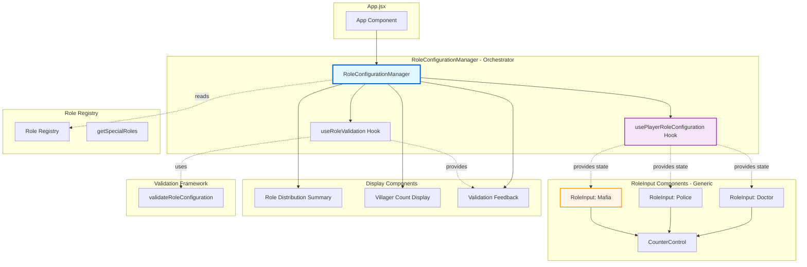

# Implementation Plan: Role Configuration UI System

## Goal

Implement a data-driven Role Configuration UI System providing the user-facing interface for multi-role game setup. Create `RoleConfigurationManager` (orchestrator) and `RoleInput` (generic reusable) components that read role registry, render dynamic inputs for each special role, and manage state through `usePlayerRoleConfiguration` hook. Display real-time villager calculation, role distribution summary with color-coded badges, and validation feedback integrated with Multi-Role Validation Framework. Achieve <100ms UI response time, 44px+ touch targets for mobile optimization, and full WCAG AA accessibility compliance. Enable automatic UI rendering when new roles added to registry (zero UI code changes).

## Requirements

- Create `RoleConfigurationManager.jsx` orchestrator component reading special roles from registry
- Create `RoleInput.jsx` generic data-driven component consuming role metadata (name, color, constraints)
- Implement `usePlayerRoleConfiguration` hook managing role counts state with real-time validation
- Display real-time villager count calculation: `totalPlayers - sum(specialRoleCounts)`
- Render role distribution summary: "5 Mafia, 1 Police, 1 Doctor, 13 Villagers (20 total)" with color badges
- Integrate `useRoleValidation` hook displaying errors/warnings below inputs
- Maintain 44px+ touch targets, smooth mobile interactions, responsive layout
- Achieve WCAG AA compliance: ARIA labels, keyboard navigation, screen reader support
- Performance: <50ms mount time, <100ms state updates
- Bundle impact: <3KB for new components

## Technical Considerations

### System Architecture



**Component Responsibilities:**
- **RoleConfigurationManager:** Orchestrates all role inputs, manages state, displays summary/validation
- **RoleInput:** Generic reusable component rendering single role's counter with metadata
- **usePlayerRoleConfiguration:** Manages role counts state, exposes update functions
- **useRoleValidation:** Provides real-time validation feedback

## Implementation Steps

### Phase 1: Custom Hook (Day 1)

**Step 1.1: Create usePlayerRoleConfiguration Hook**
```javascript
// src/hooks/usePlayerRoleConfiguration.js
import { useState, useCallback, useMemo } from 'react';
import { getSpecialRoles } from '../utils/roleRegistry';

/**
 * Manage role configuration state for multi-role setup.
 * 
 * @param {number} totalPlayers - Total players in game
 * @returns {Object} Role configuration state and update functions
 */
export function usePlayerRoleConfiguration(totalPlayers) {
  const specialRoles = getSpecialRoles();
  
  // Initialize state with default counts from registry
  const initialCounts = useMemo(() => {
    return Object.fromEntries(
      specialRoles.map(role => [role.id, role.constraints.default])
    );
  }, []);
  
  const [roleCounts, setRoleCounts] = useState(initialCounts);
  
  // Update single role count
  const updateRoleCount = useCallback((roleId, count) => {
    setRoleCounts(prev => ({ ...prev, [roleId]: count }));
  }, []);
  
  // Calculate villager count
  const villagerCount = useMemo(() => {
    const specialRoleSum = Object.values(roleCounts).reduce((sum, count) => sum + count, 0);
    return totalPlayers - specialRoleSum;
  }, [roleCounts, totalPlayers]);
  
  // Reset to defaults
  const resetToDefaults = useCallback(() => {
    setRoleCounts(initialCounts);
  }, [initialCounts]);
  
  return {
    roleCounts,
    updateRoleCount,
    villagerCount,
    resetToDefaults
  };
}
```

### Phase 2: RoleInput Component (Day 1-2)

**Step 2.1: Create Generic RoleInput Component**
```javascript
// src/components/RoleInput.jsx
import React from 'react';
import { CounterControl } from './CounterControl';

/**
 * Generic role input component consuming role metadata from registry.
 * 
 * @param {Object} props
 * @param {Object} props.role - Role definition from registry
 * @param {number} props.value - Current role count
 * @param {Function} props.onChange - Callback when count changes
 * @param {number} props.totalPlayers - Total players (for validation context)
 * @param {boolean} props.disabled - Whether input is disabled
 */
export function RoleInput({ role, value, onChange, totalPlayers, disabled = false }) {
  // Calculate effective max (dynamic or static)
  const effectiveMax = role.constraints.maxCalculator 
    ? role.constraints.maxCalculator(totalPlayers) 
    : role.constraints.max;

  return (
    <div className="space-y-2">
      {/* Role Label */}
      <label 
        htmlFor={`role-${role.id}`}
        className="block text-sm font-medium"
        style={{ color: role.color.text }}
      >
        Number of {role.name} Players
      </label>
      
      {/* Counter Control */}
      <CounterControl
        id={`role-${role.id}`}
        value={value}
        min={role.constraints.min}
        max={effectiveMax}
        onChange={onChange}
        label={role.name}
        disabled={disabled}
        aria-label={`${role.name} count`}
      />
      
      {/* Constraint Hint */}
      {effectiveMax !== -1 && (
        <p className="text-xs text-gray-500">
          Max: {effectiveMax}
        </p>
      )}
      
      {/* Role Description (optional) */}
      <p className="text-xs text-gray-600">{role.description}</p>
    </div>
  );
}
```

### Phase 3: RoleConfigurationManager (Day 2-3)

**Step 3.1: Create Orchestrator Component**
```javascript
// src/components/RoleConfigurationManager.jsx
import React from 'react';
import { getSpecialRoles, getRoleById, ROLES } from '../utils/roleRegistry';
import { usePlayerRoleConfiguration } from '../hooks/usePlayerRoleConfiguration';
import { useRoleValidation } from '../hooks/useRoleValidation';
import { RoleInput } from './RoleInput';

/**
 * Orchestrator component for multi-role configuration.
 * 
 * @param {Object} props
 * @param {number} props.totalPlayers - Total players
 * @param {Function} props.onConfigurationChange - Callback when configuration changes
 * @param {boolean} props.disabled - Whether controls disabled
 */
export function RoleConfigurationManager({ 
  totalPlayers, 
  onConfigurationChange,
  disabled = false 
}) {
  const specialRoles = getSpecialRoles();
  const { roleCounts, updateRoleCount, villagerCount, resetToDefaults } = 
    usePlayerRoleConfiguration(totalPlayers);
  
  const validation = useRoleValidation(roleCounts, totalPlayers, {
    onValidationChange: (state) => {
      onConfigurationChange?.({
        roleCounts,
        villagerCount,
        validation: state
      });
    }
  });
  
  const villagerRole = getRoleById(ROLES.VILLAGER);
  
  return (
    <div className="space-y-6">
      {/* Role Inputs */}
      <div className="space-y-4">
        {specialRoles.map(role => (
          <RoleInput
            key={role.id}
            role={role}
            value={roleCounts[role.id]}
            onChange={(count) => updateRoleCount(role.id, count)}
            totalPlayers={totalPlayers}
            disabled={disabled}
          />
        ))}
      </div>
      
      {/* Villager Count Display */}
      <div className="p-4 bg-gray-50 rounded-lg">
        <div className="flex items-center justify-between">
          <span className="text-sm font-medium text-gray-700">
            {villagerRole.name} Count
          </span>
          <span 
            className={`text-lg font-bold ${
              villagerCount < 3 ? 'text-yellow-600' : 
              villagerCount < 0 ? 'text-red-600' : 
              'text-green-600'
            }`}
          >
            {villagerCount}
          </span>
        </div>
        <p className="text-xs text-gray-600 mt-1">
          Calculated: {totalPlayers} total - {Object.values(roleCounts).reduce((a, b) => a + b, 0)} special roles
        </p>
      </div>
      
      {/* Role Distribution Summary */}
      <div className="space-y-2">
        <h3 className="text-sm font-medium text-gray-700">Role Distribution</h3>
        <div className="flex flex-wrap gap-2">
          {specialRoles.map(role => {
            const count = roleCounts[role.id];
            if (count === 0) return null;
            return (
              <span
                key={role.id}
                className="inline-flex items-center px-3 py-1 rounded-full text-sm font-medium"
                style={{
                  backgroundColor: role.color.secondary,
                  color: role.color.text,
                  border: `1px solid ${role.color.primary}`
                }}
              >
                {count} {role.name}
              </span>
            );
          })}
          {villagerCount > 0 && (
            <span 
              className="inline-flex items-center px-3 py-1 rounded-full text-sm font-medium"
              style={{
                backgroundColor: villagerRole.color.secondary,
                color: villagerRole.color.text,
                border: `1px solid ${villagerRole.color.primary}`
              }}
            >
              {villagerCount} {villagerRole.name}
            </span>
          )}
        </div>
        <p className="text-sm text-gray-600">
          Total: {totalPlayers} players
        </p>
      </div>
      
      {/* Validation Feedback */}
      {validation.errors.length > 0 && (
        <div className="space-y-2">
          {validation.errors.map((error, index) => (
            <p key={index} className="text-sm text-red-600" role="alert">
              ❌ {error.message}
            </p>
          ))}
        </div>
      )}
      
      {validation.warnings.length > 0 && (
        <div className="space-y-2">
          {validation.warnings.map((warning, index) => (
            <p key={index} className="text-sm text-yellow-600" role="alert">
              ⚠️ {warning.message}
            </p>
          ))}
        </div>
      )}
    </div>
  );
}
```

### Phase 4: Integration with App.jsx (Day 3-4)

**Step 4.1: Update App.jsx**
```javascript
// src/App.jsx (integration)
import { RoleConfigurationManager } from './components/RoleConfigurationManager';

function App() {
  const [totalPlayers, setTotalPlayers] = useState(20);
  const [roleConfiguration, setRoleConfiguration] = useState(null);
  const [isConfigValid, setIsConfigValid] = useState(false);
  
  const handleRoleConfigurationChange = useCallback((config) => {
    setRoleConfiguration(config.roleCounts);
    setIsConfigValid(config.validation.isValid);
  }, []);
  
  return (
    <div>
      {/* Player Count Manager */}
      <PlayerCountManager 
        initialCount={totalPlayers}
        onCountChange={setTotalPlayers}
      />
      
      {/* Role Configuration Manager */}
      <RoleConfigurationManager
        totalPlayers={totalPlayers}
        onConfigurationChange={handleRoleConfigurationChange}
      />
      
      {/* Allocation Button */}
      <button 
        disabled={!isConfigValid}
        onClick={() => handleAllocate(roleConfiguration)}
      >
        Allocate Roles
      </button>
    </div>
  );
}
```

### Phase 5: Testing (Day 4-5)

**Step 5.1: Component Tests**
```javascript
// src/components/RoleConfigurationManager.test.jsx
import { render, screen, fireEvent } from '@testing-library/react';
import { RoleConfigurationManager } from './RoleConfigurationManager';

describe('RoleConfigurationManager', () => {
  it('should render all special role inputs', () => {
    render(<RoleConfigurationManager totalPlayers={20} />);
    
    expect(screen.getByText(/Number of Mafia Players/i)).toBeInTheDocument();
    expect(screen.getByText(/Number of Police Players/i)).toBeInTheDocument();
    expect(screen.getByText(/Number of Doctor Players/i)).toBeInTheDocument();
  });
  
  it('should update villager count when role counts change', () => {
    render(<RoleConfigurationManager totalPlayers={20} />);
    
    // Initial: assume defaults (e.g., 1 Mafia, 0 Police, 0 Doctor = 19 Villagers)
    // Update Mafia to 5
    const mafiaIncrement = screen.getAllByRole('button')[1]; // Assumes counter controls
    fireEvent.click(mafiaIncrement);
    fireEvent.click(mafiaIncrement);
    fireEvent.click(mafiaIncrement);
    fireEvent.click(mafiaIncrement); // Now 5 Mafia
    
    // Villager count should update
    expect(screen.getByText(/15/)).toBeInTheDocument(); // 20 - 5 = 15
  });
});
```

**Step 5.2: Hook Tests**
```javascript
// src/hooks/usePlayerRoleConfiguration.test.js
import { renderHook, act } from '@testing-library/react';
import { usePlayerRoleConfiguration } from './usePlayerRoleConfiguration';

describe('usePlayerRoleConfiguration', () => {
  it('should initialize with default counts', () => {
    const { result } = renderHook(() => usePlayerRoleConfiguration(20));
    
    expect(result.current.roleCounts).toHaveProperty('MAFIA');
    expect(result.current.roleCounts).toHaveProperty('POLICE');
    expect(result.current.roleCounts).toHaveProperty('DOCTOR');
  });
  
  it('should update role count', () => {
    const { result } = renderHook(() => usePlayerRoleConfiguration(20));
    
    act(() => {
      result.current.updateRoleCount('MAFIA', 5);
    });
    
    expect(result.current.roleCounts.MAFIA).toBe(5);
  });
  
  it('should calculate villager count correctly', () => {
    const { result } = renderHook(() => usePlayerRoleConfiguration(20));
    
    act(() => {
      result.current.updateRoleCount('MAFIA', 5);
      result.current.updateRoleCount('POLICE', 1);
      result.current.updateRoleCount('DOCTOR', 1);
    });
    
    expect(result.current.villagerCount).toBe(13); // 20 - 5 - 1 - 1
  });
});
```

### Phase 6: Documentation & Deployment (Day 5)

**Step 6.1: Update Developer Guide**
Add to `docs/ROLE_EXTENSIBILITY.md`:

```markdown
## UI Extensibility

When you add a new role to the registry, the UI automatically renders it:

1. Add role to registry (e.g., DETECTIVE)
2. No UI code changes needed
3. RoleConfigurationManager reads registry via `getSpecialRoles()`
4. Detective input appears automatically with:
   - Role name from `role.name`
   - Counter constraints from `role.constraints`
   - Color accents from `role.color`
   - Description from `role.description`

**Example: Adding Detective automatically creates UI:**
- "Number of Detective Players" label
- Counter control with max constraint (e.g., Max: 1)
- Role description: "Investigate players to discover alignment"
- Color-coded badge in distribution summary
```

## Acceptance Validation

### Implementation Checklist
- [ ] usePlayerRoleConfiguration hook created with state management
- [ ] RoleInput component created as generic reusable control
- [ ] RoleConfigurationManager orchestrator component created
- [ ] Real-time villager calculation displaying
- [ ] Role distribution summary with color badges rendering
- [ ] Validation errors/warnings displaying below inputs
- [ ] 44px+ touch targets on counter controls
- [ ] ARIA labels and keyboard navigation implemented
- [ ] Component tests achieving 90%+ coverage
- [ ] Integration with App.jsx complete

### Post-Implementation Validation
- [ ] All acceptance criteria verified (US-51 through US-57)
- [ ] UI renders automatically when new role added to registry (tested with mock DETECTIVE role)
- [ ] Performance: <50ms mount, <100ms updates (measured)
- [ ] Bundle size <3KB confirmed
- [ ] Mobile testing on real devices (iOS Safari, Android Chrome)
- [ ] Accessibility audit passing (WCAG AA compliance)
- [ ] Documentation updated

## Success Metrics

- ✅ <100ms UI response time to role count changes
- ✅ 44px+ touch targets on all interactive elements
- ✅ WCAG AA accessibility compliance verified
- ✅ New role (Detective) renders automatically when added to registry
- ✅ 90%+ test coverage

## Next Steps

After Feature 4 complete, the epic is fully implemented. All four features work together enabling extensible special roles with 4-hour role addition workflow.
