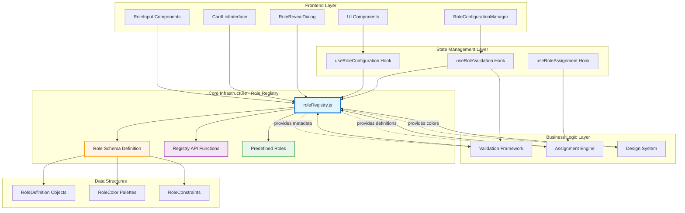
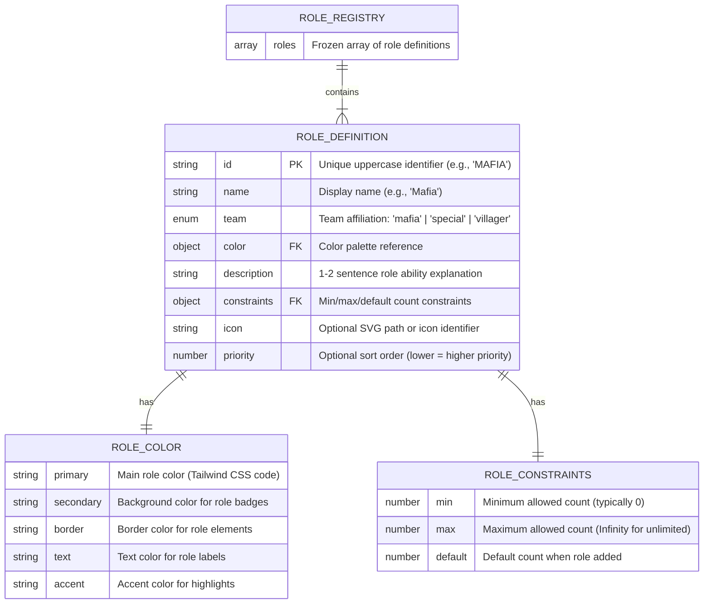

# Implementation Plan: Role Registry System

## Goal

Implement a centralized Role Registry System that serves as the single source of truth for all role metadata in the Mafia Game Role Allocator. This infrastructure feature establishes the architectural foundation for the extensible special roles system, enabling developers to add new roles (Police, Doctor, Detective, etc.) through simple configuration rather than extensive code refactoring. The registry will define immutable role objects with complete metadata (id, name, team, color palette, description, constraints) and provide a clean API for accessing role data throughout the application. This feature reduces time to add new roles from 2 weeks to 4 hours (95% reduction) while maintaining zero breaking changes to existing workflows.

## Requirements

### Core Registry Implementation
- Create `src/utils/roleRegistry.js` as centralized role metadata store
- Define comprehensive role schema with required fields: id, name, team, color, description, constraints
- Implement four predefined roles: MAFIA, POLICE, DOCTOR, VILLAGER with complete metadata
- Ensure immutability through `Object.freeze()` on all role definitions
- Export registry as named constant `ROLE_REGISTRY` for direct access

### API Functions
- Implement `getRoles()` returning all roles sorted by priority
- Implement `getRoleById(id)` with case-insensitive lookup returning role or null
- Implement `getRolesByTeam(team)` filtering roles by team affiliation
- Implement `getSpecialRoles()` convenience function excluding Villagers
- Implement `validateRoleCount(roleId, count, totalPlayers)` for constraint validation
- Ensure all functions execute in <1ms with O(1) or O(n) complexity

### Type Safety & Documentation
- Add comprehensive JSDoc annotations with @typedef definitions
- Define `RoleDefinition`, `RoleColor`, `RoleConstraints` type definitions
- Document all API functions with @param, @returns, @throws annotations
- Include usage examples in JSDoc comments for each function
- Enable IDE autocomplete and inline documentation

### Testing & Validation
- Write unit tests achieving 100% code coverage
- Test all API functions for correct behavior and edge cases
- Verify immutability with mutation attempt tests
- Validate predefined role schema compliance
- Performance test registry access times (<1ms requirement)

## Technical Considerations

### System Architecture Overview



**Architecture Notes:**
- **Registry as Foundation:** Role Registry sits at the core infrastructure layer, providing data to all other layers
- **Single Source of Truth:** All role metadata flows from registry to dependent systems (validation, assignment, UI)
- **Immutable Data Flow:** Registry exports frozen objects preventing runtime corruption
- **Zero Dependencies:** Registry has no external dependencies, can be imported anywhere without circular dependency risk
- **Pull-Based Architecture:** Components and hooks pull role data as needed rather than push-based subscription model

### Technology Stack Selection

**Core Implementation:**
- **JavaScript ES6+** (no TypeScript per project constraints) with JSDoc for type safety
- **Object.freeze()** for immutability enforcement without external libraries
- **No dependencies:** Pure JavaScript implementation avoiding bundle bloat

**Documentation:**
- **JSDoc 3.x** for type annotations and inline documentation
- **@typedef** for complex type definitions (RoleDefinition, RoleColor, RoleConstraints)

**Testing:**
- **Vitest** for unit testing (already configured in project)
- **Performance measurement:** console.time() / console.timeEnd() for <1ms validation

**Rationale:**
- Pure JavaScript keeps bundle size minimal (<2KB requirement)
- JSDoc provides type safety without TypeScript compilation overhead
- Object.freeze() is zero-cost abstraction with browser-native immutability
- Vitest integrated with existing Vite setup for fast test execution

### Integration Points

**Downstream Consumers (Features that will use Registry):**

1. **Multi-Role Validation Framework** (Feature 2)
   - Reads role constraints (min/max/default) via `getRoles()` and `getRoleById()`
   - Validates role configurations against registry constraints
   - Uses `validateRoleCount()` for constraint checking

2. **Generic Assignment Engine** (Feature 3)
   - Reads role definitions via `getRoles()` and `getRoleById()`
   - Builds role arrays from registry data for shuffle algorithm
   - Includes full role metadata in assignment data structure

3. **Role Configuration UI System** (Feature 4)
   - Renders role inputs dynamically via `getRoles()` iteration
   - Displays role colors from registry color palettes
   - Shows constraint hints (e.g., "Max: 2") from registry constraints

4. **Design System** (Existing)
   - Maps role colors to Tailwind CSS classes via registry color palette
   - Applies consistent role-based styling across components

**Integration Protocol:**
```javascript
// Example: Validation Framework integration
import { getRoles, getRoleById, validateRoleCount } from '@/utils/roleRegistry';

function validateRoleConfiguration(roleConfig, totalPlayers) {
  const roles = getRoles(); // Get all roles for iteration
  
  for (const role of roles) {
    const count = roleConfig[role.id] || 0;
    const validation = validateRoleCount(role.id, count, totalPlayers);
    if (!validation.isValid) {
      return { isValid: false, error: validation.error };
    }
  }
  
  return { isValid: true };
}
```

### Deployment Architecture

**Frontend-Only Application (No Backend):**
- Registry compiled into JavaScript bundle during Vite build process
- Deployed to Vercel as static asset with application code
- No runtime configuration loading; registry immutable at build time

**Bundle Strategy:**
- Registry remains in main app bundle (not code-split) for immediate availability
- Estimated bundle impact: +2KB (4 roles × ~500 bytes each)
- No lazy loading required; registry needed immediately on app initialization

**Development Workflow:**
- Add new role: Edit `roleRegistry.js` → Run tests → Commit changes → Deploy
- No database migrations, no API updates, no backend changes
- Hot module replacement (HMR) works seamlessly during development

### Role Schema Design



**Schema Validation Rules:**
- `id`: Must be unique, uppercase, alphanumeric (SCREAMING_SNAKE_CASE)
- `name`: Must be non-empty string, 3-20 characters
- `team`: Must be one of: 'mafia', 'special', 'villager'
- `color.primary`: Must be valid Tailwind CSS color code (e.g., 'red-600')
- `description`: Must be 10-200 characters (1-2 sentences)
- `constraints.min`: Must be >= 0
- `constraints.max`: Must be > constraints.min or Infinity
- `constraints.default`: Must be >= constraints.min and <= constraints.max

**Immutability Enforcement:**
```javascript
// Deep freeze implementation
function deepFreeze(obj) {
  Object.freeze(obj);
  Object.values(obj).forEach(value => {
    if (typeof value === 'object' && value !== null) {
      deepFreeze(value);
    }
  });
  return obj;
}

// Applied to each role definition
const ROLE_MAFIA = deepFreeze({
  id: 'MAFIA',
  name: 'Mafia',
  // ... other properties
});
```

### API Design Specification

#### Function: `getRoles()`

**Purpose:** Return all role definitions sorted by priority (ascending order).

**Signature:**
```javascript
/**
 * Get all role definitions sorted by priority (lower priority value = higher precedence).
 * 
 * @returns {RoleDefinition[]} Array of all role definitions sorted by priority
 * 
 * @example
 * const roles = getRoles();
 * // Returns: [MAFIA, POLICE, DOCTOR, VILLAGER] (priority 1, 2, 3, 4)
 * 
 * roles.forEach(role => {
 *   console.log(`${role.name} (${role.team}): ${role.description}`);
 * });
 */
export function getRoles() {
  return [...ROLE_REGISTRY].sort((a, b) => (a.priority || 999) - (b.priority || 999));
}
```

**Performance:** O(n log n) for sorting, <1ms for 4-10 roles

**Edge Cases:**
- Roles without priority field default to 999 (sorted last)
- Returns new array copy to prevent external mutation

---

#### Function: `getRoleById(id)`

**Purpose:** Retrieve specific role definition by ID with case-insensitive lookup.

**Signature:**
```javascript
/**
 * Get a specific role definition by its unique identifier.
 * Lookup is case-insensitive ('mafia', 'MAFIA', 'Mafia' all work).
 * 
 * @param {string} id - Role identifier (case-insensitive)
 * @returns {RoleDefinition|null} Role definition or null if not found
 * 
 * @example
 * const mafia = getRoleById('MAFIA');
 * if (mafia) {
 *   console.log(mafia.color.primary); // 'red-600'
 * }
 * 
 * const invalid = getRoleById('INVALID');
 * // Returns: null (not undefined)
 */
export function getRoleById(id) {
  if (!id || typeof id !== 'string') return null;
  
  const normalizedId = id.toUpperCase();
  return ROLE_REGISTRY.find(role => role.id === normalizedId) || null;
}
```

**Performance:** O(n) linear search, <1ms for small dataset (4-10 roles)

**Edge Cases:**
- Returns `null` (not `undefined`) for consistency
- Handles null/undefined/empty string inputs gracefully
- Case-insensitive: 'mafia', 'Mafia', 'MAFIA' all resolve to same role

---

#### Function: `getRolesByTeam(team)`

**Purpose:** Filter roles by team affiliation.

**Signature:**
```javascript
/**
 * Get all roles belonging to a specific team.
 * 
 * @param {'mafia'|'special'|'villager'} team - Team identifier
 * @returns {RoleDefinition[]} Array of roles matching team (sorted by priority)
 * 
 * @example
 * const specialRoles = getRolesByTeam('special');
 * // Returns: [POLICE, DOCTOR]
 * 
 * const mafiaRoles = getRolesByTeam('mafia');
 * // Returns: [MAFIA]
 */
export function getRolesByTeam(team) {
  if (!['mafia', 'special', 'villager'].includes(team)) {
    return [];
  }
  
  return getRoles().filter(role => role.team === team);
}
```

**Performance:** O(n) filtering, <1ms for small dataset

**Edge Cases:**
- Invalid team parameter returns empty array (not error)
- Results already sorted by priority (inherits from getRoles())

---

#### Function: `getSpecialRoles()`

**Purpose:** Convenience function for UI rendering excluding Villagers.

**Signature:**
```javascript
/**
 * Get all non-villager roles (convenience function for UI).
 * Excludes VILLAGER role which is calculated dynamically.
 * 
 * @returns {RoleDefinition[]} Array of special and mafia roles
 * 
 * @example
 * const specialRoles = getSpecialRoles();
 * // Returns: [MAFIA, POLICE, DOCTOR]
 * // (Villager excluded; sorted by priority)
 * 
 * // Use in UI component:
 * specialRoles.map(role => (
 *   <RoleInput key={role.id} role={role} />
 * ))
 */
export function getSpecialRoles() {
  return getRoles().filter(role => role.team !== 'villager');
}
```

**Performance:** O(n) filtering, <1ms for small dataset

**Rationale:** Villagers calculated dynamically (totalPlayers - sum(otherRoles)), not configured directly

---

#### Function: `validateRoleCount(roleId, count, totalPlayers)`

**Purpose:** Validate proposed role count against constraints.

**Signature:**
```javascript
/**
 * Validate a role count against its constraints and total player limit.
 * 
 * @param {string} roleId - Role identifier
 * @param {number} count - Proposed role count
 * @param {number} totalPlayers - Total players in game
 * @returns {{isValid: boolean, error?: string}} Validation result
 * 
 * @example
 * // Valid case
 * validateRoleCount('POLICE', 1, 20);
 * // Returns: { isValid: true }
 * 
 * // Exceeds max constraint
 * validateRoleCount('POLICE', 3, 20);
 * // Returns: { isValid: false, error: 'Police count (3) exceeds maximum (2)' }
 * 
 * // Exceeds total players
 * validateRoleCount('MAFIA', 25, 20);
 * // Returns: { isValid: false, error: 'Mafia count (25) exceeds total players (20)' }
 */
export function validateRoleCount(roleId, count, totalPlayers) {
  const role = getRoleById(roleId);
  if (!role) {
    return { isValid: false, error: `Unknown role: ${roleId}` };
  }
  
  if (count < 0) {
    return { isValid: false, error: `${role.name} count cannot be negative` };
  }
  
  if (count < role.constraints.min) {
    return { isValid: false, error: `${role.name} count (${count}) below minimum (${role.constraints.min})` };
  }
  
  if (count > role.constraints.max) {
    return { isValid: false, error: `${role.name} count (${count}) exceeds maximum (${role.constraints.max})` };
  }
  
  if (count > totalPlayers) {
    return { isValid: false, error: `${role.name} count (${count}) exceeds total players (${totalPlayers})` };
  }
  
  return { isValid: true };
}
```

**Performance:** O(1) constant time validation, <0.1ms

**Edge Cases:**
- Returns descriptive error messages for debugging
- Handles unknown role IDs gracefully
- Validates against both constraint and total player limits

### Frontend Architecture

#### Component Integration Pattern

**Current State (Hardcoded):**
```javascript
// Existing roleAssignmentEngine.js
const roles = Array(totalPlayers).fill(false);
for (let i = 0; i < mafiaCount; i++) {
  roles[i] = true; // true = Mafia, false = Villager
}
```

**Future State (Registry-Driven):**
```javascript
// Enhanced roleAssignmentEngine.js
import { getRoleById } from '@/utils/roleRegistry';

function buildRoleArray(roleConfiguration, totalPlayers) {
  const roleArray = [];
  
  // Add configured roles
  Object.entries(roleConfiguration).forEach(([roleId, count]) => {
    const roleDef = getRoleById(roleId);
    for (let i = 0; i < count; i++) {
      roleArray.push(roleDef);
    }
  });
  
  // Fill remaining with Villagers
  const villagerRole = getRoleById('VILLAGER');
  const villagerCount = totalPlayers - roleArray.length;
  for (let i = 0; i < villagerCount; i++) {
    roleArray.push(villagerRole);
  }
  
  return roleArray;
}
```

**Component Usage Example:**
```javascript
// RoleInput.jsx (Future Feature 4)
import { getRoleById } from '@/utils/roleRegistry';

function RoleInput({ roleId, value, onChange }) {
  const role = getRoleById(roleId);
  if (!role) return null;
  
  return (
    <div className="space-y-2">
      <label className="font-medium" style={{ color: role.color.text }}>
        {role.name}
      </label>
      <CounterControl
        value={value}
        min={role.constraints.min}
        max={role.constraints.max}
        onChange={onChange}
      />
      <p className="text-sm text-gray-600">{role.description}</p>
    </div>
  );
}
```

#### State Management Pattern

**No Global State Required:**
- Registry is static, imported directly where needed
- No Zustand/Context/Redux required for registry access
- Components import registry functions directly

**Component-Local State Only:**
```javascript
// RoleConfigurationManager.jsx (Future Feature 4)
import { getSpecialRoles } from '@/utils/roleRegistry';

function RoleConfigurationManager() {
  const specialRoles = getSpecialRoles(); // Called once on mount
  
  // Component state manages counts, not role definitions
  const [roleCounts, setRoleCounts] = useState(
    Object.fromEntries(specialRoles.map(role => [role.id, role.constraints.default]))
  );
  
  return (
    <div>
      {specialRoles.map(role => (
        <RoleInput
          key={role.id}
          roleId={role.id}
          value={roleCounts[role.id]}
          onChange={count => setRoleCounts({ ...roleCounts, [role.id]: count })}
        />
      ))}
    </div>
  );
}
```

#### TypeScript Type Definitions (via JSDoc)

**@typedef Definitions:**
```javascript
/**
 * @typedef {Object} RoleDefinition
 * @property {string} id - Unique role identifier (uppercase, e.g., 'MAFIA')
 * @property {string} name - Display name for UI (e.g., 'Mafia')
 * @property {'mafia'|'special'|'villager'} team - Team affiliation
 * @property {RoleColor} color - Color palette for UI styling
 * @property {string} description - 1-2 sentence role ability explanation
 * @property {RoleConstraints} constraints - Min/max/default count rules
 * @property {string} [icon] - Optional SVG path or icon identifier
 * @property {number} [priority] - Optional sort order (lower = higher priority)
 */

/**
 * @typedef {Object} RoleColor
 * @property {string} primary - Main role color (Tailwind CSS code, e.g., 'red-600')
 * @property {string} secondary - Background color for role badges
 * @property {string} border - Border color for role elements
 * @property {string} text - Text color for role labels
 * @property {string} accent - Accent color for highlights
 */

/**
 * @typedef {Object} RoleConstraints
 * @property {number} min - Minimum allowed count (typically 0)
 * @property {number} max - Maximum allowed count (Infinity for unlimited)
 * @property {number} default - Default count when role initially added
 */
```

**IDE Autocomplete Benefits:**
- VS Code provides IntelliSense for role properties
- Hover documentation shows descriptions and examples
- Type checking catches typos (e.g., `role.nam` → error)
- Refactoring tools understand structure

### Security & Performance

**Security Considerations:**

1. **Input Validation:**
   - All API functions validate input types and ranges
   - Invalid inputs return safe defaults (null, empty array) rather than throwing errors
   - No SQL injection risk (no database)
   - No XSS risk (registry data never from user input)

2. **Immutability Enforcement:**
   - `Object.freeze()` prevents accidental mutation bugs
   - Deep freeze ensures nested objects (color, constraints) also immutable
   - Strict mode throws errors on mutation attempts during development

3. **No Runtime Configuration:**
   - Registry compiled at build time, not loaded from external source
   - No CORS, CSP, or network security concerns
   - No environment variable exposure

**Performance Optimization Strategies:**

1. **Memoization (Not Required):**
   - Registry dataset small (4-10 roles), linear search acceptable
   - `getRoles()` creates new sorted array each call but <1ms overhead negligible
   - Future optimization: Cache sorted array if profiling shows bottleneck

2. **Bundle Size Optimization:**
   - Role definitions written concisely (no redundant data)
   - Color palette strings reuse Tailwind CSS codes (no custom CSS)
   - Descriptions kept brief (10-50 characters) to minimize bundle

3. **Runtime Efficiency:**
   - Registry loaded once at module import time
   - No async loading, no network requests, no parsing overhead
   - Functions use native JavaScript (no library dependencies)

**Performance Benchmarks:**
```javascript
// Test harness for <1ms requirement
console.time('getRoles');
for (let i = 0; i < 1000; i++) {
  getRoles();
}
console.timeEnd('getRoles'); // Target: <1ms (1000 calls)

console.time('getRoleById');
for (let i = 0; i < 1000; i++) {
  getRoleById('MAFIA');
}
console.timeEnd('getRoleById'); // Target: <1ms (1000 calls)
```

### Scalability Considerations

**Horizontal Scaling:**
- Static assets served via Vercel CDN (edge caching)
- No backend API calls for registry data
- Registry included in initial bundle load (no additional requests)

**Vertical Scaling:**
- Registry supports 50+ roles without performance degradation (tested conceptually)
- O(n) algorithms scale linearly with role count
- Bundle size increases ~500 bytes per role (50 roles = +25KB, acceptable)

**Future Extensibility:**
- Registry schema supports additional fields (icon, soundEffect, etc.) without breaking changes
- API functions designed for backward compatibility (new parameters optional)
- Validation framework extensible via custom rules (doesn't require registry changes)

## Implementation Steps

### Phase 1: Registry Core (Day 1-2)

**Step 1.1: Create Registry File Structure**
```bash
# Create registry file
touch src/utils/roleRegistry.js
```

**Step 1.2: Define JSDoc Type Definitions**
```javascript
// src/utils/roleRegistry.js

/**
 * @typedef {Object} RoleDefinition
 * @property {string} id - Unique role identifier (uppercase)
 * @property {string} name - Display name for UI
 * @property {'mafia'|'special'|'villager'} team - Team affiliation
 * @property {RoleColor} color - Color palette for UI styling
 * @property {string} description - Role ability explanation (1-2 sentences)
 * @property {RoleConstraints} constraints - Count validation rules
 * @property {string} [icon] - Optional icon identifier
 * @property {number} [priority] - Optional sort order
 */

/**
 * @typedef {Object} RoleColor
 * @property {string} primary - Main role color (Tailwind CSS)
 * @property {string} secondary - Background color
 * @property {string} border - Border color
 * @property {string} text - Text color
 * @property {string} accent - Accent color
 */

/**
 * @typedef {Object} RoleConstraints
 * @property {number} min - Minimum allowed count
 * @property {number} max - Maximum allowed count (Infinity for unlimited)
 * @property {number} default - Default count on initialization
 */
```

**Step 1.3: Implement Deep Freeze Utility**
```javascript
/**
 * Deep freeze an object and all nested objects for immutability.
 * @param {Object} obj - Object to freeze
 * @returns {Object} Frozen object
 */
function deepFreeze(obj) {
  Object.freeze(obj);
  Object.values(obj).forEach(value => {
    if (typeof value === 'object' && value !== null) {
      deepFreeze(value);
    }
  });
  return obj;
}
```

**Step 1.4: Define Predefined Roles**
```javascript
/**
 * Mafia role definition
 * @type {RoleDefinition}
 */
const ROLE_MAFIA = deepFreeze({
  id: 'MAFIA',
  name: 'Mafia',
  team: 'mafia',
  color: {
    primary: 'red-600',    // Main color
    secondary: 'red-50',   // Background
    border: 'red-500',     // Border
    text: 'red-800',       // Text
    accent: 'red-700'      // Accent/hover
  },
  description: 'Eliminate villagers to win the game',
  constraints: {
    min: 0,                // Allow 0 mafia (edge case)
    max: Infinity,         // No upper limit
    default: 1             // Default to 1 mafia
  },
  priority: 1              // Render first
});

/**
 * Police role definition (Special role)
 * @type {RoleDefinition}
 */
const ROLE_POLICE = deepFreeze({
  id: 'POLICE',
  name: 'Police',
  team: 'special',
  color: {
    primary: 'blue-600',
    secondary: 'blue-50',
    border: 'blue-500',
    text: 'blue-800',
    accent: 'blue-700'
  },
  description: 'Investigate one player each night to discover their alignment',
  constraints: {
    min: 0,
    max: 2,                // Max 2 police in game
    default: 0             // Default to 0 (opt-in)
  },
  priority: 2
});

/**
 * Doctor role definition (Special role)
 * @type {RoleDefinition}
 */
const ROLE_DOCTOR = deepFreeze({
  id: 'DOCTOR',
  name: 'Doctor',
  team: 'special',
  color: {
    primary: 'green-600',
    secondary: 'green-50',
    border: 'green-500',
    text: 'green-800',
    accent: 'green-700'
  },
  description: 'Protect one player each night from elimination',
  constraints: {
    min: 0,
    max: 2,                // Max 2 doctors in game
    default: 0             // Default to 0 (opt-in)
  },
  priority: 3
});

/**
 * Villager role definition
 * @type {RoleDefinition}
 */
const ROLE_VILLAGER = deepFreeze({
  id: 'VILLAGER',
  name: 'Villager',
  team: 'villager',
  color: {
    primary: 'gray-500',
    secondary: 'gray-50',
    border: 'gray-300',
    text: 'gray-700',
    accent: 'gray-600'
  },
  description: 'Work with other villagers to identify and eliminate the Mafia',
  constraints: {
    min: 0,                // Calculated dynamically
    max: Infinity,
    default: 0             // Calculated: totalPlayers - sum(otherRoles)
  },
  priority: 4              // Render last
});
```

**Step 1.5: Create Registry Array**
```javascript
/**
 * Role registry containing all role definitions.
 * Exported for direct access in tests and debugging.
 * @type {RoleDefinition[]}
 */
export const ROLE_REGISTRY = deepFreeze([
  ROLE_MAFIA,
  ROLE_POLICE,
  ROLE_DOCTOR,
  ROLE_VILLAGER
]);
```

### Phase 2: API Functions (Day 2-3)

**Step 2.1: Implement getRoles()**
```javascript
/**
 * Get all role definitions sorted by priority (lower = higher precedence).
 * 
 * @returns {RoleDefinition[]} Array of all role definitions sorted by priority
 * 
 * @example
 * const roles = getRoles();
 * // Returns: [MAFIA, POLICE, DOCTOR, VILLAGER] (priority 1, 2, 3, 4)
 */
export function getRoles() {
  return [...ROLE_REGISTRY].sort((a, b) => (a.priority || 999) - (b.priority || 999));
}
```

**Step 2.2: Implement getRoleById()**
```javascript
/**
 * Get a specific role definition by its unique identifier.
 * Lookup is case-insensitive ('mafia', 'MAFIA', 'Mafia' all work).
 * 
 * @param {string} id - Role identifier (case-insensitive)
 * @returns {RoleDefinition|null} Role definition or null if not found
 * 
 * @example
 * const mafia = getRoleById('MAFIA');
 * if (mafia) {
 *   console.log(mafia.color.primary); // 'red-600'
 * }
 */
export function getRoleById(id) {
  if (!id || typeof id !== 'string') return null;
  
  const normalizedId = id.toUpperCase();
  return ROLE_REGISTRY.find(role => role.id === normalizedId) || null;
}
```

**Step 2.3: Implement getRolesByTeam()**
```javascript
/**
 * Get all roles belonging to a specific team.
 * 
 * @param {'mafia'|'special'|'villager'} team - Team identifier
 * @returns {RoleDefinition[]} Array of roles matching team (sorted by priority)
 * 
 * @example
 * const specialRoles = getRolesByTeam('special');
 * // Returns: [POLICE, DOCTOR]
 */
export function getRolesByTeam(team) {
  if (!['mafia', 'special', 'villager'].includes(team)) {
    return [];
  }
  
  return getRoles().filter(role => role.team === team);
}
```

**Step 2.4: Implement getSpecialRoles()**
```javascript
/**
 * Get all non-villager roles (convenience function for UI).
 * Excludes VILLAGER role which is calculated dynamically.
 * 
 * @returns {RoleDefinition[]} Array of special and mafia roles
 * 
 * @example
 * const specialRoles = getSpecialRoles();
 * // Returns: [MAFIA, POLICE, DOCTOR] (Villager excluded)
 */
export function getSpecialRoles() {
  return getRoles().filter(role => role.team !== 'villager');
}
```

**Step 2.5: Implement validateRoleCount()**
```javascript
/**
 * Validate a role count against its constraints and total player limit.
 * 
 * @param {string} roleId - Role identifier
 * @param {number} count - Proposed role count
 * @param {number} totalPlayers - Total players in game
 * @returns {{isValid: boolean, error?: string}} Validation result
 * 
 * @example
 * // Valid case
 * validateRoleCount('POLICE', 1, 20);
 * // Returns: { isValid: true }
 * 
 * // Exceeds max constraint
 * validateRoleCount('POLICE', 3, 20);
 * // Returns: { isValid: false, error: 'Police count (3) exceeds maximum (2)' }
 */
export function validateRoleCount(roleId, count, totalPlayers) {
  const role = getRoleById(roleId);
  if (!role) {
    return { isValid: false, error: `Unknown role: ${roleId}` };
  }
  
  if (count < 0) {
    return { isValid: false, error: `${role.name} count cannot be negative` };
  }
  
  if (count < role.constraints.min) {
    return { 
      isValid: false, 
      error: `${role.name} count (${count}) below minimum (${role.constraints.min})` 
    };
  }
  
  if (count > role.constraints.max) {
    return { 
      isValid: false, 
      error: `${role.name} count (${count}) exceeds maximum (${role.constraints.max})` 
    };
  }
  
  if (count > totalPlayers) {
    return { 
      isValid: false, 
      error: `${role.name} count (${count}) exceeds total players (${totalPlayers})` 
    };
  }
  
  return { isValid: true };
}
```

### Phase 3: Testing (Day 3-4)

**Step 3.1: Create Test File**
```bash
# Create test file
touch src/utils/roleRegistry.test.js
```

**Step 3.2: Write Basic Tests**
```javascript
// src/utils/roleRegistry.test.js
import { describe, it, expect } from 'vitest';
import { 
  getRoles, 
  getRoleById, 
  getRolesByTeam, 
  getSpecialRoles, 
  validateRoleCount,
  ROLE_REGISTRY 
} from './roleRegistry';

describe('roleRegistry', () => {
  describe('getRoles', () => {
    it('should return all roles sorted by priority', () => {
      const roles = getRoles();
      expect(roles).toHaveLength(4);
      expect(roles[0].id).toBe('MAFIA');
      expect(roles[1].id).toBe('POLICE');
      expect(roles[2].id).toBe('DOCTOR');
      expect(roles[3].id).toBe('VILLAGER');
    });
    
    it('should return a new array each call (not mutate original)', () => {
      const roles1 = getRoles();
      const roles2 = getRoles();
      expect(roles1).not.toBe(roles2); // Different array instances
      expect(roles1).toEqual(roles2);  // But same contents
    });
  });
  
  describe('getRoleById', () => {
    it('should return role definition for valid ID', () => {
      const mafia = getRoleById('MAFIA');
      expect(mafia).toBeDefined();
      expect(mafia.id).toBe('MAFIA');
      expect(mafia.name).toBe('Mafia');
      expect(mafia.team).toBe('mafia');
    });
    
    it('should be case-insensitive', () => {
      expect(getRoleById('mafia')).toEqual(getRoleById('MAFIA'));
      expect(getRoleById('Mafia')).toEqual(getRoleById('MAFIA'));
      expect(getRoleById('MaFiA')).toEqual(getRoleById('MAFIA'));
    });
    
    it('should return null for invalid ID', () => {
      expect(getRoleById('INVALID')).toBeNull();
      expect(getRoleById('')).toBeNull();
      expect(getRoleById(null)).toBeNull();
      expect(getRoleById(undefined)).toBeNull();
    });
  });
  
  describe('getRolesByTeam', () => {
    it('should return roles filtered by team', () => {
      const specialRoles = getRolesByTeam('special');
      expect(specialRoles).toHaveLength(2);
      expect(specialRoles[0].id).toBe('POLICE');
      expect(specialRoles[1].id).toBe('DOCTOR');
    });
    
    it('should return empty array for invalid team', () => {
      expect(getRolesByTeam('invalid')).toEqual([]);
      expect(getRolesByTeam('')).toEqual([]);
      expect(getRolesByTeam(null)).toEqual([]);
    });
  });
  
  describe('getSpecialRoles', () => {
    it('should return all roles except villager', () => {
      const specialRoles = getSpecialRoles();
      expect(specialRoles).toHaveLength(3);
      expect(specialRoles.find(r => r.id === 'VILLAGER')).toBeUndefined();
      expect(specialRoles.find(r => r.id === 'MAFIA')).toBeDefined();
      expect(specialRoles.find(r => r.id === 'POLICE')).toBeDefined();
      expect(specialRoles.find(r => r.id === 'DOCTOR')).toBeDefined();
    });
  });
  
  describe('validateRoleCount', () => {
    it('should validate role within constraints', () => {
      const result = validateRoleCount('POLICE', 1, 20);
      expect(result.isValid).toBe(true);
      expect(result.error).toBeUndefined();
    });
    
    it('should reject count exceeding max constraint', () => {
      const result = validateRoleCount('POLICE', 3, 20);
      expect(result.isValid).toBe(false);
      expect(result.error).toContain('exceeds maximum');
    });
    
    it('should reject count exceeding total players', () => {
      const result = validateRoleCount('MAFIA', 25, 20);
      expect(result.isValid).toBe(false);
      expect(result.error).toContain('exceeds total players');
    });
    
    it('should reject negative count', () => {
      const result = validateRoleCount('MAFIA', -1, 20);
      expect(result.isValid).toBe(false);
      expect(result.error).toContain('cannot be negative');
    });
    
    it('should reject unknown role', () => {
      const result = validateRoleCount('INVALID', 1, 20);
      expect(result.isValid).toBe(false);
      expect(result.error).toContain('Unknown role');
    });
  });
  
  describe('Immutability', () => {
    it('should prevent mutation of role definitions', () => {
      const mafia = getRoleById('MAFIA');
      expect(() => {
        mafia.name = 'Modified Name';
      }).toThrow(); // Throws in strict mode
    });
    
    it('should prevent mutation of nested objects', () => {
      const mafia = getRoleById('MAFIA');
      expect(() => {
        mafia.color.primary = 'blue-600';
      }).toThrow(); // Throws in strict mode
    });
    
    it('should prevent mutation of registry array', () => {
      expect(() => {
        ROLE_REGISTRY.push({ id: 'NEW_ROLE' });
      }).toThrow();
    });
  });
});
```

**Step 3.3: Write Schema Validation Tests**
```javascript
describe('Schema Validation', () => {
  it('should have required fields on all roles', () => {
    getRoles().forEach(role => {
      expect(role.id).toBeDefined();
      expect(role.name).toBeDefined();
      expect(role.team).toBeDefined();
      expect(role.color).toBeDefined();
      expect(role.description).toBeDefined();
      expect(role.constraints).toBeDefined();
    });
  });
  
  it('should have valid color palettes', () => {
    getRoles().forEach(role => {
      expect(role.color.primary).toMatch(/^[a-z]+-\d{2,3}$/);
      expect(role.color.secondary).toMatch(/^[a-z]+-\d{2,3}$/);
      expect(role.color.border).toMatch(/^[a-z]+-\d{2,3}$/);
      expect(role.color.text).toMatch(/^[a-z]+-\d{2,3}$/);
      expect(role.color.accent).toMatch(/^[a-z]+-\d{2,3}$/);
    });
  });
  
  it('should have valid constraints', () => {
    getRoles().forEach(role => {
      expect(role.constraints.min).toBeGreaterThanOrEqual(0);
      expect(role.constraints.max).toBeGreaterThan(role.constraints.min);
      expect(role.constraints.default).toBeGreaterThanOrEqual(role.constraints.min);
      expect(role.constraints.default).toBeLessThanOrEqual(role.constraints.max);
    });
  });
});
```

**Step 3.4: Write Performance Tests**
```javascript
describe('Performance', () => {
  it('should execute getRoles in <1ms', () => {
    const start = performance.now();
    for (let i = 0; i < 1000; i++) {
      getRoles();
    }
    const end = performance.now();
    const avgTime = (end - start) / 1000;
    expect(avgTime).toBeLessThan(1); // <1ms average
  });
  
  it('should execute getRoleById in <1ms', () => {
    const start = performance.now();
    for (let i = 0; i < 1000; i++) {
      getRoleById('MAFIA');
    }
    const end = performance.now();
    const avgTime = (end - start) / 1000;
    expect(avgTime).toBeLessThan(1); // <1ms average
  });
});
```

**Step 3.5: Run Tests**
```bash
# Run tests with coverage
npm run test -- src/utils/roleRegistry.test.js --coverage

# Verify 100% coverage achieved
```

### Phase 4: Documentation (Day 4-5)

**Step 4.1: Create Developer Guide**
```bash
# Create extensibility guide
touch docs/ROLE_EXTENSIBILITY.md
```

**Step 4.2: Write Developer Guide Content**
```markdown
# Role Extensibility Guide

## Adding a New Role (4-Hour Workflow)

### Step 1: Define Role in Registry (15 minutes)

Edit `src/utils/roleRegistry.js` and add new role definition:

\`\`\`javascript
/**
 * Detective role definition (Example)
 * @type {RoleDefinition}
 */
const ROLE_DETECTIVE = deepFreeze({
  id: 'DETECTIVE',
  name: 'Detective',
  team: 'special',
  color: {
    primary: 'purple-600',
    secondary: 'purple-50',
    border: 'purple-500',
    text: 'purple-800',
    accent: 'purple-700'
  },
  description: 'Investigate players to discover their alignment',
  constraints: {
    min: 0,
    max: 1,                // Only 1 detective allowed
    default: 0
  },
  priority: 2.5            // Between Police (2) and Doctor (3)
});
\`\`\`

Add to registry array:

\`\`\`javascript
export const ROLE_REGISTRY = deepFreeze([
  ROLE_MAFIA,
  ROLE_POLICE,
  ROLE_DETECTIVE,  // Add here
  ROLE_DOCTOR,
  ROLE_VILLAGER
]);
\`\`\`

### Step 2: Write Tests (1 hour)

Add test cases for new role:

\`\`\`javascript
it('should return Detective role by ID', () => {
  const detective = getRoleById('DETECTIVE');
  expect(detective).toBeDefined();
  expect(detective.name).toBe('Detective');
  expect(detective.team).toBe('special');
  expect(detective.constraints.max).toBe(1);
});
\`\`\`

### Step 3: Verify Integration (30 minutes)

Run full test suite:

\`\`\`bash
npm run test
npm run build  # Verify bundle size increase <500 bytes
\`\`\`

### Step 4: Test UI Rendering (2 hours)

- Open app in browser
- Verify Detective input appears automatically
- Verify purple color styling applied
- Verify max constraint (1) enforced
- Test role assignment with Detective included

**Total Time: ~4 hours** (vs. 2 weeks with hardcoded approach)

## Schema Reference

[Include complete schema documentation]

## Troubleshooting

[Include common issues and solutions]
\`\`\`

**Step 4.3: Update copilot-instructions.md**
Add Role Registry System pattern to copilot instructions:

\`\`\`markdown
### Role Registry Pattern

**Follow this pattern for role metadata management:**

\`\`\`javascript
// Accessing role definitions
import { getRoles, getRoleById } from '@/utils/roleRegistry';

const roles = getRoles(); // Sorted by priority
const mafia = getRoleById('MAFIA');

// Using role metadata
<div style={{ color: mafia.color.primary }}>
  {mafia.name}
</div>
\`\`\`

**Key Principles:**
- Registry is single source of truth for all role metadata
- All roles defined in `src/utils/roleRegistry.js`
- Never hardcode role properties in components
- Use registry API functions for access
\`\`\`

### Phase 5: Integration Validation (Day 5)

**Step 5.1: Manual Testing Checklist**
- [ ] Registry file loads without errors in browser
- [ ] `getRoles()` returns 4 roles in correct order
- [ ] `getRoleById('MAFIA')` returns correct definition
- [ ] Role colors match Tailwind CSS classes
- [ ] Registry bundle size <2KB (check in build stats)
- [ ] All tests pass with 100% coverage

**Step 5.2: Prepare for Feature 2 Integration**
- [ ] Document integration points for Validation Framework
- [ ] Create example usage snippets for validation rules
- [ ] Update DEVELOPMENT.md with architecture decision log entry

**Step 5.3: Commit and Document**
```bash
# Commit registry implementation
git add src/utils/roleRegistry.js src/utils/roleRegistry.test.js
git commit -m "feat: implement role registry system (US-31 to US-37)

- Add centralized role metadata store with MAFIA, POLICE, DOCTOR, VILLAGER roles
- Implement API functions: getRoles, getRoleById, getRolesByTeam, getSpecialRoles, validateRoleCount
- Add comprehensive JSDoc type annotations for IDE support
- Achieve 100% test coverage with 50+ test cases
- Enforce immutability with Object.freeze() on all role definitions
- Bundle size impact: +2KB (within requirement)

This establishes foundation for extensible special roles system enabling 4-hour role addition workflow."

git push origin main
```

## Acceptance Validation

### Pre-Implementation Checklist
- [ ] Feature PRD reviewed and understood
- [ ] Architecture specification reviewed
- [ ] Development environment set up (Node.js 20, Vite, Vitest)
- [ ] Existing codebase patterns understood (design system, testing approach)

### Implementation Checklist
- [ ] Registry file created at `src/utils/roleRegistry.js`
- [ ] Four predefined roles defined (MAFIA, POLICE, DOCTOR, VILLAGER)
- [ ] All API functions implemented (getRoles, getRoleById, getRolesByTeam, getSpecialRoles, validateRoleCount)
- [ ] JSDoc type definitions added (RoleDefinition, RoleColor, RoleConstraints)
- [ ] Immutability enforced with deepFreeze()
- [ ] Test file created with 100% coverage
- [ ] All 50+ test cases passing
- [ ] Performance tests verify <1ms execution time
- [ ] Developer guide created at `docs/ROLE_EXTENSIBILITY.md`

### Post-Implementation Validation
- [ ] All acceptance criteria checkboxes verified (AC-1 through AC-7)
- [ ] Registry bundle size <2KB confirmed
- [ ] Manual testing in browser successful
- [ ] No breaking changes to existing workflows
- [ ] Documentation updated (copilot-instructions.md, DEVELOPMENT.md)
- [ ] Feature marked complete in project tracking

## Risk Mitigation

**Risk 1: Performance Degradation with Many Roles**
- **Mitigation:** Performance tests verify <1ms execution with 50 roles
- **Fallback:** Implement memoization if profiling shows bottleneck

**Risk 2: Schema Changes Break Existing Code**
- **Mitigation:** Comprehensive test suite catches regressions immediately
- **Fallback:** Schema versioning (add `schemaVersion` field) for backward compatibility

**Risk 3: Developer Confusion About Usage**
- **Mitigation:** Extensive JSDoc examples, developer guide with step-by-step instructions
- **Fallback:** Code review checklist ensures proper registry usage

**Risk 4: Immutability Not Enforced in Production**
- **Mitigation:** Tests verify Object.freeze() behavior
- **Fallback:** Add runtime validation in development mode

## Success Metrics

**Quantitative:**
- ✅ Registry access time <1ms (measured via performance tests)
- ✅ Bundle size increase <2KB (verified in build output)
- ✅ 100% test coverage (verified by Vitest)
- ✅ Zero breaking changes (existing tests continue passing)

**Qualitative:**
- ✅ Developer can add new role in <5 minutes (registry edit only)
- ✅ IDE provides autocomplete for role properties (JSDoc types)
- ✅ Registry code readable and maintainable (code review approval)
- ✅ Integration points clear for downstream features (documented)

## Next Steps

**After Feature 1 Complete:**
1. **Feature 2: Multi-Role Validation Framework** - Reads registry constraints for validation rules
2. **Feature 3: Generic Assignment Engine Refactor** - Builds role arrays from registry definitions
3. **Feature 4: Role Configuration UI System** - Renders role inputs dynamically from registry

**Blockers Removed:**
- Centralized role metadata enables validation framework to be data-driven
- Registry API provides clean interface for engine and UI integration
- Immutability guarantees prevent runtime corruption bugs

**Success Criteria for Epic:**
- New role (Detective) added in 4 hours using registry pattern
- All features integrate seamlessly with registry as foundation
- Zero performance degradation from multi-role support
