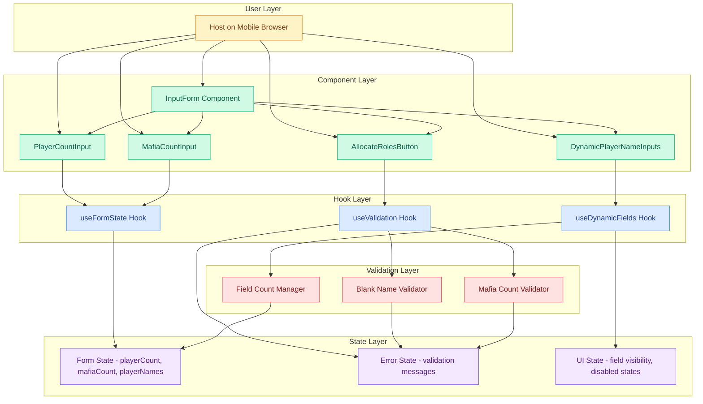

# Epic Architecture Specification: Input & Validation

## 1. Epic Architecture Overview

This epic implements client-side input validation and dynamic form management for the Mafia game setup flow. The architecture centers on React controlled components with real-time validation, using custom hooks to manage state, validation rules, and dynamic field generation. The system ensures mobile-first UX with immediate feedback and strict validation before allowing progression to role allocation.

Key properties:
- Controlled React inputs with useState/useReducer for form state management
- Real-time validation hooks that prevent invalid submissions
- Dynamic field generation based on player count changes
- Mobile-optimized touch targets and responsive validation feedback
- State persistence across navigation (prefilled names after reset)
- Zero external validation libraries; pure React validation logic

## 2. System Architecture Diagram

Notes:
- All validation occurs client-side in real-time
- No backend services; state managed purely in React hooks
- Dynamic field management handles add/remove without external libraries

## 3. High-Level Features & Technical Enablers

### Features
- **Player Count Input**: Number input controlling dynamic name field generation
- **Mafia Count Input**: Validated number input with real-time error checking
- **Dynamic Player Name Fields**: Auto-generated controlled text inputs based on player count
- **Real-time Validation**: Immediate feedback for blank names and invalid Mafia counts
- **Form State Management**: Preserve entered data across player count changes and navigation
- **Mobile-optimized UX**: Touch-friendly inputs with clear error states and accessibility

### Technical Enablers
- **useFormState Hook**: Centralized state management for playerCount, mafiaCount, and playerNames array
- **useValidation Hook**: Real-time validation logic with error message generation
- **useDynamicFields Hook**: Dynamic field creation/removal with value preservation
- **Controlled Components**: All inputs as controlled React components for consistent state
- **Tailwind Validation Styles**: Error states, disabled states, and mobile-optimized touch targets
- **Accessibility Patterns**: ARIA labels, error associations, and keyboard navigation

## 4. Technology Stack
- React 18 (useState, useEffect, custom hooks)
- Tailwind CSS v3.4.17 (form utilities, error states, responsive design)
- JavaScript (no TypeScript, no external validation libraries)
- HTML5 form elements (number, text inputs with proper attributes)
- Mobile browser APIs (viewport, touch events)

## 5. Technical Value
**Value: High**
- Establishes reusable validation patterns for the entire application
- Implements mobile-first form UX that will scale to other features
- Creates foundational hooks that other epics will leverage
- Ensures data integrity before expensive operations like role allocation

## 6. T-Shirt Size Estimate
**Size: M (≈ 1 day)**
- Custom hooks require careful state management design
- Dynamic field logic with value preservation adds complexity
- Mobile validation UX needs thorough testing across devices

## Context Template
- **Epic PRD**: `docs/ways-of-work/plan/input-and-validation/epic.md`