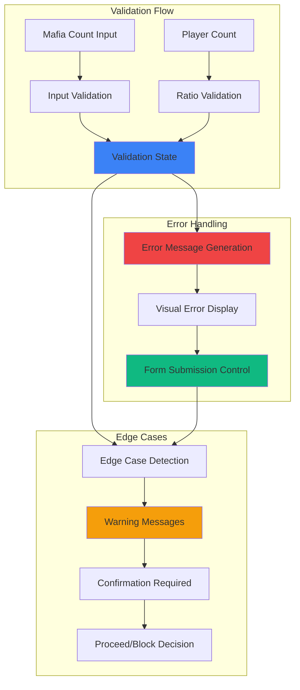

# Feature Implementation Plan: Mafia Count Validation

## Goal

Implement comprehensive Mafia count validation system that prevents invalid game configurations while providing clear feedback. This includes real-time validation against player count, error messaging, and integration with form submission controls to ensure only valid game setups proceed to allocation.

## Requirements

### Core Validation Requirements
- Real-time validation of Mafia count against total player count
- Prevention of invalid ratios (Mafia ≥ total players)
- Clear, actionable error messaging for invalid inputs
- Dynamic revalidation when player count changes
- Integration with form submission blocking
- Support for edge cases (0 Mafia, all but one Mafia)
- Mobile-optimized error display and interaction

### User Experience Requirements
- Immediate validation feedback (<100ms)
- Clear visual indicators for valid/invalid states
- Contextual error messages explaining validation rules
- Non-blocking validation for edge cases with warnings
- Accessible error messaging for screen readers

## Technical Considerations

### System Architecture Overview



### Frontend Architecture

#### Validation Component

```jsx
// components/MafiaCountValidator.jsx
import React, { useState, useEffect, useMemo, useCallback } from 'react';
import PropTypes from 'prop-types';

const MafiaCountValidator = ({ 
  playerCount, 
  initialMafiaCount = 1, 
  onMafiaCountChange, 
  onValidationChange 
}) => {
  const [mafiaCount, setMafiaCount] = useState(initialMafiaCount);
  const [hasUserInteracted, setHasUserInteracted] = useState(false);

  // Validation logic
  const validation = useMemo(() => {
    const count = parseInt(mafiaCount) || 0;
    const totalPlayers = parseInt(playerCount) || 0;
    
    // Basic input validation
    if (count < 0) {
      return {
        isValid: false,
        isEdgeCase: false,
        error: 'Mafia count cannot be negative',
        canProceed: false
      };
    }
    
    if (count >= totalPlayers) {
      return {
        isValid: false,
        isEdgeCase: false,
        error: `Mafia count must be less than total players (${totalPlayers})`,
        canProceed: false
      };
    }
    
    // Edge case detection
    if (count === 0) {
      return {
        isValid: true,
        isEdgeCase: true,
        warning: 'No Mafia players - this creates an unusual game mode',
        canProceed: true,
        requiresConfirmation: true
      };
    }
    
    if (count === totalPlayers - 1) {
      return {
        isValid: true,
        isEdgeCase: true,
        warning: 'Almost all players are Mafia - this creates an unusual game mode',
        canProceed: true,
        requiresConfirmation: true
      };
    }
    
    // Valid standard case
    return {
      isValid: true,
      isEdgeCase: false,
      canProceed: true
    };
  }, [mafiaCount, playerCount]);

  // Handle input changes
  const handleMafiaCountChange = useCallback((value) => {
    setMafiaCount(value);
    setHasUserInteracted(true);
    onMafiaCountChange?.(parseInt(value) || 0);
  }, [onMafiaCountChange]);

  // Revalidate when player count changes
  useEffect(() => {
    if (validation.isValid && parseInt(mafiaCount) >= playerCount) {
      // Auto-adjust if count becomes invalid due to player count decrease
      const maxValidMafia = Math.max(0, playerCount - 1);
      setMafiaCount(maxValidMafia);
      onMafiaCountChange?.(maxValidMafia);
    }
  }, [playerCount, mafiaCount, validation.isValid, onMafiaCountChange]);

  // Notify parent of validation state
  useEffect(() => {
    onValidationChange?.(validation);
  }, [validation, onValidationChange]);

  const shouldShowError = hasUserInteracted && !validation.isValid;
  const shouldShowWarning = validation.isEdgeCase && validation.warning;

  return (
    <div className="space-y-2">
      {/* Mafia Count Input */}
      <div>
        <label 
          htmlFor="mafiaCount"
          className="block text-sm font-medium text-gray-700 mb-2"
        >
          Number of Mafia Players
        </label>
        <input
          id="mafiaCount"
          type="number"
          min="0"
          max={Math.max(0, playerCount - 1)}
          value={mafiaCount}
          onChange={(e) => handleMafiaCountChange(e.target.value)}
          className={`
            w-full h-12 px-4 text-lg
            border-2 rounded-lg
            focus:outline-none touch-manipulation
            ${
              shouldShowError
                ? 'border-red-500 focus:border-red-500 bg-red-50'
                : validation.isEdgeCase
                ? 'border-yellow-500 focus:border-yellow-500 bg-yellow-50'
                : 'border-gray-300 focus:border-blue-500'
            }
          `}
          aria-describedby={
            shouldShowError || shouldShowWarning
              ? 'mafia-count-feedback'
              : undefined
          }
        />
      </div>

      {/* Error/Warning Messages */}
      {(shouldShowError || shouldShowWarning) && (
        <div
          id="mafia-count-feedback"
          className={`
            p-3 rounded-lg text-sm
            ${
              shouldShowError
                ? 'bg-red-100 text-red-800 border border-red-200'
                : 'bg-yellow-100 text-yellow-800 border border-yellow-200'
            }
          `}
          role="alert"
          aria-live="polite"
        >
          {shouldShowError ? validation.error : validation.warning}
          {validation.requiresConfirmation && (
            <div className="mt-2 text-xs opacity-75">
              You'll be asked to confirm this configuration before proceeding.
            </div>
          )}
        </div>
      )}

      {/* Valid State Indicator */}
      {validation.isValid && !validation.isEdgeCase && hasUserInteracted && (
        <div className="flex items-center text-sm text-green-600">
          <svg className="w-4 h-4 mr-2" fill="currentColor" viewBox="0 0 20 20">
            <path
              fillRule="evenodd"
              d="M10 18a8 8 0 100-16 8 8 0 000 16zm3.707-9.293a1 1 0 00-1.414-1.414L9 10.586 7.707 9.293a1 1 0 00-1.414 1.414l2 2a1 1 0 001.414 0l4-4z"
              clipRule="evenodd"
            />
          </svg>
          Valid Mafia count
        </div>
      )}
    </div>
  );
};

MafiaCountValidator.propTypes = {
  playerCount: PropTypes.number.isRequired,
  initialMafiaCount: PropTypes.number,
  onMafiaCountChange: PropTypes.func,
  onValidationChange: PropTypes.func,
};

export default MafiaCountValidator;
```

#### Validation Hook

```jsx
// hooks/useMafiaCountValidation.js
import { useState, useMemo, useCallback, useEffect } from 'react';

export const useMafiaCountValidation = (playerCount, initialMafiaCount = 1) => {
  const [mafiaCount, setMafiaCount] = useState(initialMafiaCount);
  const [hasConfirmedEdgeCase, setHasConfirmedEdgeCase] = useState(false);

  const validation = useMemo(() => {
    const count = parseInt(mafiaCount) || 0;
    const totalPlayers = parseInt(playerCount) || 0;
    
    if (count < 0) {
      return {
        isValid: false,
        error: 'Mafia count cannot be negative',
        canProceed: false,
        type: 'error'
      };
    }
    
    if (count >= totalPlayers) {
      return {
        isValid: false,
        error: `Mafia count must be less than total players (${totalPlayers})`,
        canProceed: false,
        type: 'error'
      };
    }
    
    // Edge cases
    const isEdgeCase = count === 0 || count === totalPlayers - 1;
    if (isEdgeCase) {
      return {
        isValid: true,
        isEdgeCase: true,
        warning: count === 0 
          ? 'No Mafia players - unusual game mode' 
          : 'Almost all players are Mafia - unusual game mode',
        canProceed: hasConfirmedEdgeCase,
        requiresConfirmation: !hasConfirmedEdgeCase,
        type: 'warning'
      };
    }
    
    return {
      isValid: true,
      canProceed: true,
      type: 'valid'
    };
  }, [mafiaCount, playerCount, hasConfirmedEdgeCase]);

  const updateMafiaCount = useCallback((newCount) => {
    setMafiaCount(newCount);
    setHasConfirmedEdgeCase(false); // Reset confirmation on change
  }, []);

  const confirmEdgeCase = useCallback(() => {
    setHasConfirmedEdgeCase(true);
  }, []);

  // Auto-adjust if count becomes invalid due to player count change
  useEffect(() => {
    if (mafiaCount >= playerCount) {
      const maxValid = Math.max(0, playerCount - 1);
      setMafiaCount(maxValid);
      setHasConfirmedEdgeCase(false);
    }
  }, [playerCount, mafiaCount]);

  return {
    mafiaCount,
    validation,
    updateMafiaCount,
    confirmEdgeCase,
    resetConfirmation: () => setHasConfirmedEdgeCase(false)
  };
};
```

### Performance Optimization

- **Memoization:** useMemo for validation calculations
- **Debounced Validation:** Optional debouncing for rapid input changes
- **Efficient Re-validation:** Only recalculate when dependencies change
- **Minimal Re-renders:** useCallback for stable function references

### Implementation Steps

1. **Core Validation Logic**
   - Implement validation rules and edge case detection
   - Create clear error/warning message system
   - Add dynamic revalidation on player count changes

2. **UI Components**
   - Create MafiaCountValidator component with error display
   - Implement accessible error messaging
   - Add visual state indicators

3. **Integration**
   - Connect with form validation system
   - Integrate with allocation flow blocking
   - Test edge case confirmation workflow

4. **Mobile Optimization**
   - Ensure touch-friendly inputs and error display
   - Test error message readability on small screens
   - Validate accessibility on mobile devices

## Context Template

- **Feature PRD:** Mafia Count Validation prevents invalid game configurations with clear user feedback
- **Epic Integration:** Builds on Player Count Management, integrates with Player Name Input System
- **Dependencies:** Requires Player Count Management for ratio validation
- **Dependents:** Role Allocation features depend on validated Mafia count