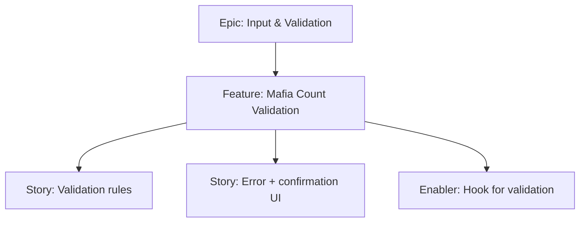

# Project Plan — Mafia Count Validation

## 1. Project Overview
- Feature Summary: Validate mafia count against player count with clear error/confirmation for edge cases (0 or all mafia allowed with confirm).
- Success Criteria: Prevent mafia >= players; allow 0/all with confirm gating; inline error messages; responsive UX.
- Milestones: Validation logic → UI error/confirm → Integration with submit.
- Risks: Confusing messages; blocking flows improperly.

## 2. Work Item Hierarchy

## 3. Issues Breakdown
- Feature: Mafia Count Validation
- Acceptance: Guard invalid; confirm 0/all; messages clear
- DoD: Docs updated with edge cases

## 4. Priority/Value
| Priority | Value |
|---|---|
| P1 | High |

## 5. Estimation
- Size: S-M (3 pts)

## 6. Dependencies
- Player Count Management

## 7. Sprint Planning
- Goal: Robust validation UX

## 8. Project Board
- Component: frontend, validation

## 9. Automation
- N/A
