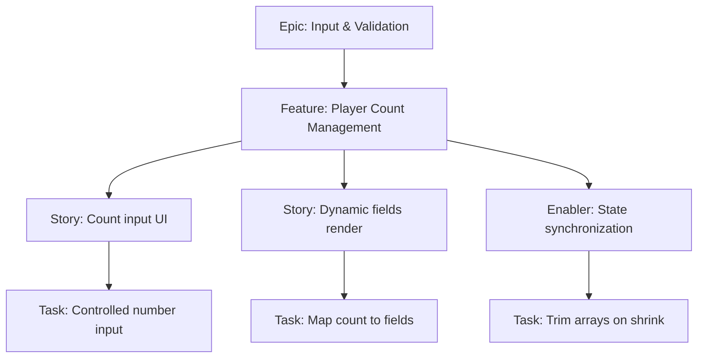

# Project Plan — Player Count Management

## 1. Project Overview
- Feature Summary: Manage dynamic player count input driving the number of name fields. Ensure state stays consistent when increasing/decreasing players.
- Success Criteria: Fields add/remove with count changes; removing fields drops values; minimum 1 player; UI remains responsive on mobile.
- Key Milestones: Count input component → Dynamic list binding → Removal behavior → Validation integration.
- Risk Assessment: Data loss on shrink; performance when adding/removing many fields quickly.

## 2. Work Item Hierarchy

## 3. Issues Breakdown
- Feature: Player Count Management
- Acceptance: Dynamic fields follow count; delete drops values; min 1 enforced
- DoD: Docs updated; tested with rapid changes

## 4. Priority/Value
| Priority | Value |
|---|---|
| P1 | High |

## 5. Estimation
- Size: M (3-5 pts)

## 6. Dependencies
- Depends on scaffolding and base components

## 7. Sprint Planning
- Goal: Stable dynamic list behavior

## 8. Project Board
- Component: frontend, state

## 9. Automation
- N/A
