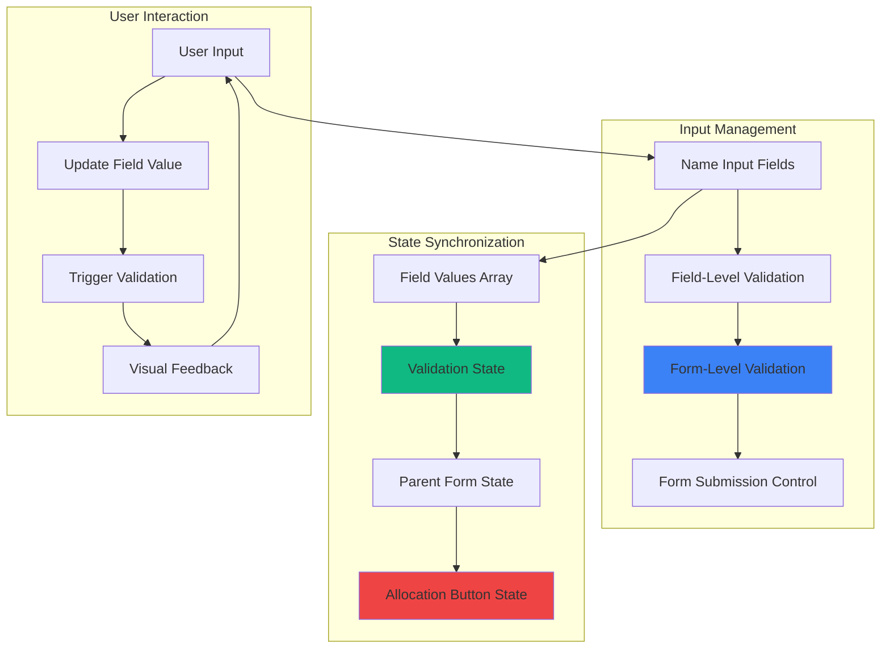

# Feature Implementation Plan: Player Name Input System

## Goal

Implement comprehensive player name input validation system that ensures all players have identifiers while supporting flexible naming patterns. This includes blank name prevention, duplicate name allowance, and seamless integration with dynamic field generation from Player Count Management.

## Requirements

### Core Validation Requirements
- Prevent form submission with any blank/empty name fields
- Allow duplicate names across different players
- Real-time validation feedback for empty fields
- Integration with dynamic field management
- Value preservation across field count changes
- Mobile-optimized input experience
- Accessible error messaging and field labeling

### User Experience Requirements
- Clear visual indication of required vs completed fields
- Immediate feedback on validation state changes
- Efficient keyboard navigation between fields
- Touch-friendly input design for mobile devices
- Contextual placeholder text and labeling

## Technical Considerations

### System Architecture Overview



### Frontend Architecture

#### Name Input Component

```jsx
// components/PlayerNameInputSystem.jsx
import React, { useState, useMemo, useCallback, useEffect } from 'react';
import PropTypes from 'prop-types';

const PlayerNameInputSystem = ({
  playerCount,
  initialNames = [],
  onNamesChange,
  onValidationChange
}) => {
  // Initialize names array based on player count
  const [names, setNames] = useState(() => 
    Array(playerCount).fill('').map((_, i) => initialNames[i] || '')
  );
  
  const [touchedFields, setTouchedFields] = useState(new Set());

  // Adjust names array when player count changes
  useEffect(() => {
    setNames(prev => {
      const newNames = [...prev];
      newNames.length = playerCount;
      return newNames.map((name, i) => name || '');
    });
  }, [playerCount]);

  // Validation logic
  const validation = useMemo(() => {
    const blankFields = [];
    const completedFields = [];
    
    names.forEach((name, index) => {
      if (!name.trim()) {
        blankFields.push(index);
      } else {
        completedFields.push(index);
      }
    });
    
    const hasBlankNames = blankFields.length > 0;
    const isComplete = blankFields.length === 0;
    
    return {
      isValid: isComplete,
      hasBlankNames,
      blankFields,
      completedFields,
      completionRate: completedFields.length / names.length,
      errors: hasBlankNames ? {
        message: `${blankFields.length} player name${blankFields.length > 1 ? 's' : ''} required`,
        fields: blankFields
      } : null
    };
  }, [names]);

  // Handle individual name changes
  const handleNameChange = useCallback((index, value) => {
    setNames(prev => 
      prev.map((name, i) => i === index ? value : name)
    );
    
    // Mark field as touched
    setTouchedFields(prev => new Set([...prev, index]));
  }, []);

  // Handle field blur events
  const handleFieldBlur = useCallback((index) => {
    setTouchedFields(prev => new Set([...prev, index]));
  }, []);

  // Notify parent components of changes
  useEffect(() => {
    onNamesChange?.(names);
    onValidationChange?.(validation);
  }, [names, validation, onNamesChange, onValidationChange]);

  return (
    <div className="space-y-4">
      {/* Header with completion status */}
      <div className="flex items-center justify-between">
        <h3 className="text-lg font-medium text-gray-900">
          Player Names
        </h3>
        <div className="text-sm text-gray-600">
          {validation.completedFields.length} of {names.length} completed
        </div>
      </div>

      {/* Progress indicator */}
      <div className="w-full bg-gray-200 rounded-full h-2">
        <div 
          className="bg-blue-600 h-2 rounded-full transition-all duration-300"
          style={{ width: `${validation.completionRate * 100}%` }}
        />
      </div>

      {/* Name input fields */}
      <div className="space-y-3">
        {names.map((name, index) => {
          const hasError = validation.blankFields.includes(index) && touchedFields.has(index);
          const isCompleted = validation.completedFields.includes(index);
          
          return (
            <div key={index} className="relative">
              <label 
                htmlFor={`player-name-${index}`}
                className="block text-sm font-medium text-gray-700 mb-1"
              >
                Player {index + 1}
                {hasError && (
                  <span className="text-red-600 ml-1">*</span>
                )}
              </label>
              
              <div className="relative">
                <input
                  id={`player-name-${index}`}
                  type="text"
                  value={name}
                  onChange={(e) => handleNameChange(index, e.target.value)}
                  onBlur={() => handleFieldBlur(index)}
                  placeholder={`Enter name for Player ${index + 1}`}
                  className={`
                    w-full h-12 px-4 pr-10
                    border-2 rounded-lg
                    focus:outline-none touch-manipulation
                    transition-colors duration-200
                    ${
                      hasError
                        ? 'border-red-500 focus:border-red-500 bg-red-50'
                        : isCompleted
                        ? 'border-green-500 focus:border-blue-500 bg-green-50'
                        : 'border-gray-300 focus:border-blue-500'
                    }
                  `}
                  aria-describedby={hasError ? `error-${index}` : undefined}
                />
                
                {/* Status icon */}
                <div className="absolute inset-y-0 right-0 flex items-center pr-3">
                  {isCompleted ? (
                    <svg className="w-5 h-5 text-green-500" fill="currentColor" viewBox="0 0 20 20">
                      <path
                        fillRule="evenodd"
                        d="M10 18a8 8 0 100-16 8 8 0 000 16zm3.707-9.293a1 1 0 00-1.414-1.414L9 10.586 7.707 9.293a1 1 0 00-1.414 1.414l2 2a1 1 0 001.414 0l4-4z"
                        clipRule="evenodd"
                      />
                    </svg>
                  ) : hasError ? (
                    <svg className="w-5 h-5 text-red-500" fill="currentColor" viewBox="0 0 20 20">
                      <path
                        fillRule="evenodd"
                        d="M18 10a8 8 0 11-16 0 8 8 0 0116 0zm-7 4a1 1 0 11-2 0 1 1 0 012 0zm-1-9a1 1 0 00-1 1v4a1 1 0 102 0V6a1 1 0 00-1-1z"
                        clipRule="evenodd"
                      />
                    </svg>
                  ) : null}
                </div>
              </div>
              
              {/* Field-specific error message */}
              {hasError && (
                <div 
                  id={`error-${index}`}
                  className="mt-1 text-sm text-red-600"
                  role="alert"
                >
                  Player {index + 1} name is required
                </div>
              )}
            </div>
          );
        })}
      </div>

      {/* Global validation summary */}
      {validation.hasBlankNames && touchedFields.size > 0 && (
        <div 
          className="p-3 bg-red-50 border border-red-200 rounded-lg"
          role="alert"
          aria-live="polite"
        >
          <div className="flex items-center">
            <svg className="w-5 h-5 text-red-500 mr-2" fill="currentColor" viewBox="0 0 20 20">
              <path
                fillRule="evenodd"
                d="M18 10a8 8 0 11-16 0 8 8 0 0116 0zm-7 4a1 1 0 11-2 0 1 1 0 012 0zm-1-9a1 1 0 00-1 1v4a1 1 0 102 0V6a1 1 0 00-1-1z"
                clipRule="evenodd"
              />
            </svg>
            <span className="text-sm text-red-800 font-medium">
              {validation.errors.message}
            </span>
          </div>
          <p className="text-sm text-red-700 mt-1">
            All players need names before roles can be allocated.
          </p>
        </div>
      )}

      {/* Success state */}
      {validation.isValid && names.length > 0 && (
        <div className="p-3 bg-green-50 border border-green-200 rounded-lg">
          <div className="flex items-center">
            <svg className="w-5 h-5 text-green-500 mr-2" fill="currentColor" viewBox="0 0 20 20">
              <path
                fillRule="evenodd"
                d="M10 18a8 8 0 100-16 8 8 0 000 16zm3.707-9.293a1 1 0 00-1.414-1.414L9 10.586 7.707 9.293a1 1 0 00-1.414 1.414l2 2a1 1 0 001.414 0l4-4z"
                clipRule="evenodd"
              />
            </svg>
            <span className="text-sm text-green-800 font-medium">
              All player names completed! Ready to allocate roles.
            </span>
          </div>
        </div>
      )}
    </div>
  );
};

PlayerNameInputSystem.propTypes = {
  playerCount: PropTypes.number.isRequired,
  initialNames: PropTypes.arrayOf(PropTypes.string),
  onNamesChange: PropTypes.func,
  onValidationChange: PropTypes.func,
};

export default PlayerNameInputSystem;
```

#### Validation Hook

```jsx
// hooks/usePlayerNameValidation.js
import { useState, useMemo, useCallback, useEffect } from 'react';

export const usePlayerNameValidation = (playerCount, initialNames = []) => {
  const [names, setNames] = useState(
    Array(playerCount).fill('').map((_, i) => initialNames[i] || '')
  );
  const [touchedFields, setTouchedFields] = useState(new Set());

  // Validation logic
  const validation = useMemo(() => {
    const blankIndices = names
      .map((name, index) => (!name.trim() ? index : null))
      .filter(index => index !== null);
    
    const completedIndices = names
      .map((name, index) => (name.trim() ? index : null))
      .filter(index => index !== null);

    return {
      isValid: blankIndices.length === 0,
      hasBlankNames: blankIndices.length > 0,
      blankCount: blankIndices.length,
      completedCount: completedIndices.length,
      blankIndices,
      completedIndices,
      completionRate: completedIndices.length / names.length,
      canProceed: blankIndices.length === 0 && names.length > 0
    };
  }, [names]);

  const updateName = useCallback((index, name) => {
    setNames(prev => prev.map((n, i) => i === index ? name : n));
    setTouchedFields(prev => new Set([...prev, index]));
  }, []);

  const markFieldTouched = useCallback((index) => {
    setTouchedFields(prev => new Set([...prev, index]));
  }, []);

  const resetNames = useCallback(() => {
    setNames(Array(playerCount).fill(''));
    setTouchedFields(new Set());
  }, [playerCount]);

  // Adjust array size when player count changes
  useEffect(() => {
    setNames(prev => {
      const newNames = [...prev];
      newNames.length = playerCount;
      return newNames.map((name, i) => name || '');
    });
  }, [playerCount]);

  return {
    names,
    validation,
    touchedFields,
    updateName,
    markFieldTouched,
    resetNames,
  };
};
```

### Performance Optimization

- **Efficient Array Updates:** Direct index-based updates
- **Memoized Validation:** useMemo for validation calculations
- **Minimal Re-renders:** useCallback for stable references
- **Touch State Management:** Efficient Set operations for touched fields

### Implementation Steps

1. **Core Input System**
   - Create PlayerNameInputSystem component
   - Implement validation logic and state management
   - Add progress indicators and completion feedback

2. **Validation Integration**
   - Connect with form submission controls
   - Implement real-time validation feedback
   - Add accessible error messaging

3. **Mobile Optimization**
   - Ensure touch-friendly inputs and navigation
   - Optimize for mobile keyboards and interaction patterns
   - Test accessibility on mobile screen readers

4. **Testing and Polish**
   - Test with various player counts and name patterns
   - Verify integration with dynamic field management
   - Validate performance with maximum player counts

## Context Template

- **Feature PRD:** Player Name Input System ensures complete player identification with flexible naming support
- **Epic Integration:** Completes Input & Validation epic with comprehensive name collection and validation
- **Dependencies:** Integrates with Player Count Management for dynamic fields
- **Dependents:** Role Allocation features require valid name list for player-role mapping