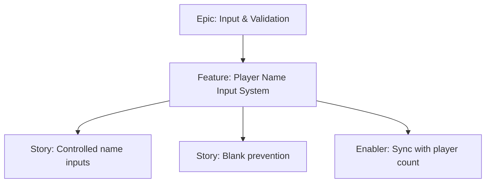

# Project Plan — Player Name Input System

## 1. Project Overview
- Feature Summary: Collect player names via controlled inputs; disallow blanks; allow duplicates; maintain alignment with player count.
- Success Criteria: No blank names allowed; duplicates accepted; trimming whitespace; responsive inputs.
- Milestones: Controlled inputs → Validation integration → UX polish.
- Risks: Performance with many inputs; accidental auto-capitalization issues on mobile.

## 2. Work Item Hierarchy

## 3. Issues Breakdown
- Feature: Player Name Input System
- Acceptance: Blank blocked; duplicates allowed; trimmed
- DoD: Docs updated; tested on mobile viewport

## 4. Priority/Value
| Priority | Value |
|---|---|
| P1 | High |

## 5. Estimation
- Size: M (5 pts)

## 6. Dependencies
- Player Count Management

## 7. Sprint Planning
- Goal: Stable and ergonomic inputs

## 8. Project Board
- Component: frontend, inputs

## 9. Automation
- N/A
