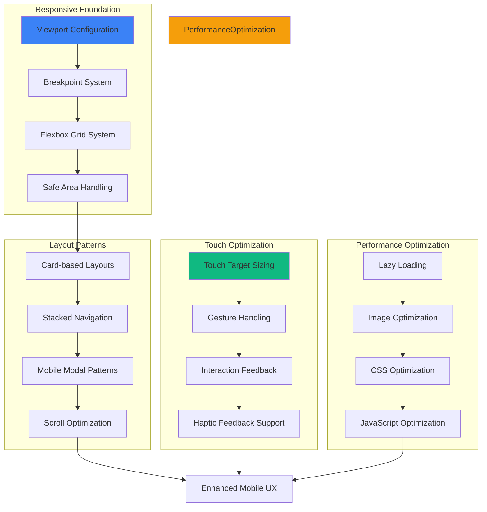

# Feature Implementation Plan: Mobile Layout Optimization

## Goal

Implement comprehensive mobile-first layout optimization ensuring excellent user experience across all mobile devices and orientations. This includes responsive design patterns, touch optimization, performance enhancements, and seamless integration with visual differentiation systems.

## Requirements

### Core Mobile Requirements
- Mobile-first responsive design with portrait orientation priority
- Touch-friendly interaction patterns with 44px minimum touch targets
- Optimized viewport configuration and safe area handling
- Fast rendering and smooth scrolling on mobile devices
- Efficient use of screen real estate with proper spacing
- Cross-device compatibility (iOS, Android, various screen sizes)
- Offline-ready design with minimal network dependencies
- Performance optimization for mobile browsers

### User Experience Requirements
- Intuitive touch gestures and interaction patterns
- Clear visual hierarchy optimized for small screens
- Fast load times (< 2s) and responsive interactions (< 200ms)
- Proper keyboard handling for mobile input methods
- Accessible design for mobile screen readers
- Battery-efficient animations and transitions
- Consistent experience across device orientations

## Technical Considerations

### System Architecture Overview



### Frontend Architecture

#### Mobile Layout System

```jsx
// utils/mobileLayout.js

/**
 * Mobile breakpoints and media queries
 */
export const BREAKPOINTS = {
  mobile: '0px',
  mobileLarge: '414px',
  tablet: '768px',
  desktop: '1024px'
};

export const MEDIA_QUERIES = {
  mobile: `(max-width: ${BREAKPOINTS.tablet})`,
  mobileLarge: `(min-width: ${BREAKPOINTS.mobileLarge})`,
  tablet: `(min-width: ${BREAKPOINTS.tablet})`,
  desktop: `(min-width: ${BREAKPOINTS.desktop})`
};

/**
 * Mobile-optimized spacing system
 */
export const MOBILE_SPACING = {
  // Container padding
  containerPadding: 'px-4 sm:px-6',
  containerPaddingLarge: 'px-6 sm:px-8',
  
  // Vertical spacing
  sectionGap: 'space-y-6',
  componentGap: 'space-y-4',
  elementGap: 'space-y-3',
  
  // Touch-friendly margins
  touchMargin: 'my-3',
  buttonSpacing: 'space-y-3',
  
  // Safe areas
  safeTop: 'pt-safe-top',
  safeBottom: 'pb-safe-bottom',
  safeLeft: 'pl-safe-left',
  safeRight: 'pr-safe-right'
};

/**
 * Touch target sizing
 */
export const TOUCH_TARGETS = {
  minimum: 'min-h-[44px] min-w-[44px]',
  comfortable: 'min-h-[48px] min-w-[48px]',
  large: 'min-h-[56px] min-w-[56px]',
  
  // Button heights
  buttonSmall: 'h-10',
  buttonMedium: 'h-12',
  buttonLarge: 'h-14',
  buttonXLarge: 'h-16'
};

/**
 * Mobile-specific utilities
 */
export const MOBILE_UTILS = {
  // Touch manipulation
  touchManipulation: 'touch-manipulation',
  
  // Prevent zoom on inputs
  preventZoom: 'text-base', // 16px prevents zoom on iOS
  
  // Smooth scrolling
  smoothScroll: 'scroll-smooth',
  
  // Hide scrollbars on mobile
  hideScrollbar: 'scrollbar-hide',
  
  // Full width containers
  fullWidth: 'w-full',
  fullScreen: 'min-h-screen',
  
  // Mobile-friendly shadows
  mobileShadow: 'shadow-lg sm:shadow-xl',
  
  // Animation performance
  willChange: 'will-change-transform',
  transform3d: 'transform-gpu'
};

/**
 * Detect mobile device and capabilities
 */
export const isMobile = () => {
  if (typeof window === 'undefined') return false;
  
  return /Android|iPhone|iPad|iPod|BlackBerry|IEMobile|Opera Mini/i.test(
    navigator.userAgent
  );
};

export const isTouchDevice = () => {
  if (typeof window === 'undefined') return false;
  
  return 'ontouchstart' in window || navigator.maxTouchPoints > 0;
};

export const hasHapticFeedback = () => {
  if (typeof window === 'undefined') return false;
  
  return 'vibrate' in navigator;
};

/**
 * Viewport utilities
 */
export const getViewportHeight = () => {
  if (typeof window === 'undefined') return 0;
  
  return window.innerHeight || document.documentElement.clientHeight;
};

export const getViewportWidth = () => {
  if (typeof window === 'undefined') return 0;
  
  return window.innerWidth || document.documentElement.clientWidth;
};

/**
 * Safe area utilities
 */
export const getSafeAreaInsets = () => {
  if (typeof window === 'undefined') return { top: 0, bottom: 0, left: 0, right: 0 };
  
  const style = getComputedStyle(document.documentElement);
  
  return {
    top: parseInt(style.getPropertyValue('env(safe-area-inset-top)') || '0'),
    bottom: parseInt(style.getPropertyValue('env(safe-area-inset-bottom)') || '0'),
    left: parseInt(style.getPropertyValue('env(safe-area-inset-left)') || '0'),
    right: parseInt(style.getPropertyValue('env(safe-area-inset-right)') || '0')
  };
};
```

#### Mobile Layout Components

```jsx
// components/layout/MobileLayoutOptimization.jsx
import React, { useEffect, useState, useRef } from 'react';
import PropTypes from 'prop-types';
import { MOBILE_SPACING, TOUCH_TARGETS, MOBILE_UTILS } from '../../utils/mobileLayout';

/**
 * Mobile Container Component
 */
export const MobileContainer = ({ 
  children, 
  padding = 'default',
  safeArea = true,
  className = '' 
}) => {
  const paddingClasses = {
    none: '',
    small: 'px-2 sm:px-4',
    default: MOBILE_SPACING.containerPadding,
    large: MOBILE_SPACING.containerPaddingLarge
  };
  
  const safeAreaClasses = safeArea ? `
    ${MOBILE_SPACING.safeTop} ${MOBILE_SPACING.safeBottom}
    ${MOBILE_SPACING.safeLeft} ${MOBILE_SPACING.safeRight}
  ` : '';
  
  return (
    <div className={`
      ${MOBILE_UTILS.fullWidth} ${paddingClasses[padding]}
      ${safeAreaClasses} ${className}
    `}>
      {children}
    </div>
  );
};

/**
 * Mobile-Optimized Button
 */
export const MobileButton = ({ 
  size = 'medium',
  variant = 'primary',
  fullWidth = false,
  hapticFeedback = true,
  children,
  onClick,
  className = '',
  ...props 
}) => {
  const [isPressed, setIsPressed] = useState(false);
  
  const sizeClasses = {
    small: `${TOUCH_TARGETS.buttonSmall} px-4 text-sm`,
    medium: `${TOUCH_TARGETS.buttonMedium} px-6 text-base`,
    large: `${TOUCH_TARGETS.buttonLarge} px-8 text-lg`,
    xlarge: `${TOUCH_TARGETS.buttonXLarge} px-10 text-xl`
  };
  
  const variantClasses = {
    primary: 'bg-blue-600 hover:bg-blue-700 active:bg-blue-800 text-white',
    secondary: 'bg-gray-200 hover:bg-gray-300 active:bg-gray-400 text-gray-900',
    danger: 'bg-red-600 hover:bg-red-700 active:bg-red-800 text-white'
  };
  
  const handleTouchStart = () => {
    setIsPressed(true);
    if (hapticFeedback && 'vibrate' in navigator) {
      navigator.vibrate(10); // Light haptic feedback
    }
  };
  
  const handleTouchEnd = () => {
    setIsPressed(false);
  };
  
  const handleClick = (e) => {
    onClick?.(e);
  };
  
  return (
    <button
      className={`
        ${sizeClasses[size]} ${variantClasses[variant]}
        ${fullWidth ? 'w-full' : ''}
        ${MOBILE_UTILS.touchManipulation} ${MOBILE_UTILS.transform3d}
        font-medium rounded-xl transition-all duration-150
        focus:outline-none focus:ring-4 focus:ring-opacity-50
        disabled:opacity-50 disabled:cursor-not-allowed
        ${isPressed ? 'scale-95' : 'scale-100'}
        ${className}
      `}
      onTouchStart={handleTouchStart}
      onTouchEnd={handleTouchEnd}
      onMouseDown={() => setIsPressed(true)}
      onMouseUp={() => setIsPressed(false)}
      onMouseLeave={() => setIsPressed(false)}
      onClick={handleClick}
      {...props}
    >
      {children}
    </button>
  );
};

/**
 * Mobile-Optimized Card
 */
export const MobileCard = ({ 
  children,
  padding = 'default',
  shadow = true,
  touchable = false,
  onClick,
  className = '',
  ...props 
}) => {
  const [isPressed, setIsPressed] = useState(false);
  
  const paddingClasses = {
    small: 'p-3',
    default: 'p-4',
    large: 'p-6'
  };
  
  const handleTouchStart = () => {
    if (touchable) setIsPressed(true);
  };
  
  const handleTouchEnd = () => {
    if (touchable) setIsPressed(false);
  };
  
  return (
    <div
      className={`
        ${paddingClasses[padding]} rounded-xl border border-gray-200
        ${shadow ? MOBILE_UTILS.mobileShadow : ''}
        ${touchable ? `${MOBILE_UTILS.touchManipulation} cursor-pointer` : ''}
        ${touchable ? 'active:scale-95 hover:shadow-xl' : ''}
        ${touchable ? TOUCH_TARGETS.minimum : ''}
        ${isPressed ? 'scale-95' : 'scale-100'}
        transition-all duration-150 bg-white
        ${className}
      `}
      onTouchStart={handleTouchStart}
      onTouchEnd={handleTouchEnd}
      onMouseDown={() => touchable && setIsPressed(true)}
      onMouseUp={() => touchable && setIsPressed(false)}
      onMouseLeave={() => touchable && setIsPressed(false)}
      onClick={touchable ? onClick : undefined}
      role={touchable ? 'button' : undefined}
      tabIndex={touchable ? 0 : -1}
      {...props}
    >
      {children}
    </div>
  );
};

/**
 * Mobile-Optimized Input
 */
export const MobileInput = ({ 
  type = 'text',
  size = 'medium',
  error = false,
  className = '',
  ...props 
}) => {
  const sizeClasses = {
    small: 'h-10 px-3 text-sm',
    medium: 'h-12 px-4 text-base', // 16px prevents zoom on iOS
    large: 'h-14 px-5 text-lg'
  };
  
  return (
    <input
      type={type}
      className={`
        ${sizeClasses[size]} w-full rounded-lg border-2
        ${error ? 'border-red-500 focus:border-red-500 bg-red-50' : 'border-gray-300 focus:border-blue-500'}
        ${MOBILE_UTILS.touchManipulation} ${MOBILE_UTILS.preventZoom}
        focus:outline-none transition-colors duration-200
        placeholder-gray-500
        ${className}
      `}
      {...props}
    />
  );
};

/**
 * Mobile-Optimized Modal
 */
export const MobileModal = ({ 
  isOpen,
  onClose,
  children,
  title,
  fullScreen = false,
  className = '' 
}) => {
  const modalRef = useRef(null);
  
  useEffect(() => {
    if (isOpen) {
      document.body.style.overflow = 'hidden';
      // Focus trap logic would go here
    } else {
      document.body.style.overflow = '';
    }
    
    return () => {
      document.body.style.overflow = '';
    };
  }, [isOpen]);
  
  if (!isOpen) return null;
  
  return (
    <div className="fixed inset-0 bg-black bg-opacity-50 flex items-end sm:items-center justify-center z-50">
      <div
        ref={modalRef}
        className={`
          bg-white rounded-t-2xl sm:rounded-2xl w-full max-w-md mx-4
          ${fullScreen ? 'h-full sm:h-auto' : 'max-h-[90vh]'}
          ${MOBILE_SPACING.safeBottom} overflow-y-auto
          transform transition-all duration-300
          ${className}
        `}
        onClick={(e) => e.stopPropagation()}
      >
        {title && (
          <div className="sticky top-0 bg-white border-b border-gray-200 px-6 py-4 rounded-t-2xl">
            <div className="flex items-center justify-between">
              <h3 className="text-lg font-semibold text-gray-900">{title}</h3>
              <button
                onClick={onClose}
                className={`
                  ${TOUCH_TARGETS.minimum} p-2 rounded-full
                  text-gray-400 hover:text-gray-600 hover:bg-gray-100
                  focus:outline-none focus:ring-2 focus:ring-gray-200
                `}
              >
                <svg className="w-6 h-6" fill="none" stroke="currentColor" viewBox="0 0 24 24">
                  <path strokeLinecap="round" strokeLinejoin="round" strokeWidth={2} d="M6 18L18 6M6 6l12 12" />
                </svg>
              </button>
            </div>
          </div>
        )}
        <div className="p-6">
          {children}
        </div>
      </div>
    </div>
  );
};

// PropTypes
MobileContainer.propTypes = {
  children: PropTypes.node.isRequired,
  padding: PropTypes.oneOf(['none', 'small', 'default', 'large']),
  safeArea: PropTypes.bool,
  className: PropTypes.string,
};

MobileButton.propTypes = {
  size: PropTypes.oneOf(['small', 'medium', 'large', 'xlarge']),
  variant: PropTypes.oneOf(['primary', 'secondary', 'danger']),
  fullWidth: PropTypes.bool,
  hapticFeedback: PropTypes.bool,
  children: PropTypes.node.isRequired,
  onClick: PropTypes.func,
  className: PropTypes.string,
};

MobileCard.propTypes = {
  children: PropTypes.node.isRequired,
  padding: PropTypes.oneOf(['small', 'default', 'large']),
  shadow: PropTypes.bool,
  touchable: PropTypes.bool,
  onClick: PropTypes.func,
  className: PropTypes.string,
};

MobileInput.propTypes = {
  type: PropTypes.string,
  size: PropTypes.oneOf(['small', 'medium', 'large']),
  error: PropTypes.bool,
  className: PropTypes.string,
};

MobileModal.propTypes = {
  isOpen: PropTypes.bool.isRequired,
  onClose: PropTypes.func.isRequired,
  children: PropTypes.node.isRequired,
  title: PropTypes.string,
  fullScreen: PropTypes.bool,
  className: PropTypes.string,
};
```

### Performance Optimization

- **Mobile-First CSS:** Efficient responsive design with minimal desktop overrides
- **Touch Performance:** Hardware-accelerated animations and touch interactions
- **Bundle Size:** Optimized for mobile network conditions
- **Lazy Loading:** Efficient resource loading for mobile bandwidth
- **Battery Efficiency:** Optimized animations and reduced resource usage

### Implementation Steps

1. **Responsive Foundation**
   - Set up mobile-first breakpoint system
   - Configure viewport and safe area handling
   - Implement responsive grid and spacing systems

2. **Touch Optimization**
   - Create touch-friendly component library
   - Implement gesture handling and haptic feedback
   - Optimize touch targets and interaction patterns

3. **Performance Enhancement**
   - Optimize CSS delivery and bundle size
   - Implement efficient animation and transition systems
   - Add mobile-specific performance monitoring

4. **Integration and Testing**
   - Apply mobile optimizations across all components
   - Test on various mobile devices and screen sizes
   - Validate performance metrics and user experience

## Context Template

- **Feature PRD:** Mobile Layout Optimization ensures excellent mobile experience with responsive design and touch optimization
- **Epic Integration:** Completes Minimal Styling & UI Clarity epic with comprehensive mobile support
- **Dependencies:** Uses Visual Differentiation System for consistent mobile styling
- **Dependents:** All components across all epics benefit from mobile optimization