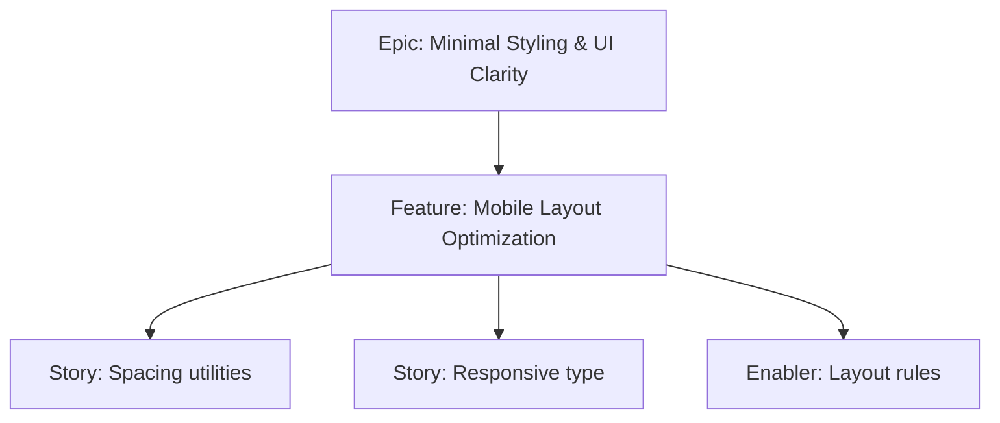

# Project Plan — Mobile Layout Optimization

## 1. Project Overview
- Feature Summary: Ensure portrait mobile layout with sensible spacing, responsive typography, and scroll behavior across flows.
- Success Criteria: Comfortable tap spacing; readable text; no horizontal scroll; responsive cards and dialogs.
- Milestones: Spacing scale → Typography → Layout checks.
- Risks: Inconsistent spacing leading to cramped UI.

## 2. Work Item Hierarchy

## 3. Issues Breakdown
- Feature: Mobile Layout Optimization
- Acceptance: No horizontal scroll; comfortable spacing; readable
- DoD: Docs updated; sample screenshots optional

## 4. Priority/Value
| Priority | Value |
|---|---|
| P2 | Medium |

## 5. Estimation
- Size: M (3-5 pts)

## 6. Dependencies
- Tailwind Integration

## 7. Sprint Planning
- Goal: Polished mobile layout

## 8. Project Board
- Component: styling

## 9. Automation
- N/A
