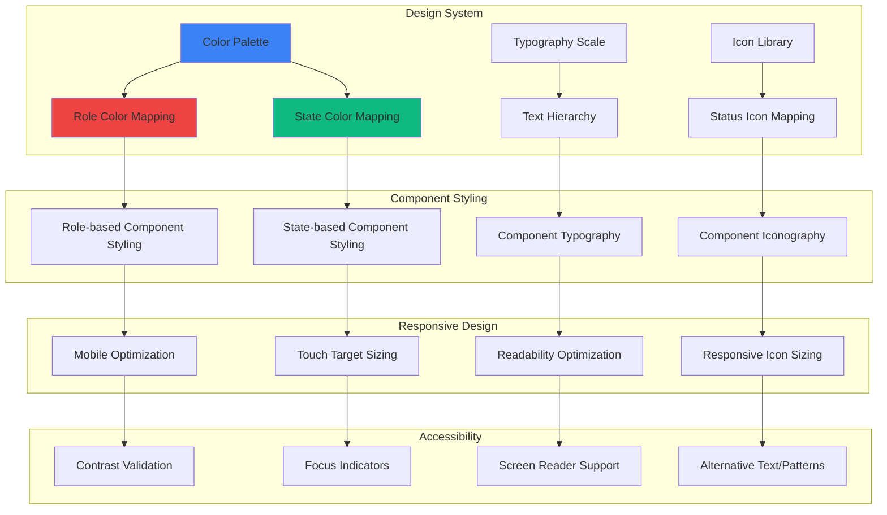

# Feature Implementation Plan: Visual Differentiation System

## Goal

Implement comprehensive visual differentiation system using color coding, typography, and iconography to create clear distinctions between Mafia and Villager roles, game states, and interaction patterns. This includes consistent design language, accessibility compliance, and mobile-optimized visual hierarchy.

## Requirements

### Core Visual Requirements
- Role-based color coding: Red for Mafia, Green for Villagers
- State-based visual indicators: waiting, current, revealed, disabled
- Consistent iconography and typography throughout application
- High contrast ratios for accessibility (WCAG AA compliance)
- Mobile-optimized touch targets and visual hierarchy
- Clear progress indicators and status communication
- Professional, game-appropriate aesthetic

### Accessibility Requirements
- Color-blind friendly design with pattern/texture alternatives
- Sufficient contrast ratios (4.5:1 minimum for normal text)
- Screen reader compatible with proper ARIA labels
- Touch-friendly interaction zones (44px minimum)
- Clear focus indicators for keyboard navigation
- Consistent visual language across all components

## Technical Considerations

### System Architecture Overview



### Frontend Architecture

#### Design System Utilities

```jsx
// utils/designSystem.js

/**
 * Color palette with role and state mappings
 */
export const COLORS = {
  // Role colors
  mafia: {
    primary: '#dc2626',    // red-600
    secondary: '#fef2f2',  // red-50
    border: '#ef4444',     // red-500
    text: '#991b1b',       // red-800
    accent: '#b91c1c'      // red-700
  },
  villager: {
    primary: '#16a34a',    // green-600
    secondary: '#f0fdf4',  // green-50
    border: '#22c55e',     // green-500
    text: '#14532d',       // green-800
    accent: '#15803d'      // green-700
  },
  
  // State colors
  current: {
    primary: '#2563eb',    // blue-600
    secondary: '#eff6ff',  // blue-50
    border: '#3b82f6',     // blue-500
    text: '#1e3a8a',       // blue-800
    accent: '#1d4ed8'      // blue-700
  },
  waiting: {
    primary: '#6b7280',    // gray-500
    secondary: '#f9fafb',  // gray-50
    border: '#d1d5db',     // gray-300
    text: '#374151',       // gray-700
    accent: '#4b5563'      // gray-600
  },
  revealed: {
    primary: '#059669',    // emerald-600
    secondary: '#ecfdf5',  // emerald-50
    border: '#10b981',     // emerald-500
    text: '#064e3b',       // emerald-800
    accent: '#047857'      // emerald-700
  },
  disabled: {
    primary: '#9ca3af',    // gray-400
    secondary: '#f3f4f6',  // gray-100
    border: '#e5e7eb',     // gray-200
    text: '#6b7280',       // gray-500
    accent: '#9ca3af'      // gray-400
  }
};

/**
 * Typography scale
 */
export const TYPOGRAPHY = {
  // Headings
  h1: 'text-3xl font-bold',
  h2: 'text-2xl font-bold',
  h3: 'text-xl font-semibold',
  h4: 'text-lg font-medium',
  
  // Body text
  body: 'text-base',
  bodyLarge: 'text-lg',
  bodySmall: 'text-sm',
  
  // UI text
  button: 'text-base font-medium',
  buttonLarge: 'text-lg font-semibold',
  label: 'text-sm font-medium',
  caption: 'text-xs',
  
  // Role display
  roleTitle: 'text-4xl font-bold',
  roleName: 'text-2xl font-bold',
  playerName: 'text-lg font-semibold'
};

/**
 * Spacing and sizing constants
 */
export const SIZING = {
  // Touch targets
  touchTarget: 'min-h-[44px] min-w-[44px]',
  buttonHeight: 'h-12',
  buttonHeightLarge: 'h-14',
  
  // Cards and containers
  cardPadding: 'p-4',
  cardPaddingLarge: 'p-6',
  cardRadius: 'rounded-xl',
  
  // Icons
  iconSmall: 'w-4 h-4',
  iconMedium: 'w-5 h-5',
  iconLarge: 'w-6 h-6',
  iconXLarge: 'w-8 h-8'
};

/**
 * Get role-based styling classes
 */
export const getRoleStyles = (role) => {
  const roleKey = role?.toLowerCase();
  
  switch (roleKey) {
    case 'mafia':
      return {
        background: 'bg-red-50',
        border: 'border-red-500',
        text: 'text-red-900',
        button: 'bg-red-600 hover:bg-red-700 text-white',
        icon: 'text-red-600'
      };
    case 'villager':
      return {
        background: 'bg-green-50',
        border: 'border-green-500',
        text: 'text-green-900',
        button: 'bg-green-600 hover:bg-green-700 text-white',
        icon: 'text-green-600'
      };
    default:
      return {
        background: 'bg-gray-50',
        border: 'border-gray-300',
        text: 'text-gray-700',
        button: 'bg-gray-600 hover:bg-gray-700 text-white',
        icon: 'text-gray-500'
      };
  }
};

/**
 * Get state-based styling classes
 */
export const getStateStyles = (state) => {
  switch (state) {
    case 'current':
      return {
        background: 'bg-blue-50',
        border: 'border-blue-500',
        text: 'text-blue-900',
        button: 'bg-blue-600 hover:bg-blue-700 text-white',
        icon: 'text-blue-600',
        pulse: 'animate-pulse'
      };
    case 'revealed':
      return {
        background: 'bg-emerald-50',
        border: 'border-emerald-500',
        text: 'text-emerald-900',
        button: 'bg-emerald-600 hover:bg-emerald-700 text-white',
        icon: 'text-emerald-600'
      };
    case 'waiting':
      return {
        background: 'bg-gray-50',
        border: 'border-gray-300',
        text: 'text-gray-700',
        button: 'bg-gray-400 text-gray-600 cursor-not-allowed',
        icon: 'text-gray-400'
      };
    case 'disabled':
      return {
        background: 'bg-gray-100',
        border: 'border-gray-200',
        text: 'text-gray-500',
        button: 'bg-gray-300 text-gray-500 cursor-not-allowed',
        icon: 'text-gray-400'
      };
    default:
      return {
        background: 'bg-white',
        border: 'border-gray-200',
        text: 'text-gray-900',
        button: 'bg-gray-600 hover:bg-gray-700 text-white',
        icon: 'text-gray-600'
      };
  }
};

/**
 * Combine role and state styles with priority to state
 */
export const getCombinedStyles = (role, state) => {
  const roleStyles = getRoleStyles(role);
  const stateStyles = getStateStyles(state);
  
  // State takes priority for interactions
  return {
    ...roleStyles,
    ...stateStyles,
    // Combine backgrounds if needed
    background: state === 'current' ? stateStyles.background : roleStyles.background
  };
};

/**
 * Accessibility utilities
 */
export const ACCESSIBILITY = {
  // Focus styles
  focusRing: 'focus:outline-none focus:ring-4 focus:ring-opacity-50',
  focusVisible: 'focus-visible:outline-none focus-visible:ring-4',
  
  // Screen reader only text
  srOnly: 'sr-only',
  
  // Touch-friendly sizing
  touchFriendly: 'min-h-[44px] min-w-[44px] touch-manipulation',
  
  // High contrast mode support
  highContrast: 'contrast-more:border-2 contrast-more:border-current'
};
```

#### Visual Component Library

```jsx
// components/ui/VisualComponents.jsx
import React from 'react';
import PropTypes from 'prop-types';
import { getRoleStyles, getStateStyles, getCombinedStyles, TYPOGRAPHY, SIZING, ACCESSIBILITY } from '../../utils/designSystem';

/**
 * Role Badge Component
 */
export const RoleBadge = ({ role, size = 'medium', className = '' }) => {
  const styles = getRoleStyles(role);
  
  const sizeClasses = {
    small: 'px-2 py-1 text-xs',
    medium: 'px-3 py-1 text-sm',
    large: 'px-4 py-2 text-base'
  };
  
  return (
    <span 
      className={`
        inline-flex items-center font-bold rounded-full
        ${styles.background} ${styles.text} border ${styles.border}
        ${sizeClasses[size]} ${className}
      `}
      role="status"
      aria-label={`Role: ${role}`}
    >
      {role.toUpperCase()}
    </span>
  );
};

/**
 * Status Icon Component
 */
export const StatusIcon = ({ state, role, size = 'medium', className = '' }) => {
  const styles = role ? getCombinedStyles(role, state) : getStateStyles(state);
  
  const sizeClasses = {
    small: SIZING.iconSmall,
    medium: SIZING.iconMedium,
    large: SIZING.iconLarge,
    xlarge: SIZING.iconXLarge
  };
  
  const getIconPath = () => {
    switch (state) {
      case 'current':
        return (
          <path
            strokeLinecap="round"
            strokeLinejoin="round"
            strokeWidth={2}
            d="M15 12a3 3 0 11-6 0 3 3 0 016 0z M2.458 12C3.732 7.943 7.523 5 12 5c4.478 0 8.268 2.943 9.542 7-1.274 4.057-5.064 7-9.542 7-4.477 0-8.268-2.943-9.542-7z"
          />
        );
      case 'revealed':
        return (
          <path
            fillRule="evenodd"
            d="M10 18a8 8 0 100-16 8 8 0 000 16zm3.707-9.293a1 1 0 00-1.414-1.414L9 10.586 7.707 9.293a1 1 0 00-1.414 1.414l2 2a1 1 0 001.414 0l4-4z"
            clipRule="evenodd"
          />
        );
      case 'waiting':
        return (
          <path
            fillRule="evenodd"
            d="M10 18a8 8 0 100-16 8 8 0 000 16zm1-12a1 1 0 10-2 0v4a1 1 0 00.293.707l2.828 2.829a1 1 0 101.415-1.415L11 9.586V6z"
            clipRule="evenodd"
          />
        );
      case 'disabled':
        return (
          <path
            fillRule="evenodd"
            d="M10 18a8 8 0 100-16 8 8 0 000 16zM8.707 7.293a1 1 0 00-1.414 1.414L8.586 10l-1.293 1.293a1 1 0 101.414 1.414L10 11.414l1.293 1.293a1 1 0 001.414-1.414L11.414 10l1.293-1.293a1 1 0 00-1.414-1.414L10 8.586 8.707 7.293z"
            clipRule="evenodd"
          />
        );
      default:
        return null;
    }
  };
  
  return (
    <svg 
      className={`${sizeClasses[size]} ${styles.icon} ${className}`}
      fill={state === 'current' ? 'none' : 'currentColor'}
      stroke={state === 'current' ? 'currentColor' : 'none'}
      viewBox="0 0 24 24"
      aria-hidden="true"
    >
      {getIconPath()}
    </svg>
  );
};

/**
 * Progress Bar Component
 */
export const ProgressBar = ({ current, total, role, className = '' }) => {
  const percentage = total > 0 ? (current / total) * 100 : 0;
  const styles = getRoleStyles(role) || getStateStyles('revealed');
  
  return (
    <div className={`w-full bg-gray-200 rounded-full h-2 ${className}`}>
      <div 
        className={`h-2 rounded-full transition-all duration-500 ${styles.button.split(' ')[0]}`}
        style={{ width: `${percentage}%` }}
        role="progressbar"
        aria-valuenow={current}
        aria-valuemin={0}
        aria-valuemax={total}
        aria-label={`Progress: ${current} of ${total} completed`}
      />
    </div>
  );
};

/**
 * Card Component with Visual States
 */
export const StateCard = ({ 
  state, 
  role, 
  children, 
  onClick, 
  disabled = false,
  className = '' 
}) => {
  const styles = role ? getCombinedStyles(role, state) : getStateStyles(state);
  const isInteractive = onClick && !disabled;
  
  return (
    <div
      className={`
        ${SIZING.cardRadius} ${SIZING.cardPadding} border-2 transition-all duration-200
        ${styles.background} ${styles.border} ${styles.text}
        ${isInteractive ? 'cursor-pointer hover:shadow-lg active:shadow-md' : ''}
        ${isInteractive ? ACCESSIBILITY.touchFriendly : ''}
        ${state === 'current' && isInteractive ? 'hover:scale-[1.02] active:scale-[0.98]' : ''}
        ${ACCESSIBILITY.focusRing}
        ${className}
      `}
      onClick={isInteractive ? onClick : undefined}
      role={isInteractive ? 'button' : undefined}
      tabIndex={isInteractive ? 0 : -1}
      onKeyDown={(e) => {
        if (isInteractive && (e.key === 'Enter' || e.key === ' ')) {
          e.preventDefault();
          onClick?.(e);
        }
      }}
    >
      {children}
    </div>
  );
};

/**
 * Action Button with Visual States
 */
export const ActionButton = ({ 
  variant = 'primary',
  size = 'medium',
  state,
  role,
  disabled = false,
  children,
  className = '',
  ...props 
}) => {
  const styles = role ? getCombinedStyles(role, state) : getStateStyles(state);
  
  const sizeClasses = {
    small: 'h-10 px-4 text-sm',
    medium: SIZING.buttonHeight + ' px-6 ' + TYPOGRAPHY.button,
    large: SIZING.buttonHeightLarge + ' px-6 ' + TYPOGRAPHY.buttonLarge
  };
  
  const variantClasses = {
    primary: styles.button,
    secondary: `border-2 ${styles.border} ${styles.text} bg-transparent hover:${styles.background}`,
    ghost: `${styles.text} hover:${styles.background}`
  };
  
  return (
    <button
      className={`
        ${sizeClasses[size]} ${variantClasses[variant]}
        rounded-lg font-medium transition-all duration-200
        ${ACCESSIBILITY.focusRing} ${ACCESSIBILITY.touchFriendly}
        disabled:opacity-50 disabled:cursor-not-allowed
        ${className}
      `}
      disabled={disabled}
      {...props}
    >
      {children}
    </button>
  );
};

// PropTypes
RoleBadge.propTypes = {
  role: PropTypes.string.isRequired,
  size: PropTypes.oneOf(['small', 'medium', 'large']),
  className: PropTypes.string,
};

StatusIcon.propTypes = {
  state: PropTypes.string.isRequired,
  role: PropTypes.string,
  size: PropTypes.oneOf(['small', 'medium', 'large', 'xlarge']),
  className: PropTypes.string,
};

ProgressBar.propTypes = {
  current: PropTypes.number.isRequired,
  total: PropTypes.number.isRequired,
  role: PropTypes.string,
  className: PropTypes.string,
};

StateCard.propTypes = {
  state: PropTypes.string.isRequired,
  role: PropTypes.string,
  children: PropTypes.node.isRequired,
  onClick: PropTypes.func,
  disabled: PropTypes.bool,
  className: PropTypes.string,
};

ActionButton.propTypes = {
  variant: PropTypes.oneOf(['primary', 'secondary', 'ghost']),
  size: PropTypes.oneOf(['small', 'medium', 'large']),
  state: PropTypes.string,
  role: PropTypes.string,
  disabled: PropTypes.bool,
  children: PropTypes.node.isRequired,
  className: PropTypes.string,
};
```

### Performance Optimization

- **CSS-in-JS Minimization:** Utility-based Tailwind classes for optimal bundle size
- **Color Calculations:** Pre-computed color palettes and style mappings
- **Icon Optimization:** Inline SVG icons with minimal DOM impact
- **Animation Performance:** Hardware-accelerated CSS transitions
- **Responsive Design:** Mobile-first approach with efficient breakpoints

### Implementation Steps

1. **Design System Foundation**
   - Create color palette with role and state mappings
   - Establish typography scale and spacing constants
   - Define accessibility standards and focus states

2. **Visual Component Library**
   - Build reusable visual components (badges, icons, progress bars)
   - Create state-aware styling utilities
   - Implement consistent interaction patterns

3. **Integration and Testing**
   - Apply visual system across all existing components
   - Test color contrast and accessibility compliance
   - Validate mobile touch targets and visual hierarchy

4. **Accessibility Validation**
   - Test with screen readers and accessibility tools
   - Validate keyboard navigation and focus indicators
   - Ensure color-blind friendly design patterns

## Context Template

- **Feature PRD:** Visual Differentiation System provides consistent, accessible design language with role-based color coding
- **Epic Integration:** Foundation of Minimal Styling & UI Clarity epic, applies to all visual components
- **Dependencies:** None (foundational system)
- **Dependents:** All visual components across all epics use this design system