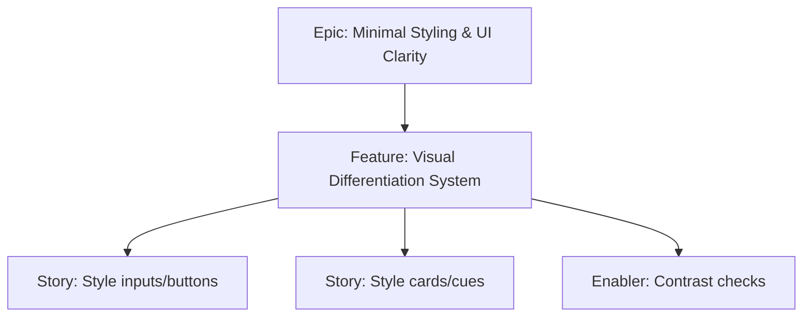

# Project Plan — Visual Differentiation System

## 1. Project Overview
- Feature Summary: Apply Tailwind utility classes to clearly differentiate inputs, buttons, cards, and cues for clarity on mobile.
- Success Criteria: Clear visual hierarchy; accessible contrast; minimal CSS beyond utilities.
- Milestones: Define tokens in Tailwind config (if needed) → Style key components → Verify contrast.
- Risks: Over-styling; global selectors harming touch behavior.

## 2. Work Item Hierarchy

## 3. Issues Breakdown
- Feature: Visual Differentiation System
- Acceptance: Contrast AA; clear hierarchy; minimal CSS
- DoD: Docs updated; screenshots optional

## 4. Priority/Value
| Priority | Value |
|---|---|
| P2 | Medium |

## 5. Estimation
- Size: M (3-5 pts)

## 6. Dependencies
- Tailwind Integration

## 7. Sprint Planning
- Goal: Legible UI

## 8. Project Board
- Component: styling

## 9. Automation
- N/A
