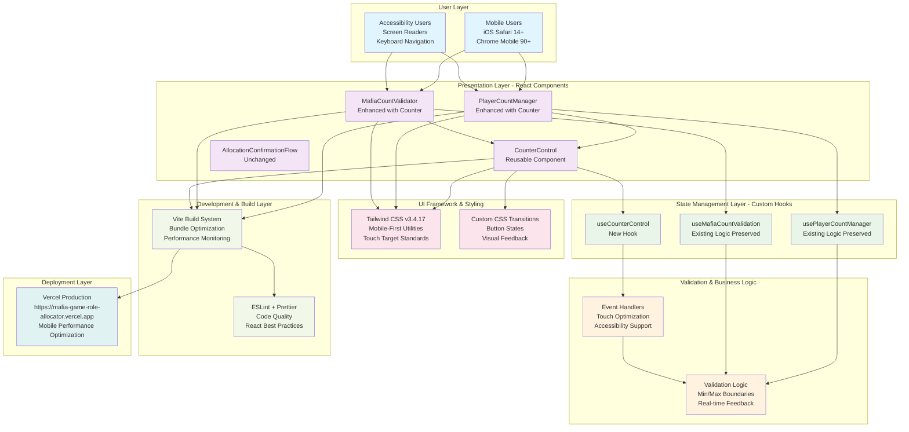

# Mobile UX Enhancement - Technical Architecture Specification

## Epic Architecture Overview

The Mobile UX Enhancement epic focuses on replacing traditional HTML `<input type="number">` elements with custom touch-optimized counter controls in the existing React component architecture. This enhancement will be implemented as a non-breaking change that preserves all existing validation logic, state management patterns, and component interfaces while dramatically improving mobile user experience.

The technical approach leverages the established React 18 + Vite + Tailwind CSS v3.4.17 stack with custom components that integrate seamlessly into the current `PlayerCountManager` and `MafiaCountValidator` components. The architecture maintains the existing hook-based state management pattern while introducing reusable counter UI components that can be applied across the application.

## System Architecture Diagram

## High-Level Features & Technical Enablers

### High-Level Features

1. **Touch-Optimized Counter Controls**
   - Custom `CounterControl` component with ↓ N ↑ button layout
   - Large 44px+ touch targets for accessibility compliance
   - Visual feedback animations and button state management

2. **Enhanced PlayerCountManager Integration**
   - Replace number input with CounterControl in existing component
   - Preserve all existing prop interfaces and validation logic
   - Maintain dynamic name field generation functionality

3. **Enhanced MafiaCountValidator Integration**
   - Integrate CounterControl with existing Mafia count validation
   - Preserve edge case handling and warning systems
   - Maintain real-time validation feedback

4. **Accessibility Enhancement**
   - WCAG AA compliance maintenance with improved motor accessibility
   - Screen reader support with proper ARIA labeling
   - Keyboard navigation support for increment/decrement actions

### Technical Enablers

1. **Reusable Counter Component Architecture**
   - Generic `CounterControl` component with configurable props
   - Custom `useCounterControl` hook for state management
   - Integration pattern for existing validation systems

2. **Touch Interaction Optimization**
   - Custom touch event handlers with debouncing
   - Visual feedback system using Tailwind CSS transitions
   - Performance optimization for rapid tapping scenarios

3. **Component Integration Framework**
   - Non-breaking enhancement pattern for existing components
   - Backward compatibility with current prop interfaces
   - Seamless integration with existing state management hooks

4. **Development Tooling Enhancement**
   - ESLint rules extension for touch interaction patterns
   - Component testing patterns for mobile interactions
   - Bundle size monitoring for new components

## Technology Stack

### Core Technologies (Unchanged)
- **Frontend Framework:** React 18 with functional components and Hooks
- **Build Tool:** Vite with Node.js 20 and npm
- **Styling:** Tailwind CSS v3.4.17 with mobile-first responsive design
- **State Management:** React useState/useCallback/useMemo patterns
- **Type Checking:** PropTypes for component validation

### Enhancement-Specific Technologies
- **Touch Interaction:** Custom event handlers with native touch events
- **Animation:** CSS transitions via Tailwind utilities (no external libraries)
- **Accessibility:** Enhanced ARIA attributes and semantic HTML
- **Component Architecture:** Compound component pattern for counter controls
- **Performance:** React.memo for counter component optimization

### Development & Quality Assurance
- **Code Quality:** ESLint with React plugin + Prettier formatting
- **Testing:** Manual mobile device testing + component unit tests
- **Performance:** Bundle analysis and Core Web Vitals monitoring
- **Deployment:** Vercel with automatic optimization and CDN distribution

## Technical Value

**Value Estimation:** **HIGH**

**Technical Justification:**
- **Low Implementation Risk:** Enhancement builds on proven React patterns and existing component architecture without requiring refactoring
- **High Reusability:** CounterControl component establishes reusable pattern for future numeric inputs across the application
- **Performance Optimized:** Minimal bundle size impact (<5KB) while providing significant UX improvements through efficient React optimization patterns
- **Accessibility Foundation:** Enhances existing WCAG AA compliance and establishes touch-optimized interaction patterns for future development
- **Maintainability:** Preserves existing validation logic and state management patterns, ensuring long-term code stability
- **Mobile-First Value:** Directly addresses the primary UX friction point in production application with measurable impact potential

**Technical Benefits:**
- Establishes reusable counter control pattern for future features
- Demonstrates mobile-first enhancement methodology within existing architecture
- Provides foundation for touch-optimized interaction patterns
- Maintains development velocity through non-breaking integration approach
- Creates measurable baseline for mobile UX improvements

## T-Shirt Size Estimate

**Size: SMALL (S)**

**Estimation Rationale:**
- **Scope:** Enhancement of 2 existing components with 1 new reusable component
- **Complexity:** Medium - requires custom touch interactions but leverages existing patterns
- **Integration:** Low risk - preserves all existing functionality and interfaces
- **Testing:** Standard mobile testing within established framework
- **Timeline:** 1-2 development cycles with comprehensive testing and validation

**Work Breakdown:**
- CounterControl component development: 40% of effort
- PlayerCountManager integration: 25% of effort  
- MafiaCountValidator integration: 25% of effort
- Testing, accessibility validation, and documentation: 10% of effort

**Dependencies:** None - can be developed independently using existing component architecture and development tooling.

**Confidence Level:** High - enhancement leverages established patterns and preserves existing functionality while providing clear UX value with minimal technical risk.