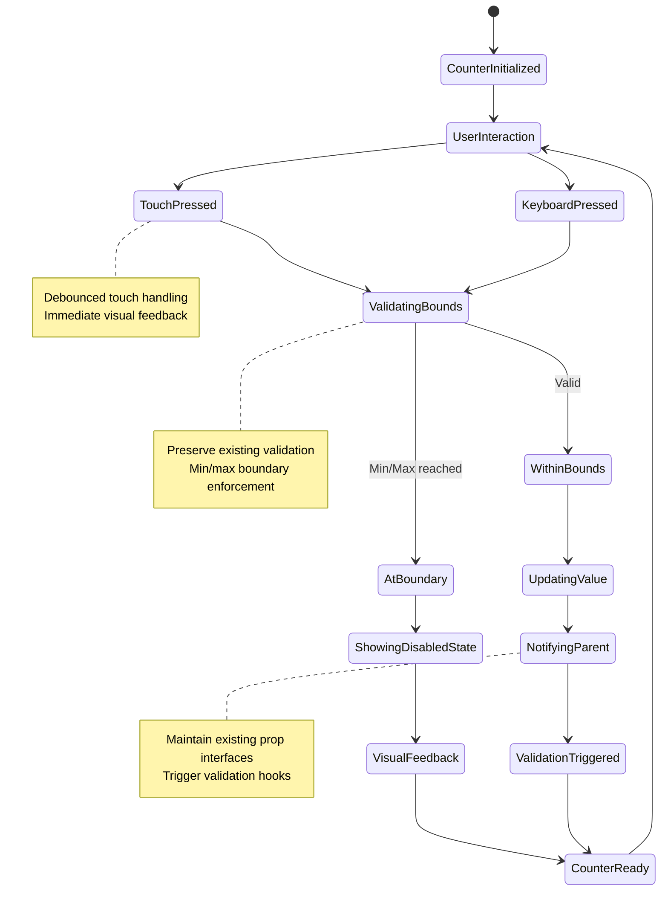

# Touch-Optimized Counter Controls - Implementation Plan

## Goal

Implement touch-optimized counter controls to replace traditional HTML `<input type="number">` elements in PlayerCountManager and MafiaCountValidator components. This enhancement will maintain all existing validation logic, state management patterns, and component interfaces while providing immediate tactile feedback, eliminating mobile keyboard dependencies, and creating an intuitive touch-first interaction paradigm. The implementation will establish reusable patterns for future numeric inputs while ensuring accessibility compliance and seamless integration with the existing React 18 + Vite + Tailwind CSS architecture.

## Requirements

### Detailed Feature Requirements

**Core Counter Control Implementation:**
- Create reusable `CounterControl` component with ↓ N ↑ button layout
- Replace number inputs in `PlayerCountManager` and `MafiaCountValidator` without breaking changes
- Implement immediate visual feedback for all button interactions (press states, hover effects)
- Support rapid tapping for quick value adjustments with appropriate debouncing
- Maintain keyboard accessibility with arrow key support and tab navigation
- Implement comprehensive ARIA labeling for screen reader compatibility
- Ensure 44px minimum touch targets for accessibility compliance

**State Management and Integration:**
- Preserve all existing validation logic from `usePlayerCountManager` and `useMafiaCountValidation` hooks
- Maintain existing prop interfaces and parent-child communication patterns
- Preserve callback functions (`onCountChange`, `onValidationChange`, etc.)
- Maintain state synchronization with other form components
- Preserve existing component lifecycle and optimization patterns

**Performance and Visual Design:**
- Add less than 5KB to current bundle size (maintain under 500KB total)
- Maintain 60fps interaction performance on target mobile devices
- Integrate seamlessly with existing Tailwind CSS v3.4.17 design system
- Support existing responsive breakpoints (375px+ mobile-first design)
- Maintain existing color schemes, typography, and spacing patterns

## Technical Considerations

### System Architecture Overview

```mermaid
graph TB
    subgraph "Frontend Layer - React Components"
        APP[App.jsx<br/>State Orchestration]
        PCM[PlayerCountManager<br/>Enhanced with Counter]
        MCV[MafiaCountValidator<br/>Enhanced with Counter]
        CC[CounterControl<br/>New Reusable Component]
        ACF[AllocationConfirmationFlow<br/>Unchanged]
    end

    subgraph "Custom Hook Layer - State Management"
        UPCM[usePlayerCountManager<br/>Existing Logic Preserved]
        UMCV[useMafiaCountValidation<br/>Existing Logic Preserved]
        UCC[useCounterControl<br/>New Custom Hook]
    end

    subgraph "Component Library - Reusable UI"
        BTN[Button Components<br/>Touch-Optimized]
        ICO[Icon Components<br/>↓ ↑ Symbols]
        TYP[Typography Components<br/>Numeric Display]
    end

    subgraph "Interaction Layer - Event Handling"
        TH[Touch Handlers<br/>Debouncing & Feedback]
        KH[Keyboard Handlers<br/>Arrow Key Support]
        AH[Accessibility Handlers<br/>ARIA Updates]
    end

    subgraph "Validation Layer - Business Logic"
        VL[Validation Logic<br/>Min/Max Boundaries]
        EH[Error Handling<br/>Real-time Feedback]
        BL[Boundary Logic<br/>Button State Management]
    end

    subgraph "Styling Layer - Visual Design"
        TW[Tailwind CSS v3.4.17<br/>Utility Classes]
        CT[CSS Transitions<br/>Button States]
        RS[Responsive Design<br/>Mobile-First]
    end

    subgraph "Build Layer - Development Pipeline"
        VITE[Vite Build System<br/>Bundle Optimization]
        ESL[ESLint + Prettier<br/>Code Quality]
        PERF[Performance Monitoring<br/>Bundle Analysis]
    end

    %% User Interaction Flow
    USER[Mobile User] --> CC
    CC --> UCC
    UCC --> TH
    UCC --> KH
    UCC --> AH

    %% Component Integration
    APP --> PCM
    APP --> MCV
    PCM --> CC
    MCV --> CC
    
    %% State Management Flow
    PCM --> UPCM
    MCV --> UMCV
    CC --> UCC
    UPCM --> VL
    UMCV --> VL
    UCC --> BL

    %% UI Component Layer
    CC --> BTN
    CC --> ICO
    CC --> TYP

    %% Event Handling
    TH --> VL
    KH --> VL
    AH --> EH

    %% Styling Integration
    CC --> TW
    BTN --> CT
    PCM --> RS
    MCV --> RS

    %% Build Pipeline
    CC --> VITE
    PCM --> VITE
    MCV --> VITE
    VITE --> ESL
    VITE --> PERF

    %% Styling
    classDef userLayer fill:#e1f5fe
    classDef componentLayer fill:#f3e5f5
    classDef hookLayer fill:#e8f5e8
    classDef libraryLayer fill:#fff3e0
    classDef interactionLayer fill:#fce4ec
    classDef validationLayer fill:#f1f8e9
    classDef stylingLayer fill:#e0f2f1
    classDef buildLayer fill:#ffebee

    class USER userLayer
    class APP,PCM,MCV,CC,ACF componentLayer
    class UPCM,UMCV,UCC hookLayer
    class BTN,ICO,TYP libraryLayer
    class TH,KH,AH interactionLayer
    class VL,EH,BL validationLayer
    class TW,CT,RS stylingLayer
    class VITE,ESL,PERF buildLayer
```



### Technology Stack Selection

**Frontend Framework (Preserved):**
- **React 18** with functional components and Hooks pattern for consistent state management
- **Vite** build system for fast development and optimized production bundles
- **Tailwind CSS v3.4.17** for utility-first styling and mobile-first responsive design

**Component Architecture (Enhanced):**
- **Compound Component Pattern** for CounterControl with flexible configuration
- **Custom Hook Pattern** for reusable state logic and event handling
- **PropTypes Validation** for component interface documentation and runtime checking

**Performance Optimization:**
- **React.memo** for CounterControl component to prevent unnecessary re-renders
- **useCallback/useMemo** for event handlers and computed values
- **CSS Transitions** via Tailwind utilities for smooth visual feedback

**Accessibility Implementation:**
- **ARIA Attributes** for comprehensive screen reader support
- **Semantic HTML** with proper button elements and labeling
- **Keyboard Navigation** with arrow key and tab support

### Integration Points

**Component Interface Boundaries:**
```pseudocode
CounterControl Props Interface:
- value: number (current count value)
- min: number (minimum allowed value)
- max: number (maximum allowed value)
- onChange: (value: number) => void
- label: string (accessibility label)
- disabled?: boolean (optional disabled state)
- className?: string (optional styling override)

PlayerCountManager Integration:
- Replace number input with CounterControl
- Preserve all existing props and callbacks
- Maintain dynamic name field generation logic

MafiaCountValidator Integration:
- Replace number input with CounterControl
- Preserve all validation logic and edge case handling
- Maintain real-time feedback and warning systems
```

**State Management Communication:**
```pseudocode
Data Flow Pattern:
CounterControl → useCounterControl → Parent Component → Validation Hook

Event Flow Pattern:
User Interaction → Touch/Keyboard Handler → Value Change → Validation → UI Update
```

### Deployment Architecture

**Build Integration:**
- **Vite Configuration:** No changes required to existing build pipeline
- **Bundle Analysis:** Monitor new component impact on bundle size (<5KB limit)
- **ESLint Integration:** Extend existing rules for touch interaction patterns

**Development Workflow:**
- **Component Testing:** Manual mobile device testing with existing patterns
- **Performance Monitoring:** Core Web Vitals tracking with existing tools
- **Code Quality:** Prettier formatting and ESLint compliance maintained

### File System Structure

```
src/
├── components/
│   ├── PlayerCountManager.jsx (Enhanced)
│   ├── MafiaCountValidator.jsx (Enhanced)
│   ├── CounterControl.jsx (New)
│   └── AllocationConfirmationFlow.jsx (Unchanged)
├── hooks/
│   ├── usePlayerCountManager.js (Unchanged)
│   ├── useMafiaCountValidation.js (Unchanged)
│   └── useCounterControl.js (New)
├── utils/
│   ├── touchHelpers.js (New)
│   └── performance.js (Existing)
└── styles/
    ├── mobile.css (Enhanced)
    └── counterControl.css (New - minimal)
```

### Frontend Architecture

#### Component Hierarchy Documentation

**Enhanced Component Structure:**

```
App.jsx (State Orchestration)
├── PlayerCountManager (Enhanced with CounterControl)
│   ├── CounterControl (New - Player Count)
│   │   ├── DecrementButton (Touch-Optimized)
│   │   ├── ValueDisplay (Numeric Display)
│   │   └── IncrementButton (Touch-Optimized)
│   ├── MafiaCountValidator (Enhanced with CounterControl)
│   │   └── CounterControl (New - Mafia Count)
│   │       ├── DecrementButton (Touch-Optimized)
│   │       ├── ValueDisplay (Numeric Display)
│   │       └── IncrementButton (Touch-Optimized)
│   └── PlayerNameFields (Unchanged)
└── AllocationConfirmationFlow (Unchanged)
```

#### State Flow Diagram



#### Custom Component Library Specifications

**CounterControl Component:**
```pseudocode
// Component Interface
interface CounterControlProps {
  value: number;
  min: number;
  max: number;
  onChange: (value: number) => void;
  label: string;
  disabled?: boolean;
  className?: string;
}

// Internal Structure
CounterControl {
  // State Management
  - useCounterControl(props) → { increment, decrement, canIncrement, canDecrement }
  
  // Event Handlers
  - handleIncrement: () => void
  - handleDecrement: () => void
  - handleKeyDown: (event) => void
  
  // Accessibility
  - ARIA labels and descriptions
  - Focus management
  - Screen reader announcements
  
  // Visual Design
  - 44px+ touch targets
  - Tailwind CSS utilities
  - Smooth transitions
}
```

**Custom Hook Specifications:**
```pseudocode
// useCounterControl Hook
function useCounterControl(value, min, max, onChange) {
  // Boundary validation
  const canIncrement = value < max;
  const canDecrement = value > min;
  
  // Debounced event handlers
  const increment = useCallback(/* increment logic */);
  const decrement = useCallback(/* decrement logic */);
  
  // Keyboard support
  const handleKeyDown = useCallback(/* arrow key handling */);
  
  return { increment, decrement, canIncrement, canDecrement, handleKeyDown };
}
```

### Security Performance

**Input Validation and Sanitization:**
- **Boundary Enforcement:** Client-side validation with min/max constraints
- **Type Safety:** PropTypes validation for all component interfaces
- **XSS Prevention:** Numeric values only, no string interpolation in displays

**Performance Optimization Strategies:**
- **React.memo:** Memoization for CounterControl to prevent unnecessary re-renders
- **Event Debouncing:** Rapid tap handling with performance-conscious debouncing
- **Bundle Optimization:** Tree-shaking unused Tailwind utilities, component-level imports
- **Memory Management:** Proper cleanup of event listeners and timeout handlers

**Caching Mechanisms:**
- **React Query:** Not applicable for this feature (no server-side data)
- **Browser Caching:** Static assets cached via Vite build configuration
- **Component Memoization:** useMemo for expensive validation computations

**Accessibility Performance:**
- **ARIA Live Regions:** Efficient screen reader updates without performance impact
- **Focus Management:** Optimized focus handling for keyboard navigation
- **Semantic HTML:** Proper button elements for native accessibility features

### Implementation Steps

**Phase 1: Core Component Development**
1. Create `useCounterControl` custom hook with boundary validation
2. Implement `CounterControl` component with basic increment/decrement functionality
3. Add touch-optimized styling with Tailwind CSS utilities
4. Implement accessibility features (ARIA labels, keyboard navigation)

**Phase 2: Integration with Existing Components**
1. Enhance `PlayerCountManager` to use CounterControl instead of number input
2. Enhance `MafiaCountValidator` to use CounterControl instead of number input
3. Preserve all existing prop interfaces and callback functions
4. Maintain integration with existing validation hooks

**Phase 3: Testing and Optimization**
1. Manual testing on target mobile devices (iOS Safari 14+, Chrome Mobile 90+)
2. Accessibility testing with screen readers and keyboard navigation
3. Performance testing for bundle size impact and interaction responsiveness
4. Integration testing with existing AllocationConfirmationFlow component

**Phase 4: Documentation and Deployment**
1. Update component documentation and PropTypes
2. Add usage examples and integration patterns
3. Deploy to production environment via existing Vercel pipeline
4. Monitor performance metrics and user feedback