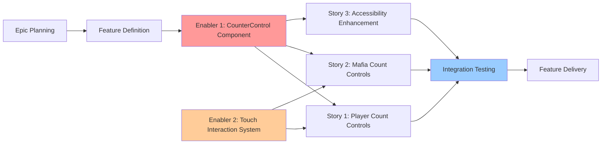

# Touch-Optimized Counter Controls - Project Plan

## Project Overview

### Feature Summary

The Touch-Optimized Counter Controls feature replaces traditional HTML `<input type="number">` elements in PlayerCountManager and MafiaCountValidator components with custom touch-friendly counter controls featuring large increment/decrement buttons. This enhancement maintains all existing validation logic while providing immediate tactile feedback, eliminating mobile keyboard dependencies, and creating an intuitive touch-first interaction paradigm for mobile users.

### Success Criteria

**Primary KPIs:**
- **Mobile Interaction Time:** Reduce average numerical configuration time by 30%
- **Touch Accuracy:** Achieve 98%+ first-attempt success rate for count adjustments
- **User Engagement:** Improve mobile user engagement by 40%
- **Setup Completion:** Increase successful game setups to 95%+

**Technical Metrics:**
- **Performance:** Maintain 60fps interaction performance with <100ms feedback
- **Bundle Impact:** Add less than 5KB to current bundle size
- **Accessibility:** Maintain 100% WCAG AA compliance with enhanced motor accessibility
- **Integration:** Zero regression in existing component functionality

### Key Milestones

**Milestone 1: Core Component Foundation**
- CounterControl component with basic increment/decrement functionality
- useCounterControl custom hook with boundary validation
- Touch-optimized styling with Tailwind CSS integration

**Milestone 2: Component Integration**
- PlayerCountManager enhancement with CounterControl
- MafiaCountValidator enhancement with CounterControl
- Preservation of all existing validation logic and interfaces

**Milestone 3: Accessibility & Performance**
- ARIA labeling and screen reader support implementation
- Keyboard navigation with arrow key support
- Performance optimization and bundle size validation

**Milestone 4: Testing & Deployment**
- Manual mobile device testing across target browsers
- Integration testing with existing AllocationConfirmationFlow
- Production deployment via existing Vercel pipeline

### Risk Assessment

**High Risk:**
- **Integration Complexity:** Risk of breaking existing validation logic during component replacement
  - *Mitigation:* Preserve exact prop interfaces and validation hook implementations
- **Performance Impact:** Risk of degrading mobile performance with new interactive components
  - *Mitigation:* React.memo optimization and performance monitoring with <5KB bundle limit

**Medium Risk:**
- **Accessibility Regression:** Risk of reducing current WCAG AA compliance during enhancement
  - *Mitigation:* Comprehensive accessibility testing and ARIA implementation
- **Cross-Browser Compatibility:** Risk of inconsistent behavior across iOS Safari and Chrome Mobile
  - *Mitigation:* Manual testing on target devices and progressive enhancement approach

**Low Risk:**
- **Design System Integration:** Risk of visual inconsistency with existing Tailwind patterns
  - *Mitigation:* Use established utility classes and maintain existing design tokens

## Work Item Hierarchy

```mermaid
graph TD
    A[Epic: Mobile UX Enhancement] --> B[Feature: Touch-Optimized Counter Controls]
    
    B --> C[Story 1: Player Count Touch Controls]
    B --> D[Story 2: Mafia Count Touch Controls]
    B --> E[Story 3: Accessibility Enhancement]
    B --> F[Enabler 1: CounterControl Component]
    B --> G[Enabler 2: Touch Interaction System]

    C --> H[Task: Replace PlayerCountManager Input]
    C --> I[Task: Preserve Validation Logic]
    C --> J[Test: Player Count Interaction Testing]

    D --> K[Task: Replace MafiaCountValidator Input]
    D --> L[Task: Maintain Edge Case Handling]
    D --> M[Test: Mafia Count Validation Testing]

    E --> N[Task: ARIA Implementation]
    E --> O[Task: Keyboard Navigation]
    E --> P[Test: Accessibility Compliance Testing]

    F --> Q[Task: Component Development]
    F --> R[Task: Custom Hook Implementation]
    F --> S[Test: Component Unit Testing]

    G --> T[Task: Touch Event Handling]
    G --> U[Task: Performance Optimization]
    G --> V[Test: Performance Benchmarking]
```



## GitHub Issues Breakdown

### Epic Issue Template

```markdown
# Epic: Mobile UX Enhancement - Intuitive Counter Controls

## Epic Description

Transform the mobile user experience by replacing traditional number input fields with intuitive touch-optimized counter controls, eliminating mobile keyboard friction while maintaining comprehensive validation and accessibility standards.

## Business Value

- **Primary Goal**: Eliminate mobile UX friction in game setup process
- **Success Metrics**: 40% engagement improvement, 30% setup time reduction, 98%+ touch accuracy
- **User Impact**: Seamless touch-first interaction for mobile game hosts and accessibility-focused users

## Epic Acceptance Criteria

- [ ] All HTML number inputs replaced with touch-optimized counter controls
- [ ] Existing validation logic preserved without modification
- [ ] WCAG AA accessibility compliance maintained and enhanced
- [ ] Mobile performance standards met (60fps, <100ms feedback)
- [ ] Production deployment with zero regression

## Features in this Epic

- [ ] #[feature-issue-number] - Touch-Optimized Counter Controls

## Definition of Done

- [ ] All feature stories completed with acceptance criteria validation
- [ ] End-to-end mobile testing passed across iOS Safari 14+ and Chrome Mobile 90+
- [ ] Performance benchmarks met (<5KB bundle impact, 60fps interactions)
- [ ] Accessibility testing completed with screen readers and keyboard navigation
- [ ] User acceptance testing completed with mobile device validation

## Labels

`epic`, `priority-high`, `value-high`, `mobile-ux`, `accessibility`

## Milestone

Mobile UX Enhancement v1.0

## Estimate

L (20-40 story points total)
```

### Feature Issue Template

```markdown
# Feature: Touch-Optimized Counter Controls

## Feature Description

Implement custom touch-friendly counter controls to replace HTML number inputs in PlayerCountManager and MafiaCountValidator components, providing large increment/decrement buttons with immediate visual feedback while preserving all existing validation logic and component interfaces.

## User Stories in this Feature

- [ ] #[story-1] - Player Count Touch Controls
- [ ] #[story-2] - Mafia Count Touch Controls  
- [ ] #[story-3] - Accessibility Enhancement

## Technical Enablers

- [ ] #[enabler-1] - CounterControl Component Development
- [ ] #[enabler-2] - Touch Interaction System Implementation

## Dependencies

**Blocks**: Future numeric input enhancements
**Blocked by**: None (can proceed immediately)

## Acceptance Criteria

- [ ] CounterControl component with ↓ N ↑ layout implemented and tested
- [ ] PlayerCountManager and MafiaCountValidator enhanced without breaking changes
- [ ] All existing validation logic preserved (min/max boundaries, edge cases)
- [ ] Touch targets meet 44px minimum accessibility requirement
- [ ] Keyboard navigation with arrow keys functional
- [ ] Bundle size increase under 5KB limit
- [ ] Performance maintains 60fps with <100ms interaction feedback

## Definition of Done

- [ ] All user stories delivered with acceptance criteria validation
- [ ] Technical enablers completed with component architecture established
- [ ] Integration testing passed with existing AllocationConfirmationFlow
- [ ] Mobile UX testing approved across target devices and browsers
- [ ] Performance testing completed with bundle size and interaction metrics

## Labels

`feature`, `priority-high`, `value-high`, `mobile-ux`, `frontend`, `accessibility`

## Epic

#[epic-issue-number]

## Estimate

M (8-20 story points)
```

### User Story Issue Templates

#### Story 1: Player Count Touch Controls

```markdown
# User Story: Player Count Touch Controls

## Story Statement

As a **Mobile Game Host**, I want **large, intuitive touch buttons to adjust player count** so that **I can quickly set up games without struggling with small number input spinners or mobile keyboards**.

## Acceptance Criteria

- [ ] HTML number input in PlayerCountManager replaced with CounterControl component
- [ ] Decrement button (↓) reduces player count by 1 with immediate visual feedback
- [ ] Increment button (↑) increases player count by 1 with immediate visual feedback
- [ ] Touch targets are minimum 44px for accessibility compliance
- [ ] Player count adjustment triggers existing dynamic name field generation/removal
- [ ] Min/max validation (1-30 players) enforced identically to current implementation
- [ ] Disabled button states displayed when boundaries are reached
- [ ] Rapid tapping supported without missed inputs or performance degradation

## Technical Tasks

- [ ] #[task-1] - Replace number input with CounterControl in PlayerCountManager
- [ ] #[task-2] - Implement boundary validation and button state management
- [ ] #[task-3] - Preserve existing prop interfaces and callback functions

## Testing Requirements

- [ ] #[test-1] - Player count interaction testing across mobile devices

## Dependencies

**Blocked by**: #[enabler-1] CounterControl Component Development

## Definition of Done

- [ ] All acceptance criteria met and validated
- [ ] Code review approved with React best practices
- [ ] Unit tests written and passing for component integration
- [ ] Manual testing completed on iOS Safari 14+ and Chrome Mobile 90+
- [ ] Existing PlayerCountManager functionality preserved without regression
- [ ] Accessibility requirements met with proper ARIA labeling

## Labels

`user-story`, `priority-high`, `frontend`, `mobile-ux`, `player-count`

## Feature

#[feature-issue-number]

## Estimate

5 story points
```

#### Story 2: Mafia Count Touch Controls

```markdown
# User Story: Mafia Count Touch Controls

## Story Statement

As a **Mobile Game Host**, I want **consistent touch controls for Mafia count adjustment** so that **I can maintain the same intuitive interaction pattern throughout the entire game setup process**.

## Acceptance Criteria

- [ ] HTML number input in MafiaCountValidator replaced with CounterControl component
- [ ] Counter controls integrate seamlessly with existing validation logic
- [ ] Edge case warnings (0 Mafia, nearly all Mafia) display identically to current implementation
- [ ] Real-time validation feedback maintains existing behavior and styling
- [ ] Mathematical relationship calculations (villager count) continue to update in real-time
- [ ] All existing error and warning messages preserved
- [ ] Boundary enforcement prevents invalid Mafia counts (0 to player count)
- [ ] Visual consistency with player count controls maintained

## Technical Tasks

- [ ] #[task-4] - Replace number input with CounterControl in MafiaCountValidator
- [ ] #[task-5] - Preserve all validation logic and edge case handling
- [ ] #[task-6] - Maintain integration with existing error messaging system

## Testing Requirements

- [ ] #[test-2] - Mafia count validation testing with edge cases

## Dependencies

**Blocked by**: #[enabler-1] CounterControl Component Development

## Definition of Done

- [ ] All acceptance criteria met and validated
- [ ] Code review approved with validation logic preservation
- [ ] Integration testing passed with existing validation hooks
- [ ] Edge case scenarios tested (0 Mafia, all Mafia configurations)
- [ ] Visual design consistency maintained with existing form elements
- [ ] Performance requirements met for real-time validation updates

## Labels

`user-story`, `priority-high`, `frontend`, `mobile-ux`, `mafia-count`

## Feature

#[feature-issue-number]

## Estimate

5 story points
```

#### Story 3: Accessibility Enhancement

```markdown
# User Story: Accessibility Enhancement

## Story Statement

As an **Accessibility-Focused User**, I want **counter controls that work seamlessly with screen readers and keyboard navigation** so that **I can independently set up games regardless of my motor abilities or assistive technology needs**.

## Acceptance Criteria

- [ ] Screen readers announce counter value changes appropriately with ARIA live regions
- [ ] Keyboard navigation supports arrow keys for increment/decrement operations
- [ ] Tab navigation flows logically through all counter controls
- [ ] ARIA labels clearly describe counter functionality and current values
- [ ] Focus indicators meet established contrast and visibility requirements
- [ ] All interactions remain accessible via keyboard-only navigation
- [ ] Counter controls integrate with existing form accessibility patterns
- [ ] Motor accessibility enhanced with larger touch targets (44px minimum)

## Technical Tasks

- [ ] #[task-7] - Implement comprehensive ARIA labeling and live regions
- [ ] #[task-8] - Add keyboard navigation support with arrow key handling
- [ ] #[task-9] - Enhance focus management and visual indicators

## Testing Requirements

- [ ] #[test-3] - Accessibility compliance testing with screen readers

## Dependencies

**Blocked by**: #[enabler-1] CounterControl Component Development

## Definition of Done

- [ ] All acceptance criteria met and validated
- [ ] WCAG AA compliance verified with automated and manual testing
- [ ] Screen reader testing completed with JAWS, NVDA, and VoiceOver
- [ ] Keyboard navigation tested across all supported browsers
- [ ] Focus management reviewed and approved
- [ ] Motor accessibility improvements validated

## Labels

`user-story`, `priority-high`, `frontend`, `accessibility`, `keyboard-navigation`

## Feature

#[feature-issue-number]

## Estimate

3 story points
```

### Technical Enabler Issue Templates

#### Enabler 1: CounterControl Component Development

```markdown
# Technical Enabler: CounterControl Component Development

## Enabler Description

Develop a reusable CounterControl component with accompanying useCounterControl hook to provide touch-optimized increment/decrement functionality with boundary validation, accessibility features, and seamless integration with existing component architecture.

## Technical Requirements

- [ ] Component implements ↓ N ↑ button layout with clear numeric display
- [ ] useCounterControl hook manages state with boundary validation
- [ ] PropTypes interface supports value, min, max, onChange, label, disabled props
- [ ] React.memo optimization for performance
- [ ] Tailwind CSS integration with existing design system
- [ ] Touch event handling with debouncing for rapid tapping
- [ ] Keyboard event handling for arrow key navigation
- [ ] ARIA attributes for comprehensive accessibility

## Implementation Tasks

- [ ] #[task-10] - Create CounterControl component with basic structure
- [ ] #[task-11] - Implement useCounterControl hook with state management
- [ ] #[task-12] - Add touch event handlers and visual feedback
- [ ] #[task-13] - Implement keyboard navigation and accessibility features

## User Stories Enabled

This enabler supports:
- #[story-1] - Player Count Touch Controls
- #[story-2] - Mafia Count Touch Controls
- #[story-3] - Accessibility Enhancement

## Acceptance Criteria

- [ ] Component renders with proper ↓ N ↑ layout and styling
- [ ] Increment/decrement functionality works with boundary enforcement
- [ ] Touch targets meet 44px minimum accessibility requirement
- [ ] Keyboard navigation functional with arrow keys
- [ ] ARIA labeling comprehensive and properly implemented
- [ ] Performance optimized with React.memo and efficient event handling
- [ ] Integration ready with configurable props interface

## Definition of Done

- [ ] Component implementation completed with full functionality
- [ ] Unit tests written for all component behavior and edge cases
- [ ] Integration tests passing with mock props and callbacks
- [ ] Code review approved with React best practices validation
- [ ] Documentation updated with usage examples and prop specifications
- [ ] Performance benchmarking completed (<100ms interaction response)

## Labels

`enabler`, `priority-critical`, `frontend`, `component-library`, `reusable`

## Feature

#[feature-issue-number]

## Estimate

8 story points
```

#### Enabler 2: Touch Interaction System Implementation

```markdown
# Technical Enabler: Touch Interaction System Implementation

## Enabler Description

Implement comprehensive touch interaction handling system with performance optimization, visual feedback, and cross-browser compatibility to support intuitive mobile counter controls across iOS Safari 14+ and Chrome Mobile 90+.

## Technical Requirements

- [ ] Touch event handlers with proper debouncing for rapid tapping
- [ ] Visual feedback system using CSS transitions and Tailwind utilities
- [ ] Performance optimization for 60fps interaction standards
- [ ] Cross-browser compatibility testing and polyfills if needed
- [ ] Memory management with proper event listener cleanup
- [ ] Bundle size optimization with tree-shaking and efficient imports

## Implementation Tasks

- [ ] #[task-14] - Implement touch event handling with debouncing
- [ ] #[task-15] - Create visual feedback system with CSS transitions
- [ ] #[task-16] - Add performance monitoring and optimization
- [ ] #[task-17] - Ensure cross-browser compatibility and testing

## User Stories Enabled

This enabler supports:
- #[story-1] - Player Count Touch Controls
- #[story-2] - Mafia Count Touch Controls

## Acceptance Criteria

- [ ] Touch events register correctly without missed inputs during rapid tapping
- [ ] Visual feedback appears within 100ms of touch interaction
- [ ] Performance maintains 60fps during extended interaction sessions
- [ ] Memory usage remains stable with proper cleanup
- [ ] Cross-browser compatibility verified on target devices
- [ ] Bundle size impact under 2KB for interaction system

## Definition of Done

- [ ] Touch interaction system implementation completed
- [ ] Performance testing passed with 60fps and <100ms feedback requirements
- [ ] Cross-browser testing completed on iOS Safari 14+ and Chrome Mobile 90+
- [ ] Memory leak testing passed with extended interaction scenarios
- [ ] Code review approved with performance optimization validation
- [ ] Bundle size analysis completed with optimization confirmed

## Labels

`enabler`, `priority-high`, `frontend`, `performance`, `touch-interaction`

## Feature

#[feature-issue-number]

## Estimate

5 story points
```

## Priority and Value Matrix

| Issue Type | Priority | Value  | Criteria                                    | Labels                                          |
| ---------- | -------- | ------ | ------------------------------------------- | ----------------------------------------------- |
| Enabler 1  | P0       | High   | Blocks all stories, core component          | `priority-critical`, `value-high`, `enabler`   |
| Story 1    | P1       | High   | Core user functionality, player setup       | `priority-high`, `value-high`, `user-story`    |
| Story 2    | P1       | High   | Core user functionality, game configuration | `priority-high`, `value-high`, `user-story`    |
| Enabler 2  | P1       | Medium | Performance critical, supports stories      | `priority-high`, `value-medium`, `enabler`     |
| Story 3    | P2       | High   | Accessibility enhancement, compliance       | `priority-medium`, `value-high`, `user-story`  |

## Estimation Guidelines

### Story Point Breakdown

**Total Feature Estimate: 26 Story Points**

- **Story 1 (Player Count Touch Controls):** 5 points
  - Medium complexity with existing component enhancement
  - Clear requirements and well-defined integration points
- **Story 2 (Mafia Count Touch Controls):** 5 points
  - Similar complexity to Story 1 with validation preservation
  - Edge case handling adds slight complexity
- **Story 3 (Accessibility Enhancement):** 3 points
  - Well-defined accessibility patterns to implement
  - Lower complexity due to established WCAG guidelines
- **Enabler 1 (CounterControl Component):** 8 points
  - Complex reusable component with multiple integration points
  - Custom hook development and performance optimization
- **Enabler 2 (Touch Interaction System):** 5 points
  - Performance-critical system with cross-browser requirements
  - Touch event handling complexity with optimization needs

### Sprint Planning Recommendation

**Sprint 1 (13 points):**
- Enabler 1: CounterControl Component Development (8 points)
- Story 3: Accessibility Enhancement (3 points) - parallel development
- Initial setup and foundation work (2 points buffer)

**Sprint 2 (13 points):**
- Enabler 2: Touch Interaction System Implementation (5 points)
- Story 1: Player Count Touch Controls (5 points)
- Integration testing and refinement (3 points buffer)

**Sprint 3 (8 points):**
- Story 2: Mafia Count Touch Controls (5 points)
- End-to-end testing and deployment (3 points buffer)

## Dependency Management



### Critical Path Analysis

**Primary Critical Path:**
1. Enabler 1 (CounterControl Component) → Story 1 → Story 2 → Integration Testing → Delivery

**Secondary Path:**
1. Enabler 2 (Touch Interaction System) → Stories 1&2 (parallel) → Integration Testing

**Accessibility Path:**
1. Story 3 can proceed in parallel with Enabler 1 and integrate during Story 1&2 development

### Dependency Mitigation Strategies

**For Enabler 1 Delays:**
- Develop component interface first to unblock story development
- Create mock implementation for early integration testing
- Parallel development of stories with interface contracts

**For Cross-Story Dependencies:**
- Shared component library approach ensures consistency
- Common accessibility patterns can be developed once and applied to both components
- Integration testing framework can be established early

## GitHub Project Board Configuration

### Column Structure

1. **Epic Backlog**: Epic-level planning and requirements
2. **Feature Ready**: Features with complete PRD and breakdown
3. **Sprint Backlog**: Stories and enablers ready for development
4. **In Progress**: Currently being developed
5. **Code Review**: Pull request review and validation
6. **Testing**: QA validation and acceptance testing
7. **Done**: Completed and deployed to production

### Automation Rules

- **Story → In Progress**: Automatically assign to current sprint when moved
- **Pull Request → Code Review**: Auto-move linked issues when PR opened
- **Merge → Testing**: Move to testing column when PR merged
- **Testing Complete → Done**: Manual transition after validation

### Custom Fields

- **Priority**: P0, P1, P2, P3
- **Value**: High, Medium, Low  
- **Component**: Frontend, Mobile-UX, Accessibility
- **Estimate**: Story points (1, 2, 3, 5, 8, 13)
- **Sprint**: Current sprint assignment
- **Device Testing**: iOS Safari, Chrome Mobile, Both
- **Epic**: Mobile UX Enhancement