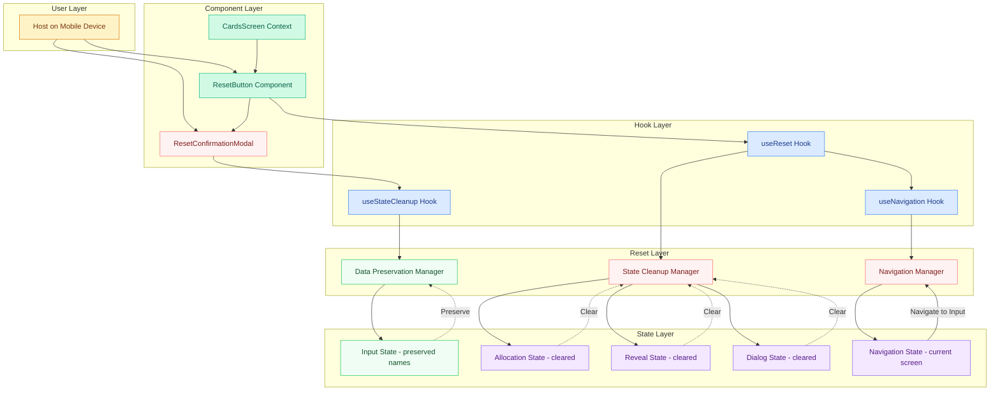

# Epic Architecture Specification: Reset & Re-Allocate

## 1. Epic Architecture Overview

This epic implements a comprehensive reset mechanism that safely transitions the application from any reveal state back to the input phase while preserving user-entered names. The architecture focuses on state cleanup, navigation management, and data preservation patterns to ensure reliable reset operations that can be triggered at any point during or after allocation.

Key properties:
- Safe state transition from reveal/allocation phases back to input phase
- Selective state preservation (names retained) with complete cleanup of allocation/reveal data
- Reset capability during active reveal dialogs with proper cleanup and focus return
- Idempotent reset operations with confirmation patterns for critical state transitions
- Performance-optimized state cleanup targeting <200ms reset completion
- Memory-efficient state management preventing data leaks between sessions

## 2. System Architecture Diagram

Notes:
- Reset can be triggered from any screen state including during active dialogs
- Data preservation ensures user-entered names survive the reset operation
- State cleanup prevents memory leaks and ensures clean re-allocation capability

## 3. High-Level Features & Technical Enablers

### Features
- **Reset Button Placement**: Accessible reset button on cards screen after allocation
- **Safe State Cleanup**: Complete cleanup of allocation and reveal state without affecting input data
- **Name Preservation**: Automatic prefilling of previously entered names after reset
- **Dialog-Safe Reset**: Reset capability during active reveal dialogs with proper cleanup
- **Navigation Management**: Smooth transition back to input screen with proper state restoration
- **Confirmation Flow**: Optional lightweight confirmation for reset operations

### Technical Enablers
- **useReset Hook**: Central reset orchestration with state cleanup coordination
- **useStateCleanup Hook**: Selective state cleanup logic preserving critical user data
- **useNavigation Hook**: Screen transition management with state restoration
- **State Cleanup Manager**: Automated cleanup of allocation and reveal-specific state
- **Data Preservation Manager**: Selective preservation of user-entered names and settings
- **Navigation Manager**: Safe screen transitions with proper state handoff
- **Reset Guards**: Idempotency and safety checks for reset operations

## 4. Technology Stack
- React 18 (useState, useCallback, custom cleanup hooks)
- Tailwind CSS v3.4.17 (button styling, modal design, mobile-optimized layouts)
- JavaScript (state management, navigation patterns, memory cleanup)
- React Router or state-based navigation for screen transitions
- Mobile browser APIs for performance monitoring and memory management

## 5. Technical Value
**Value: Medium-High**
- Enables reliable recovery from configuration mistakes without data loss
- Establishes reusable state cleanup patterns for the application
- Ensures memory efficiency and prevents state pollution between game sessions
- Creates foundation for potential future features requiring state reset capabilities

## 6. T-Shirt Size Estimate
**Size: S-M (≈ 0.5-1 day)**
- State cleanup logic is straightforward but requires careful testing
- Navigation management adds some complexity
- Integration testing with all possible reset trigger points
- Preservation logic needs validation across different input configurations

## Context Template
- **Epic PRD**: `docs/ways-of-work/plan/reset-and-reallocate/epic.md`