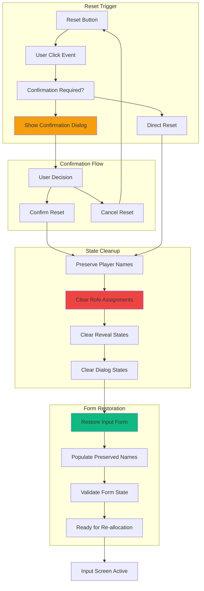

# Feature Implementation Plan: Reset Button System

## Goal

Implement comprehensive reset system that returns users to input screen while preserving player names and clearing all allocations and reveal states. This includes confirmation dialogs, state cleanup, form restoration, and seamless integration with all game systems.

## Requirements

### Core Reset Requirements
- Reset button accessible after role allocation completion
- Confirmation dialog preventing accidental resets
- Complete state cleanup: clear allocations, reveal states, dialog states
- Player name preservation: maintain all entered names and form data
- Form restoration: return to input screen with names pre-filled
- Integration with all game state systems
- Mobile-optimized interaction with proper accessibility
- Error handling and recovery for reset failures

### User Experience Requirements
- Clear visual distinction from other action buttons
- Prominent placement for easy access
- Confirmation prevents data loss from accidental clicks
- Fast reset completion (< 500ms) with visual feedback
- Smooth transition back to input screen
- Preserved player names for immediate re-allocation
- Clear success confirmation after reset

## Technical Considerations

### System Architecture Overview



### Frontend Architecture

#### Reset System Component

```jsx
// components/ResetButtonSystem.jsx
import React, { useState, useCallback, useEffect } from 'react';
import PropTypes from 'prop-types';
import { createPortal } from 'react-dom';

const ResetButtonSystem = ({
  hasActiveGame,
  currentAssignment,
  playerNames,
  gameState,
  onReset,
  disabled = false
}) => {
  const [showConfirmation, setShowConfirmation] = useState(false);
  const [isResetting, setIsResetting] = useState(false);

  // Calculate reset requirements
  const needsConfirmation = hasActiveGame || (currentAssignment && currentAssignment.players?.length > 0);
  const revealedCount = currentAssignment?.players?.filter(p => p.revealed).length || 0;
  const totalPlayers = currentAssignment?.players?.length || 0;

  // Handle reset button click
  const handleResetClick = useCallback(() => {
    if (disabled || isResetting) return;
    
    if (needsConfirmation) {
      setShowConfirmation(true);
    } else {
      performReset();
    }
  }, [needsConfirmation, disabled, isResetting]);

  // Perform the actual reset
  const performReset = useCallback(async () => {
    setIsResetting(true);
    try {
      await onReset({
        preservePlayerNames: true,
        preservePlayerCount: true,
        preserveMafiaCount: true,
        clearAssignments: true,
        clearRevealStates: true,
        clearDialogStates: true,
        returnToInput: true
      });
      setShowConfirmation(false);
    } catch (error) {
      console.error('Reset failed:', error);
      // Error handling managed by parent component
    } finally {
      setIsResetting(false);
    }
  }, [onReset]);

  // Handle confirmation
  const handleConfirm = useCallback(() => {
    performReset();
  }, [performReset]);

  // Handle cancellation
  const handleCancel = useCallback(() => {
    setShowConfirmation(false);
  }, []);

  // Handle escape key
  useEffect(() => {
    const handleEscape = (e) => {
      if (e.key === 'Escape' && showConfirmation) {
        handleCancel();
      }
    };

    if (showConfirmation) {
      document.addEventListener('keydown', handleEscape);
      return () => document.removeEventListener('keydown', handleEscape);
    }
  }, [showConfirmation, handleCancel]);

  // Don't render if no active game
  if (!hasActiveGame && !currentAssignment) {
    return null;
  }

  return (
    <>
      {/* Reset Button */}
      <button
        type="button"
        onClick={handleResetClick}
        disabled={disabled || isResetting}
        className={`
          w-full h-12 px-6 text-base font-medium rounded-lg border-2
          touch-manipulation transition-all duration-200
          focus:outline-none focus:ring-4
          ${
            !disabled && !isResetting
              ? `border-red-300 text-red-700 bg-red-50
                 hover:bg-red-100 active:bg-red-200
                 focus:ring-red-200 hover:border-red-400`
              : `border-gray-300 text-gray-500 bg-gray-100 
                 cursor-not-allowed focus:ring-gray-200`
          }
        `}
      >
        {isResetting ? (
          <div className="flex items-center justify-center">
            <svg className="animate-spin h-4 w-4 mr-2" viewBox="0 0 24 24">
              <circle
                className="opacity-25"
                cx="12"
                cy="12"
                r="10"
                stroke="currentColor"
                strokeWidth="4"
                fill="none"
              />
              <path
                className="opacity-75"
                fill="currentColor"
                d="M4 12a8 8 0 018-8V0C5.373 0 0 5.373 0 12h4zm2 5.291A7.962 7.962 0 014 12H0c0 3.042 1.135 5.824 3 7.938l3-2.647z"
              />
            </svg>
            Resetting...
          </div>
        ) : (
          <div className="flex items-center justify-center">
            <svg className="w-4 h-4 mr-2" fill="none" stroke="currentColor" viewBox="0 0 24 24">
              <path
                strokeLinecap="round"
                strokeLinejoin="round"
                strokeWidth={2}
                d="M4 4v5h.582m15.356 2A8.001 8.001 0 004.582 9m0 0H9m11 11v-5h-.581m0 0a8.003 8.003 0 01-15.357-2m15.357 2H15"
              />
            </svg>
            Reset Game
          </div>
        )}
      </button>

      {/* Confirmation Dialog */}
      {showConfirmation && createPortal(
        <div
          className="fixed inset-0 bg-black bg-opacity-50 flex items-center justify-center p-4 z-50"
          onClick={(e) => {
            if (e.target === e.currentTarget) handleCancel();
          }}
        >
          <div
            className="
              bg-white rounded-xl p-6 max-w-md w-full
              shadow-2xl transform transition-all
              max-h-[90vh] overflow-y-auto
            "
            onClick={(e) => e.stopPropagation()}
          >
            {/* Dialog Header */}
            <div className="text-center mb-6">
              <div className="mx-auto w-12 h-12 bg-red-100 rounded-full flex items-center justify-center mb-4">
                <svg className="w-6 h-6 text-red-600" fill="none" stroke="currentColor" viewBox="0 0 24 24">
                  <path
                    strokeLinecap="round"
                    strokeLinejoin="round"
                    strokeWidth={2}
                    d="M4 4v5h.582m15.356 2A8.001 8.001 0 004.582 9m0 0H9m11 11v-5h-.581m0 0a8.003 8.003 0 01-15.357-2m15.357 2H15"
                  />
                </svg>
              </div>
              <h3 className="text-xl font-bold text-gray-900 mb-2">
                Reset Game?
              </h3>
              <p className="text-gray-600">
                This will clear all current progress and return to setup.
              </p>
            </div>

            {/* Warning Information */}
            <div className="bg-red-50 border border-red-200 rounded-lg p-4 mb-6">
              <div className="flex items-start">
                <svg className="w-5 h-5 text-red-500 mr-3 mt-0.5 flex-shrink-0" fill="currentColor" viewBox="0 0 20 20">
                  <path
                    fillRule="evenodd"
                    d="M8.257 3.099c.765-1.36 2.722-1.36 3.486 0l5.58 9.92c.75 1.334-.213 2.98-1.742 2.98H4.42c-1.53 0-2.493-1.646-1.743-2.98l5.58-9.92zM11 13a1 1 0 11-2 0 1 1 0 012 0zm-1-8a1 1 0 00-1 1v3a1 1 0 002 0V6a1 1 0 00-1-1z"
                    clipRule="evenodd"
                  />
                </svg>
                <div>
                  <h4 className="text-sm font-medium text-red-800 mb-1">
                    This action will clear:
                  </h4>
                  <ul className="text-sm text-red-700 space-y-1">
                    <li>• All current role assignments</li>
                    <li>• All revealed roles ({revealedCount} of {totalPlayers} revealed)</li>
                    <li>• Current game progress and state</li>
                  </ul>
                  <p className="text-sm text-red-700 mt-2 font-medium">
                    Player names will be kept for easy re-setup.
                  </p>
                </div>
              </div>
            </div>

            {/* Current Game Summary */}
            {currentAssignment && (
              <div className="bg-gray-50 rounded-lg p-4 mb-6">
                <h4 className="text-sm font-medium text-gray-700 mb-2">Current Game:</h4>
                <div className="grid grid-cols-2 gap-4 text-sm">
                  <div>
                    <span className="text-gray-600">Players:</span>
                    <span className="font-semibold ml-2">{totalPlayers}</span>
                  </div>
                  <div>
                    <span className="text-gray-600">Revealed:</span>
                    <span className="font-semibold ml-2">{revealedCount}/{totalPlayers}</span>
                  </div>
                </div>
                {playerNames && playerNames.length > 0 && (
                  <div className="mt-2">
                    <span className="text-xs text-gray-500">
                      Names will be preserved: {playerNames.slice(0, 3).join(', ')}
                      {playerNames.length > 3 && ` +${playerNames.length - 3} more`}
                    </span>
                  </div>
                )}
              </div>
            )}

            {/* Action Buttons */}
            <div className="flex gap-3">
              <button
                type="button"
                onClick={handleCancel}
                disabled={isResetting}
                className="
                  flex-1 h-12 px-4 text-gray-700 bg-gray-200
                  hover:bg-gray-300 active:bg-gray-400
                  rounded-lg font-medium transition-colors
                  focus:outline-none focus:ring-4 focus:ring-gray-200
                  touch-manipulation
                  disabled:opacity-50 disabled:cursor-not-allowed
                "
              >
                Keep Playing
              </button>
              <button
                type="button"
                onClick={handleConfirm}
                disabled={isResetting}
                className="
                  flex-1 h-12 px-4 text-white bg-red-600
                  hover:bg-red-700 active:bg-red-800
                  rounded-lg font-medium transition-colors
                  focus:outline-none focus:ring-4 focus:ring-red-200
                  touch-manipulation
                  disabled:opacity-50 disabled:cursor-not-allowed
                "
              >
                {isResetting ? 'Resetting...' : 'Reset Game'}
              </button>
            </div>
          </div>
        </div>,
        document.body
      )}
    </>
  );
};

ResetButtonSystem.propTypes = {
  hasActiveGame: PropTypes.bool.isRequired,
  currentAssignment: PropTypes.object,
  playerNames: PropTypes.arrayOf(PropTypes.string),
  gameState: PropTypes.object,
  onReset: PropTypes.func.isRequired,
  disabled: PropTypes.bool,
};

export default ResetButtonSystem;
```

#### Reset Management Hook

```jsx
// hooks/useGameReset.js
import { useCallback } from 'react';

export const useGameReset = ({
  clearAssignment,
  clearRevealStates,
  clearDialogStates,
  preserveFormData,
  returnToInputScreen
}) => {
  // Perform complete game reset
  const performGameReset = useCallback(async ({
    preservePlayerNames = true,
    preservePlayerCount = true,
    preserveMafiaCount = true,
    clearAssignments = true,
    clearRevealStates: shouldClearReveal = true,
    clearDialogStates: shouldClearDialog = true,
    returnToInput = true
  }) => {
    try {
      // Step 1: Preserve form data if requested
      let preservedData = null;
      if (preservePlayerNames || preservePlayerCount || preserveMafiaCount) {
        preservedData = await preserveFormData({
          playerNames: preservePlayerNames,
          playerCount: preservePlayerCount,
          mafiaCount: preserveMafiaCount
        });
      }

      // Step 2: Clear game state
      if (clearAssignments) {
        clearAssignment();
      }

      if (shouldClearReveal) {
        clearRevealStates();
      }

      if (shouldClearDialog) {
        clearDialogStates();
      }

      // Step 3: Return to input screen
      if (returnToInput) {
        await returnToInputScreen(preservedData);
      }

      return {
        success: true,
        message: 'Game reset successfully',
        preservedData
      };
      
    } catch (error) {
      console.error('Game reset failed:', error);
      return {
        success: false,
        message: error.message || 'Reset failed',
        preservedData: null
      };
    }
  }, [clearAssignment, clearRevealStates, clearDialogStates, preserveFormData, returnToInputScreen]);

  // Quick reset (no confirmation)
  const quickReset = useCallback(async () => {
    return performGameReset({
      preservePlayerNames: true,
      preservePlayerCount: true,
      preserveMafiaCount: true,
      clearAssignments: true,
      clearRevealStates: true,
      clearDialogStates: true,
      returnToInput: true
    });
  }, [performGameReset]);

  return {
    performGameReset,
    quickReset
  };
};
```

### Performance Optimization

- **Fast State Cleanup:** Efficient clearing of all game states
- **Preserved Form Data:** Minimal form re-rendering with preserved names
- **Optimistic Updates:** Immediate UI feedback during reset
- **Memory Management:** Proper cleanup of all subscriptions and states
- **Smooth Transitions:** Optimized navigation back to input screen

### Implementation Steps

1. **Reset Button Component**
   - Create reset button with proper styling and placement
   - Add confirmation dialog with clear warning messaging
   - Implement accessibility and mobile optimization

2. **State Management**
   - Implement complete state cleanup functionality
   - Add player name preservation logic
   - Connect with all game state systems

3. **Form Restoration**
   - Implement smooth transition back to input screen
   - Add form population with preserved data
   - Validate restored form state

4. **Integration and Testing**
   - Test reset with various game states
   - Verify complete state cleanup
   - Test form restoration and re-allocation flow

## Context Template

- **Feature PRD:** Reset Button System provides complete game reset with form data preservation
- **Epic Integration:** Standalone epic that integrates with all other game systems
- **Dependencies:** Requires access to all game state management systems
- **Dependents:** Returns control to Input & Validation epic for new game setup