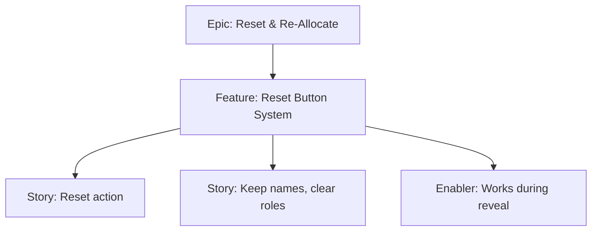

# Project Plan — Reset Button System

## 1. Project Overview
- Feature Summary: Provide a reset action to return to input screen, keep names, and clear allocations/reveal state.
- Success Criteria: Names retained; allocations cleared; works during reveal; idempotent.
- Milestones: Reset handler → State cleanup → Navigation back to inputs.
- Risks: Accidentally dropping names; partial cleanup.

## 2. Work Item Hierarchy

## 3. Issues Breakdown
- Feature: Reset Button System
- Acceptance: Names kept; roles cleared; usable anytime
- DoD: Docs updated; UX confirmed

## 4. Priority/Value
| Priority | Value |
|---|---|
| P1 | High |

## 5. Estimation
- Size: S (2 pts)

## 6. Dependencies
- Role allocation and reveal features

## 7. Sprint Planning
- Goal: Reliable reset path

## 8. Project Board
- Component: state

## 9. Automation
- N/A
