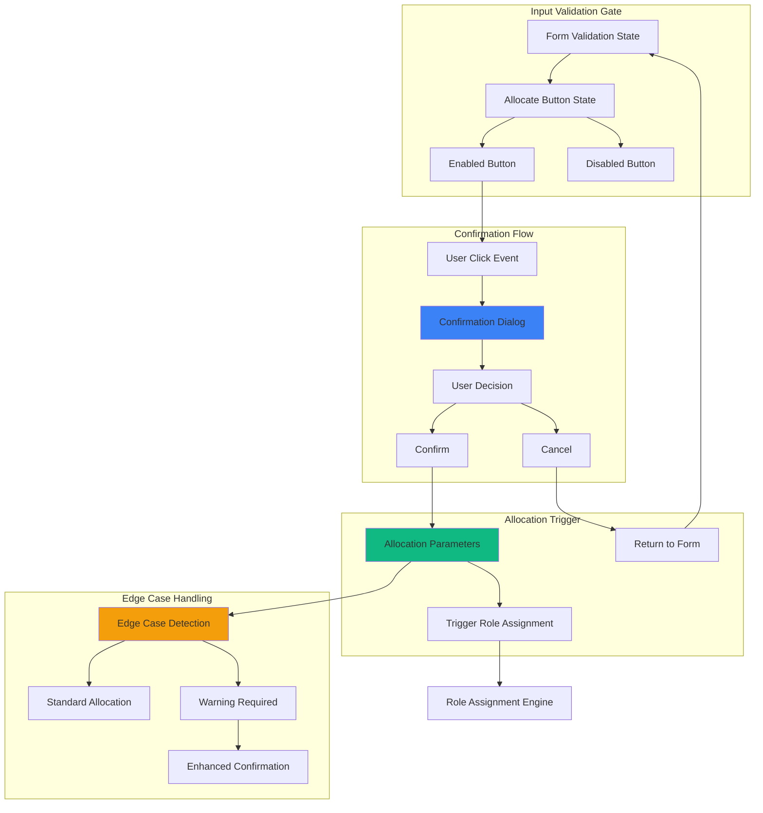

# Feature Implementation Plan: Allocation Confirmation Flow

## Goal

Implement confirmation gateway system that prevents accidental role allocation while building user confidence in the intentional nature of role assignment. This includes parameter validation, confirmation dialog with allocation details, and seamless integration with form validation and role assignment systems.

## Requirements

### Core Confirmation Requirements
- 'Allocate Roles' button with proper enabled/disabled state management
- Confirmation dialog displaying allocation parameters before proceeding
- Clear confirm/cancel options with mobile-optimized interaction
- Integration with input validation to prevent invalid allocations
- Double-tap protection and idempotency safeguards
- Edge case handling with appropriate warnings
- Accessible dialog with proper focus management

### User Experience Requirements
- Button appears within 100ms of form validation completion
- Confirmation dialog displays key parameters (player count, Mafia count)
- Clear visual feedback for button state changes
- Mobile-friendly touch targets and dialog interaction
- Escape key and background click dismissal support

## Technical Considerations

### System Architecture Overview



### Frontend Architecture

#### Confirmation Component

```jsx
// components/AllocationConfirmationFlow.jsx
import React, { useState, useCallback, useEffect } from 'react';
import PropTypes from 'prop-types';
import { createPortal } from 'react-dom';

const AllocationConfirmationFlow = ({
  playerNames,
  mafiaCount,
  isFormValid,
  onAllocate,
  disabled = false
}) => {
  const [showConfirmation, setShowConfirmation] = useState(false);
  const [isProcessing, setIsProcessing] = useState(false);

  // Calculate allocation details
  const allocationDetails = {
    totalPlayers: playerNames.length,
    mafiaCount: parseInt(mafiaCount) || 0,
    villagerCount: playerNames.length - (parseInt(mafiaCount) || 0),
    isEdgeCase: mafiaCount === 0 || mafiaCount === playerNames.length - 1
  };

  // Handle allocation button click
  const handleAllocateClick = useCallback(() => {
    if (!isFormValid || disabled || isProcessing) return;
    setShowConfirmation(true);
  }, [isFormValid, disabled, isProcessing]);

  // Handle confirmation
  const handleConfirm = useCallback(async () => {
    setIsProcessing(true);
    try {
      await onAllocate({
        playerNames,
        mafiaCount: allocationDetails.mafiaCount,
        villagerCount: allocationDetails.villagerCount
      });
      setShowConfirmation(false);
    } catch (error) {
      console.error('Allocation failed:', error);
      // Error handling would be managed by parent component
    } finally {
      setIsProcessing(false);
    }
  }, [onAllocate, playerNames, allocationDetails]);

  // Handle cancellation
  const handleCancel = useCallback(() => {
    setShowConfirmation(false);
  }, []);

  // Handle escape key
  useEffect(() => {
    const handleEscape = (e) => {
      if (e.key === 'Escape' && showConfirmation) {
        handleCancel();
      }
    };

    if (showConfirmation) {
      document.addEventListener('keydown', handleEscape);
      return () => document.removeEventListener('keydown', handleEscape);
    }
  }, [showConfirmation, handleCancel]);

  return (
    <>
      {/* Allocate Roles Button */}
      <button
        type="button"
        onClick={handleAllocateClick}
        disabled={!isFormValid || disabled || isProcessing}
        className={`
          w-full h-14 px-6 text-lg font-semibold rounded-lg
          touch-manipulation transition-all duration-200
          focus:outline-none focus:ring-4
          ${
            isFormValid && !disabled && !isProcessing
              ? `bg-blue-600 hover:bg-blue-700 active:bg-blue-800 
                 text-white focus:ring-blue-200 
                 shadow-lg hover:shadow-xl`
              : `bg-gray-300 text-gray-500 cursor-not-allowed 
                 focus:ring-gray-200`
          }
        `}
      >
        {isProcessing ? (
          <div className="flex items-center justify-center">
            <svg className="animate-spin h-5 w-5 mr-2" viewBox="0 0 24 24">
              <circle
                className="opacity-25"
                cx="12"
                cy="12"
                r="10"
                stroke="currentColor"
                strokeWidth="4"
                fill="none"
              />
              <path
                className="opacity-75"
                fill="currentColor"
                d="M4 12a8 8 0 018-8V0C5.373 0 0 5.373 0 12h4zm2 5.291A7.962 7.962 0 014 12H0c0 3.042 1.135 5.824 3 7.938l3-2.647z"
              />
            </svg>
            Allocating...
          </div>
        ) : (
          'Allocate Roles'
        )}
      </button>

      {/* Confirmation Dialog */}
      {showConfirmation && createPortal(
        <div
          className="fixed inset-0 bg-black bg-opacity-50 flex items-center justify-center p-4 z-50"
          onClick={(e) => {
            if (e.target === e.currentTarget) handleCancel();
          }}
        >
          <div
            className="
              bg-white rounded-xl p-6 max-w-md w-full
              shadow-2xl transform transition-all
              max-h-[90vh] overflow-y-auto
            "
            onClick={(e) => e.stopPropagation()}
          >
            {/* Dialog Header */}
            <div className="text-center mb-6">
              <h3 className="text-xl font-bold text-gray-900 mb-2">
                Confirm Role Allocation
              </h3>
              <p className="text-gray-600">
                Ready to assign roles to all players?
              </p>
            </div>

            {/* Allocation Details */}
            <div className="bg-gray-50 rounded-lg p-4 mb-6 space-y-3">
              <div className="flex justify-between">
                <span className="text-gray-600">Total Players:</span>
                <span className="font-semibold">{allocationDetails.totalPlayers}</span>
              </div>
              <div className="flex justify-between">
                <span className="text-gray-600">Mafia Players:</span>
                <span className="font-semibold text-red-600">{allocationDetails.mafiaCount}</span>
              </div>
              <div className="flex justify-between">
                <span className="text-gray-600">Villager Players:</span>
                <span className="font-semibold text-green-600">{allocationDetails.villagerCount}</span>
              </div>
            </div>

            {/* Edge Case Warning */}
            {allocationDetails.isEdgeCase && (
              <div className="bg-yellow-50 border border-yellow-200 rounded-lg p-4 mb-6">
                <div className="flex items-start">
                  <svg className="w-5 h-5 text-yellow-500 mr-3 mt-0.5 flex-shrink-0" fill="currentColor" viewBox="0 0 20 20">
                    <path
                      fillRule="evenodd"
                      d="M8.257 3.099c.765-1.36 2.722-1.36 3.486 0l5.58 9.92c.75 1.334-.213 2.98-1.742 2.98H4.42c-1.53 0-2.493-1.646-1.743-2.98l5.58-9.92zM11 13a1 1 0 11-2 0 1 1 0 012 0zm-1-8a1 1 0 00-1 1v3a1 1 0 002 0V6a1 1 0 00-1-1z"
                      clipRule="evenodd"
                    />
                  </svg>
                  <div>
                    <h4 className="text-sm font-medium text-yellow-800 mb-1">
                      Unusual Game Configuration
                    </h4>
                    <p className="text-sm text-yellow-700">
                      {allocationDetails.mafiaCount === 0
                        ? 'This game will have no Mafia players (all Villagers).'
                        : 'This game will have almost all players as Mafia.'}
                    </p>
                  </div>
                </div>
              </div>
            )}

            {/* Player List Preview */}
            <div className="mb-6">
              <h4 className="text-sm font-medium text-gray-700 mb-2">Players:</h4>
              <div className="max-h-32 overflow-y-auto bg-gray-50 rounded-lg p-3">
                <div className="grid grid-cols-2 gap-2 text-sm">
                  {playerNames.map((name, index) => (
                    <div key={index} className="text-gray-600">
                      {index + 1}. {name}
                    </div>
                  ))}
                </div>
              </div>
            </div>

            {/* Action Buttons */}
            <div className="flex gap-3">
              <button
                type="button"
                onClick={handleCancel}
                disabled={isProcessing}
                className="
                  flex-1 h-12 px-4 text-gray-700 bg-gray-200
                  hover:bg-gray-300 active:bg-gray-400
                  rounded-lg font-medium transition-colors
                  focus:outline-none focus:ring-4 focus:ring-gray-200
                  touch-manipulation
                  disabled:opacity-50 disabled:cursor-not-allowed
                "
              >
                Cancel
              </button>
              <button
                type="button"
                onClick={handleConfirm}
                disabled={isProcessing}
                className="
                  flex-1 h-12 px-4 text-white bg-blue-600
                  hover:bg-blue-700 active:bg-blue-800
                  rounded-lg font-medium transition-colors
                  focus:outline-none focus:ring-4 focus:ring-blue-200
                  touch-manipulation
                  disabled:opacity-50 disabled:cursor-not-allowed
                "
              >
                {isProcessing ? 'Allocating...' : 'Confirm & Allocate'}
              </button>
            </div>
          </div>
        </div>,
        document.body
      )}
    </>
  );
};

AllocationConfirmationFlow.propTypes = {
  playerNames: PropTypes.arrayOf(PropTypes.string).isRequired,
  mafiaCount: PropTypes.number.isRequired,
  isFormValid: PropTypes.bool.isRequired,
  onAllocate: PropTypes.func.isRequired,
  disabled: PropTypes.bool,
};

export default AllocationConfirmationFlow;
```

### Implementation Steps

1. **Button State Management**
   - Create allocation button with validation-based enable/disable
   - Add visual feedback for different states
   - Implement double-tap protection

2. **Confirmation Dialog**
   - Create modal dialog with allocation parameter display
   - Add edge case warnings and enhanced messaging
   - Implement proper focus management and accessibility

3. **Integration Points**
   - Connect with form validation system
   - Integrate with role assignment engine
   - Add error handling and recovery

4. **Mobile Optimization**
   - Ensure touch-friendly interactions
   - Test dialog behavior on mobile devices
   - Validate accessibility on mobile screen readers

## Context Template

- **Feature PRD:** Allocation Confirmation Flow provides trusted gateway for role allocation with parameter validation
- **Epic Integration:** First step in Role Allocation epic, triggers Role Assignment Engine
- **Dependencies:** Requires Input & Validation epic completion for form validation
- **Dependents:** Role Assignment Engine and Re-allocation System depend on this confirmation trigger