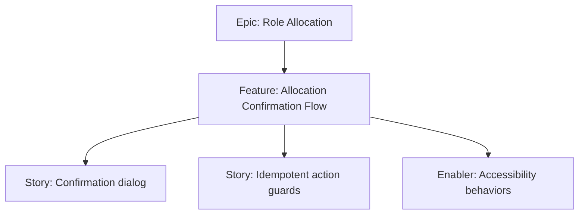

# Project Plan — Allocation Confirmation Flow

## 1. Project Overview
- Feature Summary: Add a confirmation step before shuffling roles, showing players and mafia parameters; block until user confirms.
- Success Criteria: Clicking "Allocate Roles" opens confirm; confirm proceeds; cancel aborts; idempotent against double-tap.
- Milestones: Confirmation UI → Wiring to allocation → Guards.
- Risks: Users skipping reading; ensure focus/keyboard accessibility.

## 2. Work Item Hierarchy

## 3. Issues Breakdown
- Feature: Allocation Confirmation Flow
- Acceptance: Confirm required; cancel safe; no double-exec
- DoD: Docs updated; a11y notes

## 4. Priority/Value
| Priority | Value |
|---|---|
| P1 | High |

## 5. Estimation
- Size: S (2-3 pts)

## 6. Dependencies
- Input & Validation features

## 7. Sprint Planning
- Goal: Reliable confirmation gate

## 8. Project Board
- Component: frontend, dialogs

## 9. Automation
- N/A
