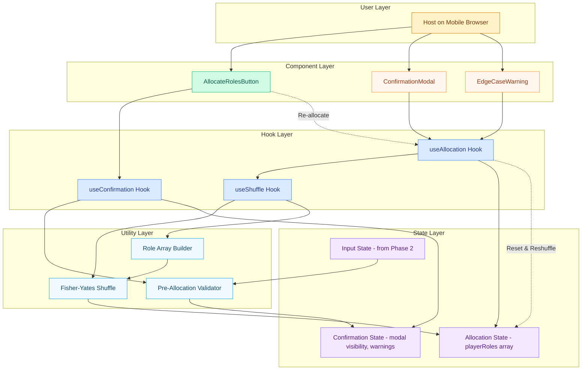

# Epic Architecture Specification: Role Allocation

## 1. Epic Architecture Overview

This epic implements the confirmation-gated role allocation system with unbiased randomization using Fisher-Yates shuffle. The architecture centers on a confirmation modal flow that validates input state, presents clear prompts (including edge case warnings), and executes deterministic role assignment with uniform random distribution. The system supports re-allocation with full state reset and maintains allocation results in memory for the reveal phase.

Key properties:
- Modal-based confirmation workflow with edge case handling
- Fisher-Yates shuffle implementation for unbiased randomization
- Allocation state management separate from input state
- Re-allocation capability with complete state reset
- Performance-optimized shuffle for mobile devices (target <200ms)
- No persistence; allocation lives in React state for session duration

## 2. System Architecture Diagram

Notes:
- Confirmation modal handles both standard and edge case flows
- Fisher-Yates ensures uniform random distribution
- Re-allocation completely resets and reshuffles previous assignments
- All state management occurs client-side with React hooks

## 3. High-Level Features & Technical Enablers

### Features
- **Confirmation Modal**: Pre-allocation confirmation with clear role count display
- **Edge Case Warnings**: Special prompts for mafia=0 or mafia=players scenarios
- **Unbiased Role Assignment**: Fisher-Yates shuffle ensuring fair randomization
- **Re-allocation Support**: Complete state reset and reshuffle on repeat allocation
- **Performance Optimization**: Sub-200ms allocation for up to 20 players on mobile
- **State Transition**: Clean handoff from input validation to allocation results

### Technical Enablers
- **useAllocation Hook**: Central allocation logic with confirmation workflow
- **useConfirmation Hook**: Modal state management and edge case detection
- **useShuffle Hook**: Fisher-Yates implementation with performance optimization
- **Fisher-Yates Utility**: Unbiased shuffle algorithm with mobile performance tuning
- **Role Array Builder**: Constructs [true, false, false...] array from mafia count
- **Pre-Allocation Validator**: Final validation before confirmation modal display
- **Modal Components**: Accessible confirmation dialogs with clear messaging

## 4. Technology Stack
- React 18 (useState, useCallback for performance optimization)
- Tailwind CSS v3.4.17 (modal styling, button states, mobile-first design)
- JavaScript (Fisher-Yates implementation, no external randomization libraries)
- HTML5 dialog element or div-based modal with focus management
- Mobile browser performance APIs for timing validation

## 5. Technical Value
**Value: High**
- Implements the core game mechanic with trustworthy randomization
- Establishes reusable confirmation patterns for other features
- Creates performance-optimized shuffle utility for potential future use
- Ensures data integrity transition from input validation to role reveal

## 6. T-Shirt Size Estimate
**Size: M (≈ 1 day)**
- Fisher-Yates implementation requires careful testing for correctness
- Confirmation modal with edge cases adds UI complexity
- Performance optimization and mobile testing add development time
- State management coordination between input and allocation phases

## Context Template
- **Epic PRD**: `docs/ways-of-work/plan/role-allocation/epic.md`