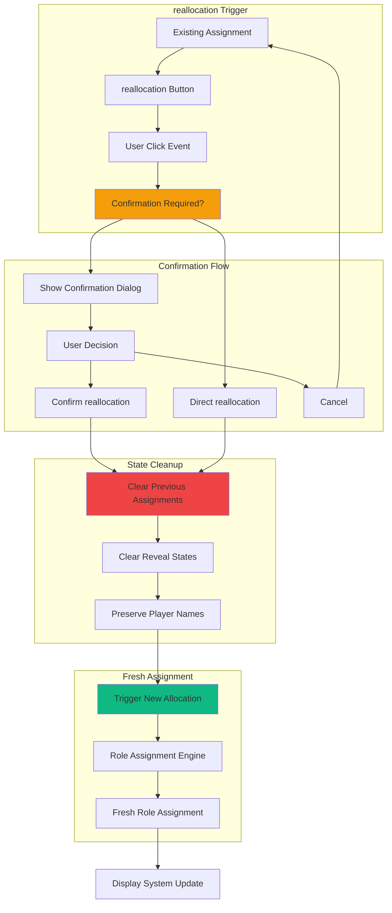

# Feature Implementation Plan: Reallocation System

## Goal

Implement seamless reallocation system that allows users to generate new role assignments while maintaining player names and game setup. This includes reallocation triggers, confirmation for existing assignments, state cleanup, and integration with allocation and display systems.

## Requirements

### Core Reallocation Requirements
- Reallocation button accessible after initial allocation
- Confirmation dialog for reallocation when assignments exist
- Complete state cleanup: clear all previous assignments and reveal states
- Fresh randomization: no preservation of previous role assignments
- Player name preservation: maintain all entered names
- Form state restoration: return to input validation if needed
- Integration with allocation confirmation flow
- Mobile-optimized interaction patterns

### User Experience Requirements
- Clear differentiation between initial allocation and reallocation
- Confirmation prevents accidental loss of current assignments
- Fast re-assignment (< 200ms from confirmation to new roles)
- Visual feedback during reallocation process
- Preservation of game configuration (player count, mafia count)
- Accessible controls and clear labeling

## Technical Considerations

### System Architecture Overview



### Frontend Architecture

#### reallocation Component

```jsx
// components/ReallocationSystem.jsx
import React, { useState, useCallback, useEffect } from 'react';
import PropTypes from 'prop-types';
import { createPortal } from 'react-dom';

const ReallocationSystem = ({
  hasExistingAssignment,
  playerNames,
  mafiaCount,
  currentAssignment,
  onReallocation,
  disabled = false
}) => {
  const [showConfirmation, setShowConfirmation] = useState(false);
  const [isProcessing, setIsProcessing] = useState(false);

  // Handle reallocation button click
  const handleReallocateClick = useCallback(() => {
    if (disabled || isProcessing) return;
    
    if (hasExistingAssignment) {
      setShowConfirmation(true);
    } else {
      performReallocation();
    }
  }, [hasExistingAssignment, disabled, isProcessing]);

  // Perform the actual reallocation
  const performReallocation = useCallback(async () => {
    setIsProcessing(true);
    try {
      await onReallocation({
        playerNames,
        mafiaCount,
        preserveNames: true,
        clearPreviousState: true
      });
      setShowConfirmation(false);
    } catch (error) {
      console.error('reallocation failed:', error);
      // Error handling managed by parent component
    } finally {
      setIsProcessing(false);
    }
  }, [onReallocation, playerNames, mafiaCount]);

  // Handle confirmation
  const handleConfirm = useCallback(() => {
    performReallocation();
  }, [performReallocation]);

  // Handle cancellation
  const handleCancel = useCallback(() => {
    setShowConfirmation(false);
  }, []);

  // Handle escape key
  useEffect(() => {
    const handleEscape = (e) => {
      if (e.key === 'Escape' && showConfirmation) {
        handleCancel();
      }
    };

    if (showConfirmation) {
      document.addEventListener('keydown', handleEscape);
      return () => document.removeEventListener('keydown', handleEscape);
    }
  }, [showConfirmation, handleCancel]);

  // Don't render if no existing assignment and this is meant for reallocation
  if (!hasExistingAssignment && currentAssignment === null) {
    return null;
  }

  return (
    <>
      {/* Re-allocate Button */}
      <button
        type="button"
        onClick={handleReallocateClick}
        disabled={disabled || isProcessing}
        className={`
          w-full h-12 px-6 text-base font-medium rounded-lg
          touch-manipulation transition-all duration-200
          focus:outline-none focus:ring-4
          ${
            !disabled && !isProcessing
              ? `bg-orange-600 hover:bg-orange-700 active:bg-orange-800 
                 text-white focus:ring-orange-200 
                 shadow-md hover:shadow-lg`
              : `bg-gray-300 text-gray-500 cursor-not-allowed 
                 focus:ring-gray-200`
          }
        `}
      >
        {isProcessing ? (
          <div className="flex items-center justify-center">
            <svg className="animate-spin h-4 w-4 mr-2" viewBox="0 0 24 24">
              <circle
                className="opacity-25"
                cx="12"
                cy="12"
                r="10"
                stroke="currentColor"
                strokeWidth="4"
                fill="none"
              />
              <path
                className="opacity-75"
                fill="currentColor"
                d="M4 12a8 8 0 018-8V0C5.373 0 0 5.373 0 12h4zm2 5.291A7.962 7.962 0 014 12H0c0 3.042 1.135 5.824 3 7.938l3-2.647z"
              />
            </svg>
            Re-allocating...
          </div>
        ) : (
          'Re-allocate Roles'
        )}
      </button>

      {/* Confirmation Dialog */}
      {showConfirmation && createPortal(
        <div
          className="fixed inset-0 bg-black bg-opacity-50 flex items-center justify-center p-4 z-50"
          onClick={(e) => {
            if (e.target === e.currentTarget) handleCancel();
          }}
        >
          <div
            className="
              bg-white rounded-xl p-6 max-w-md w-full
              shadow-2xl transform transition-all
              max-h-[90vh] overflow-y-auto
            "
            onClick={(e) => e.stopPropagation()}
          >
            {/* Dialog Header */}
            <div className="text-center mb-6">
              <div className="mx-auto w-12 h-12 bg-orange-100 rounded-full flex items-center justify-center mb-4">
                <svg className="w-6 h-6 text-orange-600" fill="none" stroke="currentColor" viewBox="0 0 24 24">
                  <path
                    strokeLinecap="round"
                    strokeLinejoin="round"
                    strokeWidth={2}
                    d="M4 4v5h.582m15.356 2A8.001 8.001 0 004.582 9m0 0H9m11 11v-5h-.581m0 0a8.003 8.003 0 01-15.357-2m15.357 2H15"
                  />
                </svg>
              </div>
              <h3 className="text-xl font-bold text-gray-900 mb-2">
                Re-allocate Roles?
              </h3>
              <p className="text-gray-600">
                This will create new role assignments for all players.
              </p>
            </div>

            {/* Warning Information */}
            <div className="bg-orange-50 border border-orange-200 rounded-lg p-4 mb-6">
              <div className="flex items-start">
                <svg className="w-5 h-5 text-orange-500 mr-3 mt-0.5 flex-shrink-0" fill="currentColor" viewBox="0 0 20 20">
                  <path
                    fillRule="evenodd"
                    d="M8.257 3.099c.765-1.36 2.722-1.36 3.486 0l5.58 9.92c.75 1.334-.213 2.98-1.742 2.98H4.42c-1.53 0-2.493-1.646-1.743-2.98l5.58-9.92zM11 13a1 1 0 11-2 0 1 1 0 012 0zm-1-8a1 1 0 00-1 1v3a1 1 0 002 0V6a1 1 0 00-1-1z"
                    clipRule="evenodd"
                  />
                </svg>
                <div>
                  <h4 className="text-sm font-medium text-orange-800 mb-1">
                    Current assignments will be lost
                  </h4>
                  <ul className="text-sm text-orange-700 space-y-1">
                    <li>• All current role assignments will be cleared</li>
                    <li>• Any revealed roles will be reset</li>
                    <li>• Player names and game settings will be kept</li>
                    <li>• New random roles will be generated</li>
                  </ul>
                </div>
              </div>
            </div>

            {/* Current Assignment Summary */}
            {currentAssignment && (
              <div className="bg-gray-50 rounded-lg p-4 mb-6">
                <h4 className="text-sm font-medium text-gray-700 mb-2">Current Game:</h4>
                <div className="grid grid-cols-2 gap-4 text-sm">
                  <div>
                    <span className="text-gray-600">Players:</span>
                    <span className="font-semibold ml-2">{playerNames.length}</span>
                  </div>
                  <div>
                    <span className="text-gray-600">Mafia:</span>
                    <span className="font-semibold ml-2">{mafiaCount}</span>
                  </div>
                </div>
                {currentAssignment.statistics && (
                  <div className="mt-2 text-xs text-gray-500">
                    Revealed: {currentAssignment.players.filter(p => p.revealed).length} of {currentAssignment.players.length}
                  </div>
                )}
              </div>
            )}

            {/* Action Buttons */}
            <div className="flex gap-3">
              <button
                type="button"
                onClick={handleCancel}
                disabled={isProcessing}
                className="
                  flex-1 h-12 px-4 text-gray-700 bg-gray-200
                  hover:bg-gray-300 active:bg-gray-400
                  rounded-lg font-medium transition-colors
                  focus:outline-none focus:ring-4 focus:ring-gray-200
                  touch-manipulation
                  disabled:opacity-50 disabled:cursor-not-allowed
                "
              >
                Keep Current
              </button>
              <button
                type="button"
                onClick={handleConfirm}
                disabled={isProcessing}
                className="
                  flex-1 h-12 px-4 text-white bg-orange-600
                  hover:bg-orange-700 active:bg-orange-800
                  rounded-lg font-medium transition-colors
                  focus:outline-none focus:ring-4 focus:ring-orange-200
                  touch-manipulation
                  disabled:opacity-50 disabled:cursor-not-allowed
                "
              >
                {isProcessing ? 'Re-allocating...' : 'Re-allocate'}
              </button>
            </div>
          </div>
        </div>,
        document.body
      )}
    </>
  );
};

ReallocationSystem.propTypes = {
  hasExistingAssignment: PropTypes.bool.isRequired,
  playerNames: PropTypes.arrayOf(PropTypes.string).isRequired,
  mafiaCount: PropTypes.number.isRequired,
  currentAssignment: PropTypes.object,
  onReallocation: PropTypes.func.isRequired,
  disabled: PropTypes.bool,
};

export default ReallocationSystem;
```

#### reallocation Hook

```jsx
// hooks/useReallocation.js
import { useCallback } from 'react';

export const useReallocation = ({
  performAssignment,
  clearAssignment,
  clearRevealStates = () => {},
  preserveFormData = () => {}
}) => {
  // Perform complete reallocation
  const performReallocation = useCallback(async ({
    playerNames,
    mafiaCount,
    preserveNames = true,
    clearPreviousState = true
  }) => {
    try {
      // Step 1: Clear previous state if requested
      if (clearPreviousState) {
        clearAssignment();
        clearRevealStates();
      }

      // Step 2: Preserve form data if requested
      if (preserveNames) {
        preserveFormData({ playerNames, mafiaCount });
      }

      // Step 3: Create new assignment
      const newAssignment = await performAssignment(playerNames, mafiaCount);
      
      return {
        success: true,
        assignment: newAssignment,
        message: 'Roles re-allocated successfully'
      };
      
    } catch (error) {
      console.error('reallocation failed:', error);
      return {
        success: false,
        assignment: null,
        message: error.message || 'reallocation failed'
      };
    }
  }, [performAssignment, clearAssignment, clearRevealStates, preserveFormData]);

  // Quick reallocation (no confirmation)
  const quickReallocation = useCallback(async (playerNames, mafiaCount) => {
    return performReallocation({
      playerNames,
      mafiaCount,
      preserveNames: true,
      clearPreviousState: true
    });
  }, [performReallocation]);

  return {
    performReallocation,
    quickReallocation
  };
};
```

### Performance Optimization

- **Fast State Cleanup:** Efficient clearing of assignment and reveal states
- **Preserved Form Data:** Minimal re-rendering by preserving player names
- **Optimistic Updates:** Immediate UI feedback during reallocation
- **Memory Management:** Proper cleanup of previous assignments

### Implementation Steps

1. **reallocation Trigger**
   - Create reallocation button with proper state management
   - Add confirmation dialog for existing assignments
   - Implement accessibility and mobile optimization

2. **State Management**
   - Implement complete state cleanup functionality
   - Add player name preservation logic
   - Connect with assignment and reveal systems

3. **Integration Points**
   - Connect with role assignment engine
   - Integrate with display and reveal systems
   - Add error handling and recovery

4. **Testing and Polish**
   - Test reallocation with various game states
   - Verify state cleanup completeness
   - Test performance with maximum player counts

## Context Template

- **Feature PRD:** reallocation System enables fresh role assignments while preserving game configuration
- **Epic Integration:** Completes Role Allocation epic with assignment refresh capability
- **Dependencies:** Uses Role Assignment Engine for fresh assignments
- **Dependents:** Integrates with Role Display & Reveal epic for state management