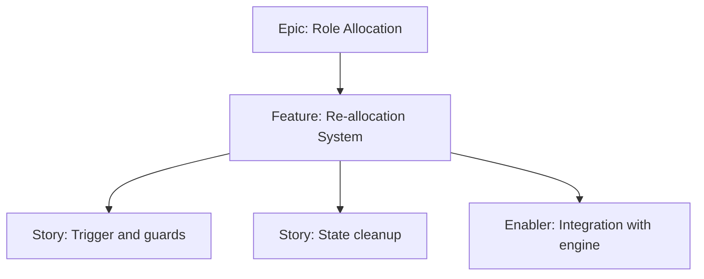

# Project Plan — Re-allocation System

## 1. Project Overview
- Feature Summary: Allow users to reshuffle all roles on demand, clearing previous allocations and re-running assignment engine.
- Success Criteria: Clicking re-allocate reshuffles; previous allocation not preserved; idempotent on double-tap; UX confirmation optional.
- Milestones: Trigger → Clear state → Re-run engine → Update UI.
- Risks: Partial state leftover causing inconsistencies.

## 2. Work Item Hierarchy

## 3. Issues Breakdown
- Feature: Re-allocation System
- Acceptance: Reshuffle works; no stale state
- DoD: Docs updated; guards documented

## 4. Priority/Value
| Priority | Value |
|---|---|
| P2 | Medium |

## 5. Estimation
- Size: S (2 pts)

## 6. Dependencies
- Role Assignment Engine

## 7. Sprint Planning
- Goal: Clean re-allocation behavior

## 8. Project Board
- Component: state

## 9. Automation
- N/A
