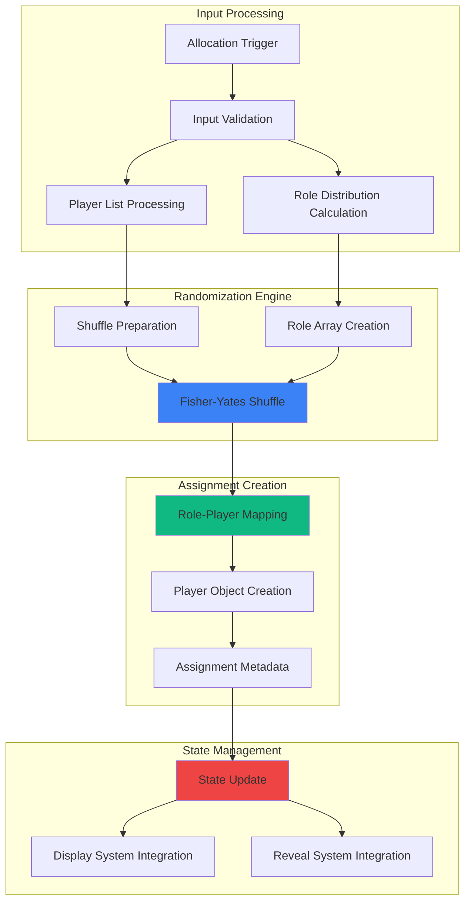

# Feature Implementation Plan: Role Assignment Engine

## Goal

Implement cryptographically fair role assignment system using Fisher-Yates shuffle algorithm to ensure unbiased distribution of Mafia and Villager roles across all players. This includes proper randomization, role object creation, and seamless integration with confirmation and display systems.

## Requirements

### Core Assignment Requirements
- Fisher-Yates shuffle implementation for unbiased randomization
- Exact allocation: assign exactly `mafiaCount` Mafia roles, remainder as Villagers
- Player-role object mapping with persistent identifiers
- Cryptographically sound randomness where available (crypto.getRandomValues)
- Immediate assignment completion (< 50ms for typical game sizes)
- Idempotent operation support for re-allocation scenarios
- Role persistence throughout reveal sequence

### Data Structure Requirements
- Player objects with name, index, and role assignment
- Role enumeration (MAFIA, VILLAGER) with clear differentiation
- Assignment metadata (timestamp, player count, mafia count)
- Integration-ready data format for display and reveal systems

## Technical Considerations

### System Architecture Overview



### Frontend Architecture

#### Role Assignment Engine

```jsx
// utils/roleAssignmentEngine.js

/**
 * Role enumeration
 */
export const ROLES = {
  MAFIA: 'MAFIA',
  VILLAGER: 'VILLAGER'
};

/**
 * Cryptographically secure random number generator
 * Falls back to Math.random() if crypto is unavailable
 */
const getSecureRandom = () => {
  if (typeof window !== 'undefined' && window.crypto && window.crypto.getRandomValues) {
    const array = new Uint32Array(1);
    window.crypto.getRandomValues(array);
    return array[0] / (0xffffffff + 1);
  }
  return Math.random();
};

/**
 * Fisher-Yates shuffle implementation with cryptographically secure randomness
 * @param {Array} array - Array to shuffle (will be modified in place)
 * @returns {Array} - The shuffled array (same reference)
 */
const fisherYatesShuffle = (array) => {
  for (let i = array.length - 1; i > 0; i--) {
    const j = Math.floor(getSecureRandom() * (i + 1));
    [array[i], array[j]] = [array[j], array[i]];
  }
  return array;
};

/**
 * Create role assignment for players
 * @param {string[]} playerNames - Array of player names
 * @param {number} mafiaCount - Number of Mafia players to assign
 * @returns {Object} Assignment result with players, metadata, and statistics
 */
export const assignRoles = (playerNames, mafiaCount) => {
  // Input validation
  if (!Array.isArray(playerNames)) {
    throw new Error('Player names must be an array');
  }
  
  if (playerNames.length === 0) {
    throw new Error('Player names array cannot be empty');
  }
  
  if (typeof mafiaCount !== 'number' || mafiaCount < 0) {
    throw new Error('Mafia count must be a non-negative number');
  }
  
  if (mafiaCount > playerNames.length) {
    throw new Error('Mafia count cannot exceed total player count');
  }

  // Validate player names
  const validNames = playerNames.filter(name => 
    typeof name === 'string' && name.trim().length > 0
  );
  
  if (validNames.length !== playerNames.length) {
    throw new Error('All player names must be non-empty strings');
  }

  const totalPlayers = playerNames.length;
  const villagerCount = totalPlayers - mafiaCount;
  
  // Create role array: true for Mafia, false for Villager
  const roles = Array(totalPlayers).fill(false);
  for (let i = 0; i < mafiaCount; i++) {
    roles[i] = true;
  }
  
  // Shuffle roles using Fisher-Yates
  fisherYatesShuffle(roles);
  
  // Create player objects with assigned roles
  const players = playerNames.map((name, index) => ({
    id: index,
    name: name.trim(),
    role: roles[index] ? ROLES.MAFIA : ROLES.VILLAGER,
    index,
    revealed: false
  }));
  
  // Create assignment metadata
  const assignment = {
    players,
    metadata: {
      timestamp: new Date().toISOString(),
      totalPlayers,
      mafiaCount,
      villagerCount,
      assignmentId: generateAssignmentId()
    },
    statistics: {
      mafiaPlayers: players.filter(p => p.role === ROLES.MAFIA),
      villagerPlayers: players.filter(p => p.role === ROLES.VILLAGER),
      mafiaNames: players.filter(p => p.role === ROLES.MAFIA).map(p => p.name),
      villagerNames: players.filter(p => p.role === ROLES.VILLAGER).map(p => p.name)
    }
  };
  
  return assignment;
};

/**
 * Generate unique assignment ID
 * @returns {string} Unique identifier for this assignment
 */
const generateAssignmentId = () => {
  const timestamp = Date.now();
  const random = Math.floor(getSecureRandom() * 1000000);
  return `assign_${timestamp}_${random}`;
};

/**
 * Validate assignment integrity
 * @param {Object} assignment - Assignment object to validate
 * @returns {Object} Validation result with success flag and details
 */
export const validateAssignment = (assignment) => {
  try {
    const { players, metadata } = assignment;
    
    if (!Array.isArray(players) || !metadata) {
      throw new Error('Invalid assignment structure');
    }
    
    const mafiaCount = players.filter(p => p.role === ROLES.MAFIA).length;
    const villagerCount = players.filter(p => p.role === ROLES.VILLAGER).length;
    const totalCount = players.length;
    
    if (mafiaCount + villagerCount !== totalCount) {
      throw new Error('Role count mismatch');
    }
    
    if (mafiaCount !== metadata.mafiaCount) {
      throw new Error('Metadata mismatch: Mafia count');
    }
    
    if (totalCount !== metadata.totalPlayers) {
      throw new Error('Metadata mismatch: Total players');
    }
    
    // Validate player structure
    const invalidPlayers = players.filter(player => 
      !player.hasOwnProperty('id') ||
      !player.hasOwnProperty('name') ||
      !player.hasOwnProperty('role') ||
      !player.hasOwnProperty('index') ||
      !player.hasOwnProperty('revealed') ||
      ![ROLES.MAFIA, ROLES.VILLAGER].includes(player.role)
    );
    
    if (invalidPlayers.length > 0) {
      throw new Error('Invalid player object structure');
    }
    
    return {
      valid: true,
      message: 'Assignment is valid',
      details: {
        totalPlayers: totalCount,
        mafiaCount,
        villagerCount
      }
    };
    
  } catch (error) {
    return {
      valid: false,
      message: error.message,
      details: null
    };
  }
};

/**
 * Create a fresh assignment with the same players but new role distribution
 * @param {string[]} playerNames - Array of player names
 * @param {number} mafiaCount - Number of Mafia players to assign
 * @returns {Object} New assignment result
 */
export const createNewAssignment = (playerNames, mafiaCount) => {
  return assignRoles(playerNames, mafiaCount);
};

/**
 * Get assignment summary for display purposes
 * @param {Object} assignment - Assignment object
 * @returns {Object} Summary information for UI display
 */
export const getAssignmentSummary = (assignment) => {
  if (!assignment || !assignment.players) {
    return null;
  }
  
  const { players, metadata } = assignment;
  
  return {
    totalPlayers: players.length,
    mafiaCount: players.filter(p => p.role === ROLES.MAFIA).length,
    villagerCount: players.filter(p => p.role === ROLES.VILLAGER).length,
    assignmentTime: metadata.timestamp,
    assignmentId: metadata.assignmentId,
    playerList: players.map(p => ({
      name: p.name,
      role: p.role,
      revealed: p.revealed
    }))
  };
};
```

#### Assignment Hook

```jsx
// hooks/useRoleAssignment.js
import { useState, useCallback, useMemo } from 'react';
import { assignRoles, validateAssignment, createNewAssignment, ROLES } from '../utils/roleAssignmentEngine';

export const useRoleAssignment = () => {
  const [currentAssignment, setCurrentAssignment] = useState(null);
  const [isAssigning, setIsAssigning] = useState(false);
  const [assignmentError, setAssignmentError] = useState(null);

  // Create new role assignment
  const performAssignment = useCallback(async (playerNames, mafiaCount) => {
    setIsAssigning(true);
    setAssignmentError(null);
    
    try {
      // Simulate brief delay for visual feedback (remove in production if not needed)
      await new Promise(resolve => setTimeout(resolve, 100));
      
      const assignment = assignRoles(playerNames, mafiaCount);
      
      // Validate the assignment
      const validation = validateAssignment(assignment);
      if (!validation.valid) {
        throw new Error(`Assignment validation failed: ${validation.message}`);
      }
      
      setCurrentAssignment(assignment);
      return assignment;
      
    } catch (error) {
      console.error('Role assignment failed:', error);
      setAssignmentError(error.message);
      throw error;
    } finally {
      setIsAssigning(false);
    }
  }, []);

  // Create new assignment (re-allocation)
  const performReallocation = useCallback(async (playerNames, mafiaCount) => {
    return performAssignment(playerNames, mafiaCount);
  }, [performAssignment]);

  // Clear current assignment
  const clearAssignment = useCallback(() => {
    setCurrentAssignment(null);
    setAssignmentError(null);
  }, []);

  // Mark player as revealed
  const markPlayerRevealed = useCallback((playerId) => {
    setCurrentAssignment(prev => {
      if (!prev) return prev;
      
      return {
        ...prev,
        players: prev.players.map(player =>
          player.id === playerId
            ? { ...player, revealed: true }
            : player
        )
      };
    });
  }, []);

  // Assignment statistics
  const assignmentStats = useMemo(() => {
    if (!currentAssignment) return null;
    
    const { players } = currentAssignment;
    return {
      totalPlayers: players.length,
      mafiaCount: players.filter(p => p.role === ROLES.MAFIA).length,
      villagerCount: players.filter(p => p.role === ROLES.VILLAGER).length,
      revealedCount: players.filter(p => p.revealed).length,
      remainingCount: players.filter(p => !p.revealed).length
    };
  }, [currentAssignment]);

  // Has assignment
  const hasAssignment = useMemo(() => currentAssignment !== null, [currentAssignment]);

  return {
    // State
    currentAssignment,
    isAssigning,
    assignmentError,
    hasAssignment,
    assignmentStats,
    
    // Actions
    performAssignment,
    performReallocation,
    clearAssignment,
    markPlayerRevealed
  };
};
```

### Performance Optimization

- **Efficient Shuffling:** Single-pass Fisher-Yates with O(n) complexity
- **Secure Randomness:** crypto.getRandomValues when available, Math.random() fallback
- **Minimal Memory:** In-place array operations, efficient object creation
- **Fast Assignment:** < 50ms completion time for typical game sizes
- **Validation Caching:** Memoized validation results

### Implementation Steps

1. **Core Algorithm Implementation**
   - Create Fisher-Yates shuffle with secure randomness
   - Implement role assignment logic with exact counting
   - Add comprehensive input validation and error handling

2. **Data Structure Creation**
   - Design player objects with required properties
   - Create assignment metadata and statistics
   - Implement validation and integrity checks

3. **React Integration**
   - Create useRoleAssignment hook for state management
   - Add assignment triggers and re-allocation support
   - Implement error handling and loading states

4. **Testing and Validation**
   - Test randomness distribution with statistical analysis
   - Verify exact role counting across different scenarios
   - Test performance with maximum player counts

## Context Template

- **Feature PRD:** Role Assignment Engine provides cryptographically fair role distribution using Fisher-Yates shuffle
- **Epic Integration:** Core component of Role Allocation epic, processes confirmation triggers
- **Dependencies:** Triggered by Allocation Confirmation Flow with validated parameters
- **Dependents:** Provides role data for Card List Interface and Role Reveal Dialog in display epic