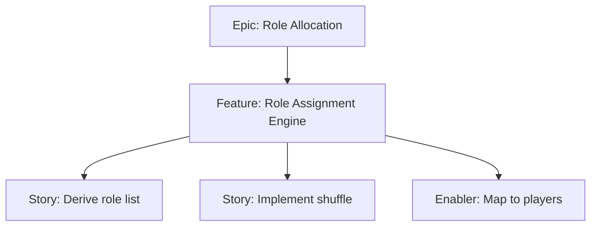

# Project Plan — Role Assignment Engine

## 1. Project Overview
- Feature Summary: Implement Fisher–Yates shuffle of derived roles list (mafiaCount true flags + villagers) and map roles to players.
- Success Criteria: Exactly mafiaCount are Mafia; unbiased shuffle; re-run reshuffles; performance acceptable.
- Milestones: Derive roles → Shuffle → Map to players → Verify counts.
- Risks: Biased shuffle; off-by-one errors at bounds.

## 2. Work Item Hierarchy

## 3. Issues Breakdown
- Feature: Role Assignment Engine
- Acceptance: Counts correct; unbiased shuffle; repeatable reshuffle
- DoD: Docs updated; tests for edge sizes

## 4. Priority/Value
| Priority | Value |
|---|---|
| P1 | High |

## 5. Estimation
- Size: M (3-5 pts)

## 6. Dependencies
- Input validation done

## 7. Sprint Planning
- Goal: Correct and performant assignment

## 8. Project Board
- Component: logic

## 9. Automation
- N/A
