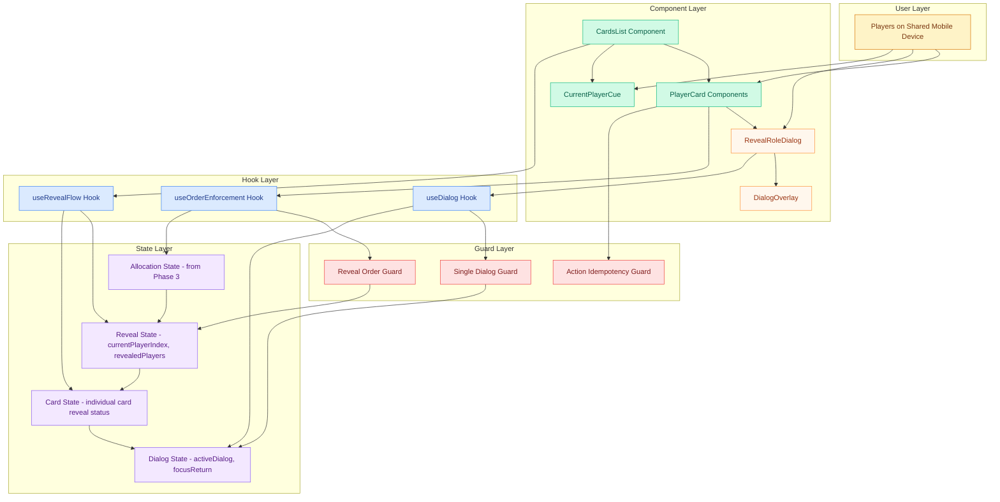

# Epic Architecture Specification: Role Display & Reveal

## 1. Epic Architecture Overview

This epic implements a strict sequential role reveal system on a single shared mobile device. The architecture centers on dialog state management, order enforcement, and accessibility patterns to ensure only one player can view their role at a time while maintaining clear progression through the player list. The system uses controlled dialog components with focus management and persistent role visibility after reveal.

Key properties:
- Single active dialog enforcement with automatic closure of competing dialogs
- Strict order validation preventing out-of-sequence reveals
- Persistent current player cue and role visibility state management
- Mobile-optimized dialog with focus trap and accessibility features
- Performance-optimized reveal transitions targeting <200ms interaction latency
- Clean state transitions between reveal phases and potential reset flows

## 2. System Architecture Diagram

Notes:
- Single dialog enforcement ensures no information leaks between players
- Order guards prevent out-of-sequence reveals maintaining game integrity
- All state management occurs client-side with React hooks and guards

## 3. High-Level Features & Technical Enablers

### Features
- **Sequential Card List**: Vertical scrolling list of player cards with reveal status indicators
- **Current Player Cue**: Persistent top-of-screen indicator showing whose turn it is to reveal
- **Single Dialog Enforcement**: Only one reveal dialog can be active at any time
- **Reveal/Close Flow**: Button transitions from "Reveal Role" to "Close" with persistent role display
- **Order Enforcement**: Strict sequential reveal preventing out-of-turn access
- **Accessibility Support**: Focus management, screen reader support, and keyboard navigation

### Technical Enablers
- **useRevealFlow Hook**: Central state management for reveal progression and player order
- **useDialog Hook**: Modal state management with focus trap and return focus handling
- **useOrderEnforcement Hook**: Validation logic preventing out-of-sequence reveals
- **Order Guard System**: Real-time validation of reveal eligibility by player index
- **Dialog Guard System**: Automatic closure of competing dialogs and state cleanup
- **Idempotency Guards**: Debouncing and state guards preventing duplicate actions
- **Accessibility Components**: ARIA-compliant dialog with proper focus management

## 4. Technology Stack
- React 18 (useState, useRef for focus management, custom hooks)
- Tailwind CSS v3.4.17 (dialog styling, card differentiation, mobile-first design)
- JavaScript (no TypeScript, focus management APIs, dialog accessibility patterns)
- HTML5 dialog element or div-based modal with proper ARIA attributes
- Mobile browser APIs (focus, viewport, touch event handling)

## 5. Technical Value
**Value: High**
- Implements the core game experience with strict integrity controls
- Establishes reusable dialog and order enforcement patterns
- Creates accessibility foundation that scales to other modal interactions
- Ensures reliable state transitions between allocation and potential reset phases

## 6. T-Shirt Size Estimate
**Size: L (≈ 2 days)**
- Dialog accessibility and focus management add complexity
- Order enforcement logic requires careful state coordination
- Mobile dialog UX needs extensive device testing
- Integration with allocation state and reset flows requires thorough validation

## Context Template
- **Epic PRD**: `docs/ways-of-work/plan/role-display-and-reveal/epic.md`