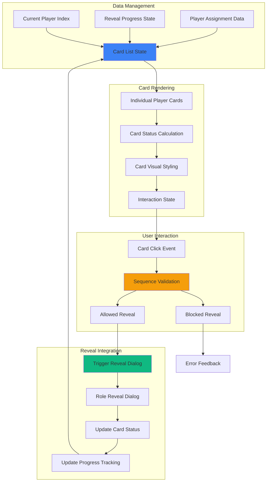

# Feature Implementation Plan: Card List Interface

## Goal

Implement vertical card list interface that displays all players as interactive cards, showing current reveal status and enabling ordered role revelation. This includes card design, status indicators, reveal tracking, and seamless integration with sequential reveal enforcement and role reveal dialog systems.

## Requirements

### Core Interface Requirements
- Vertical card layout optimized for mobile portrait orientation
- Individual player cards with names and reveal status indicators
- Clear visual differentiation between revealed and unrevealed cards
- Current player highlighting for sequential reveal enforcement
- Touch-friendly card interaction with proper spacing
- Role reveal triggers integrated with each card
- Real-time status updates during reveal sequence
- Accessibility support with proper labeling and navigation

### Visual Design Requirements
- Mobile-first responsive design with proper touch targets
- Consistent card styling with clear state indicators
- Current player prominence with visual highlighting
- Progress indicators showing reveal completion status
- Color-coded states (waiting, current, revealed, disabled)
- Clean typography and intuitive iconography

## Technical Considerations

### System Architecture Overview



### Frontend Architecture

#### Card List Component

```jsx
// components/CardListInterface.jsx
import React, { useMemo, useCallback } from 'react';
import PropTypes from 'prop-types';
import { ROLES } from '../utils/roleAssignmentEngine';

const CardListInterface = ({
  assignment,
  currentPlayerIndex,
  onPlayerReveal,
  revealInProgress = false
}) => {
  // Calculate card states and progress
  const cardStates = useMemo(() => {
    if (!assignment || !assignment.players) return [];
    
    return assignment.players.map((player, index) => {
      const isRevealed = player.revealed;
      const isCurrent = index === currentPlayerIndex;
      const isUpcoming = index > currentPlayerIndex;
      const isPast = index < currentPlayerIndex;
      const canReveal = isCurrent && !isRevealed && !revealInProgress;
      
      return {
        ...player,
        isRevealed,
        isCurrent,
        isUpcoming,
        isPast,
        canReveal,
        cardState: isRevealed ? 'revealed' : 
                  isCurrent ? 'current' :
                  isPast ? 'completed' : 'waiting'
      };
    });
  }, [assignment, currentPlayerIndex, revealInProgress]);

  // Progress calculations
  const progress = useMemo(() => {
    if (!cardStates.length) return { completed: 0, total: 0, percentage: 0 };
    
    const completed = cardStates.filter(card => card.isRevealed).length;
    const total = cardStates.length;
    const percentage = total > 0 ? (completed / total) * 100 : 0;
    
    return { completed, total, percentage };
  }, [cardStates]);

  // Handle card click
  const handleCardClick = useCallback((player, cardState) => {
    if (!cardState.canReveal) return;
    
    onPlayerReveal?.({
      playerId: player.id,
      playerName: player.name,
      playerIndex: player.index
    });
  }, [onPlayerReveal]);

  if (!assignment || !assignment.players || cardStates.length === 0) {
    return (
      <div className="text-center py-8 text-gray-500">
        <p>No player assignments to display</p>
      </div>
    );
  }

  return (
    <div className="space-y-6">
      {/* Header with Progress */}
      <div className="space-y-4">
        <div className="flex items-center justify-between">
          <h2 className="text-xl font-bold text-gray-900">
            Player Roles
          </h2>
          <div className="text-sm text-gray-600">
            {progress.completed} of {progress.total} revealed
          </div>
        </div>
        
        {/* Progress Bar */}
        <div className="w-full bg-gray-200 rounded-full h-2">
          <div 
            className="bg-green-600 h-2 rounded-full transition-all duration-500"
            style={{ width: `${progress.percentage}%` }}
          />
        </div>
        
        {/* Current Player Indicator */}
        {currentPlayerIndex < cardStates.length && (
          <div className="bg-blue-50 border border-blue-200 rounded-lg p-3">
            <div className="flex items-center">
              <div className="w-2 h-2 bg-blue-600 rounded-full mr-3 animate-pulse" />
              <span className="text-sm font-medium text-blue-800">
                {cardStates[currentPlayerIndex]?.isRevealed 
                  ? `Current: ${cardStates[currentPlayerIndex].name} (tap to see role)`
                  : `Next: ${cardStates[currentPlayerIndex].name} (tap to reveal role)`}
              </span>
            </div>
          </div>
        )}
      </div>

      {/* Player Cards */}
      <div className="space-y-3">
        {cardStates.map((cardState, index) => {
          const {
            id,
            name,
            role,
            canReveal,
            isRevealed,
            isCurrent,
            cardState: state
          } = cardState;

          return (
            <div
              key={id}
              onClick={() => handleCardClick(cardState, cardState)}
              className={`
                relative p-4 rounded-xl border-2 transition-all duration-200
                touch-manipulation cursor-pointer
                min-h-[72px] flex items-center
                ${
                  state === 'current' && canReveal
                    ? 'border-blue-500 bg-blue-50 shadow-lg hover:shadow-xl active:shadow-md'
                    : state === 'revealed'
                    ? role === ROLES.MAFIA
                      ? 'border-red-500 bg-red-50'
                      : 'border-green-500 bg-green-50'
                    : state === 'completed'
                    ? 'border-gray-300 bg-gray-50'
                    : 'border-gray-200 bg-white'
                }
                ${
                  canReveal 
                    ? 'hover:scale-[1.02] active:scale-[0.98]' 
                    : 'cursor-default'
                }
              `}
              role="button"
              tabIndex={canReveal ? 0 : -1}
              aria-label={
                isRevealed 
                  ? `${name}: ${role} (revealed)`
                  : isCurrent
                  ? `${name}: Tap to reveal role`
                  : `${name}: Waiting to reveal`
              }
              onKeyDown={(e) => {
                if ((e.key === 'Enter' || e.key === ' ') && canReveal) {
                  e.preventDefault();
                  handleCardClick(cardState, cardState);
                }
              }}
            >
              {/* Player Number */}
              <div className={`
                flex-shrink-0 w-8 h-8 rounded-full flex items-center justify-center
                text-sm font-bold mr-4
                ${
                  state === 'current' && canReveal
                    ? 'bg-blue-600 text-white'
                    : state === 'revealed'
                    ? role === ROLES.MAFIA
                      ? 'bg-red-600 text-white'
                      : 'bg-green-600 text-white'
                    : 'bg-gray-400 text-white'
                }
              `}>
                {index + 1}
              </div>

              {/* Player Info */}
              <div className="flex-1 min-w-0">
                <div className="flex items-center justify-between">
                  <h3 className={`
                    font-semibold truncate
                    ${
                      state === 'current' && canReveal
                        ? 'text-blue-900'
                        : state === 'revealed'
                        ? role === ROLES.MAFIA
                          ? 'text-red-900'
                          : 'text-green-900'
                        : 'text-gray-700'
                    }
                  `}>
                    {name}
                  </h3>
                  
                  {/* Role Badge (if revealed) */}
                  {isRevealed && (
                    <div className={`
                      px-3 py-1 rounded-full text-xs font-bold
                      ${
                        role === ROLES.MAFIA
                          ? 'bg-red-600 text-white'
                          : 'bg-green-600 text-white'
                      }
                    `}>
                      {role}
                    </div>
                  )}
                </div>
                
                {/* Status Text */}
                <p className={`
                  text-sm mt-1
                  ${
                    state === 'current' && canReveal
                      ? 'text-blue-700'
                      : state === 'revealed'
                      ? 'text-gray-600'
                      : 'text-gray-500'
                  }
                `}>
                  {isRevealed 
                    ? 'Role revealed'
                    : isCurrent
                    ? 'Tap to reveal role'
                    : 'Waiting to reveal'}
                </p>
              </div>

              {/* Status Icon */}
              <div className="flex-shrink-0 ml-3">
                {isRevealed ? (
                  <svg className={`w-6 h-6 ${
                    role === ROLES.MAFIA ? 'text-red-600' : 'text-green-600'
                  }`} fill="currentColor" viewBox="0 0 20 20">
                    <path
                      fillRule="evenodd"
                      d="M10 18a8 8 0 100-16 8 8 0 000 16zm3.707-9.293a1 1 0 00-1.414-1.414L9 10.586 7.707 9.293a1 1 0 00-1.414 1.414l2 2a1 1 0 001.414 0l4-4z"
                      clipRule="evenodd"
                    />
                  </svg>
                ) : canReveal ? (
                  <svg className="w-6 h-6 text-blue-600" fill="none" stroke="currentColor" viewBox="0 0 24 24">
                    <path
                      strokeLinecap="round"
                      strokeLinejoin="round"
                      strokeWidth={2}
                      d="M15 12a3 3 0 11-6 0 3 3 0 016 0z"
                    />
                    <path
                      strokeLinecap="round"
                      strokeLinejoin="round"
                      strokeWidth={2}
                      d="M2.458 12C3.732 7.943 7.523 5 12 5c4.478 0 8.268 2.943 9.542 7-1.274 4.057-5.064 7-9.542 7-4.477 0-8.268-2.943-9.542-7z"
                    />
                  </svg>
                ) : (
                  <svg className="w-6 h-6 text-gray-400" fill="currentColor" viewBox="0 0 20 20">
                    <path
                      fillRule="evenodd"
                      d="M10 18a8 8 0 100-16 8 8 0 000 16zM8.707 7.293a1 1 0 00-1.414 1.414L8.586 10l-1.293 1.293a1 1 0 101.414 1.414L10 11.414l1.293 1.293a1 1 0 001.414-1.414L11.414 10l1.293-1.293a1 1 0 00-1.414-1.414L10 8.586 8.707 7.293z"
                      clipRule="evenodd"
                    />
                  </svg>
                )}
              </div>

              {/* Current Player Pulse Effect */}
              {isCurrent && canReveal && (
                <div className="absolute inset-0 rounded-xl border-2 border-blue-400 animate-pulse" />
              )}
            </div>
          );
        })}
      </div>

      {/* Completion Status */}
      {progress.completed === progress.total && progress.total > 0 && (
        <div className="bg-green-50 border border-green-200 rounded-lg p-4">
          <div className="flex items-center">
            <svg className="w-6 h-6 text-green-600 mr-3" fill="currentColor" viewBox="0 0 20 20">
              <path
                fillRule="evenodd"
                d="M10 18a8 8 0 100-16 8 8 0 000 16zm3.707-9.293a1 1 0 00-1.414-1.414L9 10.586 7.707 9.293a1 1 0 00-1.414 1.414l2 2a1 1 0 001.414 0l4-4z"
                clipRule="evenodd"
              />
            </svg>
            <div>
              <h3 className="text-sm font-medium text-green-800">
                All roles revealed!
              </h3>
              <p className="text-sm text-green-600 mt-1">
                Game setup complete. Ready to start playing.
              </p>
            </div>
          </div>
        </div>
      )}
    </div>
  );
};

CardListInterface.propTypes = {
  assignment: PropTypes.object,
  currentPlayerIndex: PropTypes.number.isRequired,
  onPlayerReveal: PropTypes.func,
  revealInProgress: PropTypes.bool,
};

export default CardListInterface;
```

### Performance Optimization

- **Memoized Calculations:** Efficient card state and progress calculations
- **Minimal Re-renders:** Optimized prop dependencies and state management
- **Touch Performance:** Hardware-accelerated animations and transitions
- **List Virtualization:** Not needed for typical game sizes (< 20 players)
- **Efficient Updates:** Targeted updates for reveal status changes

### Implementation Steps

1. **Card Layout System**
   - Create responsive card grid with proper spacing
   - Implement touch-friendly interaction patterns
   - Add visual state management and transitions

2. **Status Management**
   - Implement reveal progress tracking
   - Add current player highlighting and indicators
   - Create completion status display

3. **Integration Points**
   - Connect with assignment data from Role Assignment Engine
   - Integrate with Role Reveal Dialog for reveal triggers
   - Add Sequential Order Enforcement validation

4. **Accessibility and Polish**
   - Add proper ARIA labels and keyboard navigation
   - Test with screen readers and mobile accessibility
   - Optimize animations and transitions

## Context Template

- **Feature PRD:** Card List Interface provides visual player management with reveal status tracking
- **Epic Integration:** Foundation of Role Display & Reveal epic, coordinates reveal sequence
- **Dependencies:** Uses assignment data from Role Allocation epic
- **Dependents:** Triggers Role Reveal Dialog and integrates with Sequential Order Enforcement