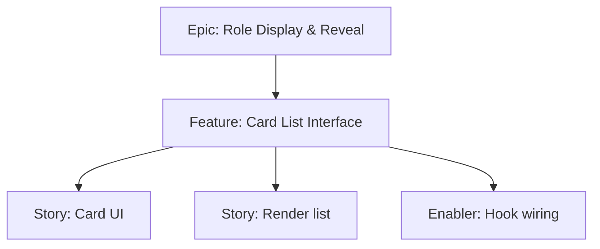

# Project Plan — Card List Interface

## 1. Project Overview
- Feature Summary: Display vertical list of player cards with names and reveal controls integrated with reveal flow. Mobile-optimized visuals.
- Success Criteria: List renders correctly; scrollable; integrates reveal dialog; performant on mobile.
- Milestones: Card component → List rendering → Hook integration.
- Risks: Long lists causing jank; accessibility focus order.

## 2. Work Item Hierarchy

## 3. Issues Breakdown
- Feature: Card List Interface
- Acceptance: Vertical list; smooth scroll; reveal integration
- DoD: Docs updated; a11y considerations

## 4. Priority/Value
| Priority | Value |
|---|---|
| P1 | High |

## 5. Estimation
- Size: M (3-5 pts)

## 6. Dependencies
- Reveal flow features

## 7. Sprint Planning
- Goal: Usable, smooth list view

## 8. Project Board
- Component: UI

## 9. Automation
- N/A
