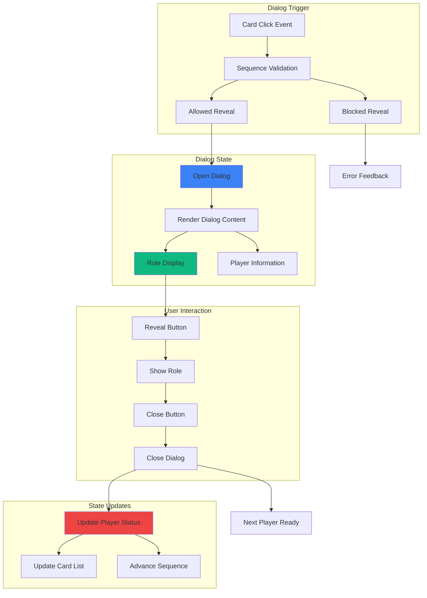

# Feature Implementation Plan: Role Reveal Dialog

## Goal

Implement focused role reveal dialog system that displays individual player roles with clear visual design, proper modal behavior, and seamless integration with card list interface and sequential reveal enforcement. This includes role-specific styling, accessibility compliance, and mobile-optimized interaction patterns.

## Requirements

### Core Dialog Requirements
- Modal dialog displaying player name and assigned role
- Role-specific visual styling (Mafia red, Villager green)
- Single dialog instance with proper z-index and overlay
- 'Reveal Role' button that changes to 'Close' after role display
- Role persistence: remains visible after initial reveal
- Escape key and overlay click dismissal support
- Focus trap and proper accessibility implementation
- Mobile-optimized sizing and touch interaction

### Visual Design Requirements
- Large, clear role display with appropriate iconography
- Consistent color coding: Red for Mafia, Green for Villagers
- Readable typography optimized for quick recognition
- Smooth reveal animations and transitions
- Professional card-like design with proper shadows
- Mobile-first responsive layout

## Technical Considerations

### System Architecture Overview



### Frontend Architecture

#### Role Reveal Dialog Component

```jsx
// components/RoleRevealDialog.jsx
import React, { useState, useEffect, useRef, useCallback } from 'react';
import PropTypes from 'prop-types';
import { createPortal } from 'react-dom';
import { ROLES } from '../utils/roleAssignmentEngine';

const RoleRevealDialog = ({
  isOpen,
  player,
  onClose,
  onRevealComplete
}) => {
  const [isRoleRevealed, setIsRoleRevealed] = useState(false);
  const [isClosing, setIsClosing] = useState(false);
  const dialogRef = useRef(null);
  const revealButtonRef = useRef(null);
  const closeButtonRef = useRef(null);

  // Reset reveal state when dialog opens with new player
  useEffect(() => {
    if (isOpen && player) {
      setIsRoleRevealed(player.revealed || false);
      setIsClosing(false);
    }
  }, [isOpen, player]);

  // Focus management
  useEffect(() => {
    if (isOpen) {
      const elementToFocus = isRoleRevealed ? closeButtonRef.current : revealButtonRef.current;
      if (elementToFocus) {
        elementToFocus.focus();
      }
    }
  }, [isOpen, isRoleRevealed]);

  // Escape key handler
  useEffect(() => {
    const handleEscape = (e) => {
      if (e.key === 'Escape' && isOpen) {
        handleClose();
      }
    };

    if (isOpen) {
      document.addEventListener('keydown', handleEscape);
      return () => document.removeEventListener('keydown', handleEscape);
    }
  }, [isOpen]);

  // Focus trap
  useEffect(() => {
    if (!isOpen) return;

    const focusableElements = dialogRef.current?.querySelectorAll(
      'button, [href], input, select, textarea, [tabindex]:not([tabindex="-1"])'
    );
    
    if (!focusableElements?.length) return;

    const firstElement = focusableElements[0];
    const lastElement = focusableElements[focusableElements.length - 1];

    const handleTabKey = (e) => {
      if (e.key !== 'Tab') return;

      if (e.shiftKey) {
        if (document.activeElement === firstElement) {
          e.preventDefault();
          lastElement.focus();
        }
      } else {
        if (document.activeElement === lastElement) {
          e.preventDefault();
          firstElement.focus();
        }
      }
    };

    document.addEventListener('keydown', handleTabKey);
    return () => document.removeEventListener('keydown', handleTabKey);
  }, [isOpen, isRoleRevealed]);

  // Handle reveal role
  const handleRevealRole = useCallback(() => {
    setIsRoleRevealed(true);
    onRevealComplete?.(player);
  }, [player, onRevealComplete]);

  // Handle dialog close
  const handleClose = useCallback(() => {
    setIsClosing(true);
    setTimeout(() => {
      onClose?.();
      setIsClosing(false);
    }, 150); // Match animation duration
  }, [onClose]);

  // Handle overlay click
  const handleOverlayClick = useCallback((e) => {
    if (e.target === e.currentTarget) {
      handleClose();
    }
  }, [handleClose]);

  if (!isOpen || !player) return null;

  const { name, role } = player;
  const isMafia = role === ROLES.MAFIA;

  return createPortal(
    <div
      className={`
        fixed inset-0 bg-black bg-opacity-50 flex items-center justify-center p-4 z-50
        transition-opacity duration-150
        ${isClosing ? 'opacity-0' : 'opacity-100'}
      `}
      onClick={handleOverlayClick}
      role="dialog"
      aria-modal="true"
      aria-labelledby="role-reveal-title"
      aria-describedby="role-reveal-description"
    >
      <div
        ref={dialogRef}
        className={`
          bg-white rounded-2xl p-6 max-w-sm w-full mx-4
          shadow-2xl transform transition-all duration-150
          ${isClosing ? 'scale-95 opacity-0' : 'scale-100 opacity-100'}
        `}
        onClick={(e) => e.stopPropagation()}
      >
        {/* Dialog Header */}
        <div className="text-center mb-6">
          <h2 
            id="role-reveal-title"
            className="text-2xl font-bold text-gray-900 mb-2"
          >
            {name}
          </h2>
          <p 
            id="role-reveal-description"
            className="text-gray-600"
          >
            {isRoleRevealed ? 'Your role:' : 'Ready to see your role?'}
          </p>
        </div>

        {/* Role Display or Reveal Button */}
        <div className="mb-8">
          {isRoleRevealed ? (
            <div className={`
              text-center p-8 rounded-xl border-4
              ${isMafia 
                ? 'bg-red-50 border-red-500 text-red-900'
                : 'bg-green-50 border-green-500 text-green-900'
              }
            `}>
              {/* Role Icon */}
              <div className="mb-4">
                {isMafia ? (
                  <div className="mx-auto w-16 h-16 bg-red-600 rounded-full flex items-center justify-center">
                    <svg className="w-8 h-8 text-white" fill="currentColor" viewBox="0 0 20 20">
                      <path
                        fillRule="evenodd"
                        d="M3 6a3 3 0 013-3h10a1 1 0 01.8 1.6L14.25 8l2.55 3.4A1 1 0 0116 13H6a1 1 0 00-1 1v3a1 1 0 11-2 0V6z"
                        clipRule="evenodd"
                      />
                    </svg>
                  </div>
                ) : (
                  <div className="mx-auto w-16 h-16 bg-green-600 rounded-full flex items-center justify-center">
                    <svg className="w-8 h-8 text-white" fill="currentColor" viewBox="0 0 20 20">
                      <path
                        fillRule="evenodd"
                        d="M6.267 3.455a3.066 3.066 0 001.745-.723 3.066 3.066 0 013.976 0 3.066 3.066 0 001.745.723 3.066 3.066 0 012.812 2.812c.051.643.304 1.254.723 1.745a3.066 3.066 0 010 3.976 3.066 3.066 0 00-.723 1.745 3.066 3.066 0 01-2.812 2.812 3.066 3.066 0 00-1.745.723 3.066 3.066 0 01-3.976 0 3.066 3.066 0 00-1.745-.723 3.066 3.066 0 01-2.812-2.812 3.066 3.066 0 00-.723-1.745 3.066 3.066 0 010-3.976 3.066 3.066 0 00.723-1.745 3.066 3.066 0 012.812-2.812zm7.44 5.252a1 1 0 00-1.414-1.414L9 10.586 7.707 9.293a1 1 0 00-1.414 1.414l2 2a1 1 0 001.414 0l4-4z"
                        clipRule="evenodd"
                      />
                    </svg>
                  </div>
                )}
              </div>
              
              {/* Role Text */}
              <h3 className={`
                text-4xl font-bold mb-2
                ${isMafia ? 'text-red-700' : 'text-green-700'}
              `}>
                {role}
              </h3>
              
              {/* Role Description */}
              <p className={`
                text-sm font-medium
                ${isMafia ? 'text-red-600' : 'text-green-600'}
              `}>
                {isMafia 
                  ? 'Work with other Mafia players to eliminate Villagers'
                  : 'Work with other Villagers to identify the Mafia'
                }
              </p>
            </div>
          ) : (
            <div className="text-center">
              <div className="mx-auto w-24 h-24 bg-gray-100 rounded-full flex items-center justify-center mb-6">
                <svg className="w-12 h-12 text-gray-400" fill="none" stroke="currentColor" viewBox="0 0 24 24">
                  <path
                    strokeLinecap="round"
                    strokeLinejoin="round"
                    strokeWidth={2}
                    d="M8.228 9c.549-1.165 2.03-2 3.772-2 2.21 0 4 1.343 4 3 0 1.4-1.278 2.575-3.006 2.907-.542.104-.994.54-.994 1.093m0 3h.01M21 12a9 9 0 11-18 0 9 9 0 0118 0z"
                  />
                </svg>
              </div>
              
              <button
                ref={revealButtonRef}
                type="button"
                onClick={handleRevealRole}
                className="
                  w-full h-14 px-6 text-lg font-semibold
                  bg-blue-600 hover:bg-blue-700 active:bg-blue-800
                  text-white rounded-xl shadow-lg
                  focus:outline-none focus:ring-4 focus:ring-blue-200
                  transition-all duration-200
                  touch-manipulation
                "
              >
                Reveal Role
              </button>
            </div>
          )}
        </div>

        {/* Close Button */}
        {isRoleRevealed && (
          <button
            ref={closeButtonRef}
            type="button"
            onClick={handleClose}
            className="
              w-full h-12 px-6 text-base font-medium
              bg-gray-200 hover:bg-gray-300 active:bg-gray-400
              text-gray-700 rounded-lg
              focus:outline-none focus:ring-4 focus:ring-gray-200
              transition-all duration-200
              touch-manipulation
            "
          >
            Close
          </button>
        )}
      </div>
    </div>,
    document.body
  );
};

RoleRevealDialog.propTypes = {
  isOpen: PropTypes.bool.isRequired,
  player: PropTypes.shape({
    id: PropTypes.number.isRequired,
    name: PropTypes.string.isRequired,
    role: PropTypes.oneOf([ROLES.MAFIA, ROLES.VILLAGER]).isRequired,
    revealed: PropTypes.bool
  }),
  onClose: PropTypes.func.isRequired,
  onRevealComplete: PropTypes.func,
};

export default RoleRevealDialog;
```

#### Dialog Management Hook

```jsx
// hooks/useRoleRevealDialog.js
import { useState, useCallback } from 'react';

export const useRoleRevealDialog = () => {
  const [isOpen, setIsOpen] = useState(false);
  const [currentPlayer, setCurrentPlayer] = useState(null);
  const [revealInProgress, setRevealInProgress] = useState(false);

  // Open dialog for specific player
  const openDialog = useCallback((player) => {
    setCurrentPlayer(player);
    setIsOpen(true);
    setRevealInProgress(false);
  }, []);

  // Close dialog
  const closeDialog = useCallback(() => {
    setIsOpen(false);
    setRevealInProgress(false);
    // Don't clear currentPlayer immediately to allow for smooth closing animation
    setTimeout(() => {
      setCurrentPlayer(null);
    }, 200);
  }, []);

  // Handle reveal completion
  const handleRevealComplete = useCallback((player) => {
    setRevealInProgress(true);
    // Additional logic for reveal completion can be added here
  }, []);

  return {
    // State
    isOpen,
    currentPlayer,
    revealInProgress,
    
    // Actions
    openDialog,
    closeDialog,
    handleRevealComplete
  };
};
```

### Performance Optimization

- **Portal Rendering:** Efficient modal rendering outside component tree
- **Animation Optimization:** Hardware-accelerated CSS transitions
- **Focus Management:** Efficient focus trap implementation
- **Event Delegation:** Optimized event handling for interactions
- **Memory Management:** Proper cleanup of event listeners

### Implementation Steps

1. **Dialog Core Functionality**
   - Create modal dialog with proper overlay and focus trap
   - Implement reveal/close state management
   - Add role-specific styling and animations

2. **Accessibility Implementation**
   - Add ARIA attributes and proper labeling
   - Implement keyboard navigation and focus management
   - Test with screen readers and accessibility tools

3. **Integration Points**
   - Connect with Card List Interface for dialog triggers
   - Integrate with Sequential Order Enforcement for reveal validation
   - Add role status updates to assignment state

4. **Mobile Optimization**
   - Test touch interaction patterns
   - Optimize dialog sizing for mobile screens
   - Validate performance on mobile devices

## Context Template

- **Feature PRD:** Role Reveal Dialog provides focused role display with proper modal behavior and accessibility
- **Epic Integration:** Core component of Role Display & Reveal epic, handles individual role reveals
- **Dependencies:** Triggered by Card List Interface with sequential validation
- **Dependents:** Updates reveal state for Sequential Order Enforcement and progress tracking