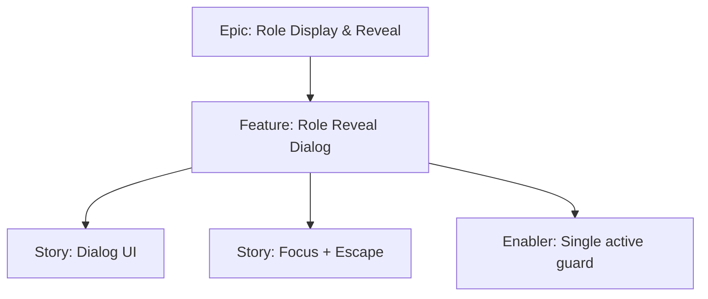

# Project Plan — Role Reveal Dialog

## 1. Project Overview
- Feature Summary: Provide a dialog for private role viewing with focus trap, Escape to close, and single-dialog enforcement.
- Success Criteria: One dialog at a time; reveal shows role; Close returns focus; keyboard accessible.
- Milestones: Dialog component → Focus management → Integration with cards.
- Risks: Focus leaks; multiple dialogs opened.

## 2. Work Item Hierarchy

## 3. Issues Breakdown
- Feature: Role Reveal Dialog
- Acceptance: Single dialog; role persists; Close works
- DoD: a11y checks; docs updated

## 4. Priority/Value
| Priority | Value |
|---|---|
| P1 | High |

## 5. Estimation
- Size: M (5 pts)

## 6. Dependencies
- Card list interface

## 7. Sprint Planning
- Goal: Accessible modal reveal

## 8. Project Board
- Component: dialogs

## 9. Automation
- N/A
