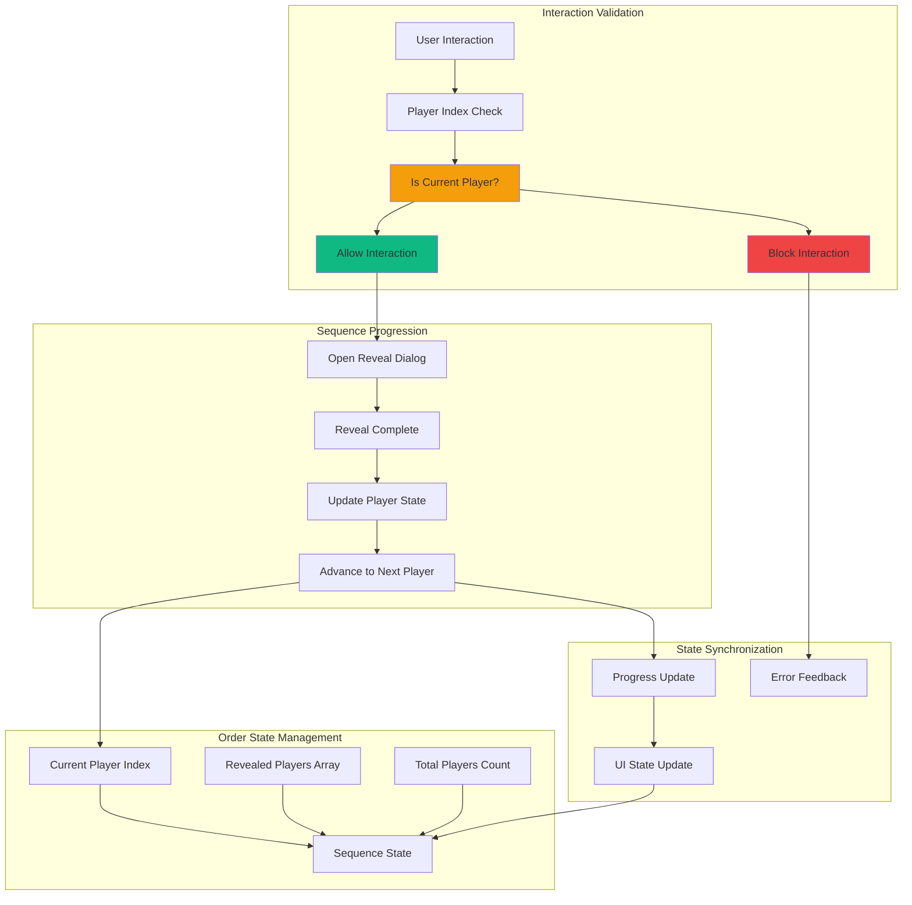

# Feature Implementation Plan: Sequential Order Enforcement

## Goal

Implement strict sequential reveal order system that ensures players can only reveal roles in predetermined sequence, preventing out-of-order reveals and maintaining game integrity. This includes current player tracking, interaction blocking, visual cues, and seamless integration with card list and dialog systems.

## Requirements

### Core Enforcement Requirements
- Strict sequential order: players can only reveal in index order (0, 1, 2, ...)
- Current player tracking with persistent visual indicator
- Interaction blocking for non-current players
- Automatic sequence advancement after each reveal
- Error handling and user feedback for invalid attempts
- Reset capability for re-allocation scenarios
- Integration with card list and dialog systems
- Accessibility compliance with clear state communication

### User Experience Requirements
- Prominent current player indicator at top of interface
- Clear visual feedback for allowed vs blocked interactions
- Smooth transitions between sequential states
- Error messages for out-of-order attempts
- Progress tracking throughout reveal sequence
- Completion detection and celebration

## Technical Considerations

### System Architecture Overview



### Frontend Architecture

#### Sequential Order Hook

```jsx
// hooks/useSequentialOrder.js
import { useState, useMemo, useCallback, useEffect } from 'react';

export const useSequentialOrder = (players = []) => {
  const [currentPlayerIndex, setCurrentPlayerIndex] = useState(0);
  const [revealedPlayers, setRevealedPlayers] = useState(new Set());

  // Calculate sequence state
  const sequenceState = useMemo(() => {
    if (!players || players.length === 0) {
      return {
        currentPlayer: null,
        isComplete: false,
        progress: { completed: 0, total: 0, percentage: 0 },
        canAdvance: false
      };
    }

    const currentPlayer = players[currentPlayerIndex] || null;
    const completedCount = revealedPlayers.size;
    const totalCount = players.length;
    const isComplete = completedCount === totalCount;
    const canAdvance = currentPlayerIndex < totalCount - 1;

    return {
      currentPlayer,
      currentPlayerIndex,
      isComplete,
      progress: {
        completed: completedCount,
        total: totalCount,
        percentage: totalCount > 0 ? (completedCount / totalCount) * 100 : 0
      },
      canAdvance,
      nextPlayerIndex: canAdvance ? currentPlayerIndex + 1 : null
    };
  }, [players, currentPlayerIndex, revealedPlayers]);

  // Check if player can reveal at given index
  const canPlayerReveal = useCallback((playerIndex) => {
    if (typeof playerIndex !== 'number' || playerIndex < 0) return false;
    if (!players || playerIndex >= players.length) return false;
    if (revealedPlayers.has(playerIndex)) return false; // Already revealed
    
    return playerIndex === currentPlayerIndex;
  }, [players, currentPlayerIndex, revealedPlayers]);

  // Get player interaction state
  const getPlayerState = useCallback((playerIndex) => {
    if (!players || playerIndex >= players.length) {
      return { state: 'invalid', canInteract: false, message: 'Invalid player' };
    }

    const isRevealed = revealedPlayers.has(playerIndex);
    const isCurrent = playerIndex === currentPlayerIndex;
    const isUpcoming = playerIndex > currentPlayerIndex;
    const isPast = playerIndex < currentPlayerIndex;
    const canInteract = canPlayerReveal(playerIndex);

    if (isRevealed) {
      return {
        state: 'revealed',
        canInteract: false,
        message: 'Role already revealed'
      };
    }

    if (isCurrent) {
      return {
        state: 'current',
        canInteract: true,
        message: 'Tap to reveal role'
      };
    }

    if (isPast) {
      return {
        state: 'past',
        canInteract: false,
        message: 'Already passed in sequence'
      };
    }

    if (isUpcoming) {
      return {
        state: 'upcoming',
        canInteract: false,
        message: 'Wait for your turn'
      };
    }

    return {
      state: 'unknown',
      canInteract: false,
      message: 'Unknown state'
    };
  }, [players, currentPlayerIndex, revealedPlayers, canPlayerReveal]);

  // Mark player as revealed and advance sequence
  const markPlayerRevealed = useCallback((playerIndex) => {
    if (!canPlayerReveal(playerIndex)) {
      console.warn(`Cannot reveal player ${playerIndex}: not current player or invalid index`);
      return false;
    }

    setRevealedPlayers(prev => new Set([...prev, playerIndex]));
    
    // Advance to next player if possible
    setCurrentPlayerIndex(prev => {
      const nextIndex = prev + 1;
      return nextIndex < players.length ? nextIndex : prev;
    });

    return true;
  }, [canPlayerReveal, players.length]);

  // Reset sequence (for re-allocation)
  const resetSequence = useCallback(() => {
    setCurrentPlayerIndex(0);
    setRevealedPlayers(new Set());
  }, []);

  // Initialize/reset when players change
  useEffect(() => {
    if (players && players.length > 0) {
      // Reset if players array changes
      const existingRevealed = Array.from(revealedPlayers).filter(index => 
        index < players.length && players[index]?.revealed
      );
      
      // Sync with actual player revealed state
      const actuallyRevealed = players
        .map((player, index) => player.revealed ? index : null)
        .filter(index => index !== null);
      
      const newRevealedSet = new Set(actuallyRevealed);
      
      if (newRevealedSet.size !== revealedPlayers.size || 
          !Array.from(newRevealedSet).every(index => revealedPlayers.has(index))) {
        setRevealedPlayers(newRevealedSet);
        
        // Set current index to first unrevealed player
        const firstUnrevealed = players.findIndex((player, index) => !newRevealedSet.has(index));
        setCurrentPlayerIndex(firstUnrevealed >= 0 ? firstUnrevealed : players.length);
      }
    } else {
      resetSequence();
    }
  }, [players]);

  return {
    // State
    sequenceState,
    currentPlayerIndex,
    revealedPlayers: Array.from(revealedPlayers),
    
    // Validation
    canPlayerReveal,
    getPlayerState,
    
    // Actions
    markPlayerRevealed,
    resetSequence
  };
};
```

#### Order Enforcement Component

```jsx
// components/SequentialOrderEnforcement.jsx
import React from 'react';
import PropTypes from 'prop-types';
import { useSequentialOrder } from '../hooks/useSequentialOrder';

const SequentialOrderEnforcement = ({
  players,
  onPlayerReveal,
  children
}) => {
  const {
    sequenceState,
    canPlayerReveal,
    getPlayerState,
    markPlayerRevealed
  } = useSequentialOrder(players);

  // Enhanced player reveal handler with sequence validation
  const handlePlayerReveal = (playerData) => {
    const { playerIndex } = playerData;
    
    if (!canPlayerReveal(playerIndex)) {
      const playerState = getPlayerState(playerIndex);
      console.warn(`Reveal blocked for player ${playerIndex}: ${playerState.message}`);
      return false;
    }

    // Mark as revealed in sequence state
    const success = markPlayerRevealed(playerIndex);
    
    if (success) {
      // Call parent reveal handler
      onPlayerReveal?.(playerData);
    }
    
    return success;
  };

  // Current player indicator component
  const CurrentPlayerIndicator = () => {
    const { currentPlayer, isComplete } = sequenceState;
    
    if (isComplete) {
      return (
        <div className="bg-green-50 border border-green-200 rounded-lg p-4 mb-4">
          <div className="flex items-center">
            <svg className="w-5 h-5 text-green-600 mr-3" fill="currentColor" viewBox="0 0 20 20">
              <path
                fillRule="evenodd"
                d="M10 18a8 8 0 100-16 8 8 0 000 16zm3.707-9.293a1 1 0 00-1.414-1.414L9 10.586 7.707 9.293a1 1 0 00-1.414 1.414l2 2a1 1 0 001.414 0l4-4z"
                clipRule="evenodd"
              />
            </svg>
            <span className="text-sm font-medium text-green-800">
              All roles revealed! Game setup complete.
            </span>
          </div>
        </div>
      );
    }

    if (!currentPlayer) return null;

    return (
      <div className="bg-blue-50 border border-blue-200 rounded-lg p-4 mb-4">
        <div className="flex items-center justify-between">
          <div className="flex items-center">
            <div className="w-3 h-3 bg-blue-600 rounded-full mr-3 animate-pulse" />
            <div>
              <span className="text-sm font-medium text-blue-800">
                Current: {currentPlayer.name}
              </span>
              <p className="text-xs text-blue-600 mt-0.5">
                {currentPlayer.revealed ? 'Tap to see role again' : 'Tap to reveal role'}
              </p>
            </div>
          </div>
          <div className="text-xs text-blue-600 font-medium">
            Player {sequenceState.currentPlayerIndex + 1}
          </div>
        </div>
      </div>
    );
  };

  // Enhanced children with sequence state
  const enhancedChildren = React.Children.map(children, (child) => {
    if (React.isValidElement(child)) {
      return React.cloneElement(child, {
        ...child.props,
        sequenceState,
        canPlayerReveal,
        getPlayerState,
        onPlayerReveal: handlePlayerReveal
      });
    }
    return child;
  });

  return (
    <div className="space-y-4">
      <CurrentPlayerIndicator />
      {enhancedChildren}
    </div>
  );
};

SequentialOrderEnforcement.propTypes = {
  players: PropTypes.arrayOf(PropTypes.shape({
    id: PropTypes.number.isRequired,
    name: PropTypes.string.isRequired,
    role: PropTypes.string.isRequired,
    revealed: PropTypes.bool
  })).isRequired,
  onPlayerReveal: PropTypes.func,
  children: PropTypes.node.isRequired,
};

export default SequentialOrderEnforcement;
```

### Performance Optimization

- **Efficient State Management:** Minimal re-renders with targeted state updates
- **Memoized Calculations:** Cached sequence state and validation results
- **Set Operations:** Efficient revealed player tracking
- **Event Delegation:** Optimized interaction handling
- **State Synchronization:** Automatic sync with player revealed state

### Implementation Steps

1. **Sequence State System**
   - Create sequential order hook with current player tracking
   - Implement validation logic for interaction permissions
   - Add automatic sequence advancement

2. **Integration Components**
   - Create enforcement wrapper component
   - Add current player indicator with visual prominence
   - Implement error handling and user feedback

3. **Validation and Blocking**
   - Add interaction blocking for non-current players
   - Implement clear error messages and visual feedback
   - Test edge cases and error scenarios

4. **State Management Integration**
   - Connect with card list for interaction validation
   - Integrate with dialog system for reveal completion
   - Add reset capability for re-allocation scenarios

## Context Template

- **Feature PRD:** Sequential Order Enforcement ensures strict reveal order with clear progression tracking
- **Epic Integration:** Orchestrates Role Display & Reveal epic by controlling interaction flow
- **Dependencies:** Uses player data from Role Allocation epic
- **Dependents:** Controls Card List Interface interactions and Role Reveal Dialog triggers