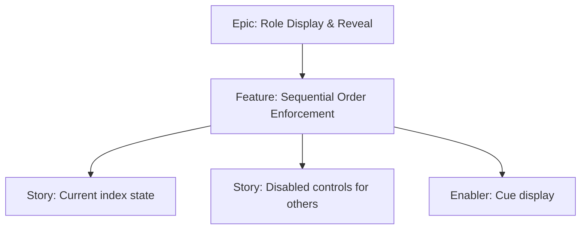

# Project Plan — Sequential Order Enforcement

## 1. Project Overview
- Feature Summary: Enforce strict reveal order; maintain current player index cue; block out-of-order reveals.
- Success Criteria: Only current index can reveal; cue visible at top; Next moves forward; roles remain visible after reveal.
- Milestones: Order state → Cue component → Guard logic.
- Risks: Dead-ends if state desyncs; ensure reset path.

## 2. Work Item Hierarchy

## 3. Issues Breakdown
- Feature: Sequential Order Enforcement
- Acceptance: Only current player can reveal; cue shown
- DoD: Docs updated; guards documented

## 4. Priority/Value
| Priority | Value |
|---|---|
| P1 | High |

## 5. Estimation
- Size: M (3-5 pts)

## 6. Dependencies
- Reveal dialog and card list

## 7. Sprint Planning
- Goal: Robust sequential flow

## 8. Project Board
- Component: state, UI

## 9. Automation
- N/A
