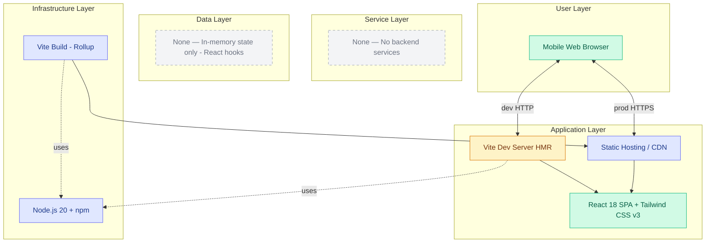

# Epic Architecture Specification: Setup & Project Scaffolding

## 1. Epic Architecture Overview

This epic establishes a lightweight, client-only React application scaffold using Vite and Tailwind CSS v3.4.17. The architecture prioritizes mobile performance, minimal bundle size, and fast developer iteration. There is no backend, no persistence, and no analytics. During development, a Vite dev server provides HMR. For production, Vite outputs static assets that can be served from any static host/CDN. State is kept entirely in-memory within React components/hooks.

Key properties:
- Client-only SPA (React 18) with Tailwind v3 utilities and preflight
- Vite development server with HMR; Vite build (Rollup) for production assets
- Strict mobile-first posture: viewport meta, touch target guidance, portrait layout
- No services/data layers beyond in-memory state

## 2. System Architecture Diagram

Notes:
- No authentication, APIs, databases, or background jobs are used.
- All interactions happen on-device; closing/reloading the tab clears the session.

## 3. High-Level Features & Technical Enablers

Features
- Initialize Vite + React 18 project (JavaScript, not TypeScript)
- Integrate Tailwind CSS v3.4.17 with PostCSS and Autoprefixer
- Configure mobile viewport meta and portrait-first styles
- Provide npm scripts: dev, build, preview, (optional) lint/format
- Set up ESLint + Prettier for consistent code style (no TS rules)
- Establish basic `src/` structure: components/, hooks/, utils/, styles/, App.jsx
- Include `.gitignore` for Node/React and update README/DEVELOPMENT docs

Technical Enablers
- Dependencies: react, react-dom, vite, @vitejs/plugin-react, tailwindcss@3.4.17, postcss, autoprefixer, eslint, prettier
- Tailwind config (v3) + PostCSS config (tailwindcss + autoprefixer)
- Base HTML with `<meta name="viewport" content="width=device-width, initial-scale=1">`
- Tailwind entry CSS (e.g., `@tailwind base; @tailwind components; @tailwind utilities;`)
- Browserslist (package.json) for modern mobile browser support

## 4. Technology Stack
- React 18 (functional components + Hooks)
- Vite (dev server + build pipeline)
- Tailwind CSS v3.4.17 (strictly v3; do not use v4 configs)
- PostCSS + Autoprefixer
- JavaScript (no TypeScript)
- Node.js 20 + npm

## 5. Technical Value
Value: High
- Unblocks all subsequent epics by providing a working, performant scaffold
- Bakes in performance and mobile constraints from day one
- Reduces configuration risk and accelerates developer onboarding

## 6. T-Shirt Size Estimate
Size: S (≈ 0.5 day)

## Context Template
- Epic PRD: `docs/ways-of-work/plan/setup-project-scaffolding/epic.md`
