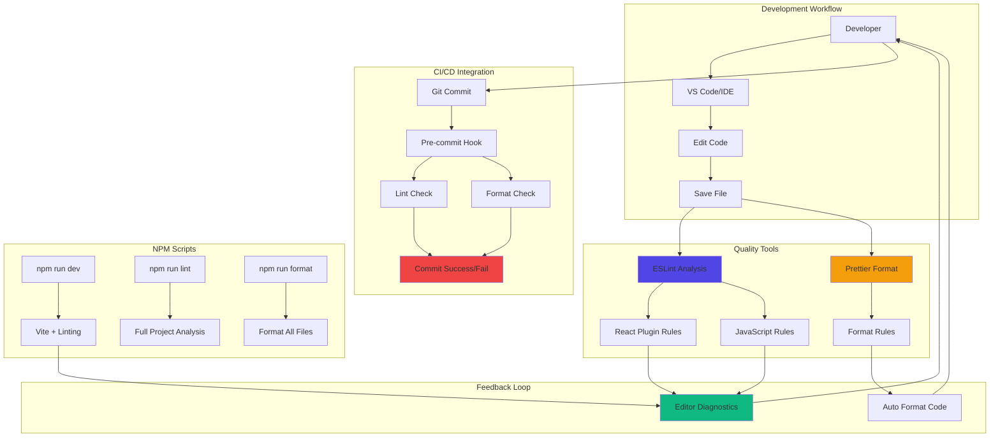

# Feature Implementation Plan: Development Tooling Setup

## Goal

Establish comprehensive development tooling ecosystem with ESLint for code quality, Prettier for consistent formatting, and automated npm scripts for all development workflows. This creates a robust foundation for maintaining code standards, catching errors early, and ensuring consistent developer experience across all contributors.

## Requirements

### Core Tooling Requirements
- ESLint configuration with React and modern JavaScript rules
- Prettier integration for automated code formatting
- Comprehensive npm scripts for all development tasks
- Editor integration for immediate feedback during coding
- Pre-commit hooks for automated quality checks
- Configuration for React functional components and Hooks
- Modern JavaScript (ES2022) linting support
- Integration with Vite build system

### Developer Experience Requirements
- Lint errors visible in editor within 100ms
- Automatic formatting on save
- Clear, actionable error messages
- Fast linting performance (<2 seconds for full project)
- Consistent formatting across all file types
- Git hook integration for quality gates

## Technical Considerations

### System Architecture Overview



### Technology Stack Selection

**Linting:** ESLint v8.x
- **Rationale:** Industry standard, excellent React support, extensible rule system
- **React Plugin:** @eslint/js and eslint-plugin-react-hooks for React best practices
- **Parser:** Modern JavaScript (ES2022) parsing with JSX support

**Formatting:** Prettier v3.x  
- **Rationale:** Opinionated formatting, excellent editor integration, consistent output
- **Integration:** ESLint-Prettier integration to avoid conflicts
- **Configuration:** Optimized for React JSX and modern JavaScript

**Git Hooks:** Husky + lint-staged
- **Rationale:** Automated quality gates, prevents bad commits
- **Strategy:** Lint and format staged files only for performance

### Integration Points

**Editor Integration:**
- VS Code ESLint extension for real-time feedback
- Prettier extension for format-on-save
- EditorConfig for consistent indentation across editors
- Settings.json recommendations for team consistency

**Vite Integration:**
- ESLint plugin for Vite to show linting errors in browser
- Development server integration for immediate feedback
- Build-time linting for production deployments

### File System Structure

```
mafia-game-role-allocator/
├── .eslintrc.cjs             # ESLint configuration
├── .prettierrc               # Prettier configuration  
├── .prettierignore           # Prettier ignore patterns
├── .editorconfig             # Editor consistency config
├── .vscode/
│   ├── settings.json         # VS Code workspace settings
│   └── extensions.json       # Recommended extensions
├── .husky/                   # Git hooks directory
│   └── pre-commit            # Pre-commit quality checks
├── package.json              # Scripts and dependencies
└── src/                      # Source code with tooling
```

**Configuration Files:**

**.eslintrc.cjs:**
```javascript
module.exports = {
  root: true,
  env: { browser: true, es2020: true },
  extends: [
    'eslint:recommended',
    '@eslint/js/recommended',
    'plugin:react/recommended',
    'plugin:react/jsx-runtime',
    'plugin:react-hooks/recommended',
  ],
  ignorePatterns: ['dist', '.eslintrc.cjs'],
  parserOptions: { ecmaVersion: 'latest', sourceType: 'module' },
  settings: { react: { version: '18.2' } },
  plugins: ['react-refresh'],
  rules: {
    'react-refresh/only-export-components': [
      'warn',
      { allowConstantExport: true },
    ],
    'react/prop-types': 'error',
    'react-hooks/rules-of-hooks': 'error',
    'react-hooks/exhaustive-deps': 'warn',
  },
}
```

**.prettierrc:**
```json
{
  "semi": true,
  "trailingComma": "es5",
  "singleQuote": true,
  "printWidth": 80,
  "tabWidth": 2,
  "useTabs": false,
  "quoteProps": "as-needed",
  "jsxSingleQuote": false,
  "bracketSpacing": true,
  "bracketSameLine": false,
  "arrowParens": "avoid"
}
```

### Frontend Architecture

#### Code Quality Patterns

**React Component Standards:**
```jsx
// ✅ Recommended pattern with proper linting
import React from 'react';
import PropTypes from 'prop-types';

const PlayerCard = ({ name, isActive, onReveal }) => {
  return (
    <div 
      className={`player-card ${isActive ? 'active' : ''}`}
      onClick={onReveal}
    >
      <h3>{name}</h3>
    </div>
  );
};

PlayerCard.propTypes = {
  name: PropTypes.string.isRequired,
  isActive: PropTypes.bool,
  onReveal: PropTypes.func.isRequired,
};

PlayerCard.defaultProps = {
  isActive: false,
};

export default PlayerCard;
```

**Hooks Usage Standards:**
```jsx
// ✅ Proper hooks usage with linting
import { useState, useEffect, useCallback } from 'react';

const usePlayerManagement = (initialCount) => {
  const [players, setPlayers] = useState([]);
  const [count, setCount] = useState(initialCount);
  
  // ESLint ensures proper dependency arrays
  useEffect(() => {
    setPlayers(prev => {
      const newPlayers = [...prev];
      // Adjust array length based on count
      newPlayers.length = count;
      return newPlayers.map((p, i) => p || { id: i, name: '' });
    });
  }, [count]);
  
  const updatePlayer = useCallback((index, name) => {
    setPlayers(prev => 
      prev.map((p, i) => i === index ? { ...p, name } : p)
    );
  }, []);
  
  return { players, count, setCount, updatePlayer };
};
```

#### NPM Scripts Configuration

**package.json scripts:**
```json
{
  "scripts": {
    "dev": "vite --host",
    "build": "vite build",
    "preview": "vite preview",
    "lint": "eslint . --ext js,jsx --report-unused-disable-directives --max-warnings 0",
    "lint:fix": "eslint . --ext js,jsx --fix",
    "format": "prettier --write \"src/**/*.{js,jsx,css,md}\"",
    "format:check": "prettier --check \"src/**/*.{js,jsx,css,md}\"",
    "quality:check": "npm run lint && npm run format:check",
    "quality:fix": "npm run lint:fix && npm run format",
    "prepare": "husky install"
  }
}
```

### Database Schema Design

**Not Applicable:** This feature handles development tooling only. No database interactions required.

### API Design

**Not Applicable:** This feature handles development tooling only. No API endpoints required.

### Security Performance

#### Development Performance
- **Linting Speed:** Full project analysis <2 seconds
- **Format Speed:** Full project formatting <1 second  
- **Editor Response:** Lint feedback within 100ms of changes
- **Git Hook Speed:** Pre-commit checks <5 seconds

#### Code Quality Gates
- **Error Prevention:** Block commits with linting errors
- **Format Enforcement:** Automatic formatting on commit
- **React Standards:** Enforce Hooks rules and best practices
- **Accessibility:** Basic a11y linting rules for inclusive design

#### Security Considerations
- **Dependency Security:** ESLint and Prettier from trusted sources
- **Configuration Security:** No sensitive data in config files
- **Git Hook Security:** Validated hook scripts, no arbitrary code execution

### Implementation Steps

1. **Package Installation**
   ```bash
   # Core linting and formatting
   npm install -D eslint @eslint/js eslint-plugin-react eslint-plugin-react-hooks eslint-plugin-react-refresh
   npm install -D prettier eslint-config-prettier eslint-plugin-prettier
   
   # Git hooks and automation
   npm install -D husky lint-staged
   
   # PropTypes for component validation
   npm install prop-types
   ```

2. **Configuration Setup**
   - Create .eslintrc.cjs with React and modern JS rules
   - Create .prettierrc with project formatting standards
   - Set up .editorconfig for cross-editor consistency
   - Configure VS Code workspace settings

3. **Git Hooks Configuration**
   ```bash
   npm run prepare  # Initialize husky
   npx husky add .husky/pre-commit "npx lint-staged"
   ```

4. **NPM Scripts Implementation**
   - Add comprehensive development scripts
   - Configure quality check and fix commands
   - Set up build integration with linting

5. **Validation Testing**
   - Test linting on sample React components
   - Verify formatting works correctly
   - Test git hooks prevent bad commits
   - Validate editor integration works

## Context Template

- **Feature PRD:** Development Tooling Setup establishes code quality foundation with ESLint, Prettier, and automated workflows
- **Epic Integration:** Builds upon Vite React Initialization and Tailwind Integration, supports all future feature development
- **Dependencies:** Requires Vite React Initialization completion
- **Dependents:** All feature development benefits from consistent tooling and quality standards