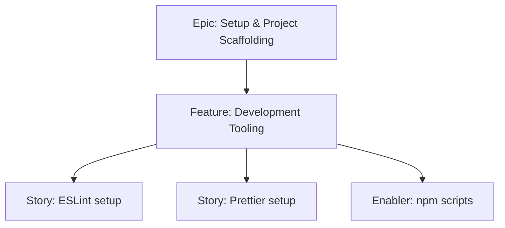

# Project Plan — Development Tooling

## 1. Project Overview
- Feature Summary: Establish ESLint + Prettier, npm scripts, and basic Husky hooks (optional) to enforce code quality and formatting.
- Success Criteria: Lint and format run without errors; pre-configured npm scripts; aligns with JS-only codebase.
- Milestones: Add ESLint/Prettier → Configure rules → Add scripts → Validate on sample files.
- Risks: Overly strict rules blocking progress; misconfigured Prettier/ESLint integration.

## 2. Work Item Hierarchy

## 3. Issues Breakdown
- Feature: Development Tooling
- Acceptance: Lint & format scripts work; no TS deps
- DoD: Docs updated with scripts

## 4. Priority/Value
| Priority | Value |
|---|---|
| P1 | Medium |

## 5. Estimation
- Size: S (2 pts)

## 6. Dependencies
- Vite React Initialization

## 7. Sprint Planning
- Goal: Lint/format integrated in dev workflow

## 8. Project Board
- Component: tooling

## 9. Automation
- Optional: run lint on PR
