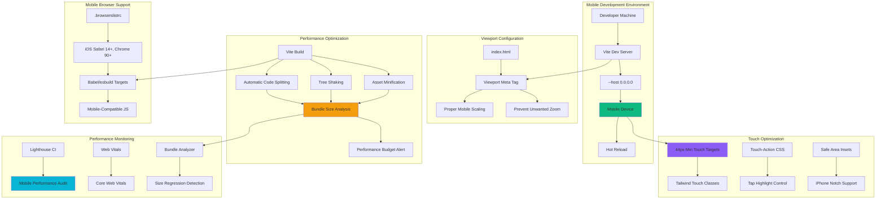

# Feature Implementation Plan: Mobile Optimization Configuration

## Goal

Configure comprehensive mobile optimization including viewport settings, performance budgets, mobile-first development patterns, and device testing capabilities. This establishes the foundation for optimal mobile user experience while meeting strict performance requirements of <2s load time and <500KB bundle size.

## Requirements

### Core Mobile Optimization Requirements
- Viewport meta tag configuration for proper mobile scaling
- Vite build optimizations for mobile performance targets
- Performance budgets with automated warnings (<500KB bundle)
- Mobile-first CSS patterns and breakpoint strategies
- Local network development server for mobile device testing
- Mobile browser compatibility configuration (iOS Safari 14+, Chrome 90+)
- Touch interaction optimizations and 44px minimum touch targets
- Performance monitoring integration for development workflow

### Performance Requirements
- Production bundle <500KB total (JS + CSS + assets)
- Application load time <2s on simulated 3G connection
- First Contentful Paint (FCP) <1.5s on mobile
- Largest Contentful Paint (LCP) <2.5s on mobile
- Cumulative Layout Shift (CLS) <0.1
- Development server accessible on local network for real device testing

## Technical Considerations

### System Architecture Overview



### Technology Stack Selection

**Mobile Development Server:**
- **Vite Host Configuration:** `--host 0.0.0.0` for network access
- **Port Strategy:** Auto-assignment with network IP display
- **HTTPS Support:** Local HTTPS for PWA testing capabilities
- **Live Reload:** Mobile-compatible hot module replacement

**Performance Budgets:**
- **Bundle Analyzer:** `rollup-plugin-visualizer` for size analysis
- **Size Limits:** Automated warnings at 400KB, errors at 500KB
- **Asset Optimization:** Image compression, font subsetting
- **Critical Resource Hints:** Preload/prefetch for optimal loading

**Mobile Browser Targets:**
```javascript
// .browserslistrc
> 1%
last 2 versions
iOS >= 14
Chrome >= 90
Firefox >= 88
not dead
```

### Integration Points

**Vite Configuration Enhancement:**
```javascript
// vite.config.js mobile optimizations
export default defineConfig({
  plugins: [
    react(),
    // Bundle analyzer for performance monitoring
    visualizer({ filename: 'dist/bundle-analysis.html' })
  ],
  server: {
    host: '0.0.0.0', // Network access for mobile testing
    port: 5173,
    https: false, // Enable for PWA testing
  },
  build: {
    target: ['es2022', 'chrome90', 'safari14'],
    rollupOptions: {
      output: {
        manualChunks: {
          vendor: ['react', 'react-dom'],
        },
      },
    },
    // Performance budgets
    chunkSizeWarningLimit: 400,
  },
  preview: {
    host: '0.0.0.0',
    port: 4173,
  },
});
```

**Viewport Configuration:**
```html
<!-- index.html viewport optimization -->
<meta name="viewport" content="width=device-width, initial-scale=1.0, viewport-fit=cover">
<meta name="theme-color" content="#000000">
<meta name="mobile-web-app-capable" content="yes">
<meta name="apple-mobile-web-app-capable" content="yes">
<meta name="apple-mobile-web-app-status-bar-style" content="default">
```

### File System Structure

```
mafia-game-role-allocator/
├── index.html                # Mobile viewport configuration
├── vite.config.js            # Mobile build optimizations  
├── .browserslistrc           # Mobile browser targets
├── src/
│   ├── styles/
│   │   ├── mobile.css        # Mobile-specific styles
│   │   └── touch.css         # Touch interaction styles
│   └── utils/
│       ├── performance.js    # Performance monitoring utilities
│       └── mobile-detect.js  # Mobile device detection
├── public/
│   ├── manifest.json         # PWA manifest for mobile
│   └── icons/                # Mobile app icons
└── performance/
    ├── lighthouse.config.js  # Lighthouse configuration
    └── budget.json           # Performance budget config
```

### Frontend Architecture

#### Mobile-First CSS Patterns

**Responsive Design Strategy:**
```css
/* Mobile-first utility patterns */
.touch-target {
  min-height: 44px;
  min-width: 44px;
  touch-action: manipulation;
}

.mobile-container {
  width: 100%;
  max-width: 100vw;
  padding: 0 1rem;
}

/* Progressive enhancement for larger screens */
@media (min-width: 640px) {
  .mobile-container {
    padding: 0 1.5rem;
    max-width: 42rem;
    margin: 0 auto;
  }
}
```

**Touch Optimization Patterns:**
```jsx
// React components optimized for touch
const MobileTouchButton = ({ children, onClick, disabled }) => (
  <button
    className="
      w-full min-h-[44px] px-4 py-3
      touch-manipulation select-none
      active:scale-95 transition-transform
      disabled:opacity-50 disabled:cursor-not-allowed
      focus:outline-none focus:ring-2 focus:ring-blue-500
    "
    onClick={onClick}
    disabled={disabled}
    type="button"
  >
    {children}
  </button>
);
```

#### Performance Monitoring Integration

**Core Web Vitals Tracking:**
```javascript
// src/utils/performance.js
export const measureWebVitals = () => {
  // Largest Contentful Paint
  new PerformanceObserver((entryList) => {
    const entries = entryList.getEntries();
    const lastEntry = entries[entries.length - 1];
    console.log('LCP:', lastEntry.startTime);
  }).observe({ entryTypes: ['largest-contentful-paint'] });
  
  // First Input Delay  
  new PerformanceObserver((entryList) => {
    const entries = entryList.getEntries();
    entries.forEach((entry) => {
      console.log('FID:', entry.processingStart - entry.startTime);
    });
  }).observe({ entryTypes: ['first-input'] });
  
  // Cumulative Layout Shift
  let clsScore = 0;
  new PerformanceObserver((entryList) => {
    for (const entry of entryList.getEntries()) {
      if (!entry.hadRecentInput) {
        clsScore += entry.value;
      }
    }
    console.log('CLS:', clsScore);
  }).observe({ entryTypes: ['layout-shift'] });
};
```

#### Mobile Device Testing Workflow

**Development Testing Setup:**
```javascript
// Mobile development utilities
export const getMobileDeviceInfo = () => {
  const userAgent = navigator.userAgent;
  const isMobile = /Android|webOS|iPhone|iPad|iPod|BlackBerry|IEMobile|Opera Mini/i.test(userAgent);
  const isIOS = /iPad|iPhone|iPod/.test(userAgent);
  const isAndroid = /Android/.test(userAgent);
  
  return {
    isMobile,
    isIOS,
    isAndroid,
    viewportWidth: window.innerWidth,
    viewportHeight: window.innerHeight,
    devicePixelRatio: window.devicePixelRatio,
    touchSupport: 'ontouchstart' in window,
  };
};

// Network connection monitoring
export const getConnectionInfo = () => {
  const connection = navigator.connection || navigator.mozConnection || navigator.webkitConnection;
  
  return {
    effectiveType: connection?.effectiveType || 'unknown',
    downlink: connection?.downlink || 0,
    rtt: connection?.rtt || 0,
    saveData: connection?.saveData || false,
  };
};
```

### Database Schema Design

**Not Applicable:** This feature handles mobile optimization configuration only. No database interactions required.

### API Design

**Not Applicable:** This feature handles mobile optimization only. No API endpoints required.

### Security Performance

#### Performance Budget Enforcement

**Automated Bundle Analysis:**
```javascript
// performance/budget.json
{
  "budgets": [
    {
      "type": "bundle",
      "name": "main",
      "maximumWarning": "400kb",
      "maximumError": "500kb"
    },
    {
      "type": "initial",
      "maximumWarning": "350kb", 
      "maximumError": "450kb"
    }
  ]
}
```

**Lighthouse Performance Testing:**
```javascript
// performance/lighthouse.config.js
module.exports = {
  ci: {
    collect: {
      url: ['http://localhost:4173'],
      numberOfRuns: 3,
    },
    assert: {
      assertions: {
        'categories:performance': ['error', { minScore: 0.9 }],
        'categories:accessibility': ['error', { minScore: 0.9 }],
        'first-contentful-paint': ['error', { maxNumericValue: 1500 }],
        'largest-contentful-paint': ['error', { maxNumericValue: 2500 }],
        'cumulative-layout-shift': ['error', { maxNumericValue: 0.1 }],
      },
    },
  },
};
```

#### Mobile Security Considerations

**Content Security Policy for Mobile:**
```html
<!-- Mobile-optimized CSP -->
<meta http-equiv="Content-Security-Policy" content="
  default-src 'self';
  script-src 'self' 'unsafe-inline';
  style-src 'self' 'unsafe-inline';
  img-src 'self' data: https:;
  connect-src 'self';
  font-src 'self';
  media-src 'self';
">
```

**Touch Security:**
```css
/* Prevent touch callouts and selection on mobile */
.no-touch-callout {
  -webkit-touch-callout: none;
  -webkit-user-select: none;
  user-select: none;
}

/* Secure button interactions */
.secure-touch {
  touch-action: manipulation;
  -webkit-tap-highlight-color: transparent;
}
```

### Implementation Steps

1. **Viewport Configuration**
   - Update index.html with mobile-optimized viewport meta tags
   - Add mobile web app meta tags for better app-like experience
   - Configure theme colors and status bar styles

2. **Vite Mobile Configuration**
   ```bash
   npm install -D rollup-plugin-visualizer
   npm install -D @vitejs/plugin-react
   ```
   - Configure Vite for network access and mobile testing
   - Set up performance budgets and bundle analysis
   - Configure build targets for mobile browsers

3. **Performance Monitoring Setup**
   ```bash
   npm install -D lighthouse @lhci/cli
   npm install web-vitals
   ```
   - Integrate Lighthouse CI for automated performance testing
   - Set up Core Web Vitals tracking
   - Configure performance budgets and regression detection

4. **Mobile CSS Patterns**
   - Create mobile-first utility classes in Tailwind
   - Set up touch interaction optimizations
   - Configure safe area handling for modern mobile devices

5. **Development Workflow Enhancement**
   - Set up mobile device testing workflow
   - Create performance monitoring dashboard
   - Configure automated performance regression detection

6. **Validation and Testing**
   - Test development server access from mobile devices
   - Validate performance budgets work correctly
   - Run Lighthouse audits and verify scores meet targets
   - Test touch interactions and viewport behavior

## Context Template

- **Feature PRD:** Mobile Optimization Configuration establishes comprehensive mobile-first foundation with performance budgets and device testing capabilities
- **Epic Integration:** Completes Setup & Project Scaffolding epic by adding mobile optimization to the Vite React foundation
- **Dependencies:** Requires Vite React Initialization and Tailwind Integration
- **Dependents:** All mobile UI features depend on this optimization foundation, particularly Mobile Layout Optimization feature