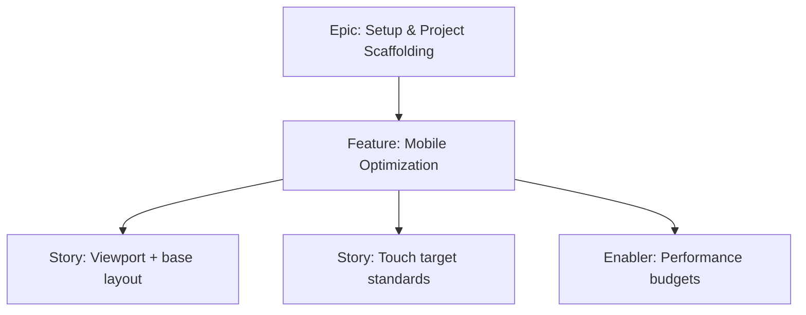

# Project Plan — Mobile Optimization

## 1. Project Overview
- Feature Summary: Configure mobile-first foundations (viewport meta, touch targets, performance budgets) to ensure fast, usable experience on mobile devices.
- Success Criteria: Correct viewport; buttons >=44px; Lighthouse mobile performance reasonable; bundle within budget; docs updated.
- Milestones: Add meta viewport → Define base sizing → Verify performance budgets.
- Risks: Over-aggressive resets harming tap targets; uncontrolled bundle growth.

## 2. Work Item Hierarchy

## 3. Issues Breakdown
- Feature: Mobile Optimization
- Acceptance: Viewport present; 44px min targets; doc performance budgets
- DoD: Docs updated; basic checks recorded

## 4. Priority/Value
| Priority | Value |
|---|---|
| P1 | High |

## 5. Estimation
- Size: S (2 pts)

## 6. Dependencies
- Vite React Initialization, Tailwind Integration

## 7. Sprint Planning
- Goal: Guarantee mobile baseline quality

## 8. Project Board
- Component: infrastructure

## 9. Automation
- Optional: CI Lighthouse check (later)
