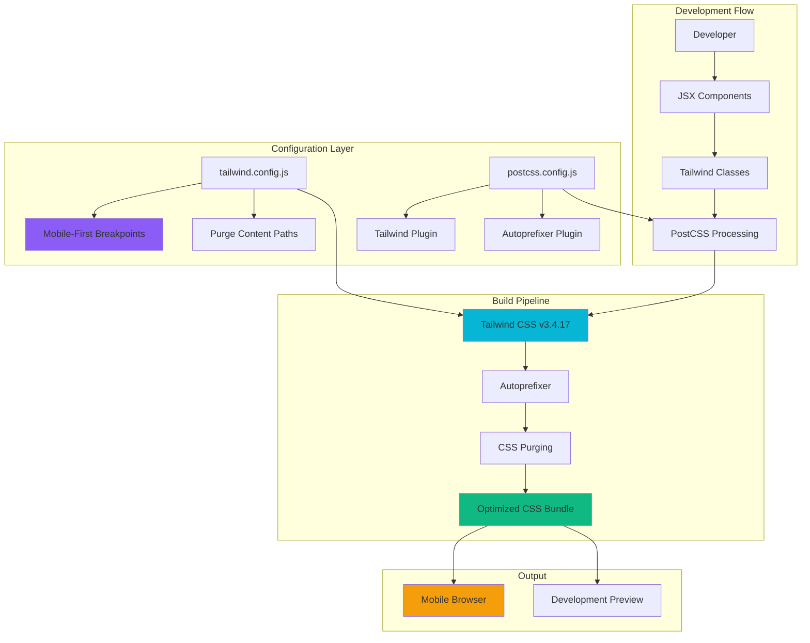

# Feature Implementation Plan: Tailwind CSS Integration

## Goal

Integrate Tailwind CSS v3.4.17 with the React application to establish a mobile-first, utility-based styling system. This implementation provides consistent design patterns, optimized bundle sizes, and responsive utilities while maintaining strict version compatibility and performance requirements for mobile devices.

## Requirements

### Core Integration Requirements
- Install Tailwind CSS v3.4.17 (strictly v3.x, not v4+)
- Configure PostCSS with Tailwind and Autoprefixer
- Set up mobile-first responsive breakpoints
- Configure CSS purging for production optimization
- Establish utility-first styling patterns
- Create Tailwind configuration for mobile optimization
- Integrate with Vite build system
- Set up development-time class validation

### Mobile Performance Requirements
- CSS bundle size <50KB after purging
- Mobile-first breakpoint configuration (320px, 768px, 1024px)
- Vendor prefix automation for mobile browser compatibility
- Fast CSS processing during development (<100ms)
- Production build optimization with unused CSS removal

## Technical Considerations

### System Architecture Overview



### Technology Stack Selection

**CSS Framework:** Tailwind CSS v3.4.17
- **Rationale:** Utility-first approach, excellent mobile support, mature v3 ecosystem
- **Version Constraint:** Strictly v3.4.17 - avoid v4+ for compatibility
- **Features:** Mobile-first responsive design, automatic vendor prefixing, CSS purging

**PostCSS Configuration:**
- **PostCSS:** v8.x for modern CSS processing
- **Autoprefixer:** Vendor prefix automation for mobile browsers
- **Processing Chain:** Tailwind → Autoprefixer → Optimization

**Mobile-First Breakpoints:**
```javascript
// Tailwind config breakpoints
screens: {
  'sm': '640px',   // Small mobile landscape
  'md': '768px',   // Tablet portrait  
  'lg': '1024px',  // Desktop (out of scope but available)
}
```

### Integration Points

**Vite Integration:**
- PostCSS plugin automatic detection
- CSS import in main.jsx entry point
- Hot reload support for Tailwind changes
- Production build optimization

**React Component Integration:**
```jsx
// Example utility usage patterns
<button className="w-full py-3 px-4 bg-blue-500 text-white rounded-lg 
                   hover:bg-blue-600 active:bg-blue-700 
                   sm:w-auto md:px-6">
  Allocate Roles
</button>
```

### File System Structure

```
mafia-game-role-allocator/
├── src/
│   ├── main.jsx              # Tailwind CSS import
│   ├── index.css             # Tailwind directives
│   └── components/           # Styled React components
├── tailwind.config.js        # Tailwind configuration
├── postcss.config.js         # PostCSS configuration  
├── package.json              # Dependencies
└── vite.config.js            # Vite integration
```

**Configuration Files:**

**tailwind.config.js:**
```javascript
/** @type {import('tailwindcss').Config} */
export default {
  content: [
    "./index.html",
    "./src/**/*.{js,ts,jsx,tsx}",
  ],
  theme: {
    screens: {
      'sm': '640px',
      'md': '768px', 
      'lg': '1024px',
    },
    extend: {
      // Mobile-specific customizations
    },
  },
  plugins: [],
}
```

**postcss.config.js:**
```javascript
export default {
  plugins: {
    tailwindcss: {},
    autoprefixer: {},
  },
}
```

### Frontend Architecture

#### Component Styling Patterns

**Utility-First Methodology:**
```jsx
// ✅ Recommended pattern
const PlayerCard = ({ name, isActive }) => (
  <div className={`
    w-full p-4 rounded-lg border-2 transition-colors
    ${isActive 
      ? 'border-blue-500 bg-blue-50' 
      : 'border-gray-200 bg-white hover:bg-gray-50'
    }
  `}>
    <h3 className="text-lg font-semibold text-gray-900">{name}</h3>
  </div>
);

// ❌ Avoid custom CSS classes
const PlayerCard = ({ name, isActive }) => (
  <div className={`player-card ${isActive ? 'active' : ''}`}>
    <h3 className="player-name">{name}</h3>
  </div>
);
```

#### Mobile-First Responsive Design

**Breakpoint Strategy:**
```jsx
// Mobile-first approach with responsive utilities
<div className="
  w-full                    // Full width on mobile
  p-4                       // Base padding
  sm:p-6                    // More padding on small screens+
  md:max-w-2xl md:mx-auto   // Constrained width on tablets+
  grid gap-4                // Grid layout
  grid-cols-1               // Single column mobile
  sm:grid-cols-2            // Two columns on small screens+
  md:grid-cols-3            // Three columns on tablets+
">
```

#### State-Based Styling

**Dynamic Classes Pattern:**
```jsx
const useButtonStyles = (state) => {
  return {
    base: 'w-full py-3 px-4 rounded-lg font-medium transition-colors touch-manipulation',
    enabled: 'bg-blue-500 text-white hover:bg-blue-600 active:bg-blue-700',
    disabled: 'bg-gray-300 text-gray-500 cursor-not-allowed',
    loading: 'bg-blue-400 text-white cursor-wait',
  }[state];
};
```

### Database Schema Design

**Not Applicable:** This feature handles CSS integration only. No database interactions required.

### API Design  

**Not Applicable:** This feature handles styling integration only. No API endpoints required.

### Security Performance

#### Performance Optimization

**CSS Bundle Optimization:**
- **Purging Strategy:** Remove unused utilities in production
- **Content Scanning:** Scan all JSX files for class usage
- **Bundle Target:** <50KB compressed CSS bundle
- **Critical CSS:** Inline critical styles for faster rendering

**Development Performance:**
- **JIT Compilation:** Just-in-time class generation for faster builds
- **Hot Reload:** Instant CSS updates without page refresh
- **Build Speed:** <500ms CSS processing time

#### Mobile Browser Compatibility

**Vendor Prefixing:**
- Autoprefixer targets: iOS Safari 14+, Chrome 90+, Firefox 88+
- Touch interaction optimization (-webkit-tap-highlight-color)
- Mobile viewport handling (viewport-fit)

**CSS Features:**
```css
/* Generated vendor prefixes */
.transform {
  -webkit-transform: translateZ(0);
  transform: translateZ(0);
}

.touch-manipulation {
  -ms-touch-action: manipulation;
  touch-action: manipulation;
}
```

### Implementation Steps

1. **Package Installation**
   ```bash
   npm install -D tailwindcss@3.4.17 postcss autoprefixer
   npx tailwindcss init -p
   ```

2. **Configuration Setup**
   - Configure tailwind.config.js with mobile-first breakpoints
   - Set up postcss.config.js with required plugins
   - Update content paths for CSS purging

3. **CSS Integration**
   - Add Tailwind directives to src/index.css
   - Import CSS in main.jsx entry point
   - Remove default Vite CSS

4. **Development Validation**
   - Test utility classes in components
   - Verify responsive breakpoints
   - Validate CSS purging in production builds
   - Test mobile browser compatibility

5. **Performance Testing**
   - Measure CSS bundle size
   - Verify purging effectiveness
   - Test build performance impact

## Context Template

- **Feature PRD:** Tailwind CSS Integration establishes utility-first styling system with mobile-first responsive design
- **Epic Integration:** Builds upon Vite React Initialization foundation, enables Visual Differentiation System and Mobile Layout Optimization features
- **Dependencies:** Requires completed Vite React Initialization
- **Dependents:** Visual Differentiation System, Mobile Layout Optimization, and all UI component features