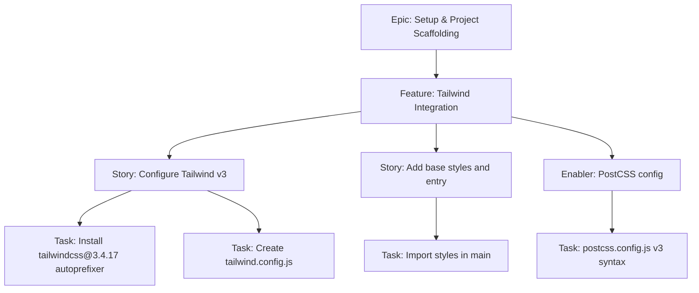

# Project Plan — Tailwind Integration

## 1. Project Overview

- Feature Summary: Integrate Tailwind CSS v3.4.17 with Vite React ensuring correct PostCSS config, purge, and mobile-first utility styling. Strictly avoid Tailwind v4.
- Success Criteria: Tailwind utilities render; PostCSS configured as per guidelines; base styles minimal; build size within budget; docs updated with v3 constraint.
- Key Milestones: Install Tailwind + PostCSS → Init Tailwind config → Wire main CSS → Validate utilities and purge.
- Risk Assessment: Misconfig to v4 plugin, purge mis-setup causing large bundle; CSS reset affecting mobile buttons.

## 2. Work Item Hierarchy

## 3. GitHub Issues Breakdown
- Feature: Tailwind Integration
- Acceptance: Utilities work; purge configured; postcss correct; no v4 plugin
- DoD: Docs updated; CSS size checked; mobile tap targets unaffected

## 4. Priority and Value Matrix
| Priority | Value | Criteria |
|---|---|---|
| P0 | High | Styling foundation for all UI |

## 5. Estimation
- Size: S (2-3 pts)

## 6. Dependencies
- Depends on Vite React Initialization

## 7. Sprint Planning
- Goal: Tailwind working with sample utility-rendered page

## 8. Project Board
- Component: styling

## 9. Automation
- N/A
