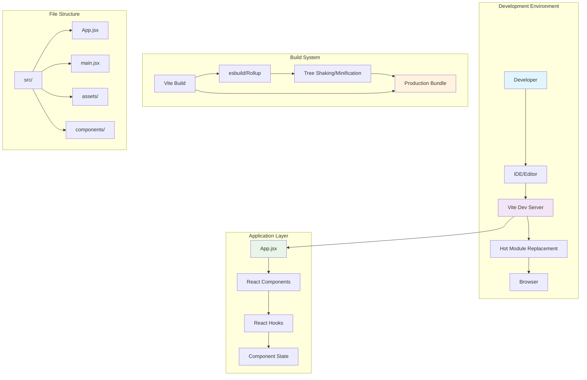
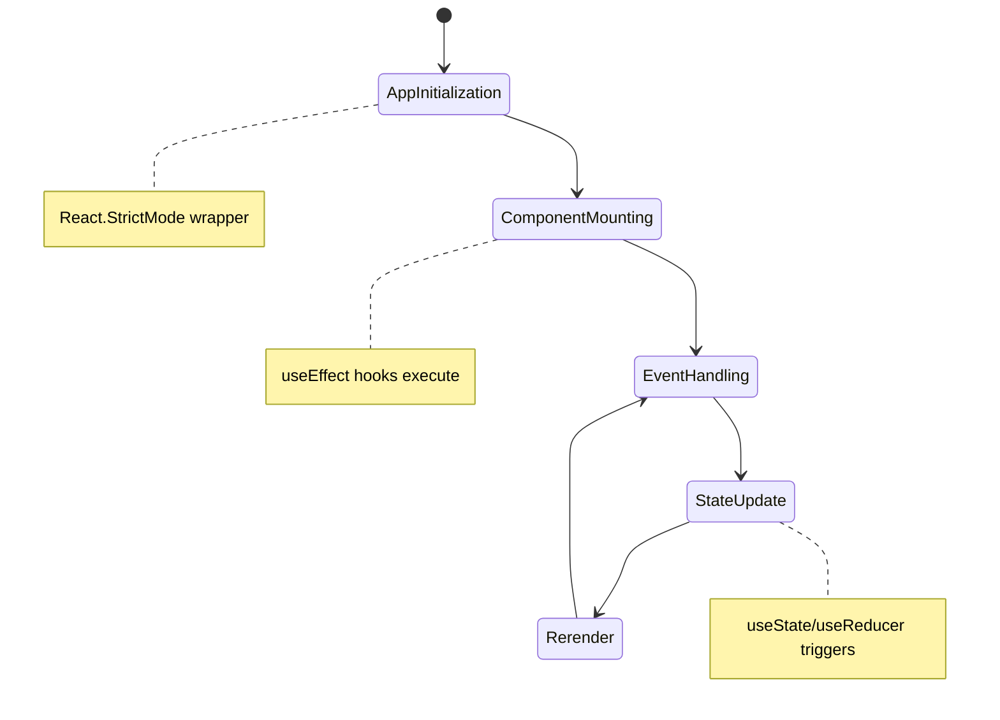

# Feature Implementation Plan: Vite React Project Initialization

## Goal

Initialize a clean, modern React 18 application using Vite build system to establish the foundational codebase for the Mafia Game Role Allocator. This creates the essential project structure, build configuration, and development environment that enables all subsequent feature development with fast iteration cycles and modern React patterns.

## Requirements

### Core Initialization Requirements
- Initialize new Vite project with React 18 template
- Configure functional component architecture with Hooks
- Establish clean `src/` directory structure for scalable development
- Set up development server with hot module replacement
- Configure build pipeline for production deployment
- Create basic App component as feature development starting point
- Configure package.json with essential npm scripts
- Establish modern JavaScript (ES2022) and JSX support
- Configure Vite for mobile-optimized development and production builds

### Development Environment Requirements
- Fast development server startup (<3 seconds)
- Hot module replacement for instant code change reflection
- Optimized build output for mobile performance
- Clear error reporting during development
- Source map support for debugging
- Development proxy configuration readiness
- Production build optimization (tree shaking, minification)

## Technical Considerations

### System Architecture Overview



### Technology Stack Selection

**Frontend Framework:** React 18
- **Rationale:** Modern React with Concurrent Features, Hooks API, and functional components
- **Version:** 18.2.0+ for stability and latest features
- **Pattern:** Functional components with Hooks exclusively

**Build Tool:** Vite
- **Rationale:** Fastest development server, superior hot reload, optimized for modern browsers
- **Version:** Latest stable (5.x)
- **Features:** Native ES modules, lightning-fast HMR, optimized production builds

**JavaScript Standard:** ES2022
- **Rationale:** Modern syntax support, optional chaining, nullish coalescing
- **Target:** Modern mobile browsers (iOS Safari 14+, Chrome 90+)
- **Transpilation:** Minimal via esbuild for maximum performance

### Integration Points

**Package Management:** npm
- **Node.js Version:** 20+ for maximum compatibility
- **Lock File:** package-lock.json for reproducible builds
- **Script Configuration:** Standard Vite scripts (dev, build, preview)

**Development Server Configuration:**
- **Host:** localhost with network access for mobile testing
- **Port:** Auto-assigned with fallback (typically 5173)
- **Proxy:** Ready for future API integration
- **HTTPS:** Development HTTPS support for mobile testing

### Deployment Architecture

**Development Environment:**
```
Developer Machine
├── Node.js 20+
├── npm package manager  
├── Vite Dev Server (localhost:5173)
└── Mobile device access (network IP)
```

**Production Build:**
```
Static Assets
├── index.html (entry point)
├── assets/
│   ├── index-[hash].js (application bundle)
│   ├── index-[hash].css (styles bundle)
│   └── favicon.ico
└── Modern ES modules for supported browsers
```

### File System Structure

```
mafia-game-role-allocator/
├── src/
│   ├── main.jsx              # Application entry point
│   ├── App.jsx               # Root application component
│   ├── App.css               # Basic application styles
│   ├── index.css             # Global styles reset
│   ├── components/           # Future component directory
│   ├── hooks/                # Future custom hooks directory
│   ├── utils/                # Future utility functions directory
│   └── assets/               # Static assets (images, icons)
├── public/
│   ├── index.html            # HTML template
│   └── favicon.ico           # Application favicon
├── package.json              # Project configuration
├── vite.config.js            # Vite configuration
├── .gitignore                # Git ignore patterns
└── README.md                 # Project documentation
```

### Frontend Architecture

#### Component Hierarchy Documentation

**Initial Application Structure:**

```
App (Root Component)
├── Header Placeholder (future navigation)
├── Main Content Area (future game interface)
└── Footer Placeholder (future reset/actions)
```

**Component Design Patterns:**
- **Functional Components:** All components use function syntax with Hooks
- **Props Interface:** Clear prop typing with PropTypes or inline validation
- **State Management:** useState and useReducer for local state
- **Effect Management:** useEffect for side effects and lifecycle

#### State Flow Diagram



**State Management Patterns:**
- **Local State:** useState for simple component state
- **Complex State:** useReducer for multi-field forms and complex workflows
- **Derived State:** useMemo for computed values
- **Side Effects:** useEffect for DOM interactions and async operations

### Database Schema Design

**Not Applicable:** This feature establishes frontend foundation only. No database interactions required.

### API Design

**Not Applicable:** This feature establishes frontend foundation only. No API endpoints required for initial setup.

### Security Performance

#### Performance Optimization Strategies
- **Bundle Splitting:** Vite automatically splits vendor and application code
- **Tree Shaking:** Dead code elimination in production builds
- **Asset Optimization:** Image and static asset optimization
- **Modern Browser Targeting:** ES2022 output for smaller bundles

#### Development Performance
- **Cold Start:** Vite dev server starts in <3 seconds
- **Hot Reload:** Sub-100ms update cycles for component changes  
- **Build Performance:** Production build completes in <30 seconds
- **Mobile Testing:** Network-accessible dev server for real device testing

#### Security Considerations
- **Dependencies:** Only essential, well-maintained packages
- **Build Security:** No sensitive data in client bundle
- **Development Security:** Localhost-only by default, network access opt-in
- **Static Hosting:** Generated output suitable for static CDN deployment

### Implementation Steps

1. **Project Initialization**
   ```bash
   npm create vite@latest mafia-game-role-allocator --template react
   cd mafia-game-role-allocator
   npm install
   ```

2. **Clean Template Customization**
   - Remove template boilerplate
   - Create basic App component structure
   - Set up directory structure for future development

3. **Development Configuration**
   - Configure Vite for mobile development
   - Set up network access for mobile testing
   - Optimize build configuration for performance

4. **Validation Testing**
   - Verify development server startup
   - Test hot module replacement
   - Validate production build output
   - Test mobile device access

## Context Template

- **Feature PRD:** Vite React Project Initialization establishes the foundational React 18 application with Vite build system for rapid feature development
- **Epic Integration:** Provides the core foundation that all other Setup & Project Scaffolding features build upon
- **Next Dependencies:** Tailwind Integration, Development Tooling, and Mobile Optimization features depend on this foundation