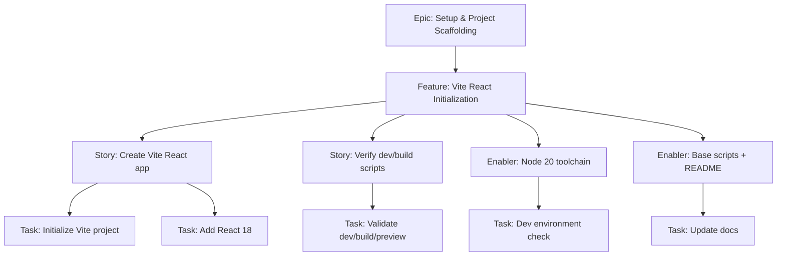
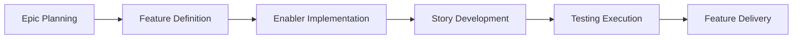

# Project Plan — Vite React Initialization

## 1. Project Overview

- Feature Summary: Initialize a Vite + React 18 project scaffold with npm scripts, sensible defaults, and a clean base to build the Mafia Role Allocator app. Mobile-first, minimal footprint, fast HMR.
- Success Criteria: Repo builds and runs dev server; HMR works; base React app renders; lint/format scripts present; aligns with PRD tech stack.
- Key Milestones: Scaffold project → Configure package.json/scripts → Verify dev/build/preview → Commit baseline scaffold.
- Risk Assessment: Version drift of Node/Vite; ensure Node 20; avoid extra deps bloating bundle; CI not yet configured.

## 2. Work Item Hierarchy

## 3. GitHub Issues Breakdown

### Epic Issue (reference)
- Epic: Setup & Project Scaffolding
- Features in this Epic: includes this feature (issue number to create)

### Feature Issue
- Title: Feature: Vite React Initialization
- Dependencies: None
- Acceptance Criteria: dev server runs; build succeeds; preview works; base app renders
- DoD: Code committed; docs updated; scripts verified

### Example User Stories
- Story 1: As a developer, I can scaffold a Vite React app so I can run a dev server quickly.
- Story 2: As a developer, I can build and preview the app so I can validate production output.

### Example Enablers
- Ensure Node.js 20 is used consistently
- Provide base npm scripts and README quickstart

## 4. Priority and Value Matrix

| Priority | Value  | Criteria |
| --- | --- | --- |
| P0 | High | Blocks all development |

## 5. Estimation Guidelines
- T-Shirt Size: S
- Story Points: 2-3 total

## 6. Dependency Management

## 7. Sprint Planning Template

Goal: Have dev server and build pipeline working by mid-sprint.

## 8. Project Board Configuration
- Columns: Backlog → Sprint Ready → In Progress → In Review → Testing → Done
- Custom Fields: Priority, Value, Component=Infrastructure, Estimate

## 9. Automation and GitHub Actions
- See automation recipes in `.github/prompts/breakdown-plan.prompt.md`.
